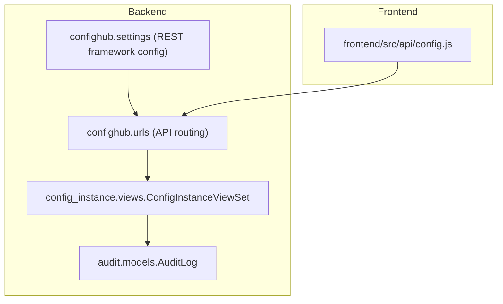
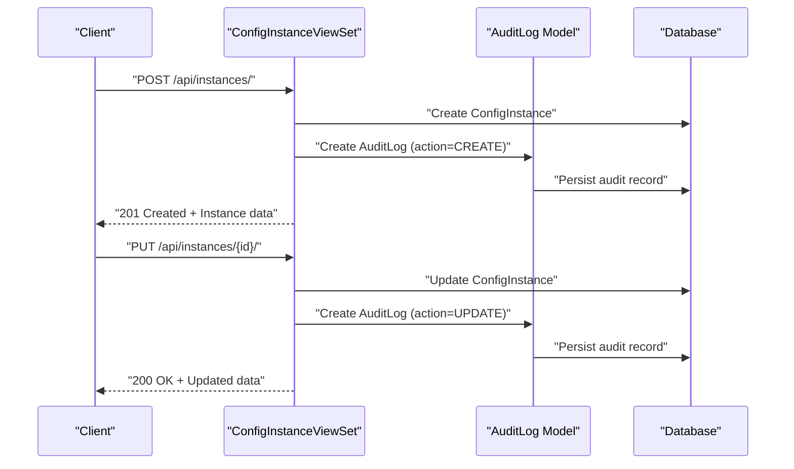
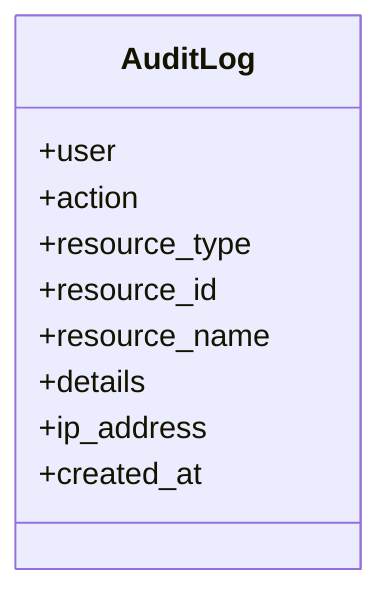
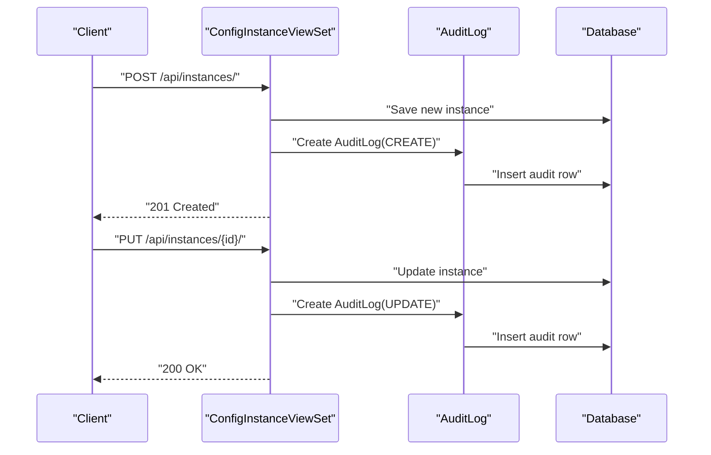
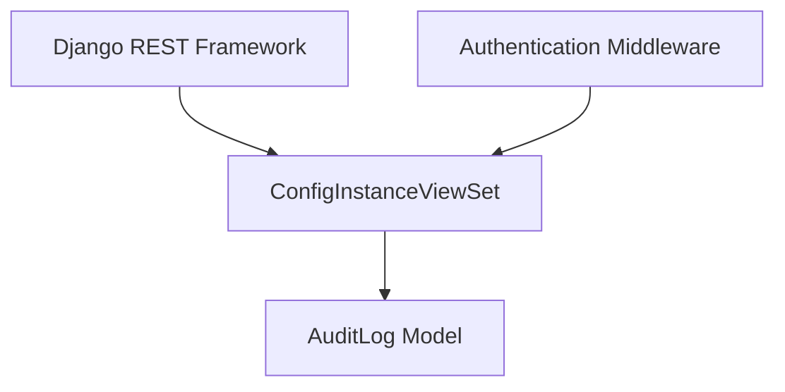

# Audit Log API

<cite>
**Referenced Files in This Document**
- [models.py](file://backend/audit/models.py)
- [0001_initial.py](file://backend/audit/migrations/0001_initial.py)
- [views.py](file://backend/config_instance/views.py)
- [urls.py](file://backend/confighub/urls.py)
- [settings.py](file://backend/confighub/settings.py)
- [config.js](file://frontend/src/api/config.js)
</cite>

## Table of Contents
1. [Introduction](#introduction)
2. [Project Structure](#project-structure)
3. [Core Components](#core-components)
4. [Architecture Overview](#architecture-overview)
5. [Detailed Component Analysis](#detailed-component-analysis)
6. [Dependency Analysis](#dependency-analysis)
7. [Performance Considerations](#performance-considerations)
8. [Troubleshooting Guide](#troubleshooting-guide)
9. [Conclusion](#conclusion)

## Introduction
This document provides comprehensive API documentation for Audit Log endpoints within the AI Operations platform. It focuses on how audit trail data is recorded and accessed, including the current implementation patterns and recommended approaches for listing, filtering, and exporting audit records. The documentation covers HTTP methods, URL patterns, request/response schemas, authentication requirements, error handling, and practical examples for retrieving audit logs with various filters.

## Project Structure
The audit logging capability is implemented as part of the backend Django application and integrates with the REST framework. The audit model defines the schema for storing audit events, while the configuration instance management APIs demonstrate how audit events are generated during CRUD operations.

**Diagram sources**
- [models.py:5-30](file://backend/audit/models.py#L5-L30)
- [views.py:11-90](file://backend/config_instance/views.py#L11-L90)
- [urls.py:20-24](file://backend/confighub/urls.py#L20-L24)
- [settings.py:33-39](file://backend/confighub/settings.py#L33-L39)
- [config.js:1-33](file://frontend/src/api/config.js#L1-L33)

**Section sources**
- [models.py:1-31](file://backend/audit/models.py#L1-L31)
- [views.py:1-150](file://backend/config_instance/views.py#L1-L150)
- [urls.py:1-25](file://backend/confighub/urls.py#L1-L25)
- [settings.py:1-159](file://backend/confighub/settings.py#L1-L159)
- [config.js:1-33](file://frontend/src/api/config.js#L1-L33)

## Core Components
- AuditLog model: Defines the audit event schema including user, action type, resource identifiers, details payload, IP address, and timestamps.
- ConfigInstanceViewSet: Implements CRUD operations for configuration instances and generates audit events upon create/update actions.
- REST framework configuration: Pagination and permission settings influence how audit data is exposed via the API.

Key implementation references:
- AuditLog model definition and field descriptions: [models.py:5-30](file://backend/audit/models.py#L5-L30)
- Audit event creation during instance updates: [views.py:82-90](file://backend/config_instance/views.py#L82-L90)
- Audit event creation during instance creation: [views.py:52-60](file://backend/config_instance/views.py#L52-L60)
- API routing under /api/: [urls.py:20-24](file://backend/confighub/urls.py#L20-L24)
- REST framework pagination and permissions: [settings.py:33-39](file://backend/confighub/settings.py#L33-L39)

**Section sources**
- [models.py:5-30](file://backend/audit/models.py#L5-L30)
- [views.py:52-90](file://backend/config_instance/views.py#L52-L90)
- [urls.py:20-24](file://backend/confighub/urls.py#L20-L24)
- [settings.py:33-39](file://backend/confighub/settings.py#L33-L39)

## Architecture Overview
The audit trail is produced reactively by business logic in the configuration instance management layer. When a configuration instance is created or updated, an audit record is persisted to the AuditLog table. The REST framework exposes these resources through standard endpoints, and pagination is applied by default.

**Diagram sources**
- [views.py:36-90](file://backend/config_instance/views.py#L36-L90)
- [models.py:5-30](file://backend/audit/models.py#L5-L30)

**Section sources**
- [views.py:36-90](file://backend/config_instance/views.py#L36-L90)
- [models.py:5-30](file://backend/audit/models.py#L5-L30)

## Detailed Component Analysis

### AuditLog Data Model
The AuditLog model captures the essential attributes for audit trail analysis:
- user: Foreign key to the User model (nullable to support system-initiated actions)
- action: Enumerated action type (CREATE, UPDATE, DELETE, VIEW, EXPORT, IMPORT)
- resource_type: String identifying the affected resource category
- resource_id: String identifier for the specific resource
- resource_name: Human-readable name for the resource
- details: JSON payload containing contextual information
- ip_address: IP address of the client (nullable)
- created_at: Timestamp of when the event was recorded

**Diagram sources**
- [models.py:5-30](file://backend/audit/models.py#L5-L30)

**Section sources**
- [models.py:5-30](file://backend/audit/models.py#L5-L30)
- [0001_initial.py:17-35](file://backend/audit/migrations/0001_initial.py#L17-L35)

### Current Audit Event Generation
The ConfigInstanceViewSet creates audit events during create and update operations:
- Creation: Records an audit event with action=CREATE and includes format details in the details payload.
- Update: Records an audit event with action=UPDATE and includes version metadata in the details payload.

**Diagram sources**
- [views.py:36-90](file://backend/config_instance/views.py#L36-L90)
- [models.py:5-30](file://backend/audit/models.py#L5-L30)

**Section sources**
- [views.py:36-90](file://backend/config_instance/views.py#L36-L90)
- [models.py:5-30](file://backend/audit/models.py#L5-L30)

### API Endpoints and Usage Patterns
- Base URL: /api/
- Current endpoint exposure: The configuration instance endpoints are exposed under /api/instances/. While these endpoints do not directly expose audit logs, they demonstrate how audit events are generated during normal operations.
- Pagination: Enabled by default with page size 20.

Practical usage patterns:
- Retrieve configuration instances (audits are generated automatically): GET /api/instances/
- Create a configuration instance (generates CREATE audit): POST /api/instances/
- Update a configuration instance (generates UPDATE audit): PUT /api/instances/{id}/

Note: There is no dedicated audit listing endpoint yet. The current implementation focuses on generating audit events during business operations.

**Section sources**
- [urls.py:20-24](file://backend/confighub/urls.py#L20-L24)
- [settings.py:33-39](file://backend/confighub/settings.py#L33-L39)
- [views.py:21-34](file://backend/config_instance/views.py#L21-L34)

### Request and Response Schemas
- Request body for creating/updating configuration instances: Defined by the configuration instance serializer. The audit details payload is stored as JSON in the AuditLog.details field.
- Response body for configuration instance operations: Standard REST responses with instance data.
- Audit event representation: The AuditLog model fields are populated by the business logic in the viewset.

References:
- AuditLog fields: [models.py:5-30](file://backend/audit/models.py#L5-L30)
- Audit event creation during create/update: [views.py:36-90](file://backend/config_instance/views.py#L36-L90)

**Section sources**
- [models.py:5-30](file://backend/audit/models.py#L5-L30)
- [views.py:36-90](file://backend/config_instance/views.py#L36-L90)

### Authentication and Authorization
- Authentication: Session-based authentication is enabled by default in the middleware stack.
- Permissions: REST framework default permission allows any client to access endpoints. For audit data exposure, adjust permissions as needed.

References:
- Middleware stack includes AuthenticationMiddleware: [settings.py:59-68](file://backend/confighub/settings.py#L59-L68)
- REST framework default permissions: [settings.py:33-39](file://backend/confighub/settings.py#L33-L39)

**Section sources**
- [settings.py:59-68](file://backend/confighub/settings.py#L59-L68)
- [settings.py:33-39](file://backend/confighub/settings.py#L33-L39)

### Filtering and Search Capabilities
- Configuration instance listing supports filtering by config_type, search term, and format. These patterns illustrate how filtering could be extended to audit logs.
- Audit log filtering is not currently implemented in the provided code. To enable audit log filtering, implement a dedicated viewset or action with appropriate query parameters.

References:
- Configuration instance filtering: [views.py:21-34](file://backend/config_instance/views.py#L21-L34)

**Section sources**
- [views.py:21-34](file://backend/config_instance/views.py#L21-L34)

### Exporting Audit Data
- No dedicated export endpoint exists in the current implementation.
- Practical approach: Use the existing configuration instance listing endpoint with pagination and client-side aggregation to compile audit summaries. Alternatively, implement a dedicated export action similar to the existing versions/rollback actions.

**Section sources**
- [views.py:92-136](file://backend/config_instance/views.py#L92-L136)

## Dependency Analysis
The audit logging mechanism depends on:
- Django REST framework for API exposure
- Django authentication middleware for user context
- Database ORM for persisting audit records

**Diagram sources**
- [settings.py:33-39](file://backend/confighub/settings.py#L33-L39)
- [settings.py:59-68](file://backend/confighub/settings.py#L59-L68)
- [views.py:11-90](file://backend/config_instance/views.py#L11-L90)
- [models.py:5-30](file://backend/audit/models.py#L5-L30)

**Section sources**
- [settings.py:33-39](file://backend/confighub/settings.py#L33-L39)
- [settings.py:59-68](file://backend/confighub/settings.py#L59-L68)
- [views.py:11-90](file://backend/config_instance/views.py#L11-L90)
- [models.py:5-30](file://backend/audit/models.py#L5-L30)

## Performance Considerations
- Pagination: Default page size of 20 helps manage large datasets. Consider tuning PAGE_SIZE for audit workloads.
- Indexing: For efficient audit queries, add database indexes on frequently filtered fields (e.g., user, resource_type, created_at).
- JSON details: Large details payloads can impact storage and query performance; keep details concise and structured.
- Monitoring: Track audit volume and query patterns to prevent performance degradation.

[No sources needed since this section provides general guidance]

## Troubleshooting Guide
Common issues and resolutions:
- Missing user context: If the request is unauthenticated, the audit record may have a null user. Ensure proper authentication for accurate attribution.
- Empty or missing details: Verify that the details payload is populated during create/update operations.
- Pagination limits: Use page and page_size query parameters to navigate large audit datasets.
- CORS and permissions: Adjust REST framework permissions and CORS settings if clients encounter access issues.

**Section sources**
- [settings.py:33-39](file://backend/confighub/settings.py#L33-L39)
- [settings.py:59-68](file://backend/confighub/settings.py#L59-L68)
- [views.py:52-90](file://backend/config_instance/views.py#L52-L90)

## Conclusion
The current implementation demonstrates how audit events are generated during configuration instance operations. While there is no dedicated audit listing endpoint, the AuditLog model and REST framework infrastructure provide a solid foundation for building comprehensive audit log APIs. Extend the API surface by adding a dedicated audit endpoint with robust filtering, pagination, and export capabilities to meet compliance and monitoring needs.