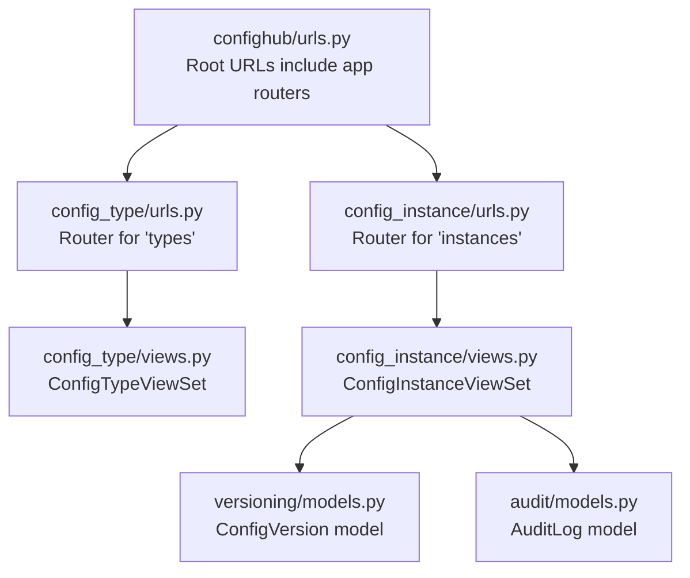
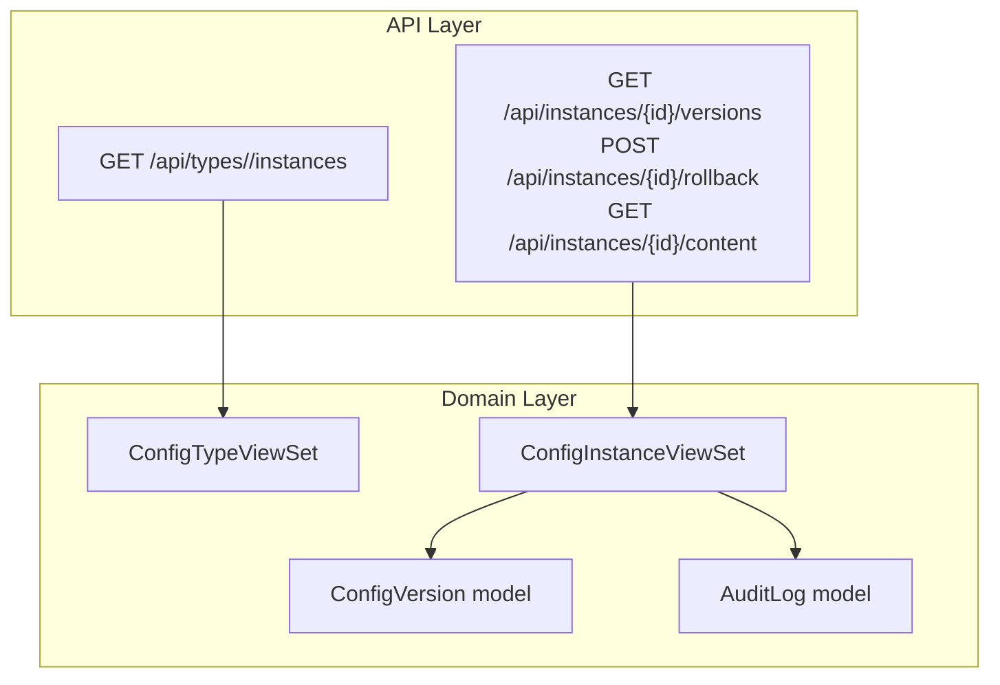
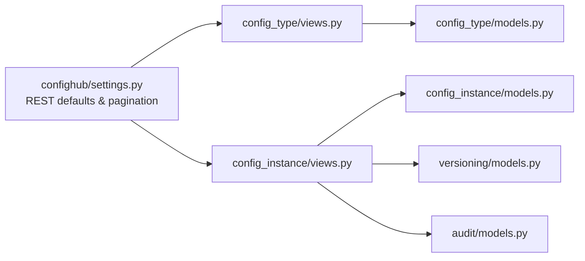

# Backend API Documentation

<cite>
**Referenced Files in This Document**
- [confighub/urls.py](file://backend/confighub/urls.py)
- [confighub/settings.py](file://backend/confighub/settings.py)
- [config_type/urls.py](file://backend/config_type/urls.py)
- [config_type/views.py](file://backend/config_type/views.py)
- [config_instance/urls.py](file://backend/config_instance/urls.py)
- [config_instance/views.py](file://backend/config_instance/views.py)
- [config_type/models.py](file://backend/config_type/models.py)
- [config_instance/models.py](file://backend/config_instance/models.py)
- [versioning/models.py](file://backend/versioning/models.py)
- [audit/models.py](file://backend/audit/models.py)
- [config_type/serializers.py](file://backend/config_type/serializers.py)
- [config_instance/serializers.py](file://backend/config_instance/serializers.py)
</cite>

## Table of Contents
1. [Introduction](#introduction)
2. [Project Structure](#project-structure)
3. [Core Components](#core-components)
4. [Architecture Overview](#architecture-overview)
5. [Detailed Component Analysis](#detailed-component-analysis)
6. [Dependency Analysis](#dependency-analysis)
7. [Performance Considerations](#performance-considerations)
8. [Troubleshooting Guide](#troubleshooting-guide)
9. [Conclusion](#conclusion)
10. [Appendices](#appendices)

## Introduction
This document provides comprehensive API documentation for the AI-Ops Configuration Hub backend REST APIs. It covers configuration type management, configuration instance management, version control, and audit log operations. For each endpoint, you will find HTTP methods, URL patterns, request/response schemas, authentication requirements, and error handling. It also documents pagination, filtering, and security considerations.

## Project Structure
The backend is a Django application with Django REST Framework (DRF) providing automatic CRUD endpoints via ViewSets and routers. URL routing is organized under /api/, with separate routers for configuration types and instances.

**Diagram sources**
- [confighub/urls.py:20-24](file://backend/confighub/urls.py#L20-L24)
- [config_type/urls.py:5-10](file://backend/config_type/urls.py#L5-L10)
- [config_instance/urls.py:5-10](file://backend/config_instance/urls.py#L5-L10)
- [config_type/views.py:8-39](file://backend/config_type/views.py#L8-L39)
- [config_instance/views.py:11-150](file://backend/config_instance/views.py#L11-L150)

**Section sources**
- [confighub/urls.py:20-24](file://backend/confighub/urls.py#L20-L24)
- [confighub/settings.py:33-39](file://backend/confighub/settings.py#L33-L39)

## Core Components
- Configuration Type Management: Provides CRUD operations for configuration types with search and filter support.
- Configuration Instance Management: Provides CRUD operations for configuration instances, versioning, rollback, and content retrieval.
- Version Control: Tracks historical versions of configuration instances.
- Audit Logs: Records user actions on configuration instances.

Key implementation highlights:
- Automatic endpoints via DRF ViewSet routers.
- Pagination configured globally.
- Filtering via query parameters.
- Transactional updates and version creation.
- Audit logging on create/update.

**Section sources**
- [config_type/views.py:8-39](file://backend/config_type/views.py#L8-L39)
- [config_instance/views.py:11-150](file://backend/config_instance/views.py#L11-L150)
- [confighub/settings.py:33-39](file://backend/confighub/settings.py#L33-L39)

## Architecture Overview
The API follows a layered architecture:
- URL routing maps /api/types and /api/instances to respective ViewSets.
- ViewSets handle HTTP verbs and delegate to serializers and models.
- Versioning and audit models persist historical and activity data.

**Diagram sources**
- [config_type/views.py:27-39](file://backend/config_type/views.py#L27-L39)
- [config_instance/views.py:92-149](file://backend/config_instance/views.py#L92-L149)
- [versioning/models.py](file://backend/versioning/models.py)
- [audit/models.py](file://backend/audit/models.py)

## Detailed Component Analysis

### Configuration Type Management API
Endpoints:
- GET /api/types
  - Purpose: List configuration types with optional filters.
  - Query parameters:
    - search: substring match on name or title.
    - format: filter by format.
  - Response: Paginated list of configuration types.
  - Authentication: Not enforced by default settings.
  - Permissions: AllowAny by default.
  - Pagination: PageNumberPagination, page size 20.

- GET /api/types/{name}
  - Purpose: Retrieve a configuration type by name.
  - Path parameter: name (lookup field).
  - Response: Single configuration type object.
  - Authentication: Not enforced by default.

- POST /api/types
  - Purpose: Create a configuration type.
  - Request body: Fields defined by ConfigTypeSerializer.
  - Response: Created configuration type object.
  - Authentication: Not enforced by default.

- PUT/PATCH /api/types/{name}
  - Purpose: Update a configuration type by name.
  - Path parameter: name.
  - Response: Updated configuration type object.
  - Authentication: Not enforced by default.

- DELETE /api/types/{name}
  - Purpose: Delete a configuration type by name.
  - Path parameter: name.
  - Response: Deletion result.
  - Authentication: Not enforced by default.

- GET /api/types/{name}/instances
  - Purpose: List instances belonging to this configuration type.
  - Path parameter: name.
  - Response: Array of instance summaries (id, name, version, updated_at).
  - Authentication: Not enforced by default.

Notes:
- Filtering and search are handled in the ViewSet’s get_queryset method.
- Lookup by name is enabled via lookup_field.

**Section sources**
- [config_type/urls.py:5-10](file://backend/config_type/urls.py#L5-L10)
- [config_type/views.py:8-39](file://backend/config_type/views.py#L8-L39)
- [config_type/serializers.py](file://backend/config_type/serializers.py)
- [config_type/models.py](file://backend/config_type/models.py)
- [confighub/settings.py:33-39](file://backend/confighub/settings.py#L33-L39)

### Configuration Instance Management API
Endpoints:
- GET /api/instances
  - Purpose: List configuration instances with optional filters.
  - Query parameters:
    - config_type: filter by configuration type name.
    - search: substring match on name.
    - format: filter by format.
  - Response: Paginated list of instances with related config_type.
  - Authentication: Not enforced by default.
  - Pagination: PageNumberPagination, page size 20.

- GET /api/instances/{id}
  - Purpose: Retrieve a configuration instance by ID.
  - Path parameter: id.
  - Response: Instance object with related config_type.
  - Authentication: Not enforced by default.

- POST /api/instances
  - Purpose: Create a configuration instance.
  - Request body: Fields defined by ConfigInstanceSerializer.
  - Behavior:
    - Creates initial version (version=1).
    - Records audit log for CREATE.
  - Response: Created instance object.
  - Authentication: Not enforced by default.

- PUT/PATCH /api/instances/{id}
  - Purpose: Update a configuration instance.
  - Path parameter: id.
  - Behavior:
    - Increments version number.
    - Creates new version record.
    - Records audit log for UPDATE.
  - Response: Updated instance object.
  - Authentication: Not enforced by default.

- DELETE /api/instances/{id}
  - Purpose: Delete a configuration instance.
  - Path parameter: id.
  - Response: Deletion result.
  - Authentication: Not enforced by default.

- GET /api/instances/{id}/versions
  - Purpose: Retrieve version history for an instance.
  - Path parameter: id.
  - Response: Array of version entries (version, format, change_reason, changed_by, changed_at).
  - Authentication: Not enforced by default.

- POST /api/instances/{id}/rollback
  - Purpose: Rollback to a previous version.
  - Path parameter: id.
  - Request body:
    - version: target version number.
  - Behavior:
    - Validates existence of target version.
    - Creates new version with rolled-back content.
  - Response: { message, new_version }.
  - Authentication: Not enforced by default.

- GET /api/instances/{id}/content
  - Purpose: Get content in a specified format.
  - Path parameter: id.
  - Query parameters:
    - format: requested output format (defaults to instance format).
  - Response: { format, content, parsed_data }.
  - Authentication: Not enforced by default.

Notes:
- Atomic transactions wrap create/update to ensure consistency.
- Versioning and audit models are used for persistence.
- Content retrieval supports format conversion via instance method.

**Section sources**
- [config_instance/urls.py:5-10](file://backend/config_instance/urls.py#L5-L10)
- [config_instance/views.py:11-150](file://backend/config_instance/views.py#L11-L150)
- [config_instance/serializers.py](file://backend/config_instance/serializers.py)
- [config_instance/models.py](file://backend/config_instance/models.py)
- [versioning/models.py](file://backend/versioning/models.py)
- [audit/models.py](file://backend/audit/models.py)
- [confighub/settings.py:33-39](file://backend/confighub/settings.py#L33-L39)

### Version Control API
While there is no dedicated router for versions, the system exposes version history via the instance endpoint:
- GET /api/instances/{id}/versions
  - Returns historical versions of a configuration instance.
  - Each entry includes version number, format, change reason, who changed it, and when.

Rollback capability:
- POST /api/instances/{id}/rollback
  - Requires a version number in the request body.
  - On success, creates a new version reflecting the rollback and returns a message and new version number.

**Section sources**
- [config_instance/views.py:92-136](file://backend/config_instance/views.py#L92-L136)
- [versioning/models.py](file://backend/versioning/models.py)

### Audit Log API
There is no dedicated router for audit logs. However, the system records audit events during create and update operations:
- CREATE: Logged when a new instance is created.
- UPDATE: Logged when an instance is updated (including rollbacks).
Each audit event includes user, action, resource type, resource id/name, and details.

Note: There is no explicit endpoint to query audit logs in the current codebase.

**Section sources**
- [config_instance/views.py:36-60](file://backend/config_instance/views.py#L36-L60)
- [config_instance/views.py:62-90](file://backend/config_instance/views.py#L62-L90)
- [audit/models.py](file://backend/audit/models.py)

## Dependency Analysis
- URL routing:
  - Root includes app routers for types and instances.
- ViewSets:
  - ConfigTypeViewSet handles types.
  - ConfigInstanceViewSet handles instances and delegates to versioning and audit models.
- Serializers:
  - Define request/response schemas for types and instances.
- Models:
  - ConfigType and ConfigInstance define domain entities.
  - ConfigVersion persists version history.
  - AuditLog persists audit events.

**Diagram sources**
- [confighub/settings.py:33-39](file://backend/confighub/settings.py#L33-L39)
- [config_type/views.py:8-39](file://backend/config_type/views.py#L8-L39)
- [config_instance/views.py:11-150](file://backend/config_instance/views.py#L11-L150)
- [config_type/models.py](file://backend/config_type/models.py)
- [config_instance/models.py](file://backend/config_instance/models.py)
- [versioning/models.py](file://backend/versioning/models.py)
- [audit/models.py](file://backend/audit/models.py)

**Section sources**
- [confighub/settings.py:33-39](file://backend/confighub/settings.py#L33-L39)
- [config_type/views.py:8-39](file://backend/config_type/views.py#L8-L39)
- [config_instance/views.py:11-150](file://backend/config_instance/views.py#L11-L150)

## Performance Considerations
- Pagination: PageNumberPagination with page size 20 is globally configured. Clients should implement cursor-based pagination for large datasets if needed.
- Select-related: Instance queries use select_related('config_type') to reduce database hits.
- Transactions: Create/update operations are wrapped in atomic transactions to maintain consistency.
- Filtering: Queries apply filters in Python for simplicity; consider adding database-level indexes for frequently filtered fields.

[No sources needed since this section provides general guidance]

## Troubleshooting Guide
Common issues and resolutions:
- 404 Not Found on rollback:
  - Cause: Target version does not exist.
  - Resolution: Verify the version number exists via GET /api/instances/{id}/versions.
- Authentication:
  - Current settings allow any permission. If you enable authentication, ensure clients send credentials.
- CORS:
  - CORS is enabled for all origins. For production, restrict origins and configure credentials as needed.

**Section sources**
- [config_instance/views.py:112-116](file://backend/config_instance/views.py#L112-L116)
- [confighub/settings.py:33-39](file://backend/confighub/settings.py#L33-L39)
- [confighub/settings.py:31](file://backend/confighub/settings.py#L31)

## Conclusion
The AI-Ops Configuration Hub backend provides a clean REST API surface for managing configuration types and instances, with integrated versioning and audit logging. The APIs are generated via DRF ViewSets and routers, offering standard CRUD operations plus specialized actions for versions and content retrieval. Pagination and filtering are supported out-of-the-box, while authentication and permissions are currently permissive by default.

[No sources needed since this section summarizes without analyzing specific files]

## Appendices

### API Versioning Strategy
- No explicit API versioning is implemented in the current codebase. Clients should pin to the current base path (/api/) and expect backward-compatible changes unless documented otherwise.

[No sources needed since this section provides general guidance]

### Pagination Implementation
- Global pagination settings:
  - DEFAULT_PAGINATION_CLASS: PageNumberPagination
  - PAGE_SIZE: 20
- Clients should rely on standard DRF pagination fields (page, page_size) when consuming lists.

**Section sources**
- [confighub/settings.py:33-39](file://backend/confighub/settings.py#L33-L39)

### Filtering Capabilities
- Configuration Types:
  - search: substring match on name or title.
  - format: filter by format.
- Configuration Instances:
  - config_type: filter by configuration type name.
  - search: substring match on name.
  - format: filter by format.

**Section sources**
- [config_type/views.py:14-25](file://backend/config_type/views.py#L14-L25)
- [config_instance/views.py:21-34](file://backend/config_instance/views.py#L21-L34)

### Authentication and Authorization
- Authentication:
  - Not enforced by default settings.
- Authorization:
  - DEFAULT_PERMISSION_CLASSES set to AllowAny.
- Recommendations:
  - Enable session or token-based authentication.
  - Define custom permissions to restrict access to sensitive operations.

**Section sources**
- [confighub/settings.py:33-36](file://backend/confighub/settings.py#L33-L36)

### Rate Limiting Information
- No rate limiting is configured in the current codebase. Consider integrating DRF Throttling for production deployments.

[No sources needed since this section provides general guidance]

### Security Considerations
- CORS: Enabled for all origins; restrict origins and configure credentials for production.
- CSRF: CSRF middleware is present; ensure proper handling for browser clients.
- Database: Supports SQLite and MySQL8 backends; configure secure credentials and network access.

**Section sources**
- [confighub/settings.py:31](file://backend/confighub/settings.py#L31)
- [confighub/settings.py:94-117](file://backend/confighub/settings.py#L94-L117)

### Practical Examples

- Create a configuration type
  - Method: POST
  - URL: /api/types
  - Body: Fields defined by ConfigTypeSerializer
  - Expected response: Created configuration type object

- List configuration instances with filters
  - Method: GET
  - URL: /api/instances?config_type=example-type&search=myapp&format=yaml
  - Expected response: Paginated list of instances with related config_type

- Retrieve version history
  - Method: GET
  - URL: /api/instances/{id}/versions
  - Expected response: Array of version entries

- Rollback to a specific version
  - Method: POST
  - URL: /api/instances/{id}/rollback
  - Body: { version: 2 }
  - Expected response: { message, new_version }

- Get content in a specific format
  - Method: GET
  - URL: /api/instances/{id}/content?format=json
  - Expected response: { format, content, parsed_data }

[No sources needed since this section provides general guidance]