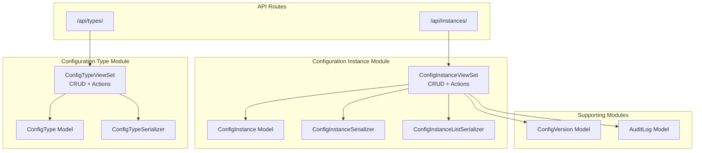
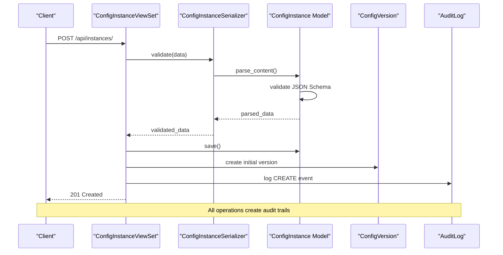
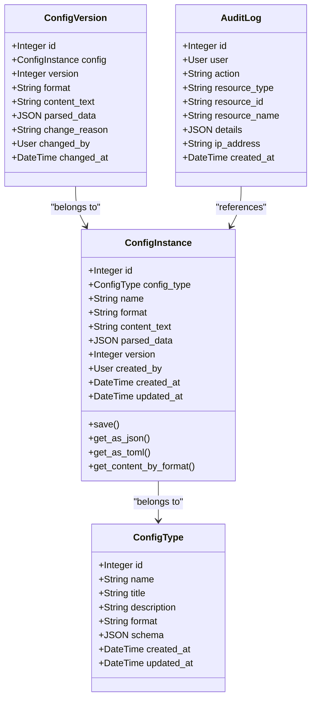

# Configuration Instance Management API

<cite>
**Referenced Files in This Document**
- [urls.py](file://backend/confighub/urls.py)
- [urls.py](file://backend/config_instance/urls.py)
- [views.py](file://backend/config_instance/views.py)
- [models.py](file://backend/config_instance/models.py)
- [serializers.py](file://backend/config_instance/serializers.py)
- [models.py](file://backend/config_type/models.py)
- [models.py](file://backend/versioning/models.py)
- [models.py](file://backend/audit/models.py)
- [settings.py](file://backend/confighub/settings.py)
</cite>

## Table of Contents
1. [Introduction](#introduction)
2. [Project Structure](#project-structure)
3. [Core Components](#core-components)
4. [Architecture Overview](#architecture-overview)
5. [Detailed Component Analysis](#detailed-component-analysis)
6. [Dependency Analysis](#dependency-analysis)
7. [Performance Considerations](#performance-considerations)
8. [Troubleshooting Guide](#troubleshooting-guide)
9. [Conclusion](#conclusion)

## Introduction
This document provides comprehensive API documentation for Configuration Instance Management endpoints. It covers all RESTful endpoints for managing configuration instances including creation, retrieval, updating, deletion, version history, rollback, and content export operations. The API follows REST conventions with JSON responses and supports both JSON and TOML content formats. Content validation ensures compliance with associated configuration types' JSON Schemas.

## Project Structure
The API is organized around Django REST Framework ViewSets with automatic CRUD endpoints plus custom actions for specialized operations.



**Diagram sources**
- [urls.py:20-24](file://backend/confighub/urls.py#L20-L24)
- [urls.py:5-10](file://backend/config_instance/urls.py#L5-L10)
- [views.py:11-19](file://backend/config_instance/views.py#L11-L19)

**Section sources**
- [urls.py:20-24](file://backend/confighub/urls.py#L20-L24)
- [urls.py:5-10](file://backend/config_instance/urls.py#L5-L10)

## Core Components
The Configuration Instance Management API consists of the following core components:

### Configuration Instance Model
Represents individual configuration entries with format-aware content storage and JSON Schema validation.

### Configuration Instance Serializer
Handles content parsing/validation and maintains normalized parsed_data for efficient querying.

### ConfigInstanceViewSet
Provides RESTful CRUD operations plus specialized actions for version management and content export.

### Supporting Models
- ConfigVersion: Maintains historical versions with format preservation
- AuditLog: Records all configuration changes for compliance tracking

**Section sources**
- [models.py:7-32](file://backend/config_instance/models.py#L7-L32)
- [serializers.py:7-18](file://backend/config_instance/serializers.py#L7-L18)
- [views.py:11-19](file://backend/config_instance/views.py#L11-L19)
- [models.py:5-19](file://backend/versioning/models.py#L5-L19)
- [models.py:5-23](file://backend/audit/models.py#L5-L23)

## Architecture Overview
The API follows a layered architecture with explicit separation between data models, serialization, and presentation logic.



**Diagram sources**
- [views.py:36-60](file://backend/config_instance/views.py#L36-L60)
- [serializers.py:20-48](file://backend/config_instance/serializers.py#L20-L48)
- [models.py:42-53](file://backend/config_instance/models.py#L42-L53)

## Detailed Component Analysis

### Base Endpoint Structure
All endpoints are served under `/api/instances/` with automatic RESTful routing:

- GET `/api/instances/` - List instances with filtering
- GET `/api/instances/{id}/` - Retrieve specific instance
- POST `/api/instances/` - Create new instance
- PUT `/api/instances/{id}/` - Update existing instance
- DELETE `/api/instances/{id}/` - Delete instance

**Section sources**
- [urls.py:5-10](file://backend/config_instance/urls.py#L5-L10)
- [views.py:11-19](file://backend/config_instance/views.py#L11-L19)

### Request/Response Schemas

#### Base Instance Schema
| Field | Type | Required | Description |
|-------|------|----------|-------------|
| id | integer | No | Auto-generated identifier |
| config_type | integer/string | Yes | Foreign key to ConfigType (by ID or name) |
| name | string | Yes | Unique instance name within type |
| format | string | Yes | Content format: 'json' or 'toml' |
| content | string | Yes | Raw content in specified format |
| content_text | string | No | Stored raw content (write-only) |
| parsed_data | object | No | Parsed JSON representation (write-only) |
| version | integer | No | Current version number (auto-managed) |
| created_by | integer | No | Creator user ID (auto-managed) |
| created_at | datetime | No | Creation timestamp (auto-managed) |
| updated_at | datetime | No | Last update timestamp (auto-managed) |

#### List Response Schema
Simplified response for listing operations:
- id, config_type, config_type_name, config_type_title
- name, format, version, created_at, updated_at

#### Version History Response
```json
{
  "version": 1,
  "format": "json",
  "change_reason": "Initial creation",
  "changed_by": "john_doe",
  "changed_at": "2024-01-01T12:00:00Z"
}
```

#### Content Export Response
```json
{
  "format": "json",
  "content": "{...}",
  "parsed_data": {}
}
```

**Section sources**
- [serializers.py:13-18](file://backend/config_instance/serializers.py#L13-L18)
- [serializers.py:56-60](file://backend/config_instance/serializers.py#L56-L60)
- [views.py:96-104](file://backend/config_instance/views.py#L96-L104)
- [views.py:145-149](file://backend/config_instance/views.py#L145-L149)

### Authentication and Authorization
- **Authentication**: Session-based authentication via Django middleware
- **Authorization**: No explicit permission classes (AllowAny)
- **User Context**: Automatically captures authenticated user for audit trails

**Section sources**
- [settings.py:33-39](file://backend/confighub/settings.py#L33-L39)
- [views.py:39-50](file://backend/config_instance/views.py#L39-L50)

### Content Validation Rules

#### Format Validation
- **Supported Formats**: JSON and TOML
- **Format Choice**: Must be one of 'json' or 'toml'
- **Content Parsing**: Automatic validation during save/update

#### JSON Schema Validation
- **Schema Source**: Retrieved from associated ConfigType
- **Validation Trigger**: Occurs when ConfigType has non-empty schema
- **Failure Behavior**: Validation errors prevent instance creation/update

#### Content Conversion
The system automatically converts between formats while preserving semantic meaning:
- JSON content can be exported as TOML
- TOML content can be exported as JSON
- Internal representation stored as normalized JSON

**Section sources**
- [models.py:9-12](file://backend/config_instance/models.py#L9-L12)
- [models.py:42-68](file://backend/config_instance/models.py#L42-L68)
- [serializers.py:26-42](file://backend/config_instance/serializers.py#L26-L42)

### Filtering and Search Parameters

#### Query Parameters
- `config_type`: Filter by configuration type name
- `search`: Case-insensitive search in instance names
- `format`: Filter by content format ('json' or 'toml')

#### Example Queries
- `GET /api/instances/?config_type=database`
- `GET /api/instances/?search=production&format=json`
- `GET /api/instances/?config_type=webapp&search=cache`

**Section sources**
- [views.py:21-34](file://backend/config_instance/views.py#L21-L34)

### Custom Actions

#### Get Versions (`GET /api/instances/{id}/versions/`)
Retrieves complete version history for an instance.

**Response**: Array of version objects with metadata.

#### Rollback (`POST /api/instances/{id}/rollback/`)
Rolls back to a previous version.

**Request Body**:
```json
{
  "version": 2
}
```

**Response**: Confirmation with new version number.

#### Content Export (`GET /api/instances/{id}/content/`)
Exports content in specified format.

**Query Parameters**:
- `format`: Target format ('json' or 'toml', defaults to instance format)

**Response**: Object containing format, content, and parsed_data.

**Section sources**
- [views.py:92-104](file://backend/config_instance/views.py#L92-L104)
- [views.py:106-136](file://backend/config_instance/views.py#L106-L136)
- [views.py:138-149](file://backend/config_instance/views.py#L138-L149)

### Error Handling

#### Validation Errors
Common validation failures and their causes:

| Error Type | Cause | Response |
|------------|--------|----------|
| Format Error | Invalid JSON/TOML syntax | "内容格式错误: ..." |
| Schema Error | JSON Schema validation failure | "Schema 验证失败: ..." |
| Unique Constraint | Duplicate instance name/type | Django IntegrityError |
| Not Found | Non-existent instance | 404 Not Found |

#### HTTP Status Codes
- 200 OK: Successful operations
- 201 Created: New instance created
- 400 Bad Request: Validation errors
- 404 Not Found: Resource not found
- 500 Internal Server Error: Unexpected server errors

**Section sources**
- [serializers.py:34-42](file://backend/config_instance/serializers.py#L34-L42)
- [views.py:114-115](file://backend/config_instance/views.py#L114-L115)

## Dependency Analysis



**Diagram sources**
- [models.py:7-32](file://backend/config_instance/models.py#L7-L32)
- [models.py:4-24](file://backend/config_type/models.py#L4-L24)
- [models.py:5-22](file://backend/versioning/models.py#L5-L22)
- [models.py:5-30](file://backend/audit/models.py#L5-L30)

### Relationship Dependencies
- **ConfigInstance** depends on **ConfigType** for schema validation
- **ConfigInstance** creates **ConfigVersion** records on changes
- **ConfigInstance** generates **AuditLog** entries for all operations
- **ConfigVersion** maintains historical content snapshots

**Section sources**
- [models.py:14-14](file://backend/config_instance/models.py#L14-L14)
- [views.py:42-50](file://backend/config_instance/views.py#L42-L50)
- [views.py:72-80](file://backend/config_instance/views.py#L72-L80)

## Performance Considerations
- **Query Optimization**: Views use select_related to minimize database queries
- **Pagination**: Default pagination limit of 20 items per page
- **Indexing**: Unique constraint on (config_type, name) prevents duplicates
- **Memory Usage**: Content stored as text with JSON parsing on demand
- **Caching**: No built-in caching layer; consider Redis for high-volume scenarios

## Troubleshooting Guide

### Common Issues and Solutions

#### Content Validation Failures
**Problem**: "内容格式错误"
**Cause**: Malformed JSON/TOML syntax
**Solution**: Validate content format before submission

#### Schema Validation Failures  
**Problem**: "Schema 验证失败"
**Cause**: Content doesn't match ConfigType schema
**Solution**: Review ConfigType schema and adjust content structure

#### Duplicate Instance Names
**Problem**: IntegrityError on create/update
**Cause**: Same name within same ConfigType
**Solution**: Use unique instance names within each type

#### Version Rollback Issues
**Problem**: "版本不存在" error
**Cause**: Specified version number doesn't exist
**Solution**: Check available versions using GET /{id}/versions/

### Debug Information
- **Audit Logs**: Track all operations with timestamps and user context
- **Version History**: Inspect complete change history for debugging
- **Parsed Data**: Access normalized JSON representation for troubleshooting

**Section sources**
- [views.py:114-115](file://backend/config_instance/views.py#L114-L115)
- [models.py:7-13](file://backend/audit/models.py#L7-L13)

## Conclusion
The Configuration Instance Management API provides a robust foundation for configuration management with strong validation, versioning, and audit capabilities. Its RESTful design enables straightforward integration while the dual-format support (JSON/TOML) offers flexibility for diverse configuration needs. The automatic JSON Schema validation ensures data integrity, while comprehensive versioning and audit logging provide operational visibility and compliance support.