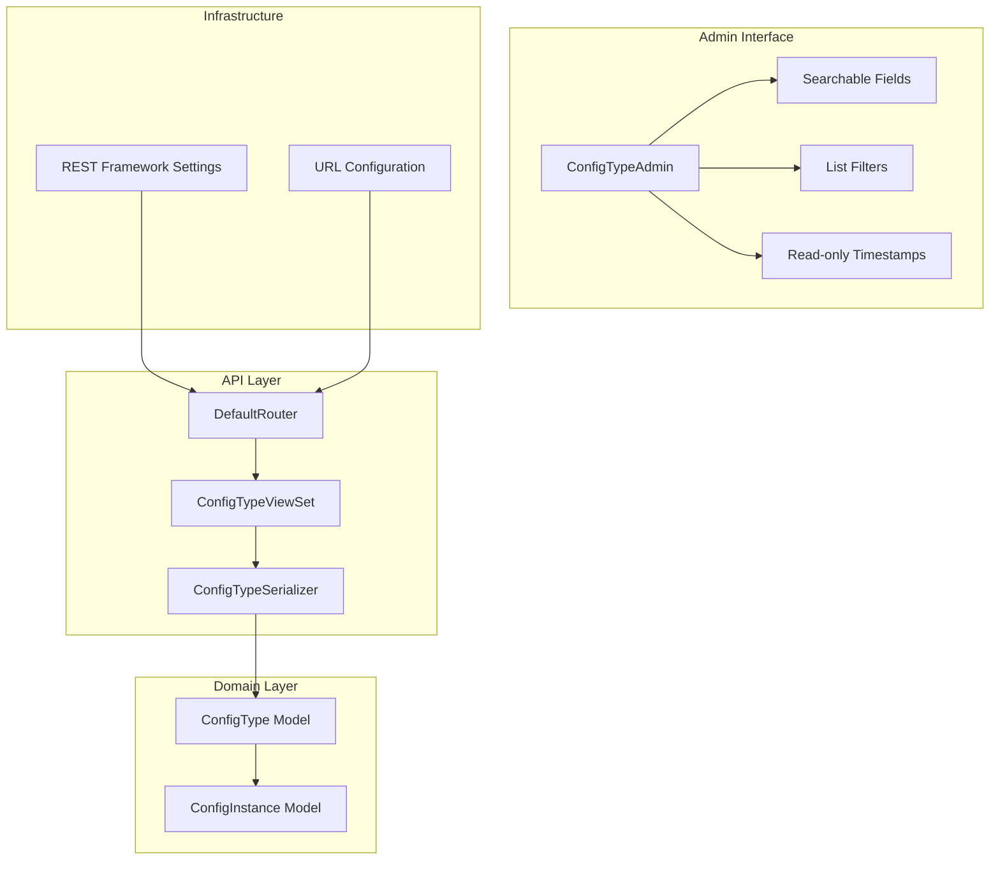
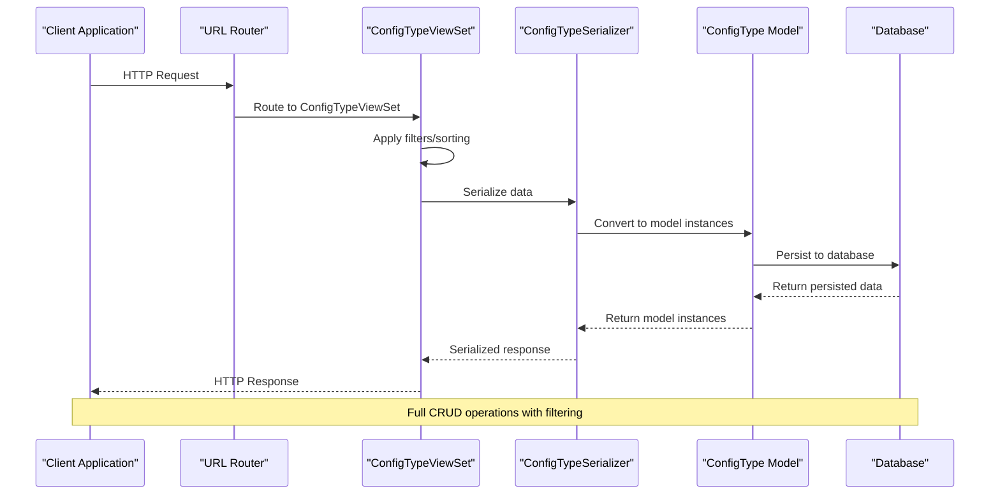
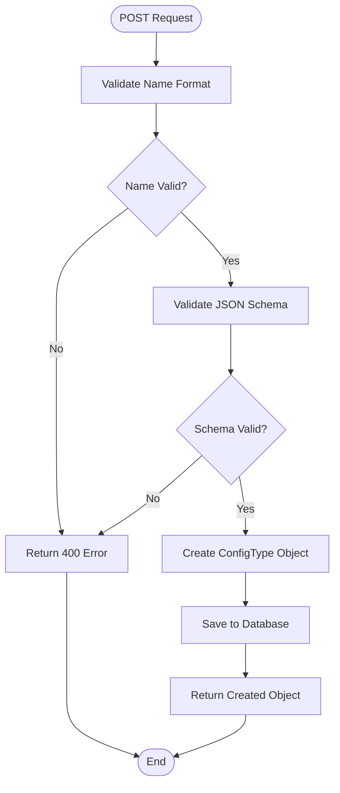
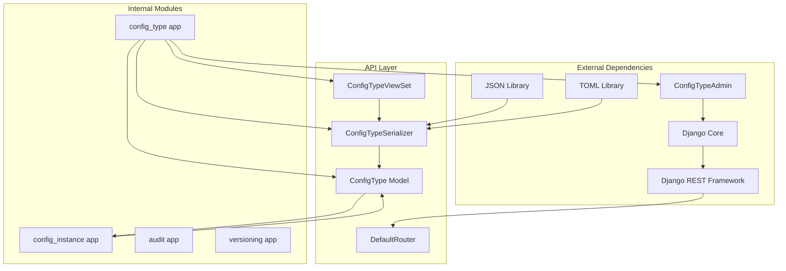

# Configuration Type Management API

<cite>
**Referenced Files in This Document**
- [models.py](file://backend/config_type/models.py)
- [serializers.py](file://backend/config_type/serializers.py)
- [views.py](file://backend/config_type/views.py)
- [urls.py](file://backend/config_type/urls.py)
- [admin.py](file://backend/config_type/admin.py)
- [settings.py](file://backend/confighub/settings.py)
- [urls.py](file://backend/confighub/urls.py)
- [models.py](file://backend/config_instance/models.py)
</cite>

## Update Summary
**Changes Made**
- Added Django Admin Interface section documenting enhanced ConfigTypeAdmin registration
- Updated Core Components section to include Admin interface features
- Enhanced troubleshooting guide with Admin interface considerations
- Added Admin interface usage examples and best practices

## Table of Contents
1. [Introduction](#introduction)
2. [Project Structure](#project-structure)
3. [Core Components](#core-components)
4. [Architecture Overview](#architecture-overview)
5. [Detailed Component Analysis](#detailed-component-analysis)
6. [Django Admin Interface](#django-admin-interface)
7. [Dependency Analysis](#dependency-analysis)
8. [Performance Considerations](#performance-considerations)
9. [Troubleshooting Guide](#troubleshooting-guide)
10. [Conclusion](#conclusion)

## Introduction
This document provides comprehensive API documentation for Configuration Type Management endpoints. It covers all RESTful endpoints for managing configuration types including creation, retrieval, updating, and deletion operations. The API follows Django REST Framework conventions and exposes CRUD operations for configuration types with filtering, sorting, and pagination support. Additionally, the Django Admin interface provides enhanced administrative capabilities with searchable fields, list filtering, and read-only timestamp display.

## Project Structure
The Configuration Type Management API is part of a larger Django application with the following structure:



**Diagram sources**
- [urls.py:1-11](file://backend/config_type/urls.py#L1-L11)
- [views.py:1-39](file://backend/config_type/views.py#L1-L39)
- [admin.py:4-9](file://backend/config_type/admin.py#L4-L9)
- [models.py:1-25](file://backend/config_type/models.py#L1-L25)

**Section sources**
- [urls.py:17-24](file://backend/confighub/urls.py#L17-L24)
- [settings.py:33-39](file://backend/confighub/settings.py#L33-L39)

## Core Components
The Configuration Type Management API consists of several core components working together:

### Data Model
The `ConfigType` model defines the configuration type entity with the following fields:
- `id`: Auto-generated primary key
- `name`: Unique identifier for the configuration type (alphanumeric + underscore)
- `title`: Human-readable display name
- `description`: Optional description field
- `format`: Enumerated format choice (JSON or TOML)
- `schema`: JSONField containing the JSON Schema definition
- `created_at`: Automatic timestamp for creation
- `updated_at`: Automatic timestamp for updates

### Serializer
The `ConfigTypeSerializer` handles serialization/deserialization with:
- Automatic instance count calculation
- Validation for name format (alphanumeric + underscore)
- Validation for JSON Schema structure
- Read-only fields for timestamps

### ViewSet
The `ConfigTypeViewSet` provides full CRUD operations with:
- Custom filtering by search term and format
- Lookup by name instead of ID
- Additional endpoint for listing associated instances

### Django Admin Interface
The `ConfigTypeAdmin` provides enhanced administrative capabilities:
- **Searchable Fields**: Search by name and title
- **List Filters**: Filter by format and creation date
- **Read-only Timestamps**: Prevent editing of created_at and updated_at fields
- **Display Fields**: Show name, title, format, and created_at in list view

**Section sources**
- [models.py:4-25](file://backend/config_type/models.py#L4-L25)
- [serializers.py:5-31](file://backend/config_type/serializers.py#L5-L31)
- [views.py:8-39](file://backend/config_type/views.py#L8-L39)
- [admin.py:4-9](file://backend/config_type/admin.py#L4-L9)

## Architecture Overview
The API follows a layered architecture pattern with clear separation of concerns:



**Diagram sources**
- [urls.py:5-10](file://backend/config_type/urls.py#L5-L10)
- [views.py:14-25](file://backend/config_type/views.py#L14-L25)
- [models.py:19-21](file://backend/config_type/models.py#L19-L21)

## Detailed Component Analysis

### Endpoint Definitions

#### Base URL Pattern
All configuration type endpoints are served under `/api/types/` with the following routing structure:

| Method | URL Pattern | Action | Description |
|--------|-------------|--------|-------------|
| GET | `/api/types/` | List | Retrieve paginated list of configuration types |
| POST | `/api/types/` | Create | Create new configuration type |
| GET | `/api/types/{name}/` | Retrieve | Get specific configuration type by name |
| PUT | `/api/types/{name}/` | Update | Update existing configuration type |
| DELETE | `/api/types/{name}/` | Delete | Remove configuration type |
| GET | `/api/types/{name}/instances/` | List Instances | Get associated configuration instances |

#### Authentication and Authorization
The API uses Django REST Framework's default permissions configuration:
- **Permission Class**: `AllowAny` - No authentication required
- **Access Control**: Open access to all operations
- **Security Implications**: Suitable for internal tools, consider adding authentication for production environments

**Section sources**
- [settings.py:33-39](file://backend/confighub/settings.py#L33-L39)
- [views.py:8-12](file://backend/config_type/views.py#L8-L12)

### Request/Response Schemas

#### Configuration Type Object Schema
All requests and responses use the following JSON structure:

| Field | Type | Required | Description | Validation |
|-------|------|----------|-------------|------------|
| `id` | integer | No | Auto-generated identifier | Read-only |
| `name` | string | Yes | Unique type identifier | Alphanumeric + underscore |
| `title` | string | Yes | Display name | Max length 200 |
| `description` | string | No | Type description | Optional |
| `format` | string | Yes | Data format (JSON/TOML) | Enum validation |
| `schema` | object | Yes | JSON Schema definition | Must be object with type field |
| `instance_count` | integer | No | Count of associated instances | Computed field |
| `created_at` | datetime | No | Creation timestamp | Read-only |
| `updated_at` | datetime | No | Last update timestamp | Read-only |

#### JSON Schema Validation Rules
The API enforces strict JSON Schema validation:

1. **Schema Type Validation**: Must be a JSON object (dictionary)
2. **Required Fields**: Must contain a `type` field
3. **Format Validation**: Only accepts JSON or TOML formats
4. **Name Validation**: Only alphanumeric characters and underscores allowed

**Section sources**
- [serializers.py:18-30](file://backend/config_type/serializers.py#L18-L30)
- [models.py:6-9](file://backend/config_type/models.py#L6-L9)

### Filtering, Sorting, and Pagination

#### Filtering Options
The API supports the following query parameters for filtering:

| Parameter | Type | Description | Example |
|-----------|------|-------------|---------|
| `search` | string | Filter by name or title (case-insensitive) | `?search=user` |
| `format` | enum | Filter by format (json/toml) | `?format=json` |

#### Sorting Behavior
The API automatically sorts results by creation date:
- **Default Order**: Newest first (`-created_at`)
- **Custom Ordering**: Not currently supported via query parameters

#### Pagination
The API implements automatic pagination:
- **Pagination Class**: `PageNumberPagination`
- **Page Size**: 20 items per page
- **Pagination Links**: Standard DRF pagination response format

**Section sources**
- [views.py:14-25](file://backend/config_type/views.py#L14-L25)
- [settings.py:37-39](file://backend/confighub/settings.py#L37-L39)

### CRUD Operations

#### Create Configuration Type (POST)
Creates a new configuration type with the following process:



**Diagram sources**
- [serializers.py:18-30](file://backend/config_type/serializers.py#L18-L30)
- [views.py:8-12](file://backend/config_type/views.py#L8-L12)

#### Retrieve Configuration Types (GET)
Supports multiple retrieval modes:

1. **List All Types**: `GET /api/types/`
2. **Filtered List**: `GET /api/types/?search={term}&format={format}`
3. **Single Type**: `GET /api/types/{name}/`
4. **Associated Instances**: `GET /api/types/{name}/instances/`

#### Update Configuration Type (PUT)
Updates existing configuration types with the same validation rules as creation.

#### Delete Configuration Type (DELETE)
Removes configuration types with cascading effects on associated instances.

**Section sources**
- [views.py:27-39](file://backend/config_type/views.py#L27-L39)

### Practical Examples

#### Creating a Configuration Type
Example request payload for creating a JSON configuration type:

```json
{
  "name": "user_config",
  "title": "User Configuration",
  "description": "Configuration for user preferences",
  "format": "json",
  "schema": {
    "type": "object",
    "properties": {
      "theme": {"type": "string"},
      "notifications": {"type": "boolean"}
    },
    "required": ["theme"]
  }
}
```

#### Retrieving Filtered Lists
Example requests:
- `GET /api/types/?search=user`
- `GET /api/types/?format=json`
- `GET /api/types/?search=user&format=json`

#### Getting Associated Instances
Example request:
- `GET /api/types/user_config/instances/`

**Section sources**
- [serializers.py:11-16](file://backend/config_type/serializers.py#L11-L16)
- [views.py:27-39](file://backend/config_type/views.py#L27-L39)

## Django Admin Interface

The Django Admin interface provides enhanced administrative capabilities for managing configuration types with improved usability and functionality.

### Admin Configuration
The `ConfigTypeAdmin` class is registered with the following features:

#### Searchable Fields
- **Enabled Fields**: `name`, `title`
- **Search Behavior**: Case-insensitive search across both fields
- **Usage**: Enter search terms in the admin search bar to filter configuration types

#### List Filters
- **Format Filter**: Filter by configuration format (JSON/TOML)
- **Created At Filter**: Filter by creation date range
- **Dynamic Filtering**: Apply multiple filters simultaneously

#### Display Configuration
- **List Display**: Shows `name`, `title`, `format`, and `created_at` fields
- **Read-only Fields**: `created_at` and `updated_at` are displayed but not editable
- **Default Ordering**: Newest configurations appear first

#### Administrative Features
- **Bulk Actions**: Available for mass operations on multiple configuration types
- **Inline Editing**: Direct editing capabilities for basic field modifications
- **History Tracking**: Built-in change history for auditing purposes

### Admin Interface Usage Examples

#### Searching Configuration Types
1. Navigate to the Configuration Types section in Django Admin
2. Use the search bar to find specific configuration types
3. Example searches:
   - `user` - finds all types with "user" in name or title
   - `config` - finds all types with "config" in name or title

#### Filtering by Format
1. Click the "Filters" button in the admin interface
2. Select format filter
3. Choose between JSON and TOML formats
4. Apply filters to narrow down the results

#### Managing Configuration Types
1. **Adding New Types**: Click "Add ConfigType" button
2. **Editing Existing Types**: Click on a configuration type row
3. **Deleting Types**: Select multiple types and use bulk delete action
4. **Viewing Details**: Click the "View on site" link to see the API endpoint

### Best Practices for Admin Usage
- **Search Strategy**: Use specific terms for precise results
- **Filter Combination**: Combine format and date filters for targeted searches
- **Timestamp Management**: Remember that created_at and updated_at fields are read-only
- **Validation**: Admin interface respects the same validation rules as the API

**Section sources**
- [admin.py:4-9](file://backend/config_type/admin.py#L4-L9)
- [models.py:19-21](file://backend/config_type/models.py#L19-L21)

## Dependency Analysis



**Diagram sources**
- [requirements.txt:1-7](file://backend/requirements.txt#L1-L7)
- [settings.py:44-57](file://backend/confighub/settings.py#L44-L57)
- [models.py:1-25](file://backend/config_type/models.py#L1-L25)
- [admin.py:1-10](file://backend/config_type/admin.py#L1-L10)

### Key Dependencies
- **Django REST Framework**: Provides ViewSet base class and pagination
- **Django Admin Interface**: Provides enhanced administrative capabilities
- **Django ORM**: Handles database operations and relationships
- **JSON/TOML Libraries**: Parse and validate configuration content
- **CORS Headers**: Enables cross-origin requests

**Section sources**
- [requirements.txt:1-7](file://backend/requirements.txt#L1-L7)
- [models.py:3-4](file://backend/config_instance/models.py#L3-L4)

## Performance Considerations
The API implementation includes several performance characteristics:

### Database Indexing
- **Unique Constraint**: `name` field has unique constraint for fast lookups
- **Foreign Keys**: Proper indexing on foreign key relationships
- **Ordering**: Default ordering by creation date for efficient pagination

### Query Optimization
- **Selective Field Loading**: Serializer loads only necessary fields
- **Count Aggregation**: Efficient counting of associated instances
- **Filter Chaining**: Combined filtering reduces database load

### Caching Opportunities
Consider implementing caching for:
- Frequently accessed configuration types
- Popular filtered queries
- Instance count calculations

### Admin Interface Performance
- **Search Optimization**: Database-level search across indexed fields
- **Filter Efficiency**: Efficient filtering with proper database indexes
- **List Display**: Optimized field selection for admin list view

## Troubleshooting Guide

### Common Validation Errors

#### Name Validation Errors
**Error**: "名称只能包含字母、数字和下划线"
**Cause**: Name contains invalid characters
**Solution**: Use only alphanumeric characters and underscores

#### JSON Schema Validation Errors
**Error**: "Schema 必须是 JSON 对象"
**Cause**: Schema is not a JSON object
**Solution**: Ensure schema is a dictionary/object

**Error**: "Schema 必须包含 type 字段"
**Cause**: Missing type property in schema
**Solution**: Include type field in schema definition

#### Format Validation Errors
**Error**: Format must be either 'json' or 'toml'
**Cause**: Invalid format value
**Solution**: Use only 'json' or 'toml'

### Admin Interface Issues

#### Search Not Working
**Issue**: Search returns no results
**Cause**: No matching records or incorrect search terms
**Solution**: Try different search terms or broaden the search criteria

#### Filter Not Applying
**Issue**: Filters don't seem to work in admin interface
**Cause**: Incorrect filter selection or empty results
**Solution**: Verify filter values and check if results match the criteria

#### Timestamp Editing Errors
**Issue**: Cannot edit created_at or updated_at fields
**Cause**: Fields are set as read-only in admin configuration
**Solution**: These timestamps are automatically managed by the system

### Error Response Format
All validation errors return structured JSON responses with error details:

```json
{
  "field_name": ["Error message"],
  "another_field": ["Another error message"]
}
```

### Permission Issues
**Issue**: Access denied to API endpoints
**Cause**: Authentication required (not configured)
**Solution**: Configure appropriate authentication classes in settings

**Section sources**
- [serializers.py:18-30](file://backend/config_type/serializers.py#L18-L30)
- [settings.py:33-39](file://backend/confighub/settings.py#L33-L39)
- [admin.py:6-8](file://backend/config_type/admin.py#L6-L8)

## Conclusion
The Configuration Type Management API provides a robust foundation for managing configuration types with comprehensive CRUD operations, filtering capabilities, and proper validation. The API follows RESTful conventions and integrates seamlessly with Django's ecosystem. The enhanced Django Admin interface adds powerful administrative capabilities with searchable fields, list filtering, and read-only timestamp display.

Key strengths of the implementation include:
- Clear separation of concerns between models, serializers, and views
- Comprehensive validation at multiple layers
- Flexible filtering and pagination support
- Enhanced administrative interface with improved usability
- Extensible architecture for future enhancements

The API serves as a solid foundation for configuration management systems and can be easily integrated into larger applications requiring structured configuration handling. The combination of REST API and Django Admin interface provides both programmatic access and user-friendly administration capabilities.

**Updated** Enhanced Django Admin interface with searchable fields, list filtering, and read-only timestamp display provides improved administrative capabilities for managing configuration types.