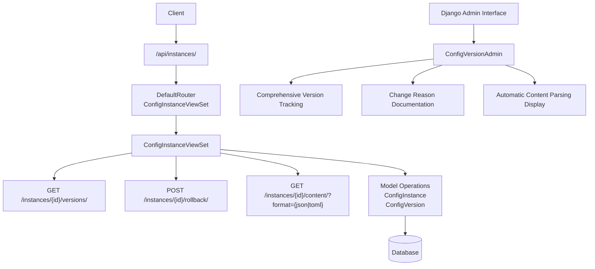
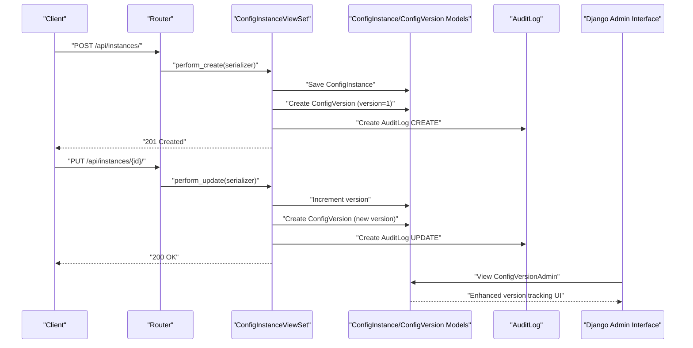
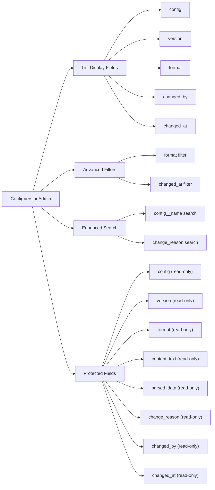
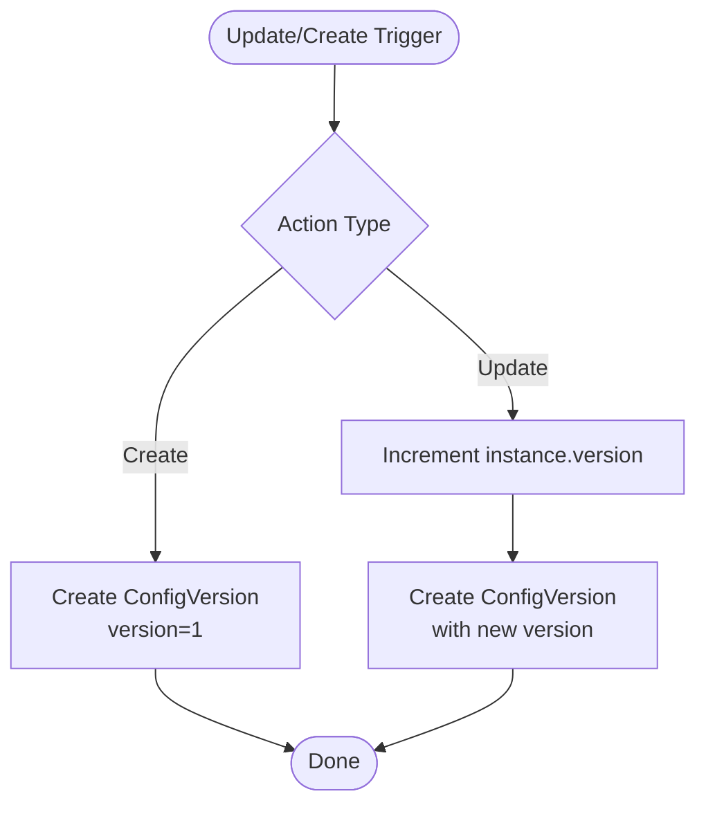
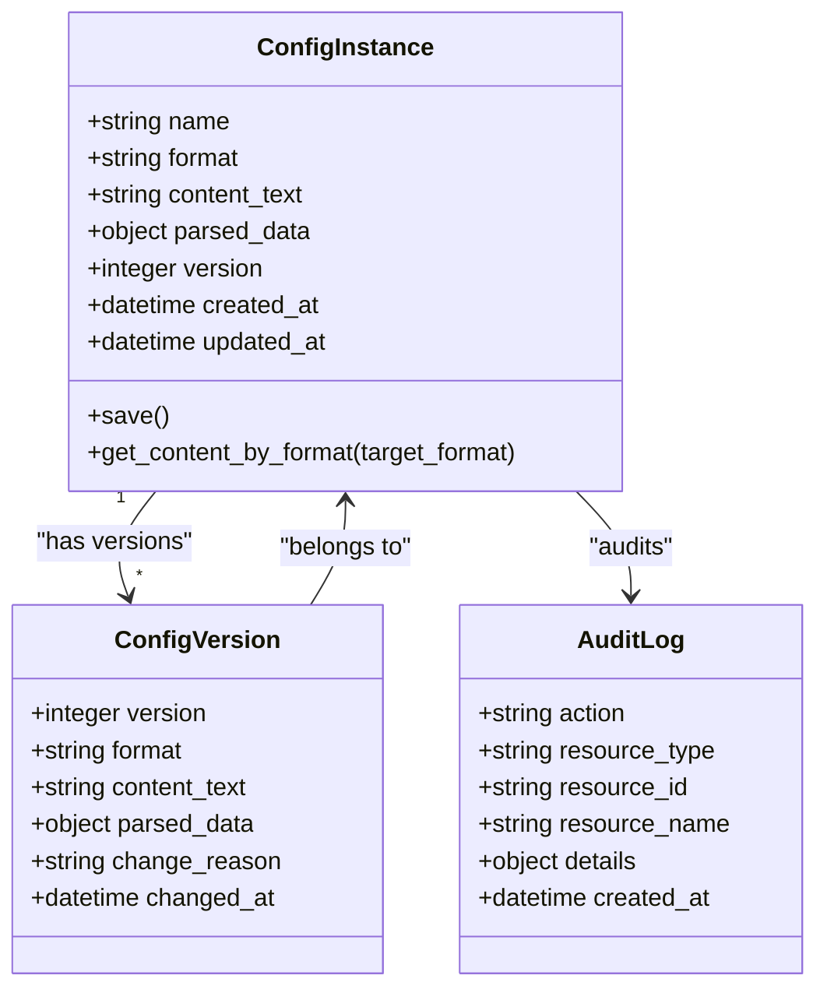
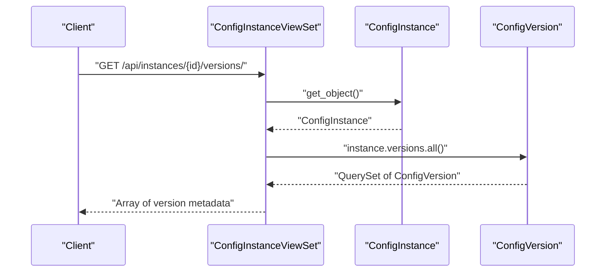
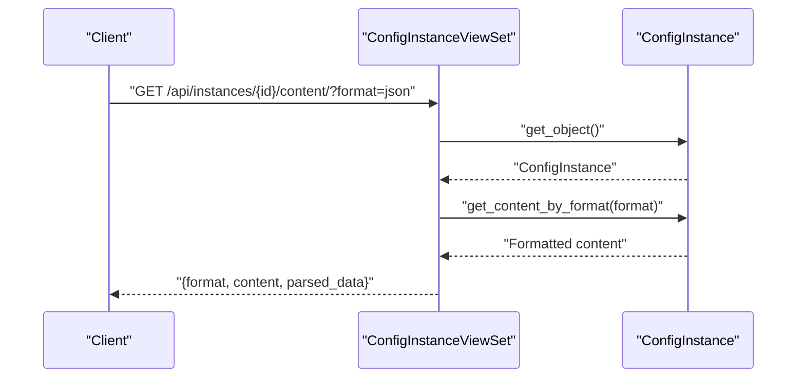
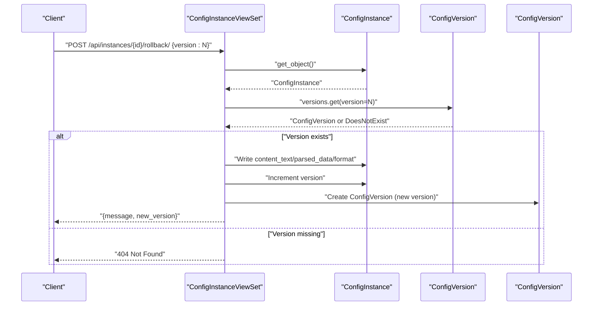
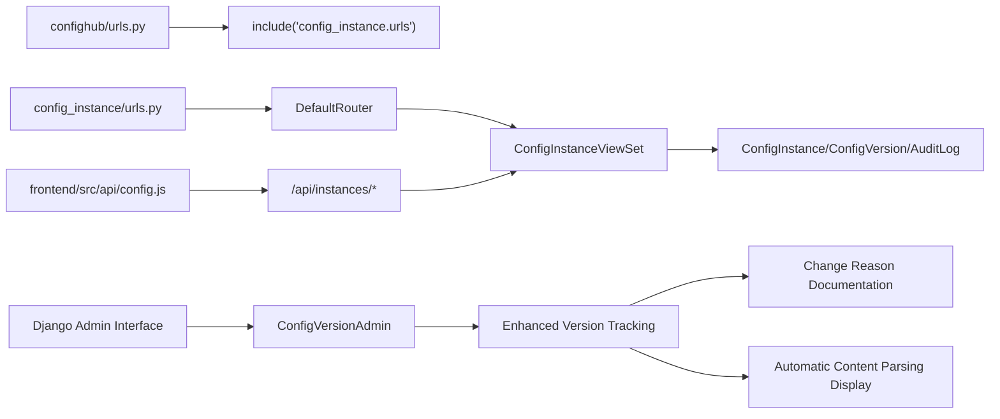

# Version Control API

<cite>
**Referenced Files in This Document**
- [confighub/urls.py](file://backend/confighub/urls.py)
- [config_instance/urls.py](file://backend/config_instance/urls.py)
- [config_instance/views.py](file://backend/config_instance/views.py)
- [config_instance/models.py](file://backend/config_instance/models.py)
- [versioning/models.py](file://backend/versioning/models.py)
- [versioning/migrations/0001_initial.py](file://backend/versioning/migrations/0001_initial.py)
- [versioning/admin.py](file://backend/versioning/admin.py)
- [config_instance/admin.py](file://backend/config_instance/admin.py)
- [audit/models.py](file://backend/audit/models.py)
- [config_instance/serializers.py](file://backend/config_instance/serializers.py)
- [frontend/src/api/config.js](file://frontend/src/api/config.js)
</cite>

## Update Summary
**Changes Made**
- Added comprehensive Django Admin interface documentation for ConfigVersionAdmin
- Enhanced version tracking capabilities with change reason documentation
- Updated automatic content parsing display features in admin interface
- Added detailed admin interface configuration and field management

## Table of Contents
1. [Introduction](#introduction)
2. [Project Structure](#project-structure)
3. [Core Components](#core-components)
4. [Architecture Overview](#architecture-overview)
5. [Django Admin Interface](#django-admin-interface)
6. [Detailed Component Analysis](#detailed-component-analysis)
7. [Dependency Analysis](#dependency-analysis)
8. [Performance Considerations](#performance-considerations)
9. [Troubleshooting Guide](#troubleshooting-guide)
10. [Conclusion](#conclusion)
11. [Appendices](#appendices)

## Introduction
This document provides comprehensive API documentation for Version Control endpoints that manage configuration version history. It covers RESTful endpoints for listing versions, retrieving content in various formats, and rolling back to previous versions. It also documents the automatic version creation mechanism, version numbering system, and historical data retention policies. The documentation now includes enhanced Django Admin interface capabilities with comprehensive version tracking, change reason documentation, and automatic content parsing display features.

## Project Structure
The Version Control API is implemented within the Django backend using Django REST Framework. The API is exposed under the base path /api/ and registered via a router for the ConfigInstanceViewSet. The versioning model persists historical snapshots of configuration content with enhanced admin interface support.

**Diagram sources**
- [confighub/urls.py:20-24](file://backend/confighub/urls.py#L20-L24)
- [config_instance/urls.py:5-10](file://backend/config_instance/urls.py#L5-L10)
- [config_instance/views.py:92-149](file://backend/config_instance/views.py#L92-L149)
- [versioning/admin.py:4-9](file://backend/versioning/admin.py#L4-L9)

**Section sources**
- [confighub/urls.py:20-24](file://backend/confighub/urls.py#L20-L24)
- [config_instance/urls.py:5-10](file://backend/config_instance/urls.py#L5-L10)
- [versioning/admin.py:4-9](file://backend/versioning/admin.py#L4-L9)

## Core Components
- ConfigInstance: Represents a configuration instance with format, raw content, parsed data, and current version number. It validates content during save and supports conversion to JSON/TOML formats.
- ConfigVersion: Stores historical snapshots of a configuration instance with version number, format, raw content, parsed data, change reason, and timestamps.
- ConfigInstanceViewSet: Provides CRUD operations plus three custom actions:
  - GET /instances/{id}/versions/: List version history for a configuration instance.
  - POST /instances/{id}/rollback/: Roll back to a specified historical version.
  - GET /instances/{id}/content/?format=: Retrieve current content in requested format.
- AuditLog: Records administrative actions including create/update events with details.
- ConfigVersionAdmin: Enhanced Django admin interface for comprehensive version tracking with change reason documentation and automatic content parsing display.

Key behaviors:
- Automatic version creation: Initial version is created on creation; a new version is created on each update.
- Version numbering: Incremental positive integers per configuration instance; rollback creates a new version with an incremented number.
- Historical retention: No explicit retention policy; all historical versions are retained in the database.
- Enhanced admin interface: Comprehensive version tracking with searchable change reasons and automatic content parsing display.

**Section sources**
- [config_instance/models.py:7-69](file://backend/config_instance/models.py#L7-L69)
- [versioning/models.py:5-23](file://backend/versioning/models.py#L5-L23)
- [config_instance/views.py:36-90](file://backend/config_instance/views.py#L36-L90)
- [audit/models.py:5-31](file://backend/audit/models.py#L5-L31)
- [versioning/admin.py:4-9](file://backend/versioning/admin.py#L4-L9)

## Architecture Overview
The Version Control API follows a layered architecture:
- URL routing mounts the ConfigInstanceViewSet under /api/instances/.
- The viewset exposes standard CRUD actions and three custom actions for versioning.
- On create/update, the viewset persists a new ConfigVersion snapshot.
- Rollback reads a target ConfigVersion and writes its content into the current ConfigInstance, then records a new ConfigVersion.
- Django Admin interface provides comprehensive version tracking with enhanced UI capabilities.

**Diagram sources**
- [config_instance/views.py:36-90](file://backend/config_instance/views.py#L36-L90)
- [versioning/models.py:5-23](file://backend/versioning/models.py#L5-L23)
- [audit/models.py:5-31](file://backend/audit/models.py#L5-L31)
- [versioning/admin.py:4-9](file://backend/versioning/admin.py#L4-L9)

## Django Admin Interface

### ConfigVersionAdmin Features
The Django Admin interface has been significantly enhanced with ConfigVersionAdmin providing comprehensive version tracking capabilities:

**Core Features:**
- **Comprehensive Version Tracking**: Full visibility into all configuration versions with detailed metadata
- **Change Reason Documentation**: Complete documentation of why changes were made to configurations
- **Automatic Content Parsing Display**: Intelligent parsing and display of configuration content in admin interface
- **Advanced Search and Filtering**: Powerful search capabilities across configuration names and change reasons

**Admin Interface Configuration:**
- **List Display**: Shows config, version, format, changed_by, and changed_at fields
- **Filtering**: Supports filtering by format and changed_at date ranges
- **Search**: Enables searching by configuration name and change reason text
- **Read-only Fields**: Protects version data integrity while providing comprehensive display

**Enhanced Field Management:**
- **Config**: Foreign key relationship to ConfigInstance with full instance information
- **Version**: Positive integer version number with validation
- **Format**: Configuration format (json/toml) with display formatting
- **Content Text**: Raw content storage with automatic parsing capabilities
- **Parsed Data**: JSONField containing structured configuration data
- **Change Reason**: Text field for documenting change purposes
- **Changed By**: User who made the change with authentication integration
- **Changed At**: Timestamp with automatic creation on version record

**Diagram sources**
- [versioning/admin.py:4-9](file://backend/versioning/admin.py#L4-L9)

**Section sources**
- [versioning/admin.py:4-9](file://backend/versioning/admin.py#L4-L9)
- [versioning/models.py:5-23](file://backend/versioning/models.py#L5-L23)

## Detailed Component Analysis

### Endpoint Definitions

#### List Versions
- Method: GET
- URL: /api/instances/{id}/versions/
- Authentication: Not enforced by default settings
- Request parameters: None
- Response: Array of version entries
  - version: integer
  - format: string ("json" or "toml")
  - change_reason: string or null
  - changed_by: string or null
  - changed_at: datetime
- Error responses:
  - 404 Not Found: If the configuration instance does not exist

Example usage (client-side):
- GET /api/instances/{id}/versions/

**Section sources**
- [config_instance/views.py:92-104](file://backend/config_instance/views.py#L92-L104)
- [frontend/src/api/config.js:28](file://frontend/src/api/config.js#L28)

#### Retrieve Version Content
- Method: GET
- URL: /api/instances/{id}/content/
- Query parameters:
  - format: string, optional. One of "json" or "toml". Defaults to the instance's current format.
- Authentication: Not enforced by default settings
- Response:
  - format: string (requested or default)
  - content: string (formatted content)
  - parsed_data: object (current parsed data)
- Error responses:
  - 404 Not Found: If the configuration instance does not exist

Example usage (client-side):
- GET /api/instances/{id}/content/?format=json

**Section sources**
- [config_instance/views.py:138-149](file://backend/config_instance/views.py#L138-L149)
- [frontend/src/api/config.js:30](file://frontend/src/api/config.js#L30)

#### Rollback to Previous Version
- Method: POST
- URL: /api/instances/{id}/rollback/
- Authentication: Not enforced by default settings
- Request body:
  - version: integer (target historical version number)
- Response:
  - message: string (success message)
  - new_version: integer (newly created version after rollback)
- Error responses:
  - 404 Not Found: If the target version does not exist for the instance
  - 400 Bad Request: If the request body is invalid (missing version)

Example usage (client-side):
- POST /api/instances/{id}/rollback/ with JSON body {"version": 3}

**Section sources**
- [config_instance/views.py:106-136](file://backend/config_instance/views.py#L106-L136)
- [frontend/src/api/config.js:29](file://frontend/src/api/config.js#L29)

### Automatic Version Creation and Version Numbering
- Creation:
  - On initial creation of a configuration instance, a ConfigVersion record is created with version=1.
- Updates:
  - On each update, the instance version is incremented, and a new ConfigVersion snapshot is created.
- Rollback:
  - Rolling back to a historical version writes the historical content into the current instance and increments the version again, creating a new ConfigVersion.

**Diagram sources**
- [config_instance/views.py:36-90](file://backend/config_instance/views.py#L36-L90)
- [versioning/models.py:5-23](file://backend/versioning/models.py#L5-L23)

**Section sources**
- [config_instance/views.py:36-90](file://backend/config_instance/views.py#L36-L90)

### Data Models and Relationships

**Diagram sources**
- [config_instance/models.py:7-69](file://backend/config_instance/models.py#L7-L69)
- [versioning/models.py:5-23](file://backend/versioning/models.py#L5-L23)
- [audit/models.py:5-31](file://backend/audit/models.py#L5-L31)

**Section sources**
- [config_instance/models.py:7-69](file://backend/config_instance/models.py#L7-L69)
- [versioning/models.py:5-23](file://backend/versioning/models.py#L5-L23)
- [audit/models.py:5-31](file://backend/audit/models.py#L5-L31)

### API Workflows

#### Listing Version History

**Diagram sources**
- [config_instance/views.py:92-104](file://backend/config_instance/views.py#L92-L104)

#### Retrieving Specific Version Content

**Diagram sources**
- [config_instance/views.py:138-149](file://backend/config_instance/views.py#L138-L149)
- [config_instance/models.py:55-69](file://backend/config_instance/models.py#L55-L69)

#### Performing a Rollback

**Diagram sources**
- [config_instance/views.py:106-136](file://backend/config_instance/views.py#L106-L136)
- [versioning/models.py:5-23](file://backend/versioning/models.py#L5-L23)

## Dependency Analysis
- URL Routing:
  - Root URLs include config_instance under /api/.
  - Router registers ConfigInstanceViewSet with basename "configinstance".
- Viewset Dependencies:
  - Uses ConfigInstance model and ConfigVersion model for versioning.
  - Uses AuditLog for auditing create/update operations.
- Admin Interface Dependencies:
  - ConfigVersionAdmin depends on ConfigVersion model for comprehensive version tracking.
  - Enhanced admin interface provides automatic content parsing display capabilities.
- Frontend Integration:
  - Frontend client constructs requests to /api/instances/{id}/versions/, /api/instances/{id}/rollback/, and /api/instances/{id}/content/.

**Diagram sources**
- [confighub/urls.py:20-24](file://backend/confighub/urls.py#L20-L24)
- [config_instance/urls.py:5-10](file://backend/config_instance/urls.py#L5-L10)
- [versioning/admin.py:4-9](file://backend/versioning/admin.py#L4-L9)
- [frontend/src/api/config.js:22-31](file://frontend/src/api/config.js#L22-L31)

**Section sources**
- [confighub/urls.py:20-24](file://backend/confighub/urls.py#L20-L24)
- [config_instance/urls.py:5-10](file://backend/config_instance/urls.py#L5-L10)
- [versioning/admin.py:4-9](file://backend/versioning/admin.py#L4-L9)
- [frontend/src/api/config.js:22-31](file://frontend/src/api/config.js#L22-L31)

## Performance Considerations
- Version count growth: Each update creates a new ConfigVersion snapshot. Large histories increase storage and query time.
- Pagination: Default pagination is enabled; consider paginating version lists if histories become large.
- Query efficiency: The versions endpoint returns a flat array of metadata; ensure database indexing on foreign keys and ordering fields remains effective.
- Content size: content_text is stored as text; very large configurations will increase storage and transfer overhead.
- Admin interface performance: Enhanced ConfigVersionAdmin with automatic content parsing display requires efficient database queries and caching strategies.
- Recommendations:
  - Monitor version counts per instance and consider implementing retention policies (e.g., keep last N versions).
  - Use query filters (e.g., changed_after, changed_before) if extended in the future.
  - Consider compression or archival strategies for very large historical content.
  - Implement database indexing on ConfigVersion fields for optimal admin interface performance.

## Troubleshooting Guide
Common issues and resolutions:
- 404 Not Found when listing versions or rolling back:
  - Cause: Instance ID does not exist or target version does not exist.
  - Resolution: Verify the instance exists and the version number is correct.
- 400 Bad Request on rollback:
  - Cause: Missing or invalid version field in request body.
  - Resolution: Ensure the request body contains a valid integer version.
- Unexpected format in content retrieval:
  - Cause: format query parameter not one of supported values.
  - Resolution: Use "json" or "toml" as the format value.
- Admin interface issues:
  - **ConfigVersionAdmin not displaying**: Verify Django admin registration and proper model imports.
  - **Change reason not showing**: Ensure change_reason field is populated during version creation.
  - **Content parsing errors**: Check that content_text is valid JSON/TOML format for proper parsing.

**Section sources**
- [config_instance/views.py:106-136](file://backend/config_instance/views.py#L106-L136)
- [versioning/admin.py:4-9](file://backend/versioning/admin.py#L4-L9)

## Conclusion
The Version Control API provides robust versioning for configuration instances with automatic snapshotting on create and update, and explicit rollback capabilities. The enhanced Django Admin interface with ConfigVersionAdmin offers comprehensive version tracking, change reason documentation, and automatic content parsing display capabilities. These improvements significantly enhance operational visibility and administrative efficiency. The endpoints are straightforward and integrate cleanly with the existing frontend client. For large-scale deployments, consider implementing retention policies and monitoring version growth to maintain performance.

## Appendices

### API Reference Summary
- Base URL: /api/
- Authentication: Not enforced by default settings
- Pagination: Enabled globally

Endpoints:
- GET /instances/{id}/versions/
  - Purpose: List version history
  - Response: Array of version metadata
- GET /instances/{id}/content/?format={json|toml}
  - Purpose: Retrieve current content in requested format
  - Response: {format, content, parsed_data}
- POST /instances/{id}/rollback/
  - Purpose: Roll back to a specific version
  - Request body: {version: integer}
  - Response: {message, new_version}

**Section sources**
- [config_instance/views.py:92-149](file://backend/config_instance/views.py#L92-L149)
- [frontend/src/api/config.js:22-31](file://frontend/src/api/config.js#L22-L31)

### Data Model Schemas
- ConfigInstance
  - Fields: id, config_type, name, format, content_text, parsed_data, version, created_by, created_at, updated_at
  - Notes: content is write-only via serializer; parsed_data and content_text are derived
- ConfigVersion
  - Fields: id, config (FK), version, format, content_text, parsed_data, change_reason, changed_by, changed_at
  - Constraints: unique_together(config, version); ordered by -version
- AuditLog
  - Fields: id, user, action, resource_type, resource_id, resource_name, details, ip_address, created_at

**Section sources**
- [config_instance/models.py:7-69](file://backend/config_instance/models.py#L7-L69)
- [versioning/models.py:5-23](file://backend/versioning/models.py#L5-L23)
- [audit/models.py:5-31](file://backend/audit/models.py#L5-L31)

### Enhanced Admin Interface Features
- **ConfigVersionAdmin Configuration**:
  - List display: config, version, format, changed_by, changed_at
  - Advanced filtering: format, changed_at
  - Enhanced search: config__name, change_reason
  - Protected fields: comprehensive read-only protection
- **Change Reason Documentation**:
  - Complete documentation trail for all configuration changes
  - Audit-ready change tracking with user attribution
  - Searchable change reason text for quick troubleshooting
- **Automatic Content Parsing Display**:
  - Intelligent parsing of configuration content in admin interface
  - Structured display of parsed_data for better readability
  - Format-aware content presentation (JSON/TOML)

**Section sources**
- [versioning/admin.py:4-9](file://backend/versioning/admin.py#L4-L9)
- [versioning/models.py:5-23](file://backend/versioning/models.py#L5-L23)

### Versioning Behavior Details
- Automatic creation:
  - Initial version=1 created on first save
  - New version created on each subsequent update
- Rollback behavior:
  - Writes historical content into current instance
  - Increments version and creates a new ConfigVersion with a change reason indicating rollback
- Historical retention:
  - No explicit retention policy; all versions retained
- Admin interface enhancements:
  - Comprehensive version tracking with change reason documentation
  - Automatic content parsing display for improved usability
  - Enhanced search and filtering capabilities

**Section sources**
- [config_instance/views.py:36-90](file://backend/config_instance/views.py#L36-L90)
- [config_instance/views.py:106-136](file://backend/config_instance/views.py#L106-L136)
- [versioning/admin.py:4-9](file://backend/versioning/admin.py#L4-L9)