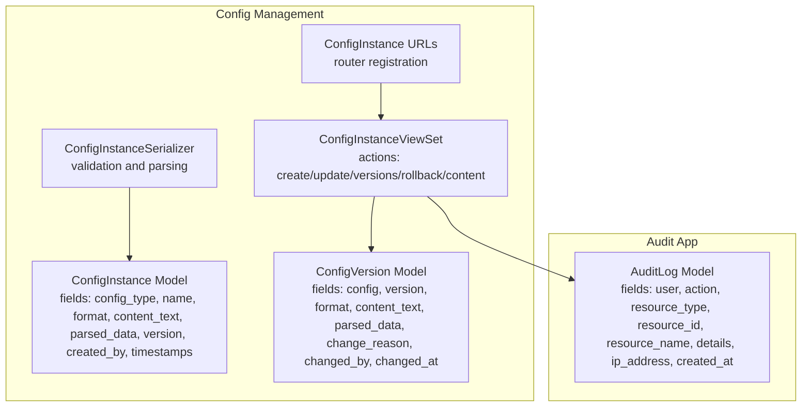
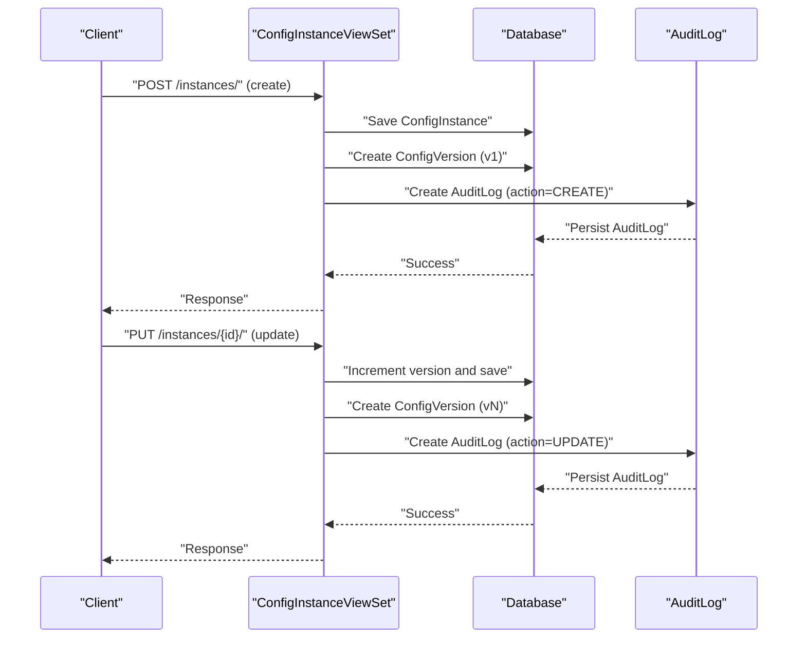
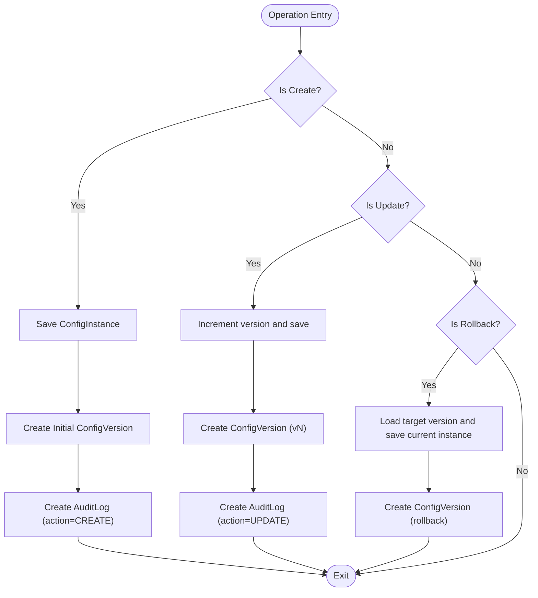
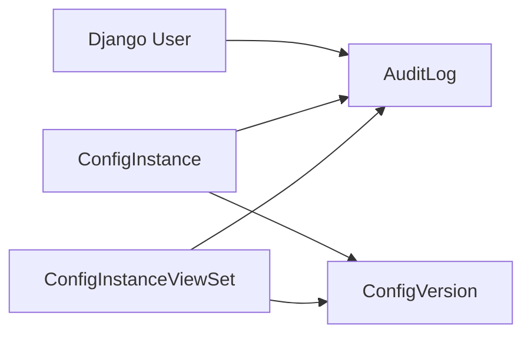

# Audit Trail & Logging Systems

<cite>
**Referenced Files in This Document**
- [models.py](file://backend/audit/models.py)
- [0001_initial.py](file://backend/audit/migrations/0001_initial.py)
- [views.py](file://backend/config_instance/views.py)
- [serializers.py](file://backend/config_instance/serializers.py)
- [models.py](file://backend/config_instance/models.py)
- [models.py](file://backend/versioning/models.py)
- [urls.py](file://backend/config_instance/urls.py)
- [settings.py](file://backend/confighub/settings.py)
</cite>

## Table of Contents
1. [Introduction](#introduction)
2. [Project Structure](#project-structure)
3. [Core Components](#core-components)
4. [Architecture Overview](#architecture-overview)
5. [Detailed Component Analysis](#detailed-component-analysis)
6. [Dependency Analysis](#dependency-analysis)
7. [Performance Considerations](#performance-considerations)
8. [Troubleshooting Guide](#troubleshooting-guide)
9. [Conclusion](#conclusion)
10. [Appendices](#appendices)

## Introduction
This document explains the audit trail and logging system implemented in the backend. It covers the event logging architecture, user action tracking, resource modification logging, and system event capture. It documents the AuditLog model structure, event categorization, and metadata collection strategies. It also details user activity tracking (including IP capture and user agent parsing), security monitoring capabilities, compliance logging, examples of audit event types, logging configuration options, export functionality, performance optimization, indexing strategies, and data retention policies.

## Project Structure
The audit system is implemented as a dedicated Django app with a single model, AuditLog, which captures user actions against resources. The system integrates with the configuration management APIs so that every create, update, and delete operation on configuration instances is logged. Versioning records are maintained separately to track content changes over time.

**Diagram sources**
- [models.py:5-31](file://backend/audit/models.py#L5-L31)
- [models.py:7-69](file://backend/config_instance/models.py#L7-L69)
- [models.py:5-23](file://backend/versioning/models.py#L5-L23)
- [views.py:11-150](file://backend/config_instance/views.py#L11-L150)
- [serializers.py:7-60](file://backend/config_instance/serializers.py#L7-L60)
- [urls.py:1-11](file://backend/config_instance/urls.py#L1-L11)

**Section sources**
- [models.py:1-31](file://backend/audit/models.py#L1-L31)
- [0001_initial.py:8-36](file://backend/audit/migrations/0001_initial.py#L8-L36)
- [models.py:1-69](file://backend/config_instance/models.py#L1-L69)
- [models.py:1-23](file://backend/versioning/models.py#L1-L23)
- [views.py:1-150](file://backend/config_instance/views.py#L1-L150)
- [serializers.py:1-60](file://backend/config_instance/serializers.py#L1-L60)
- [urls.py:1-11](file://backend/config_instance/urls.py#L1-L11)

## Core Components
- AuditLog model: central record of user actions, including user identity, action type, resource metadata, contextual details, IP address, and timestamp.
- ConfigInstanceViewSet: orchestrates create, update, and rollback operations and emits audit events for each.
- ConfigInstanceSerializer: validates and parses configuration content, ensuring data integrity before persistence.
- ConfigVersion model: maintains historical snapshots of configuration content for rollback and audit purposes.

Key responsibilities:
- Capture user actions with rich metadata for compliance and forensics.
- Persist version history alongside audit logs for content change tracking.
- Provide programmatic access to audit events via the API.

**Section sources**
- [models.py:5-31](file://backend/audit/models.py#L5-L31)
- [views.py:36-90](file://backend/config_instance/views.py#L36-L90)
- [serializers.py:20-48](file://backend/config_instance/serializers.py#L20-L48)
- [models.py:5-23](file://backend/versioning/models.py#L5-L23)

## Architecture Overview
The audit architecture follows a reactive pattern: when a configuration instance is created or updated, the viewset persists the change, creates a version snapshot, and writes an AuditLog entry. The AuditLog model stores the action, resource identity, and optional details. The system does not currently capture IP addresses or user agents automatically; these would require middleware or request augmentation.

**Diagram sources**
- [views.py:36-90](file://backend/config_instance/views.py#L36-L90)
- [models.py:5-23](file://backend/versioning/models.py#L5-L23)
- [models.py:5-31](file://backend/audit/models.py#L5-L31)

## Detailed Component Analysis

### AuditLog Model
The AuditLog model defines the schema for audit events:
- Identity: user (nullable to support anonymous actions), action (choices include CREATE, UPDATE, DELETE, VIEW, EXPORT, IMPORT), resource_type, resource_id, resource_name.
- Context: details (JSON field for arbitrary metadata), ip_address (nullable), created_at (auto timestamp).
- Ordering: default descending by created_at for efficient retrieval of recent events.

Event categorization:
- Action choices enumerate common administrative and operational activities. Additional categories can be introduced by extending the choices and updating producers.

Metadata collection:
- details supports free-form JSON to capture extra context (e.g., format, version numbers).
- resource_name combines human-readable identifiers for traceability.

Indexing and ordering:
- Default ordering by created_at desc improves common query patterns.
- Additional indexes can be added for frequently filtered fields (see Performance Considerations).

**Section sources**
- [models.py:5-31](file://backend/audit/models.py#L5-L31)
- [0001_initial.py:16-36](file://backend/audit/migrations/0001_initial.py#L16-L36)

### ConfigInstanceViewSet Integration
The viewset integrates audit logging into lifecycle operations:
- Creation: after saving the instance and creating the initial version, an AuditLog is emitted with action CREATE and details containing the format.
- Update: increments the version number, saves a new version, and emits an AuditLog with action UPDATE and details including old and new versions.
- Rollback: triggers a new version creation and returns a success response; consider adding an audit event for rollback actions if required.

**Diagram sources**
- [views.py:36-90](file://backend/config_instance/views.py#L36-L90)
- [models.py:5-23](file://backend/versioning/models.py#L5-L23)
- [models.py:5-31](file://backend/audit/models.py#L5-L31)

**Section sources**
- [views.py:36-90](file://backend/config_instance/views.py#L36-L90)

### ConfigInstanceSerializer Validation
The serializer validates incoming configuration content:
- Parses content according to selected format (JSON/TOML).
- Validates parsed data against the associated ConfigType’s JSON Schema.
- Sets content_text and parsed_data for persistence.

This ensures that only valid configurations are persisted, reducing invalid audit events caused by malformed data.

**Section sources**
- [serializers.py:20-48](file://backend/config_instance/serializers.py#L20-L48)
- [models.py:42-61](file://backend/config_instance/models.py#L42-L61)

### ConfigInstance and ConfigVersion Models
- ConfigInstance stores the configuration content in both raw and parsed forms, tracks version, and associates creators.
- ConfigVersion stores historical snapshots with format, content_text, parsed_data, change_reason, and changed_by.

These models complement AuditLog by providing temporal context for content changes.

**Section sources**
- [models.py:7-69](file://backend/config_instance/models.py#L7-L69)
- [models.py:5-23](file://backend/versioning/models.py#L5-L23)

### User Activity Tracking
Current implementation:
- User identity is captured via the authenticated request user in viewset actions.
- IP address and user agent are not captured by default in the audit system.

Recommended enhancements:
- Add middleware to extract and attach ip_address and user_agent to requests before view execution.
- Extend AuditLog details to include user_agent and other request attributes for richer forensics.

Impact:
- Capturing IP and user agent enables suspicious activity detection (e.g., unusual geographic access patterns) and access pattern analysis.

**Section sources**
- [views.py:36-90](file://backend/config_instance/views.py#L36-L90)
- [models.py:16-23](file://backend/audit/models.py#L16-L23)

### Security Monitoring Capabilities
- Suspicious activity detection: use ip_address and user_agent metadata to flag anomalies (e.g., rapid repeated actions, new geographic regions).
- Access pattern analysis: group AuditLog entries by user, resource_type, and action to identify unusual behavior.
- Compliance logging: maintain immutable audit trails with sufficient metadata for audits.

Note: These capabilities depend on capturing IP and user agent metadata as described above.

[No sources needed since this section provides general guidance]

### Examples of Audit Event Types
Common event types produced by the system:
- CREATE: New configuration instance created.
- UPDATE: Existing configuration instance updated; includes version metadata.
- DELETE: Deletion events can be added by extending the viewset and emitting an AuditLog with action DELETE.
- VIEW: Resource viewing events can be added by instrumenting GET endpoints and emitting an AuditLog with action VIEW.
- EXPORT/IMPORT: Data export/import events can be added by instrumenting endpoints and emitting AuditLog with action EXPORT or IMPORT.

**Section sources**
- [models.py:7-14](file://backend/audit/models.py#L7-L14)
- [views.py:52-90](file://backend/config_instance/views.py#L52-L90)

### Logging Configuration Options
- Django logging: configure loggers, handlers, and formatters in settings to capture application-level logs alongside audit events.
- Structured logging: emit structured JSON logs for downstream SIEM ingestion.
- Filtering: apply filters to exclude noisy endpoints or internal tasks from audit logs.

Note: The repository does not define explicit logging configuration; integrate with Django’s logging framework in settings.

**Section sources**
- [settings.py](file://backend/confighub/settings.py)

### Export Functionality for Regulatory Compliance
- API exposure: AuditLog records can be queried via the Django REST Framework router registered under the config_instance app.
- Pagination and filtering: leverage DRF pagination and query parameters to export large datasets.
- Bulk export: implement CSV or JSON export endpoints to produce audit reports for compliance.

Note: The current URL routing registers the ConfigInstanceViewSet; extend the router or add a dedicated endpoint for exporting AuditLog records.

**Section sources**
- [urls.py:1-11](file://backend/config_instance/urls.py#L1-L11)

## Dependency Analysis
The audit system depends on:
- Django’s ORM and REST Framework for persistence and API exposure.
- ConfigInstance and ConfigVersion models for context and versioning.
- User model for identity association.

**Diagram sources**
- [models.py:16-23](file://backend/audit/models.py#L16-L23)
- [models.py:14-27](file://backend/config_instance/models.py#L14-L27)
- [models.py:7-14](file://backend/versioning/models.py#L7-L14)
- [views.py:36-90](file://backend/config_instance/views.py#L36-L90)

**Section sources**
- [models.py:1-31](file://backend/audit/models.py#L1-L31)
- [models.py:1-69](file://backend/config_instance/models.py#L1-L69)
- [models.py:1-23](file://backend/versioning/models.py#L1-L23)
- [views.py:1-150](file://backend/config_instance/views.py#L1-L150)

## Performance Considerations
- Indexing strategies:
  - Add database indexes on frequently queried fields: user, resource_type, resource_id, created_at, ip_address.
  - Composite indexes for common filter combinations (e.g., user + created_at, resource_type + created_at).
- Partitioning:
  - Consider partitioning AuditLog by date range for very large datasets.
- Asynchronous logging:
  - Offload audit log writes to a message queue or background task to reduce request latency.
- Sampling:
  - Apply probabilistic sampling for high-volume operations to reduce storage costs while preserving signal.
- Query optimization:
  - Use select_related and prefetch_related to minimize N+1 queries when retrieving audit events with user/resource details.
- Data retention:
  - Define retention policies (e.g., 90–365 days) and automate archival/deletion jobs.
- Storage:
  - Compress logs and use columnar storage formats for analytical queries.

[No sources needed since this section provides general guidance]

## Troubleshooting Guide
- Missing user identity:
  - Ensure requests are authenticated; otherwise, user will be NULL in AuditLog.
- Empty or missing IP address:
  - Implement middleware to populate ip_address before view execution.
- Audit events not appearing:
  - Verify that viewset actions are invoked and that exceptions during audit creation do not abort the transaction unintentionally.
- Large audit volumes:
  - Monitor database growth and implement indexing, partitioning, and retention policies.
- Export delays:
  - Add pagination and limit exports to reasonable time windows; consider background jobs for large exports.

**Section sources**
- [views.py:36-90](file://backend/config_instance/views.py#L36-L90)
- [models.py:16-23](file://backend/audit/models.py#L16-L23)

## Conclusion
The audit trail system provides a solid foundation for tracking user actions and resource modifications in the configuration management domain. By integrating with the ConfigInstance lifecycle and maintaining version history, it offers strong compliance support. To enhance security monitoring and meet regulatory requirements, extend the system to capture IP addresses and user agents, implement robust indexing and retention policies, and add export capabilities for audit reporting.

[No sources needed since this section summarizes without analyzing specific files]

## Appendices

### Appendix A: AuditLog Fields Reference
- user: ForeignKey to Django User (nullable)
- action: CharField with predefined choices (CREATE, UPDATE, DELETE, VIEW, EXPORT, IMPORT)
- resource_type: CharField describing the resource category
- resource_id: CharField storing the resource identifier
- resource_name: CharField storing a human-readable resource label
- details: JSONField for additional metadata
- ip_address: GenericIPAddressField (nullable)
- created_at: DateTimeField auto-populated on creation

**Section sources**
- [models.py:5-31](file://backend/audit/models.py#L5-L31)
- [0001_initial.py:16-36](file://backend/audit/migrations/0001_initial.py#L16-L36)

### Appendix B: Example Audit Events
- CREATE: Emitted on initial configuration instance creation; details include format.
- UPDATE: Emitted on updates; details include old and new versions.
- DELETE: Can be added similarly to CREATE/UPDATE.
- VIEW: Can be added for read operations.
- EXPORT/IMPORT: Can be added for bulk operations.

**Section sources**
- [views.py:52-90](file://backend/config_instance/views.py#L52-L90)
- [models.py:7-14](file://backend/audit/models.py#L7-L14)