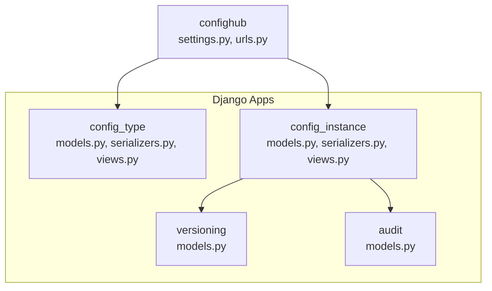
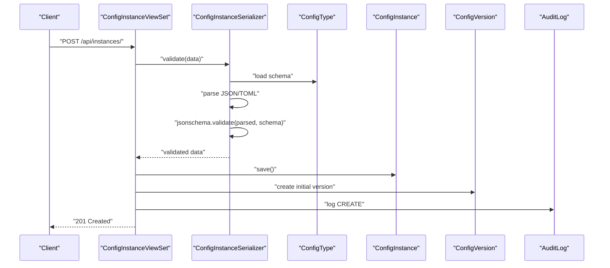
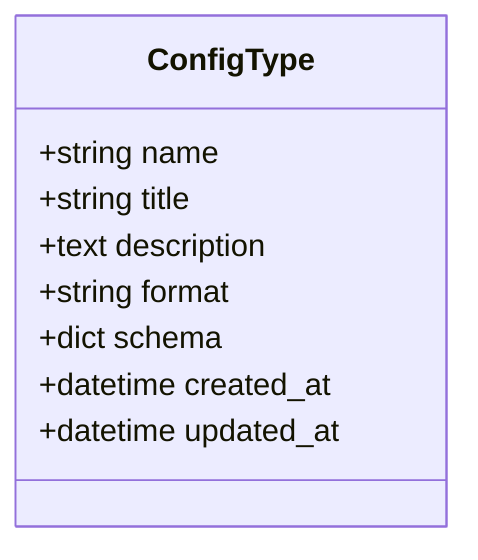
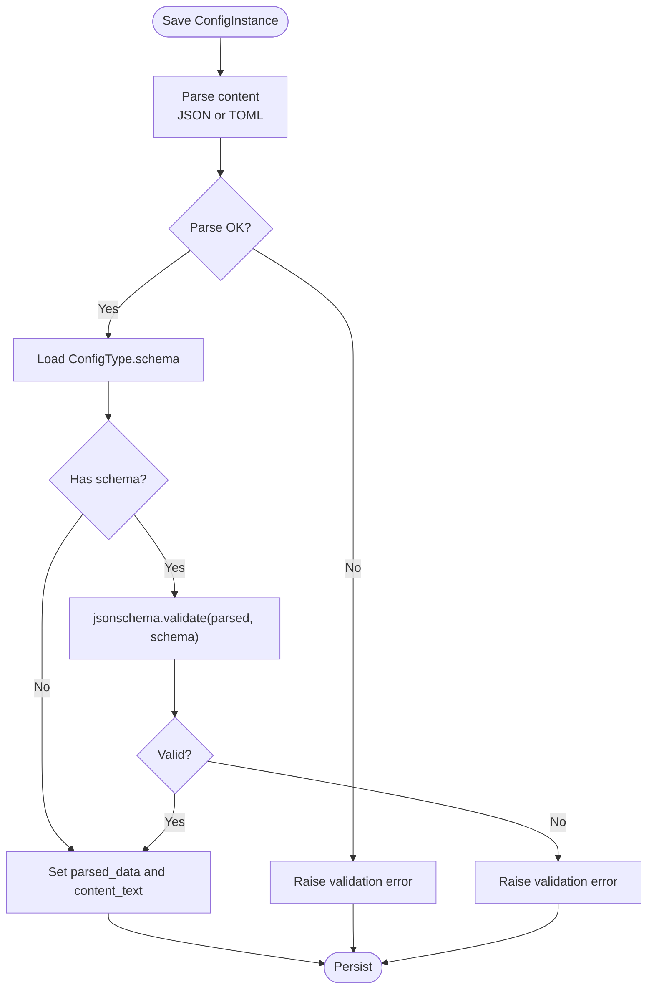
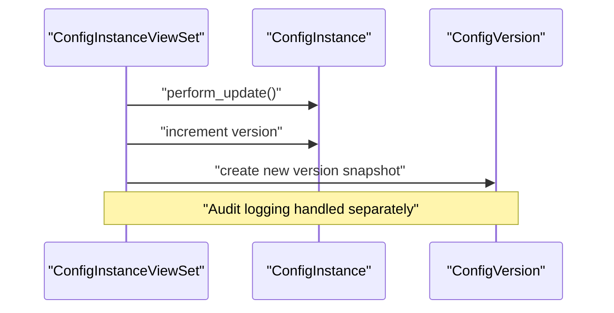
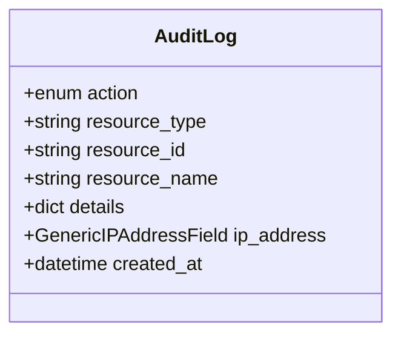
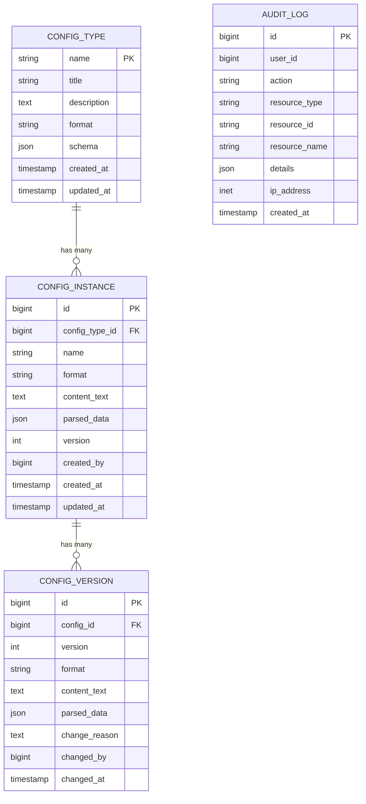
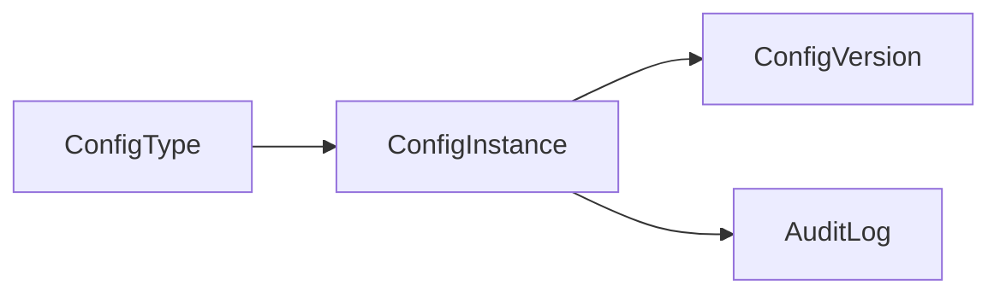

# Business Logic Implementation

<cite>
**Referenced Files in This Document**
- [settings.py](file://backend/confighub/settings.py)
- [urls.py](file://backend/confighub/urls.py)
- [models.py](file://backend/config_type/models.py)
- [serializers.py](file://backend/config_type/serializers.py)
- [views.py](file://backend/config_type/views.py)
- [models.py](file://backend/config_instance/models.py)
- [serializers.py](file://backend/config_instance/serializers.py)
- [views.py](file://backend/config_instance/views.py)
- [models.py](file://backend/versioning/models.py)
- [models.py](file://backend/audit/models.py)
- [0001_initial.py](file://backend/config_type/migrations/0001_initial.py)
- [0001_initial.py](file://backend/config_instance/migrations/0001_initial.py)
- [0001_initial.py](file://backend/versioning/migrations/0001_initial.py)
- [0001_initial.py](file://backend/audit/migrations/0001_initial.py)
</cite>

## Table of Contents
1. [Introduction](#introduction)
2. [Project Structure](#project-structure)
3. [Core Components](#core-components)
4. [Architecture Overview](#architecture-overview)
5. [Detailed Component Analysis](#detailed-component-analysis)
6. [Dependency Analysis](#dependency-analysis)
7. [Performance Considerations](#performance-considerations)
8. [Troubleshooting Guide](#troubleshooting-guide)
9. [Conclusion](#conclusion)

## Introduction
This document explains the business logic implementation of the AI-Ops Configuration Hub. It focuses on configuration validation, format conversion, version control, and audit trail generation. It also documents the JSON Schema validation, TOML/JSON parsing and conversion logic, content validation workflows, automatic version creation, historical data management, rollback functionality, and the audit system including event logging, user tracking, and security monitoring. Guidance on performance optimization, caching strategies, and scalability is included.

## Project Structure
The backend is organized into Django apps:
- config_type: Defines configuration types and their JSON Schemas.
- config_instance: Stores configuration instances, validates content, converts formats, and manages versions.
- versioning: Historical snapshots of configuration instances.
- audit: Centralized audit log for all user actions.
- confighub: Django project settings and URL routing.

**Diagram sources**
- [settings.py:44-57](file://backend/confighub/settings.py#L44-L57)
- [urls.py:22-23](file://backend/confighub/urls.py#L22-L23)
- [models.py:1-25](file://backend/config_type/models.py#L1-L25)
- [models.py:1-69](file://backend/config_instance/models.py#L1-L69)
- [models.py:1-23](file://backend/versioning/models.py#L1-L23)
- [models.py:1-31](file://backend/audit/models.py#L1-L31)

**Section sources**
- [settings.py:44-57](file://backend/confighub/settings.py#L44-L57)
- [urls.py:22-23](file://backend/confighub/urls.py#L22-L23)

## Core Components
- ConfigType: Defines configuration categories with a JSON Schema and default format (JSON or TOML). Includes validation for schema shape and type name.
- ConfigInstance: Stores raw content, parsed JSON data, format, version, creator, timestamps, and foreign key to ConfigType. Automatically parses and validates content on save.
- ConfigVersion: Historical snapshot of a ConfigInstance with version number, format, content, parsed data, change reason, modifier, and timestamp.
- AuditLog: Centralized audit trail capturing user actions, resources, IP address, and metadata.

Key behaviors:
- Validation pipeline: Content format parsing (JSON/TOML), JSON Schema validation against ConfigType.schema, and normalized parsed_data storage.
- Format conversion: Seamless conversion between JSON and TOML via parsed_data.
- Version control: Automatic version increment on updates, initial version creation on create, and rollback to previous versions.
- Audit trail: Logging of create/update/delete/view/export/import events with user and resource context.

**Section sources**
- [models.py:4-25](file://backend/config_type/models.py#L4-L25)
- [serializers.py:18-31](file://backend/config_type/serializers.py#L18-L31)
- [models.py:7-69](file://backend/config_instance/models.py#L7-L69)
- [serializers.py:20-48](file://backend/config_instance/serializers.py#L20-L48)
- [models.py:5-23](file://backend/versioning/models.py#L5-L23)
- [models.py:5-31](file://backend/audit/models.py#L5-L31)

## Architecture Overview
The business logic layer orchestrates validation, transformation, persistence, and auditing around CRUD operations on configuration instances.

**Diagram sources**
- [views.py:36-61](file://backend/config_instance/views.py#L36-L61)
- [serializers.py:20-48](file://backend/config_instance/serializers.py#L20-L48)
- [models.py:14-15](file://backend/config_type/models.py#L14-L15)
- [models.py:37-40](file://backend/config_instance/models.py#L37-L40)
- [models.py:5-23](file://backend/versioning/models.py#L5-L23)
- [models.py:5-31](file://backend/audit/models.py#L5-L31)

## Detailed Component Analysis

### Configuration Type Management
Responsibilities:
- Define configuration categories with a JSON Schema and default format.
- Enforce schema shape and type name constraints.
- Provide counts of associated instances.

Validation highlights:
- Name validation ensures alphanumeric and underscore characters.
- Schema validation enforces dictionary type and presence of a top-level type field.

**Diagram sources**
- [models.py:4-25](file://backend/config_type/models.py#L4-L25)
- [serializers.py:18-31](file://backend/config_type/serializers.py#L18-L31)

**Section sources**
- [models.py:4-25](file://backend/config_type/models.py#L4-L25)
- [serializers.py:18-31](file://backend/config_type/serializers.py#L18-L31)

### Configuration Instance Management
Responsibilities:
- Parse and validate incoming content (JSON/TOML).
- Normalize content into parsed_data for querying and association.
- Convert between JSON and TOML formats on demand.
- Manage version lifecycle (create, update, rollback).
- Emit audit logs for create/update/delete/view/export/import.

Validation and conversion workflow:
- Serializer validates format correctness and applies JSON Schema from ConfigType.
- Model-level parsing ensures parsed_data consistency.
- Format conversion uses JSON/TOML libraries to serialize parsed_data.

Version control workflow:
- Create: Initialize version 1 and record initial snapshot.
- Update: Increment version, persist new snapshot, and log details.
- Rollback: Restore target version’s content and create a new snapshot with a change reason.

**Diagram sources**
- [serializers.py:20-48](file://backend/config_instance/serializers.py#L20-L48)
- [models.py:42-61](file://backend/config_instance/models.py#L42-L61)

**Section sources**
- [models.py:7-69](file://backend/config_instance/models.py#L7-L69)
- [serializers.py:20-48](file://backend/config_instance/serializers.py#L20-L48)
- [views.py:36-90](file://backend/config_instance/views.py#L36-L90)

### Version Control and History
Responsibilities:
- Maintain historical snapshots of configuration instances.
- Enforce unique version per instance.
- Support rollback to any prior version.

Key behaviors:
- Initial version created on first save.
- New version created on each update.
- Rollback restores content from target version and increments version.

**Diagram sources**
- [views.py:62-90](file://backend/config_instance/views.py#L62-L90)
- [models.py:5-23](file://backend/versioning/models.py#L5-L23)

**Section sources**
- [models.py:5-23](file://backend/versioning/models.py#L5-L23)
- [views.py:62-90](file://backend/config_instance/views.py#L62-L90)

### Audit Trail System
Responsibilities:
- Log user actions on resources.
- Capture user identity, resource metadata, IP address, and details.
- Support security monitoring and compliance.

Supported actions include create, update, delete, view, export, and import. The system records user, action, resource type/id/name, and optional details such as version numbers or format.

**Diagram sources**
- [models.py:5-31](file://backend/audit/models.py#L5-L31)

**Section sources**
- [models.py:5-31](file://backend/audit/models.py#L5-L31)
- [views.py:52-60](file://backend/config_instance/views.py#L52-L60)
- [views.py:82-90](file://backend/config_instance/views.py#L82-L90)

### Data Models Overview
Entity relationships and constraints:

**Diagram sources**
- [0001_initial.py:14-25](file://backend/config_type/migrations/0001_initial.py#L14-L25)
- [0001_initial.py:18-31](file://backend/config_instance/migrations/0001_initial.py#L18-L31)
- [0001_initial.py:18-29](file://backend/versioning/migrations/0001_initial.py#L18-L29)
- [0001_initial.py:17-28](file://backend/audit/migrations/0001_initial.py#L17-L28)

**Section sources**
- [0001_initial.py:14-25](file://backend/config_type/migrations/0001_initial.py#L14-L25)
- [0001_initial.py:18-31](file://backend/config_instance/migrations/0001_initial.py#L18-L31)
- [0001_initial.py:18-29](file://backend/versioning/migrations/0001_initial.py#L18-L29)
- [0001_initial.py:17-28](file://backend/audit/migrations/0001_initial.py#L17-L28)

## Dependency Analysis
- ConfigInstance depends on ConfigType for schema validation and format defaults.
- ConfigInstance persists parsed_data for efficient querying and cross-format conversion.
- ConfigVersion maintains immutable history linked to ConfigInstance.
- AuditLog captures user actions across resources for governance and security.

**Diagram sources**
- [models.py:14-15](file://backend/config_type/models.py#L14-L15)
- [models.py:14-24](file://backend/config_instance/models.py#L14-L24)
- [models.py:7-14](file://backend/versioning/models.py#L7-L14)
- [models.py:16-23](file://backend/audit/models.py#L16-L23)

**Section sources**
- [models.py:14-15](file://backend/config_type/models.py#L14-L15)
- [models.py:14-24](file://backend/config_instance/models.py#L14-L24)
- [models.py:7-14](file://backend/versioning/models.py#L7-L14)
- [models.py:16-23](file://backend/audit/models.py#L16-L23)

## Performance Considerations
- Parsing and validation cost:
  - JSON/TOML parsing occurs during save and serializer validation. Keep content sizes reasonable and avoid unnecessary re-parsing by leveraging cached parsed_data.
- Schema validation:
  - jsonschema.validate runs per write operation. Consider pre-validating large batches and caching frequently used schemas at the application level.
- Query optimization:
  - Views filter by config_type, search terms, and format. Ensure appropriate database indexes exist on frequently queried fields (e.g., config_type.name, name, format).
- Pagination:
  - REST framework pagination is configured globally. Use it consistently in list endpoints to limit payload sizes.
- Caching strategies:
  - Cache ConfigType.schema and derived metadata to reduce repeated loads.
  - Cache recent audit logs for dashboards and reporting.
- Concurrency:
  - Use atomic transactions for create/update/rollback to prevent race conditions on version increments.
- Scalability:
  - Offload heavy validation to background tasks if throughput demands exceed single-threaded capacity.
  - Scale horizontally with read replicas for read-heavy list and content endpoints.

[No sources needed since this section provides general guidance]

## Troubleshooting Guide
Common issues and resolutions:
- Invalid JSON/TOML content:
  - Symptoms: Validation errors raised during create/update.
  - Resolution: Ensure content matches selected format; use the content endpoint to convert and verify output.
  - References: [serializers.py:27-35](file://backend/config_instance/serializers.py#L27-L35), [models.py:44-53](file://backend/config_instance/models.py#L44-L53)
- Schema validation failures:
  - Symptoms: ValidationError indicating schema mismatch.
  - Resolution: Align content with ConfigType.schema; verify schema completeness and type fields.
  - References: [serializers.py:37-42](file://backend/config_instance/serializers.py#L37-L42), [models.py:14-15](file://backend/config_type/models.py#L14-L15)
- Version not found during rollback:
  - Symptoms: 404 response when calling rollback endpoint.
  - Resolution: Verify the target version exists for the instance; list versions via the versions endpoint.
  - References: [views.py:106-136](file://backend/config_instance/views.py#L106-L136)
- Audit log missing user context:
  - Symptoms: User field empty in audit entries.
  - Resolution: Ensure requests are authenticated; the system records user only when authenticated.
  - References: [views.py:53-60](file://backend/config_instance/views.py#L53-L60), [views.py:82-90](file://backend/config_instance/views.py#L82-L90)

**Section sources**
- [serializers.py:27-42](file://backend/config_instance/serializers.py#L27-L42)
- [models.py:44-53](file://backend/config_instance/models.py#L44-L53)
- [views.py:106-136](file://backend/config_instance/views.py#L106-L136)
- [views.py:53-60](file://backend/config_instance/views.py#L53-L60)
- [views.py:82-90](file://backend/config_instance/views.py#L82-L90)

## Conclusion
The AI-Ops Configuration Hub implements robust business logic centered on validated, normalized configuration data with strong versioning and audit capabilities. The system enforces format correctness and JSON Schema compliance, supports seamless format conversion, and provides a complete audit trail for governance. With careful attention to validation costs, caching, and transactional integrity, the platform scales effectively while maintaining data consistency and security.