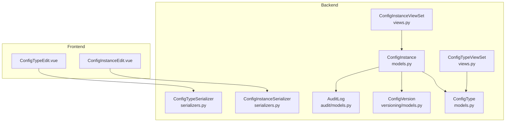
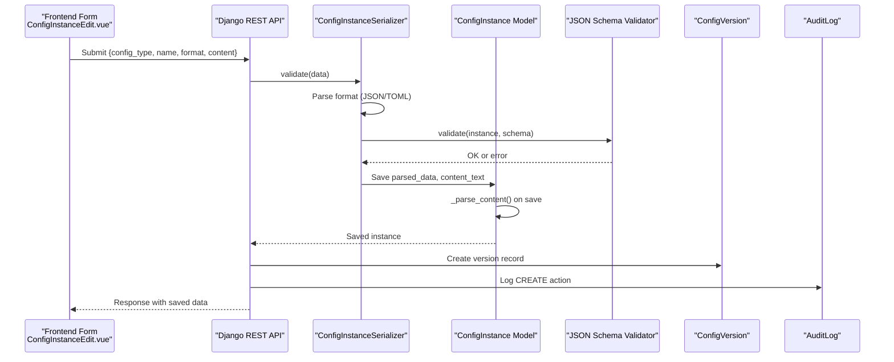
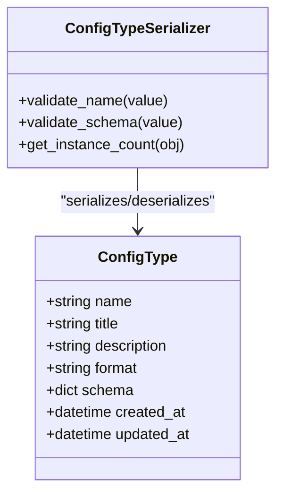
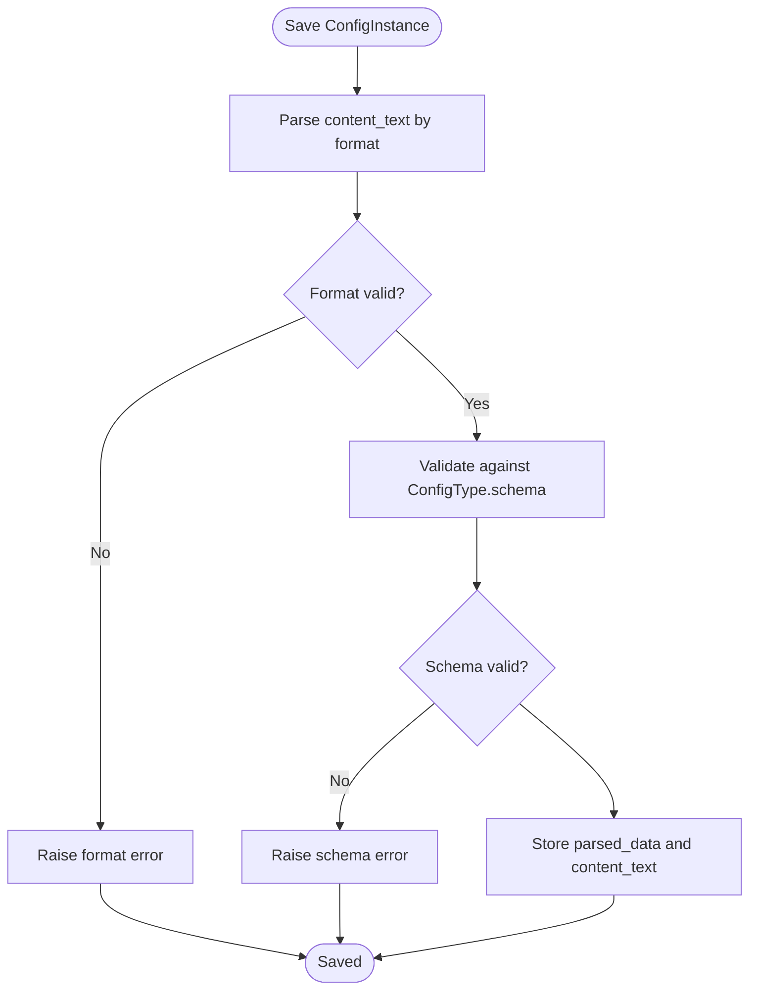
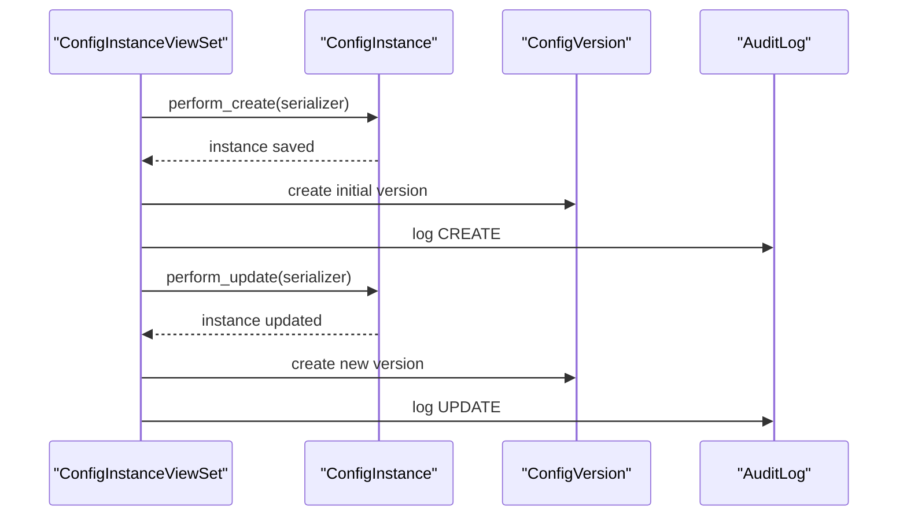
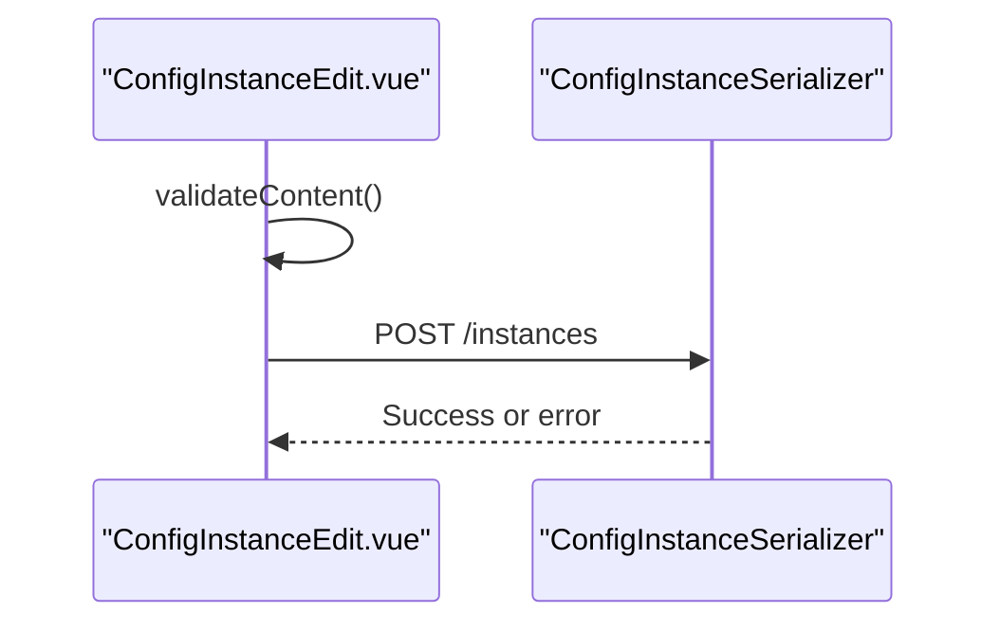
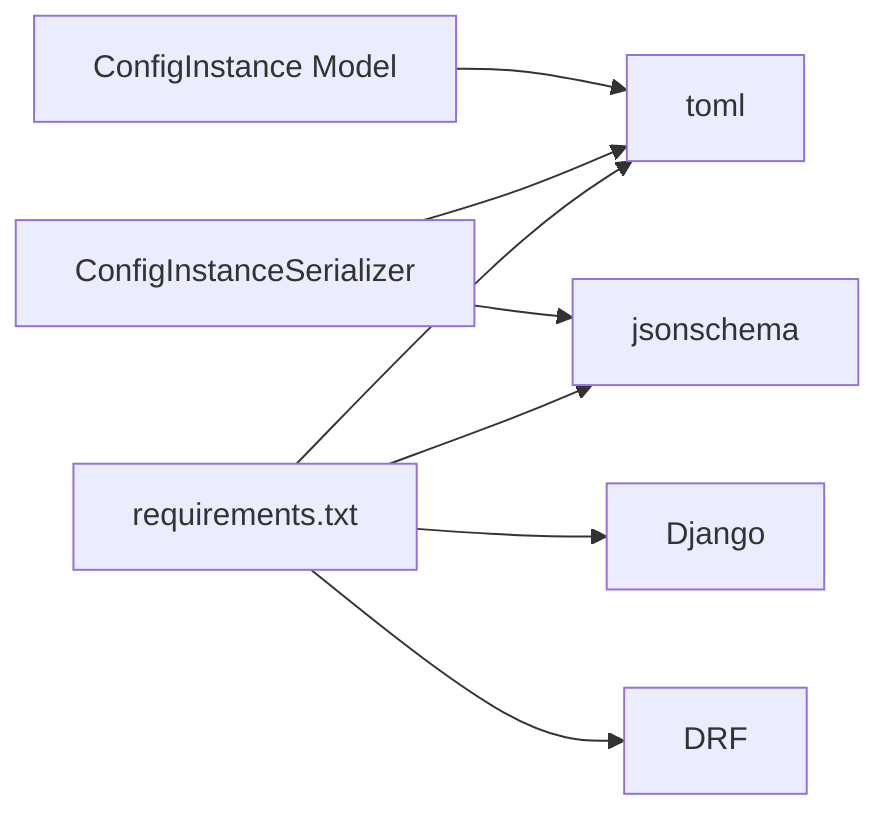

# Configuration Validation & Format Processing

<cite>
**Referenced Files in This Document**
- [config_type/models.py](file://backend/config_type/models.py)
- [config_type/serializers.py](file://backend/config_type/serializers.py)
- [config_instance/models.py](file://backend/config_instance/models.py)
- [config_instance/serializers.py](file://backend/config_instance/serializers.py)
- [config_instance/views.py](file://backend/config_instance/views.py)
- [config_type/views.py](file://backend/config_type/views.py)
- [versioning/models.py](file://backend/versioning/models.py)
- [audit/models.py](file://backend/audit/models.py)
- [requirements.txt](file://backend/requirements.txt)
- [ConfigTypeEdit.vue](file://frontend/src/views/ConfigTypeEdit.vue)
- [ConfigInstanceEdit.vue](file://frontend/src/views/ConfigInstanceEdit.vue)
</cite>

## Table of Contents
1. [Introduction](#introduction)
2. [Project Structure](#project-structure)
3. [Core Components](#core-components)
4. [Architecture Overview](#architecture-overview)
5. [Detailed Component Analysis](#detailed-component-analysis)
6. [Dependency Analysis](#dependency-analysis)
7. [Performance Considerations](#performance-considerations)
8. [Troubleshooting Guide](#troubleshooting-guide)
9. [Conclusion](#conclusion)

## Introduction
This document explains the configuration validation and format processing business logic implemented in the backend and frontend. It covers:
- How configuration types define validation rules via JSON Schema stored in the database
- How configuration instances are validated and transformed between JSON and TOML formats
- How raw content is parsed into a unified JSON representation for querying and storage
- Error handling strategies and user-friendly error messages
- Practical validation scenarios, format conversion edge cases, and performance optimization techniques

## Project Structure
The system is organized around two primary Django apps:
- config_type: defines configuration types with associated JSON Schema and format preferences
- config_instance: stores configuration instances, validates content against the type’s schema, and maintains parsed data for querying

Additional supporting apps:
- versioning: tracks historical versions of configuration instances
- audit: records administrative actions and changes

**Diagram sources**
- [config_type/models.py:1-25](file://backend/config_type/models.py#L1-L25)
- [config_instance/models.py:1-69](file://backend/config_instance/models.py#L1-L69)
- [config_type/serializers.py:1-31](file://backend/config_type/serializers.py#L1-L31)
- [config_instance/serializers.py:1-60](file://backend/config_instance/serializers.py#L1-L60)
- [config_instance/views.py:1-150](file://backend/config_instance/views.py#L1-L150)
- [config_type/views.py:1-39](file://backend/config_type/views.py#L1-L39)
- [versioning/models.py:1-23](file://backend/versioning/models.py#L1-L23)
- [audit/models.py:1-31](file://backend/audit/models.py#L1-L31)
- [ConfigTypeEdit.vue:1-171](file://frontend/src/views/ConfigTypeEdit.vue#L1-L171)
- [ConfigInstanceEdit.vue:1-237](file://frontend/src/views/ConfigInstanceEdit.vue#L1-L237)

**Section sources**
- [config_type/models.py:1-25](file://backend/config_type/models.py#L1-L25)
- [config_instance/models.py:1-69](file://backend/config_instance/models.py#L1-L69)
- [config_type/serializers.py:1-31](file://backend/config_type/serializers.py#L1-L31)
- [config_instance/serializers.py:1-60](file://backend/config_instance/serializers.py#L1-L60)
- [config_instance/views.py:1-150](file://backend/config_instance/views.py#L1-L150)
- [config_type/views.py:1-39](file://backend/config_type/views.py#L1-L39)
- [versioning/models.py:1-23](file://backend/versioning/models.py#L1-L23)
- [audit/models.py:1-31](file://backend/audit/models.py#L1-L31)
- [ConfigTypeEdit.vue:1-171](file://frontend/src/views/ConfigTypeEdit.vue#L1-L171)
- [ConfigInstanceEdit.vue:1-237](file://frontend/src/views/ConfigInstanceEdit.vue#L1-L237)

## Core Components
- ConfigType: Defines a configuration type with a format (JSON or TOML) and a JSON Schema used to validate instances.
- ConfigInstance: Stores a configuration instance, validates content against the type’s schema, parses raw content into a unified JSON structure, and exposes conversion to either JSON or TOML.
- Serializers: Validate and transform data between the API and models, including format validation and JSON Schema enforcement.
- ViewSets: Expose CRUD APIs, handle versioning and auditing, and provide content conversion endpoints.
- Frontend forms: Provide client-side validation and example generation based on the JSON Schema.

Key responsibilities:
- Validation: Format validation (JSON/TOML), JSON Schema validation, and model-level parsing
- Transformation: Parsing raw content into unified JSON for querying and storage; converting parsed data back to target format on demand
- Persistence: Storing original content and parsed data; maintaining version history and audit logs

**Section sources**
- [config_type/models.py:4-24](file://backend/config_type/models.py#L4-L24)
- [config_instance/models.py:7-69](file://backend/config_instance/models.py#L7-L69)
- [config_type/serializers.py:5-31](file://backend/config_type/serializers.py#L5-L31)
- [config_instance/serializers.py:7-48](file://backend/config_instance/serializers.py#L7-L48)
- [config_instance/views.py:11-150](file://backend/config_instance/views.py#L11-L150)
- [ConfigTypeEdit.vue:78-118](file://frontend/src/views/ConfigTypeEdit.vue#L78-L118)
- [ConfigInstanceEdit.vue:117-159](file://frontend/src/views/ConfigInstanceEdit.vue#L117-L159)

## Architecture Overview
The validation and format processing pipeline spans frontend and backend:

**Diagram sources**
- [config_instance/serializers.py:20-48](file://backend/config_instance/serializers.py#L20-L48)
- [config_instance/models.py:37-53](file://backend/config_instance/models.py#L37-L53)
- [config_instance/views.py:36-60](file://backend/config_instance/views.py#L36-L60)
- [versioning/models.py:5-19](file://backend/versioning/models.py#L5-L19)
- [audit/models.py:5-31](file://backend/audit/models.py#L5-L31)
- [ConfigInstanceEdit.vue:161-185](file://frontend/src/views/ConfigInstanceEdit.vue#L161-L185)

## Detailed Component Analysis

### ConfigType: JSON Schema Definition and Validation
- Stores format (JSON or TOML) and a JSON Schema used to validate instances.
- Serializer enforces:
  - Name format: alphanumeric and underscore, must start with a letter
  - Schema format: must be a JSON object and must include a top-level type field

**Diagram sources**
- [config_type/models.py:4-24](file://backend/config_type/models.py#L4-L24)
- [config_type/serializers.py:5-31](file://backend/config_type/serializers.py#L5-L31)

**Section sources**
- [config_type/models.py:4-24](file://backend/config_type/models.py#L4-L24)
- [config_type/serializers.py:18-30](file://backend/config_type/serializers.py#L18-L30)
- [ConfigTypeEdit.vue:78-118](file://frontend/src/views/ConfigTypeEdit.vue#L78-L118)

### ConfigInstance: Format Conversion and Content Validation
- On save, raw content is parsed into a unified JSON structure for querying and storage.
- Provides methods to convert parsed data back to JSON or TOML.
- Serializer validates:
  - Format correctness (JSON/TOML)
  - JSON Schema compliance using the associated ConfigType’s schema
  - Stores both original content_text and parsed_data

**Diagram sources**
- [config_instance/models.py:37-53](file://backend/config_instance/models.py#L37-L53)
- [config_instance/serializers.py:20-48](file://backend/config_instance/serializers.py#L20-L48)

**Section sources**
- [config_instance/models.py:37-69](file://backend/config_instance/models.py#L37-L69)
- [config_instance/serializers.py:20-48](file://backend/config_instance/serializers.py#L20-L48)

### API Workflows: Versioning and Auditing
- Creation and updates create version records and log audit events.
- Content endpoint allows retrieving content in a specified format while returning parsed data.

**Diagram sources**
- [config_instance/views.py:36-90](file://backend/config_instance/views.py#L36-L90)
- [versioning/models.py:5-19](file://backend/versioning/models.py#L5-L19)
- [audit/models.py:5-31](file://backend/audit/models.py#L5-L31)

**Section sources**
- [config_instance/views.py:36-150](file://backend/config_instance/views.py#L36-L150)
- [versioning/models.py:5-23](file://backend/versioning/models.py#L5-L23)
- [audit/models.py:5-31](file://backend/audit/models.py#L5-L31)

### Frontend Validation and Example Generation
- ConfigTypeEdit.vue:
  - Validates JSON Schema input and displays user-friendly errors
  - Generates default schema for quick start
- ConfigInstanceEdit.vue:
  - Client-side JSON validation for immediate feedback
  - Generates example content based on the selected type’s schema and format
  - Submits content to backend for server-side validation and persistence

**Diagram sources**
- [ConfigInstanceEdit.vue:145-185](file://frontend/src/views/ConfigInstanceEdit.vue#L145-L185)
- [config_instance/serializers.py:20-48](file://backend/config_instance/serializers.py#L20-L48)

**Section sources**
- [ConfigTypeEdit.vue:108-118](file://frontend/src/views/ConfigTypeEdit.vue#L108-L118)
- [ConfigInstanceEdit.vue:117-159](file://frontend/src/views/ConfigInstanceEdit.vue#L117-L159)
- [ConfigInstanceEdit.vue:161-185](file://frontend/src/views/ConfigInstanceEdit.vue#L161-L185)

## Dependency Analysis
External libraries used:
- toml: for TOML parsing and serialization
- jsonschema: for JSON Schema validation
- Django REST Framework: for serializers and viewsets

**Diagram sources**
- [requirements.txt:1-7](file://backend/requirements.txt#L1-L7)
- [config_instance/serializers.py:1-4](file://backend/config_instance/serializers.py#L1-L4)
- [config_instance/models.py:3-4](file://backend/config_instance/models.py#L3-L4)

**Section sources**
- [requirements.txt:1-7](file://backend/requirements.txt#L1-L7)
- [config_instance/serializers.py:1-4](file://backend/config_instance/serializers.py#L1-L4)
- [config_instance/models.py:3-4](file://backend/config_instance/models.py#L3-L4)

## Performance Considerations
- Prefer storing parsed_data as JSONField to enable efficient querying and filtering on normalized keys.
- For large configurations, consider streaming or chunked processing if extending parsing logic.
- Minimize repeated conversions by caching parsed_data and reusing it for content export.
- Use database indexes on frequently filtered fields (e.g., config_type, name) to improve query performance.

## Troubleshooting Guide
Common validation and format issues:
- Malformed JSON or TOML:
  - Frontend attempts JSON parse for JSON content; otherwise, backend handles TOML parsing
  - Backend raises explicit errors for invalid formats
- JSON Schema violations:
  - Backend raises user-friendly errors indicating which schema rule failed
- Name validation failures:
  - ConfigType name must match the configured pattern; frontend provides immediate feedback
- Schema validation failures:
  - ConfigType schema must be a JSON object and include a top-level type field

User-facing error handling:
- Frontend displays formatted error messages for both schema and content validation
- Backend returns structured error messages for API consumers

**Section sources**
- [config_instance/serializers.py:34-42](file://backend/config_instance/serializers.py#L34-L42)
- [config_type/serializers.py:18-30](file://backend/config_type/serializers.py#L18-L30)
- [ConfigInstanceEdit.vue:145-159](file://frontend/src/views/ConfigInstanceEdit.vue#L145-L159)
- [ConfigTypeEdit.vue:108-118](file://frontend/src/views/ConfigTypeEdit.vue#L108-L118)

## Conclusion
The system provides robust configuration validation and format processing:
- Configuration types define validation rules via JSON Schema
- Instances are validated for format correctness and schema compliance
- Raw content is parsed into a unified JSON structure for querying and storage
- Seamless conversion between JSON and TOML is supported on demand
- Versioning and auditing ensure traceability and recoverability
- Frontend offers user-friendly validation and example generation