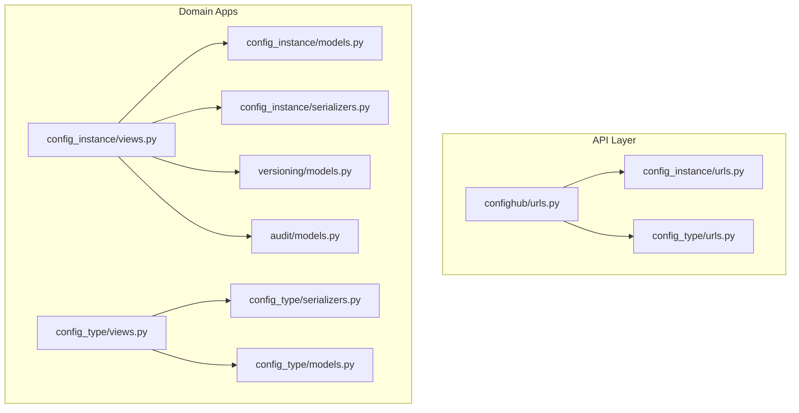
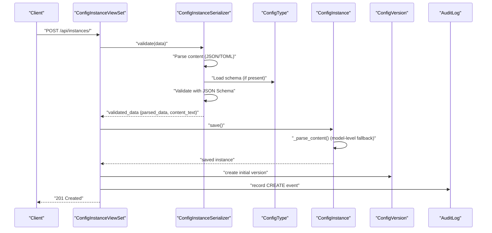
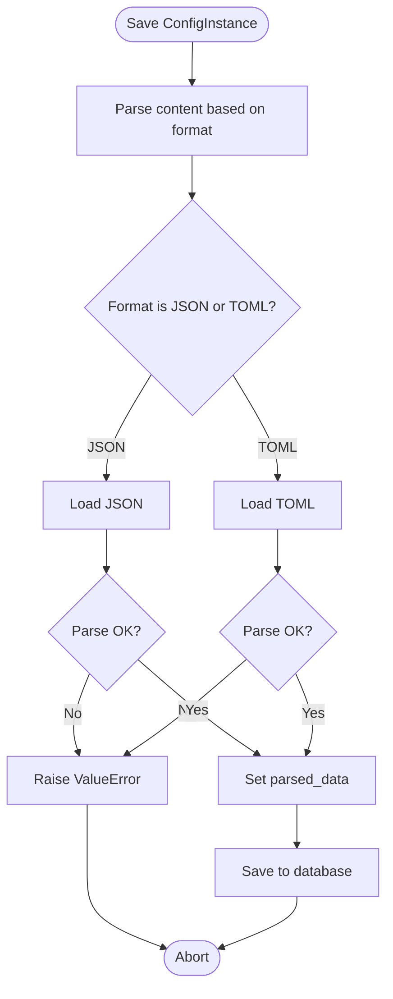
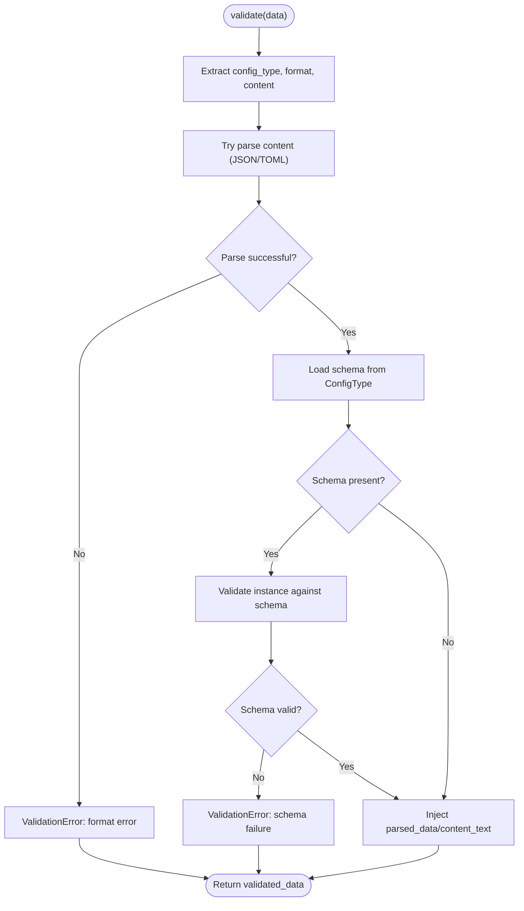
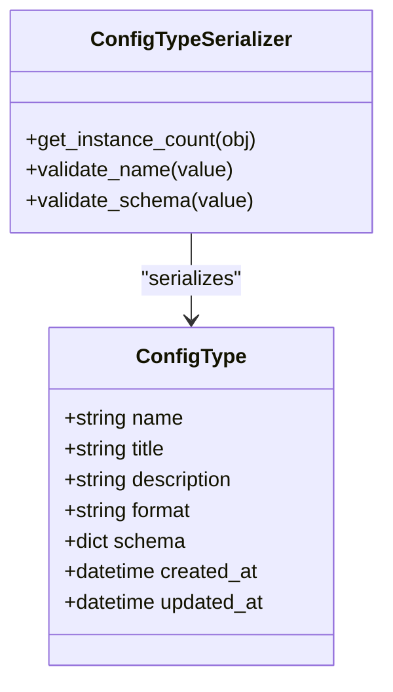
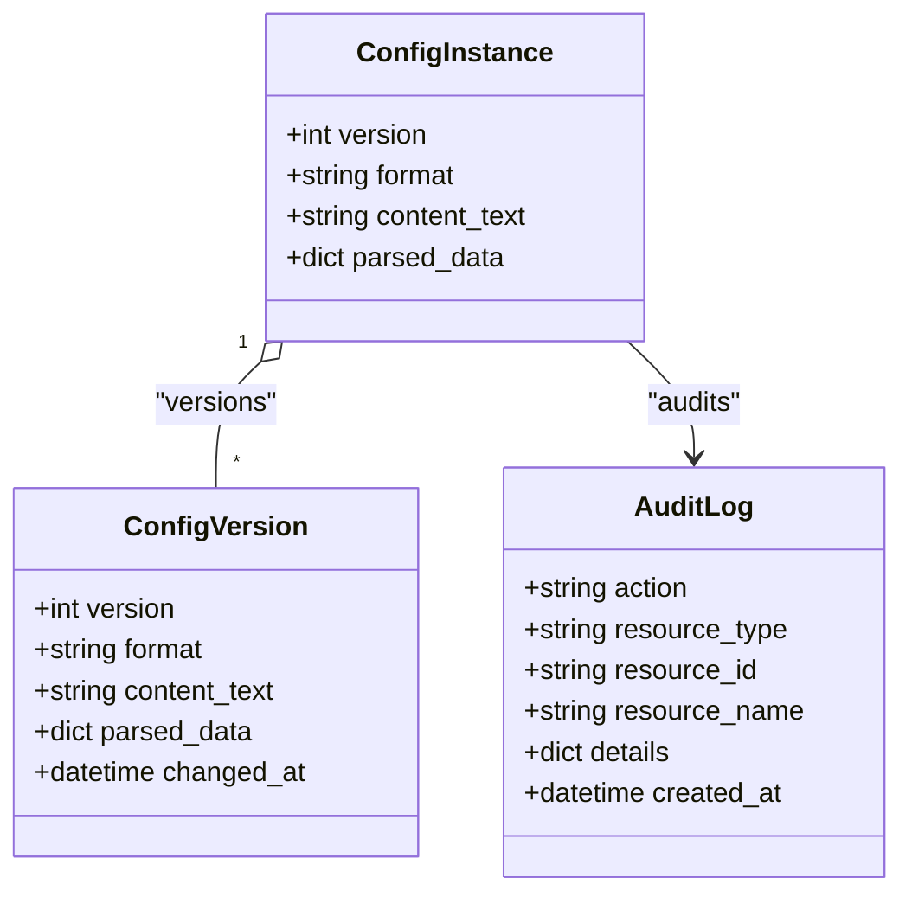
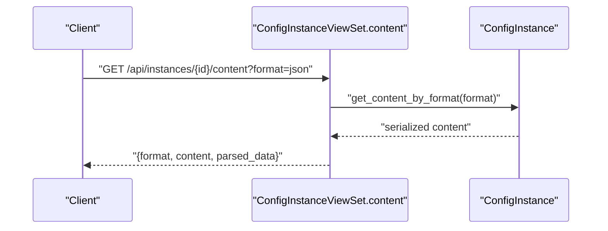
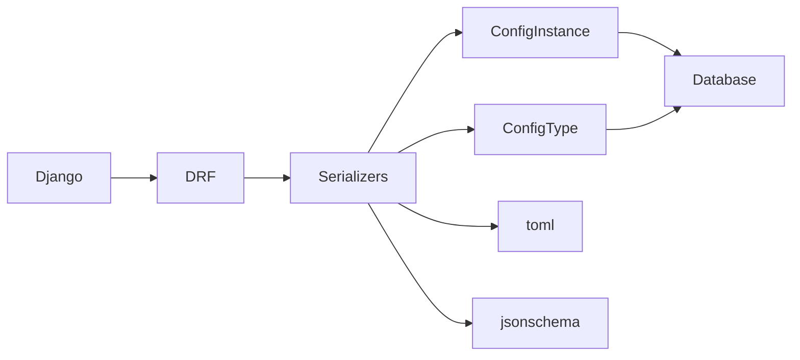

# Data Transformation & Content Processing

<cite>
**Referenced Files in This Document**
- [models.py](file://backend/config_instance/models.py)
- [serializers.py](file://backend/config_instance/serializers.py)
- [views.py](file://backend/config_instance/views.py)
- [models.py](file://backend/config_type/models.py)
- [serializers.py](file://backend/config_type/serializers.py)
- [views.py](file://backend/config_type/views.py)
- [models.py](file://backend/versioning/models.py)
- [models.py](file://backend/audit/models.py)
- [urls.py](file://backend/confighub/urls.py)
- [urls.py](file://backend/config_instance/urls.py)
- [urls.py](file://backend/config_type/urls.py)
- [requirements.txt](file://backend/requirements.txt)
</cite>

## Table of Contents
1. [Introduction](#introduction)
2. [Project Structure](#project-structure)
3. [Core Components](#core-components)
4. [Architecture Overview](#architecture-overview)
5. [Detailed Component Analysis](#detailed-component-analysis)
6. [Dependency Analysis](#dependency-analysis)
7. [Performance Considerations](#performance-considerations)
8. [Troubleshooting Guide](#troubleshooting-guide)
9. [Conclusion](#conclusion)
10. [Appendices](#appendices)

## Introduction
This document explains the data transformation and content processing workflows in the AI-Ops system. It covers:
- Content parsing algorithms for JSON and TOML, including error handling and validation integration
- Unified data representation using JSONField for parsed content
- Content retrieval mechanisms across formats with serialization and encoding handling
- Transformation pipelines: preprocessing, validation, normalization, and post-processing
- Practical scenarios, performance considerations, and memory optimization techniques

## Project Structure
The system is organized around Django apps with clear separation of concerns:
- config_type: Defines configuration types and their JSON Schemas
- config_instance: Stores configuration instances, parses content, and exposes retrieval APIs
- versioning: Maintains historical snapshots of configurations
- audit: Records operational events for compliance and traceability
- confighub: Root URL routing for API endpoints

**Diagram sources**
- [urls.py:20-24](file://backend/confighub/urls.py#L20-L24)
- [urls.py:1-11](file://backend/config_instance/urls.py#L1-L11)
- [urls.py:1-11](file://backend/config_type/urls.py#L1-L11)
- [models.py:1-69](file://backend/config_instance/models.py#L1-L69)
- [serializers.py:1-60](file://backend/config_instance/serializers.py#L1-L60)
- [views.py:1-150](file://backend/config_instance/views.py#L1-L150)
- [models.py:1-25](file://backend/config_type/models.py#L1-L25)
- [serializers.py:1-31](file://backend/config_type/serializers.py#L1-L31)
- [views.py:1-39](file://backend/config_type/views.py#L1-L39)
- [models.py:1-23](file://backend/versioning/models.py#L1-L23)
- [models.py:1-31](file://backend/audit/models.py#L1-L31)

**Section sources**
- [urls.py:20-24](file://backend/confighub/urls.py#L20-L24)
- [urls.py:1-11](file://backend/config_instance/urls.py#L1-L11)
- [urls.py:1-11](file://backend/config_type/urls.py#L1-L11)

## Core Components
- ConfigType: Defines a configuration type with a default format and a JSON Schema used for validation
- ConfigInstance: Stores raw content and normalized parsed data, supports JSON and TOML, and provides retrieval helpers
- Versioning: Historical snapshot of content and parsed data per version
- Audit: Operational logging for create/update actions and other activities
- Serializers and Views: Orchestrate parsing, validation, normalization, and response formatting

Key responsibilities:
- Parsing: Convert raw text to structured data based on declared format
- Validation: Enforce format correctness and JSON Schema compliance
- Normalization: Store parsed data in a unified JSONField for efficient querying
- Retrieval: Serialize back to requested format with proper encoding
- History and Auditing: Track changes and maintain audit logs

**Section sources**
- [models.py:4-25](file://backend/config_type/models.py#L4-L25)
- [models.py:7-69](file://backend/config_instance/models.py#L7-L69)
- [models.py:5-23](file://backend/versioning/models.py#L5-L23)
- [models.py:5-31](file://backend/audit/models.py#L5-L31)
- [serializers.py:7-60](file://backend/config_instance/serializers.py#L7-L60)
- [views.py:11-150](file://backend/config_instance/views.py#L11-L150)

## Architecture Overview
The transformation pipeline spans the API layer, domain models, and persistence. The flow below maps to actual code paths.

**Diagram sources**
- [views.py:36-60](file://backend/config_instance/views.py#L36-L60)
- [serializers.py:20-48](file://backend/config_instance/serializers.py#L20-L48)
- [models.py:37-54](file://backend/config_instance/models.py#L37-L54)
- [models.py:5-23](file://backend/versioning/models.py#L5-L23)
- [models.py:5-31](file://backend/audit/models.py#L5-L31)

## Detailed Component Analysis

### ConfigInstance Model: Parsing, Normalization, and Retrieval
- Format support: JSON and TOML via format field and choice constraints
- Preprocessing: Automatic parsing on save using model-level method
- Validation integration: Raises explicit errors for invalid formats
- Normalized storage: parsed_data stored as JSONField for querying and indexing
- Retrieval helpers: get_as_json, get_as_toml, and get_content_by_format with format negotiation

**Diagram sources**
- [models.py:37-54](file://backend/config_instance/models.py#L37-L54)

**Section sources**
- [models.py:7-69](file://backend/config_instance/models.py#L7-L69)

### ConfigInstance Serializer: Validation and Normalization
- Accepts raw content and format, validates both
- Parses content to structured data
- Validates against ConfigType JSON Schema if present
- Injects parsed_data and content_text into validated_data for persistence

**Diagram sources**
- [serializers.py:20-48](file://backend/config_instance/serializers.py#L20-L48)

**Section sources**
- [serializers.py:7-60](file://backend/config_instance/serializers.py#L7-L60)

### ConfigType Model and Serializer: Schema Definition and Validation
- ConfigType defines default format and JSON Schema
- Serializer enforces schema shape and validates name format
- Provides instance_count aggregation for listing

**Diagram sources**
- [models.py:4-25](file://backend/config_type/models.py#L4-L25)
- [serializers.py:5-31](file://backend/config_type/serializers.py#L5-L31)

**Section sources**
- [models.py:4-25](file://backend/config_type/models.py#L4-L25)
- [serializers.py:5-31](file://backend/config_type/serializers.py#L5-L31)

### Versioning and Audit: History and Compliance
- ConfigVersion captures format, raw content, and parsed_data per version
- AuditLog records user actions, resource metadata, and details

**Diagram sources**
- [models.py:7-27](file://backend/config_instance/models.py#L7-L27)
- [models.py:5-23](file://backend/versioning/models.py#L5-L23)
- [models.py:5-31](file://backend/audit/models.py#L5-L31)

**Section sources**
- [models.py:5-23](file://backend/versioning/models.py#L5-L23)
- [models.py:5-31](file://backend/audit/models.py#L5-L31)

### Content Retrieval API: Formatting and Serialization
- Endpoint: GET /api/instances/{id}/content
- Query param: format (optional; defaults to instance format)
- Returns: requested format content, parsed_data, and format metadata
- Serialization: JSON for parsed_data; format-specific dumps for content

**Diagram sources**
- [views.py:138-149](file://backend/config_instance/views.py#L138-L149)
- [models.py:55-69](file://backend/config_instance/models.py#L55-L69)

**Section sources**
- [views.py:138-149](file://backend/config_instance/views.py#L138-L149)
- [models.py:55-69](file://backend/config_instance/models.py#L55-L69)

## Dependency Analysis
External libraries and their roles:
- toml: Parsing TOML content during validation and model save
- jsonschema: Validating parsed content against ConfigType schema
- Django and DRF: ORM, serializers, and viewsets
- gunicorn/mysqlclient: Runtime and database connectivity

**Diagram sources**
- [requirements.txt:1-8](file://backend/requirements.txt#L1-L8)
- [serializers.py:1-60](file://backend/config_instance/serializers.py#L1-L60)
- [models.py:1-69](file://backend/config_instance/models.py#L1-L69)
- [models.py:1-25](file://backend/config_type/models.py#L1-L25)

**Section sources**
- [requirements.txt:1-8](file://backend/requirements.txt#L1-L8)

## Performance Considerations
- Parsing cost: Both JSON and TOML parsing occur during validation and model save. Keep content sizes reasonable and avoid unnecessary re-parsing by leveraging validated_data.
- Schema validation overhead: Enforcing JSON Schema adds CPU work proportional to schema complexity and payload size. Consider caching frequently reused schemas at the application level if needed.
- Storage efficiency: Storing parsed_data as JSONField enables flexible queries but increases write amplification. Ensure indexes align with typical query patterns.
- Query optimization:
  - Use select_related('config_type') to reduce N+1 queries in listings
  - Filter early with query params (config_type, search, format)
- Encoding: Ensure UTF-8 serialization for non-ASCII content to prevent encoding errors
- Memory optimization:
  - Stream large payloads when feasible (not shown in current code)
  - Avoid materializing large parsed structures unnecessarily
  - Reuse parsed_data in serializers rather than re-parsing
- Benchmarking guidance:
  - Measure end-to-end latency for create/update under varying payload sizes
  - Profile JSON vs TOML parsing costs for representative schemas
  - Test schema validation scaling with nested structures and large arrays

[No sources needed since this section provides general guidance]

## Troubleshooting Guide
Common issues and resolutions:
- Invalid JSON or TOML
  - Symptom: Validation errors raised during creation/update
  - Resolution: Fix syntax; ensure content matches declared format
  - References:
    - [models.py:44-53](file://backend/config_instance/models.py#L44-L53)
    - [serializers.py:27-35](file://backend/config_instance/serializers.py#L27-L35)
- Schema validation failures
  - Symptom: ValidationError mentioning schema message
  - Resolution: Align content with ConfigType schema; fix missing required fields
  - References:
    - [serializers.py:38-42](file://backend/config_instance/serializers.py#L38-L42)
    - [models.py:15-15](file://backend/config_type/models.py#L15-L15)
- Retrieving wrong format
  - Symptom: Unexpected serialized output
  - Resolution: Pass format query param or rely on instance format
  - References:
    - [views.py:138-149](file://backend/config_instance/views.py#L138-L149)
    - [models.py:63-69](file://backend/config_instance/models.py#L63-L69)
- Version mismatch after rollback
  - Symptom: Unexpected version number or content drift
  - Resolution: Verify rollback endpoint usage and version existence
  - References:
    - [views.py:106-136](file://backend/config_instance/views.py#L106-L136)
    - [models.py:8-11](file://backend/versioning/models.py#L8-L11)

**Section sources**
- [models.py:44-53](file://backend/config_instance/models.py#L44-L53)
- [serializers.py:27-42](file://backend/config_instance/serializers.py#L27-L42)
- [views.py:138-149](file://backend/config_instance/views.py#L138-L149)
- [views.py:106-136](file://backend/config_instance/views.py#L106-L136)
- [models.py:8-11](file://backend/versioning/models.py#L8-L11)

## Conclusion
The AI-Ops system implements a robust, extensible data transformation pipeline:
- Clear separation of parsing, validation, normalization, and retrieval
- Unified JSONField representation for efficient querying and indexing
- Strong validation via format checks and JSON Schema
- Comprehensive history and audit for compliance
- Well-defined APIs for content retrieval across formats

[No sources needed since this section summarizes without analyzing specific files]

## Appendices

### Unified Data Representation and Indexing Strategies
- JSONField for parsed_data enables:
  - Flexible querying (e.g., path-based lookups)
  - Aggregation and filtering on normalized keys
- Recommended indexes:
  - Composite indexes on (config_type_id, name) for uniqueness and lookups
  - Consider GIN indexes on parsed_data for frequent path queries if supported by your database
- Query patterns:
  - Use select_related('config_type') to minimize joins
  - Apply filters for config_type, search terms, and format early in the queryset chain

**Section sources**
- [models.py:29-32](file://backend/config_instance/models.py#L29-L32)
- [views.py:21-34](file://backend/config_instance/views.py#L21-L34)

### Example Transformation Scenarios
- Scenario 1: Create a JSON instance
  - Action: POST /api/instances/ with format=json and content
  - Outcome: Parsed JSON stored in parsed_data; initial version recorded
  - References:
    - [views.py:36-60](file://backend/config_instance/views.py#L36-L60)
    - [serializers.py:20-48](file://backend/config_instance/serializers.py#L20-L48)
- Scenario 2: Update with TOML content
  - Action: PUT/PATCH with format=toml and content
  - Outcome: TOML parsed, validated against schema, new version created
  - References:
    - [views.py:62-90](file://backend/config_instance/views.py#L62-L90)
    - [models.py:42-54](file://backend/config_instance/models.py#L42-L54)
- Scenario 3: Retrieve formatted content
  - Action: GET /api/instances/{id}/content?format=toml
  - Outcome: TOML-formatted content returned alongside parsed_data
  - References:
    - [views.py:138-149](file://backend/config_instance/views.py#L138-L149)
    - [models.py:59-69](file://backend/config_instance/models.py#L59-L69)

**Section sources**
- [views.py:36-60](file://backend/config_instance/views.py#L36-L60)
- [views.py:62-90](file://backend/config_instance/views.py#L62-L90)
- [views.py:138-149](file://backend/config_instance/views.py#L138-L149)
- [models.py:42-54](file://backend/config_instance/models.py#L42-L54)
- [models.py:59-69](file://backend/config_instance/models.py#L59-L69)