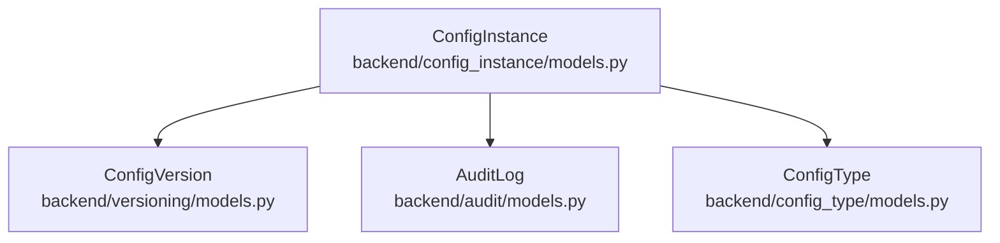
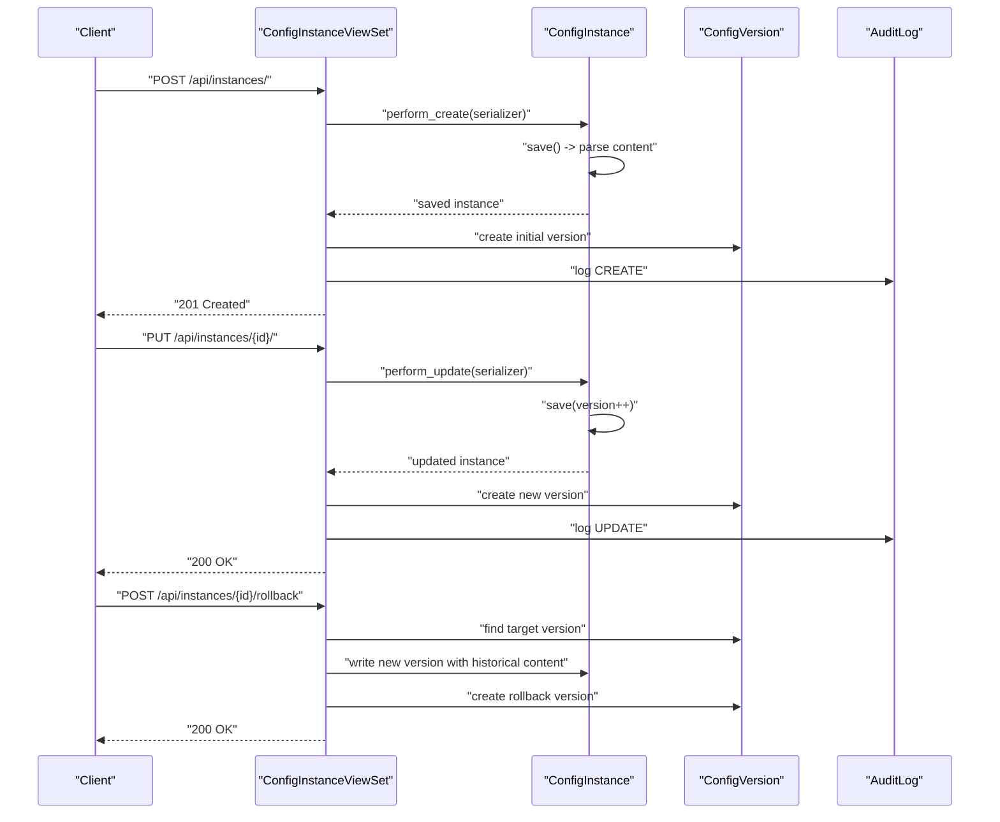
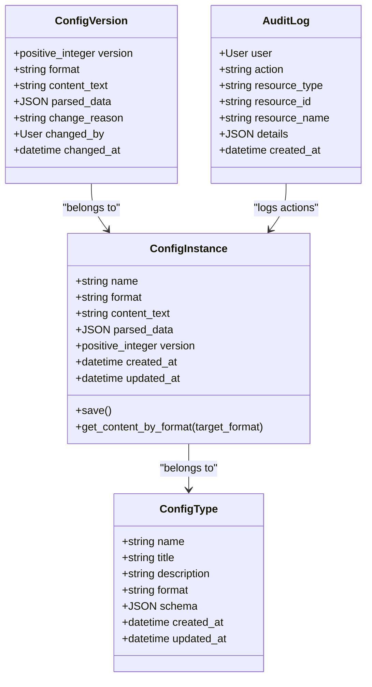

# Version Control & History Management

<cite>
**Referenced Files in This Document**
- [models.py](file://backend/versioning/models.py)
- [views.py](file://backend/versioning/views.py)
- [models.py](file://backend/config_instance/models.py)
- [views.py](file://backend/config_instance/views.py)
- [serializers.py](file://backend/config_instance/serializers.py)
- [urls.py](file://backend/config_instance/urls.py)
- [models.py](file://backend/audit/models.py)
- [models.py](file://backend/config_type/models.py)
- [settings.py](file://backend/confighub/settings.py)
- [urls.py](file://backend/confighub/urls.py)
- [0001_initial.py](file://backend/versioning/migrations/0001_initial.py)
- [0001_initial.py](file://backend/config_instance/migrations/0001_initial.py)
</cite>

## Table of Contents
1. [Introduction](#introduction)
2. [Project Structure](#project-structure)
3. [Core Components](#core-components)
4. [Architecture Overview](#architecture-overview)
5. [Detailed Component Analysis](#detailed-component-analysis)
6. [Dependency Analysis](#dependency-analysis)
7. [Performance Considerations](#performance-considerations)
8. [Troubleshooting Guide](#troubleshooting-guide)
9. [Conclusion](#conclusion)

## Introduction
This document explains the version control and history management system for configuration instances. It covers automatic version creation on updates, version increment logic, historical data preservation, rollback functionality, version comparison approaches, and the lifecycle of versions including archival and cleanup considerations. It also documents the ConfigVersion model structure, version metadata tracking, and storage strategies for historical content, along with performance and concurrency considerations.

## Project Structure
The versioning system spans several Django applications:
- config_instance: Defines configuration instances and their lifecycle (create/update/delete), including parsing and validation.
- versioning: Stores historical versions of configuration instances.
- audit: Records audit logs for create/update/delete actions.
- config_type: Defines configuration types and JSON Schema validation rules.

**Diagram sources**
- [models.py:7-69](file://backend/config_instance/models.py#L7-L69)
- [models.py:5-23](file://backend/versioning/models.py#L5-L23)
- [models.py:5-31](file://backend/audit/models.py#L5-L31)
- [models.py:4-25](file://backend/config_type/models.py#L4-L25)

**Section sources**
- [settings.py:44-57](file://backend/confighub/settings.py#L44-L57)
- [urls.py:20-24](file://backend/confighub/urls.py#L20-L24)

## Core Components
- ConfigInstance: Represents a configuration instance with format, raw content, parsed JSON data, version counter, and timestamps. It parses incoming content into a unified JSON structure and validates against a JSON Schema defined by the associated ConfigType.
- ConfigVersion: Historical snapshot of a ConfigInstance at a specific version, storing format, raw content, parsed data, change reason, and metadata (changed_by, changed_at).
- AuditLog: Tracks who performed actions and when, including create/update/delete events.
- ConfigType: Defines type-level metadata and JSON Schema used to validate configuration content.

Key behaviors:
- Automatic version creation on create and update.
- Version increments on update.
- Rollback creates a new version based on a selected historical version.
- Content is stored in two forms: raw text and parsed JSON for efficient querying and cross-format conversion.

**Section sources**
- [models.py:7-69](file://backend/config_instance/models.py#L7-L69)
- [models.py:5-23](file://backend/versioning/models.py#L5-L23)
- [models.py:5-31](file://backend/audit/models.py#L5-L31)
- [models.py:4-25](file://backend/config_type/models.py#L4-L25)

## Architecture Overview
The versioning architecture integrates tightly with the REST API and database layer:
- ConfigInstanceViewSet handles create/update/delete and exposes actions for versions, rollback, and content retrieval.
- On create/update, a new ConfigVersion record is created with the current state.
- Rollback reads a historical ConfigVersion and writes a new ConfigInstance version with the historical content.
- AuditLog records all significant operations.

**Diagram sources**
- [views.py:36-90](file://backend/config_instance/views.py#L36-L90)
- [models.py:5-23](file://backend/versioning/models.py#L5-L23)
- [models.py:5-31](file://backend/audit/models.py#L5-L31)

## Detailed Component Analysis

### ConfigInstance Model and Lifecycle
- Fields:
  - config_type: foreign key to ConfigType
  - name: instance name
  - format: JSON/TOML choice
  - content_text: raw content
  - parsed_data: JSON representation for querying
  - version: positive integer, incremented on updates
  - created_by, created_at, updated_at
- Validation and parsing:
  - save() invokes _parse_content() to convert content_text to parsed_data based on format.
  - Serializers validate content format and apply JSON Schema from ConfigType.
- Content retrieval:
  - get_content_by_format() returns content in requested format (JSON or TOML).

Automatic version creation and increment:
- Create: perform_create() saves the instance and immediately creates a ConfigVersion with version=1.
- Update: perform_update() increments version by 1, persists the instance, and creates a ConfigVersion snapshot.

Rollback:
- perform_update() sets version to old_version + 1, then rollback() reads the target ConfigVersion, rewrites the instance content, increments version, and creates a new ConfigVersion with a change reason indicating rollback.

Version history endpoint:
- versions() returns a compact list of historical versions with metadata.

Content endpoint:
- content() returns content in the requested format, derived from parsed_data.

**Section sources**
- [models.py:37-69](file://backend/config_instance/models.py#L37-L69)
- [serializers.py:20-48](file://backend/config_instance/serializers.py#L20-L48)
- [views.py:36-150](file://backend/config_instance/views.py#L36-L150)

### ConfigVersion Model
- Fields:
  - config: ForeignKey to ConfigInstance, with related_name='versions'
  - version: positive integer
  - format: format of the historical content
  - content_text: raw content at that version
  - parsed_data: JSON data at that version
  - change_reason: optional reason for the change
  - changed_by: user who made the change
  - changed_at: timestamp of the change
- Constraints:
  - unique_together: (config, version)
  - ordering: descending by version

Storage strategy:
- Historical snapshots preserve both raw content and parsed data to enable fast retrieval and cross-format conversion without re-parsing.

**Section sources**
- [models.py:5-23](file://backend/versioning/models.py#L5-L23)
- [0001_initial.py:17-37](file://backend/versioning/migrations/0001_initial.py#L17-L37)

### Audit Logging
- Tracks user actions (CREATE, UPDATE, DELETE, VIEW, EXPORT, IMPORT) with resource metadata and details.
- Used to record create/update/rollback events with version numbers and resource identifiers.

**Section sources**
- [models.py:5-31](file://backend/audit/models.py#L5-L31)
- [views.py:52-90](file://backend/config_instance/views.py#L52-L90)

### Version Comparison and Diff Algorithms
- Current implementation:
  - No built-in diff calculation between versions.
  - Rollback uses exact content replacement from a historical snapshot.
- Recommended approaches for future enhancement:
  - Compare parsed_data JSON structures to compute diffs.
  - Store minimal deltas (additions/removals) alongside snapshots for efficient comparisons.
  - Use a library like deepdiff for structured JSON comparison.

[No sources needed since this section provides conceptual guidance]

### Version Lifecycle Management
- Creation triggers:
  - Initial version created on instance creation.
- Update triggers:
  - New version created on every update.
- Rollback triggers:
  - Creates a new version based on a historical snapshot.
- Archival and cleanup:
  - Not implemented in the current codebase.
  - Suggested policies:
    - Retain last N versions.
    - Archive older versions to separate storage.
    - Periodic cleanup jobs to remove versions beyond retention.

**Section sources**
- [views.py:36-136](file://backend/config_instance/views.py#L36-L136)

### Rollback Operations
- Endpoint: POST /api/instances/{id}/rollback with payload containing the target version number.
- Behavior:
  - Validates existence of target version.
  - Writes historical content into the current instance.
  - Increments version and creates a new ConfigVersion with a change reason indicating rollback.
- Example request:
  - POST /api/instances/{id}/rollback with body: {"version": 3}

**Section sources**
- [views.py:106-136](file://backend/config_instance/views.py#L106-L136)

### Version History Storage Mechanism
- Each ConfigVersion snapshot includes:
  - format, content_text, parsed_data
  - change_reason, changed_by, changed_at
- Snapshots are indexed by (config, version) to ensure uniqueness and fast lookup.

**Section sources**
- [models.py:5-23](file://backend/versioning/models.py#L5-L23)
- [0001_initial.py:17-37](file://backend/versioning/migrations/0001_initial.py#L17-L37)

### Concurrent Modification Handling
- Current implementation:
  - Uses Django transactions around create/update operations to ensure atomicity.
  - Version increment is performed by setting serializer.save(version=old_version + 1) and refreshing the instance.
- Potential race conditions:
  - If multiple clients update concurrently, the last write wins.
- Recommendations:
  - Use optimistic locking with a version field and compare-and-swap semantics.
  - Implement advisory locks or database-level row-level locking for critical sections.
  - Add retry logic with exponential backoff for transient conflicts.

**Section sources**
- [views.py:36-90](file://backend/config_instance/views.py#L36-L90)

## Dependency Analysis
- ConfigInstance depends on:
  - ConfigType for schema validation.
  - Serializer validation for content format and schema.
- ConfigVersion depends on:
  - ConfigInstance via ForeignKey.
  - User via changed_by.
- AuditLog depends on:
  - User for actor tracking.
- Routing:
  - ConfigInstanceViewSet is registered under /api/instances/.

**Diagram sources**
- [models.py:4-25](file://backend/config_type/models.py#L4-L25)
- [models.py:7-69](file://backend/config_instance/models.py#L7-L69)
- [models.py:5-23](file://backend/versioning/models.py#L5-L23)
- [models.py:5-31](file://backend/audit/models.py#L5-L31)

**Section sources**
- [urls.py:1-11](file://backend/config_instance/urls.py#L1-L11)
- [settings.py:44-57](file://backend/confighub/settings.py#L44-L57)

## Performance Considerations
- Query patterns:
  - ConfigInstance.versions.all() retrieves historical versions ordered by descending version.
  - AuditLog is ordered by descending created_at for recent activity.
- Indexing strategies:
  - Unique constraint on (config, version) ensures O(1) lookup for a specific historical version.
  - Ordering by -version allows efficient pagination of latest versions.
- Storage optimization:
  - Storing both content_text and parsed_data enables fast retrieval and avoids repeated parsing.
  - Consider compressing large content_text if storage becomes a bottleneck.
- Query performance:
  - Use select_related('config_type') to avoid N+1 queries in list views.
  - Paginate version lists and limit page sizes to reduce memory usage.
- Concurrency:
  - Transactions protect version creation during create/update.
  - Consider adding database-level constraints and retry logic for robustness.

**Section sources**
- [models.py:16-19](file://backend/versioning/models.py#L16-L19)
- [views.py:21-34](file://backend/config_instance/views.py#L21-L34)

## Troubleshooting Guide
- Version not found during rollback:
  - Ensure the target version exists for the instance.
  - Verify the version number passed in the request payload.
- Invalid content format:
  - Content must match the declared format (JSON/TOML).
  - Schema validation errors indicate misconfiguration of ConfigType.schema.
- Permission and authentication:
  - Some operations require authenticated users; ensure proper authentication is configured.
- Audit log discrepancies:
  - Check AuditLog entries for CREATE/UPDATE/ROLLBACK actions and their details.

**Section sources**
- [views.py:106-136](file://backend/config_instance/views.py#L106-L136)
- [serializers.py:20-48](file://backend/config_instance/serializers.py#L20-L48)
- [models.py:5-31](file://backend/audit/models.py#L5-L31)

## Conclusion
The version control and history management system provides robust versioning for configuration instances with automatic snapshot creation on create and update, explicit rollback capabilities, and audit logging. The ConfigVersion model preserves both raw and parsed content for efficient retrieval and cross-format support. While the current implementation focuses on snapshot-based history, future enhancements could include delta-based diffs and configurable archival/cleanup policies to scale effectively for large version histories.