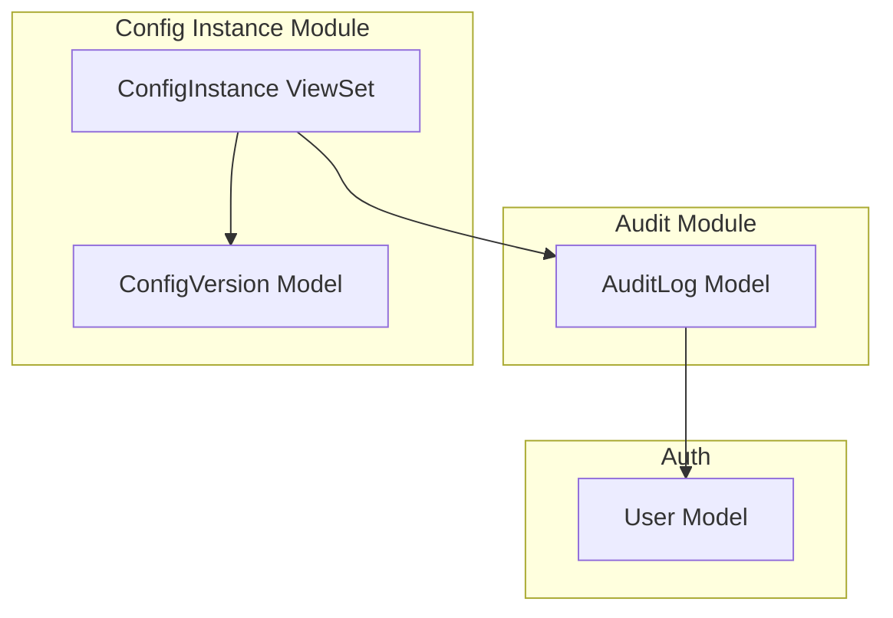
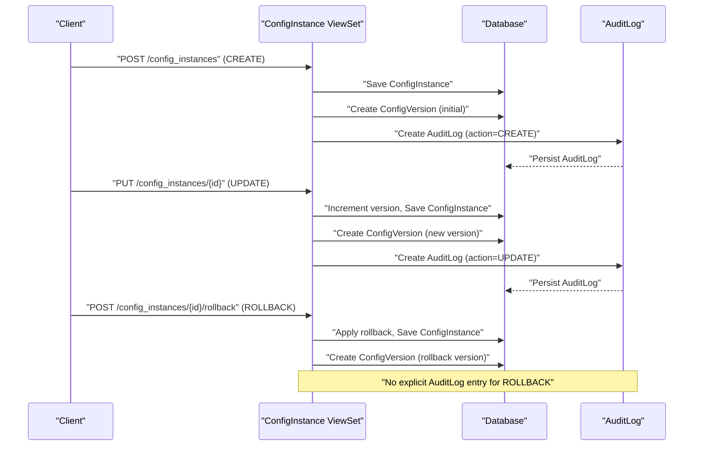
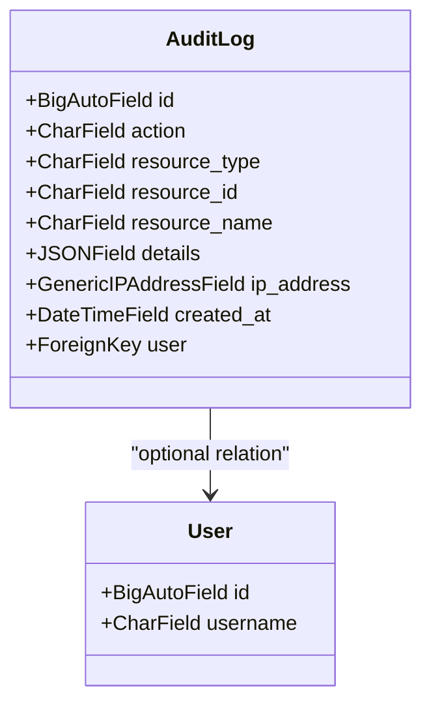
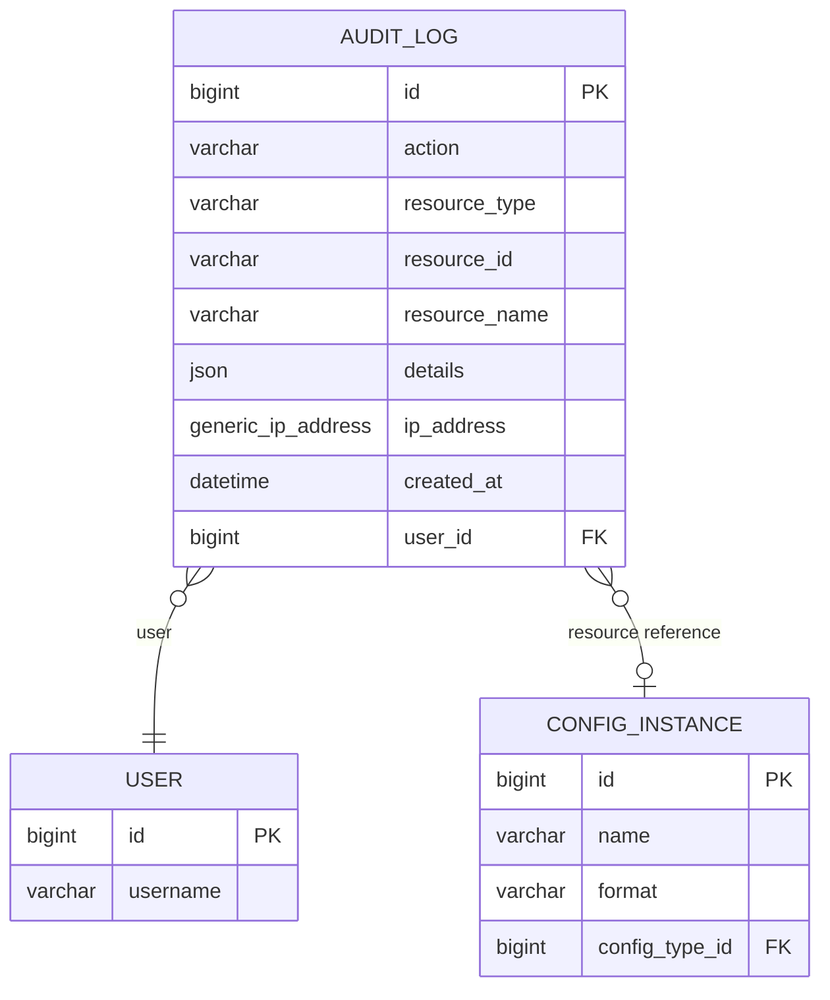
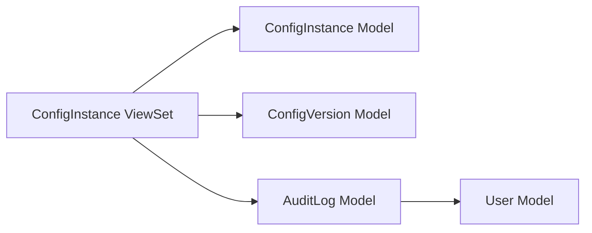

# Audit Log Model

<cite>
**Referenced Files in This Document**
- [models.py](file://backend/audit/models.py)
- [0001_initial.py](file://backend/audit/migrations/0001_initial.py)
- [views.py](file://backend/config_instance/views.py)
- [models.py](file://backend/config_instance/models.py)
- [models.py](file://backend/versioning/models.py)
- [settings.py](file://backend/confighub/settings.py)
</cite>

## Table of Contents
1. [Introduction](#introduction)
2. [Project Structure](#project-structure)
3. [Core Components](#core-components)
4. [Architecture Overview](#architecture-overview)
5. [Detailed Component Analysis](#detailed-component-analysis)
6. [Dependency Analysis](#dependency-analysis)
7. [Performance Considerations](#performance-considerations)
8. [Troubleshooting Guide](#troubleshooting-guide)
9. [Conclusion](#conclusion)
10. [Appendices](#appendices)

## Introduction
This document provides comprehensive data model documentation for the AuditLog model and the audit trail system. It defines the audit log schema, supported event types, user and IP tracking mechanisms, and the foreign key relationships with the User and ConfigInstance models. It also documents the current filtering/search capabilities exposed via the ConfigInstance API and outlines practical examples of logged events and typical audit trail queries. Finally, it addresses security and compliance considerations for audit data retention.

## Project Structure
The audit trail system spans three modules:
- Audit: Defines the AuditLog model and its database schema.
- Config Instance: Produces audit events for create/update operations and exposes actions such as rollback and version history.
- Versioning: Stores historical versions of configuration instances, used by the rollback action.

**Diagram sources**
- [models.py:5-30](file://backend/audit/models.py#L5-L30)
- [views.py:11-150](file://backend/config_instance/views.py#L11-L150)
- [models.py:5-23](file://backend/versioning/models.py#L5-L23)
- [models.py:7-36](file://backend/config_instance/models.py#L7-L36)

**Section sources**
- [models.py:1-31](file://backend/audit/models.py#L1-L31)
- [0001_initial.py:1-36](file://backend/audit/migrations/0001_initial.py#L1-L36)
- [views.py:1-150](file://backend/config_instance/views.py#L1-L150)
- [models.py:1-23](file://backend/versioning/models.py#L1-L23)
- [models.py:1-69](file://backend/config_instance/models.py#L1-L69)

## Core Components
This section documents the AuditLog data model and its fields, along with the supported event types and relationships.

- Event types (action): CREATE, UPDATE, DELETE, VIEW, EXPORT, IMPORT
- Fields:
  - user: Foreign key to the User model; nullable and blankable to support anonymous operations.
  - action: Char field constrained to the event type choices.
  - resource_type: String identifying the type of resource affected (e.g., ConfigInstance).
  - resource_id: String identifier of the affected resource instance.
  - resource_name: Human-readable name/description of the resource.
  - details: JSON field capturing structured details about the event (e.g., format, version).
  - ip_address: Generic IP address field; nullable and blankable.
  - created_at: Auto-populated timestamp of when the log was created.

Foreign key relationships:
- AuditLog.user → User (nullable)
- AuditLog does not directly reference ConfigInstance; however, ConfigInstance ViewSet creates AuditLog entries with resource_type and resource_id set to the ConfigInstance entity.

Indexing and ordering:
- Default ordering is by created_at descending for chronological retrieval.
- No explicit indexes are defined in the model; consider adding indexes on frequently filtered fields (e.g., user, resource_type, resource_id, created_at) for performance.

**Section sources**
- [models.py:5-30](file://backend/audit/models.py#L5-L30)
- [0001_initial.py:17-35](file://backend/audit/migrations/0001_initial.py#L17-L35)

## Architecture Overview
The audit trail is generated at the API boundary by the ConfigInstance ViewSet. When a create or update occurs, the system records both a version history entry and an audit log entry. Rollback operations also create a version history entry but do not currently emit an explicit audit log entry for ROLLBACK.

**Diagram sources**
- [views.py:36-90](file://backend/config_instance/views.py#L36-L90)
- [views.py:106-136](file://backend/config_instance/views.py#L106-L136)
- [models.py:5-23](file://backend/versioning/models.py#L5-L23)
- [models.py:5-30](file://backend/audit/models.py#L5-L30)

## Detailed Component Analysis

### AuditLog Model
The AuditLog model encapsulates all audit events. It supports six event types and captures contextual information for traceability.

**Diagram sources**
- [models.py:5-30](file://backend/audit/models.py#L5-L30)

**Section sources**
- [models.py:5-30](file://backend/audit/models.py#L5-L30)
- [0001_initial.py:17-35](file://backend/audit/migrations/0001_initial.py#L17-L35)

### Event Types and Logged Details
- CREATE
  - Emitted during initial creation of a ConfigInstance.
  - Logged details include the format of the configuration.
- UPDATE
  - Emitted when a ConfigInstance is modified; version increments.
  - Logged details include the new and previous version numbers.
- DELETE
  - Not emitted by the current ConfigInstance ViewSet.
  - The AuditLog model supports this action type; a dedicated DELETE handler would need to be added to produce these events.
- VIEW
  - Not emitted by the current ConfigInstance ViewSet.
  - The AuditLog model supports this action type; a dedicated VIEW handler would need to be added to produce these events.
- EXPORT
  - Not emitted by the current ConfigInstance ViewSet.
  - The AuditLog model supports this action type; an export endpoint would need to be added to produce these events.
- IMPORT
  - Not emitted by the current ConfigInstance ViewSet.
  - The AuditLog model supports this action type; an import endpoint would need to be added to produce these events.

Notes:
- ROLLBACK is implemented as a ViewSet action and creates a new version history entry but does not emit an explicit AuditLog entry for ROLLBACK.
- IMPORT is not implemented in the current codebase; adding an import endpoint would require emitting AuditLog entries with appropriate details.

**Section sources**
- [views.py:36-90](file://backend/config_instance/views.py#L36-L90)
- [views.py:106-136](file://backend/config_instance/views.py#L106-L136)
- [models.py:7-14](file://backend/audit/models.py#L7-L14)

### User Tracking Mechanism
- The AuditLog.user field references the authenticated user from the request context.
- For unauthenticated requests, the user field is stored as NULL, enabling auditing of anonymous operations.

Practical implication:
- When generating audit events, ensure the request context includes the authenticated user. In the current implementation, the ConfigInstance ViewSet passes request.user into the AuditLog creation.

**Section sources**
- [views.py:36-90](file://backend/config_instance/views.py#L36-L90)
- [models.py](file://backend/audit/models.py#L16)

### IP Address Capture
- The AuditLog.ip_address field is present in the model and migration.
- Current implementation does not populate ip_address in the ConfigInstance ViewSet.
- To enable IP capture, middleware or request processing should extract the client IP (e.g., from request.META) and pass it to the AuditLog creation.

Security note:
- Ensure proper handling of proxies and trusted headers when capturing IP addresses.

**Section sources**
- [models.py](file://backend/audit/models.py#L22)
- [0001_initial.py](file://backend/audit/migrations/0001_initial.py#L26)
- [views.py:36-90](file://backend/config_instance/views.py#L36-L90)

### Request Detail Logging
- The AuditLog.details field is a JSON field designed to capture structured information about the event.
- Examples of logged details:
  - CREATE: format of the configuration instance.
  - UPDATE: new and old version numbers.
- For future extensions (e.g., IMPORT, EXPORT, VIEW), define a consistent schema for details to improve searchability and reporting.

**Section sources**
- [views.py:53-60](file://backend/config_instance/views.py#L53-L60)
- [views.py:82-90](file://backend/config_instance/views.py#L82-L90)
- [models.py](file://backend/audit/models.py#L21)

### Foreign Key Relationships
- AuditLog.user → User (nullable)
- AuditLog does not directly reference ConfigInstance; however, the ConfigInstance ViewSet emits AuditLog entries with:
  - resource_type = "ConfigInstance"
  - resource_id = str(ConfigInstance.id)
  - resource_name = formatted name derived from related ConfigType and ConfigInstance name

**Diagram sources**
- [models.py:5-30](file://backend/audit/models.py#L5-L30)
- [models.py:7-36](file://backend/config_instance/models.py#L7-L36)
- [models.py:5-23](file://backend/versioning/models.py#L5-L23)

**Section sources**
- [models.py:16-23](file://backend/audit/models.py#L16-L23)
- [models.py](file://backend/config_instance/models.py#L14)
- [views.py:53-60](file://backend/config_instance/views.py#L53-L60)
- [views.py:82-90](file://backend/config_instance/views.py#L82-L90)

### Audit Filtering Capabilities and Search Functionality
The ConfigInstance API provides basic filtering/search capabilities that can be leveraged to narrow down audit trails indirectly:
- Query parameters:
  - config_type: Filter by the associated ConfigType name.
  - search: Case-insensitive substring search on ConfigInstance name.
  - format: Filter by format (json/toml).
- Pagination:
  - REST framework pagination is configured globally.

How to use these filters for audit-related queries:
- To find all ConfigInstance-related audit events, filter ConfigInstance records by config_type and/or search criteria, then correlate with AuditLog entries by resource_type="ConfigInstance" and matching resource_id.

Limitations:
- There is no dedicated audit API endpoint for filtering AuditLog entries by user, action, or date range.
- The AuditLog model lacks indexes on frequently queried fields (e.g., user, resource_type, resource_id, created_at), which could impact performance for large datasets.

**Section sources**
- [views.py:21-34](file://backend/config_instance/views.py#L21-L34)
- [settings.py:33-39](file://backend/confighub/settings.py#L33-L39)

### Export Features
- The ConfigInstance API does not expose a dedicated export endpoint for audit logs.
- Export functionality for configuration content exists (content endpoint), but not for audit trail data.

Recommendation:
- Add an audit export endpoint that supports filtering and pagination, returning CSV or JSON with standardized fields for downstream analytics and compliance reporting.

**Section sources**
- [views.py:138-149](file://backend/config_instance/views.py#L138-L149)

### Examples of Logged Events
- CREATE ConfigInstance:
  - action: "CREATE"
  - resource_type: "ConfigInstance"
  - resource_id: ConfigInstance.id
  - resource_name: "{ConfigType.title}/{ConfigInstance.name}"
  - details: {"format": ConfigInstance.format}
- UPDATE ConfigInstance:
  - action: "UPDATE"
  - resource_type: "ConfigInstance"
  - resource_id: ConfigInstance.id
  - resource_name: "{ConfigType.title}/{ConfigInstance.name}"
  - details: {"version": new_version, "old_version": old_version}
- ROLLBACK ConfigInstance:
  - Current implementation creates a new version history entry but does not emit an AuditLog entry for ROLLBACK.

Note:
- DELETE, VIEW, EXPORT, IMPORT are not emitted by the current implementation; they would require explicit handlers.

**Section sources**
- [views.py:36-90](file://backend/config_instance/views.py#L36-L90)
- [views.py:106-136](file://backend/config_instance/views.py#L106-L136)

### Typical Audit Trail Queries
- Retrieve recent audit events for a specific user:
  - Filter AuditLog entries by user_id.
- Retrieve all events for a specific ConfigInstance:
  - Filter by resource_type="ConfigInstance" and resource_id="{instance_id}".
- Retrieve events within a date range:
  - Filter by created_at greater/less than specific timestamps.
- Retrieve events by action type:
  - Filter by action in ["CREATE", "UPDATE", "DELETE", "VIEW", "EXPORT", "IMPORT"].

Note:
- Without explicit indexes on user, resource_type, resource_id, and created_at, such queries may require careful indexing and query planning.

**Section sources**
- [models.py:16-23](file://backend/audit/models.py#L16-L23)

## Dependency Analysis
- ConfigInstance ViewSet depends on:
  - ConfigInstance model for persistence and metadata.
  - ConfigVersion model for version history.
  - AuditLog model for audit trail generation.
- AuditLog depends on:
  - User model for optional user association.
- No circular dependencies detected among these components.

**Diagram sources**
- [views.py:11-150](file://backend/config_instance/views.py#L11-L150)
- [models.py:7-36](file://backend/config_instance/models.py#L7-L36)
- [models.py:5-23](file://backend/versioning/models.py#L5-L23)
- [models.py:5-30](file://backend/audit/models.py#L5-L30)

**Section sources**
- [views.py:11-150](file://backend/config_instance/views.py#L11-L150)
- [models.py](file://backend/audit/models.py#L16)

## Performance Considerations
- Indexes:
  - Consider adding database indexes on AuditLog.user, AuditLog.resource_type, AuditLog.resource_id, and AuditLog.created_at to optimize common audit queries.
- JSON details:
  - Keep AuditLog.details concise to minimize storage overhead and improve query performance.
- Pagination:
  - Use pagination for retrieving large audit datasets to avoid memory pressure.
- IP capture:
  - Capturing ip_address adds minimal overhead but requires careful middleware configuration to avoid performance regressions.

[No sources needed since this section provides general guidance]

## Troubleshooting Guide
- Missing user in audit logs:
  - Ensure the request is authenticated; otherwise, user will be NULL.
- Missing IP address in audit logs:
  - Confirm that IP capture is enabled and the request context includes the client IP.
- No DELETE/VIEW/EXPORT/IMPORT events:
  - These actions are not emitted by the current implementation; implement dedicated handlers to generate these events.
- No ROLLBACK audit event:
  - The current implementation does not emit an AuditLog entry for ROLLBACK; add an explicit handler if required.
- Slow audit queries:
  - Add indexes on frequently filtered fields and consider partitioning strategies for large datasets.

**Section sources**
- [models.py:16-23](file://backend/audit/models.py#L16-L23)
- [views.py:36-90](file://backend/config_instance/views.py#L36-L90)
- [views.py:106-136](file://backend/config_instance/views.py#L106-L136)

## Conclusion
The AuditLog model provides a robust foundation for auditing configuration lifecycle events. The current implementation emits CREATE and UPDATE events and captures user identity and resource identifiers. To meet comprehensive audit requirements, consider implementing DELETE, VIEW, EXPORT, and IMPORT event emission, adding IP capture, and introducing a dedicated audit API with filtering, search, and export capabilities. Proper indexing and retention policies are essential for performance and compliance.

[No sources needed since this section summarizes without analyzing specific files]

## Appendices

### Appendix A: Field Reference
- user: Optional foreign key to User; enables attribution of events to authenticated users.
- action: Enumerated action type; supports CREATE, UPDATE, DELETE, VIEW, EXPORT, IMPORT.
- resource_type: String identifying the affected resource type (e.g., "ConfigInstance").
- resource_id: String identifier of the affected resource instance.
- resource_name: Human-readable resource name/description.
- details: JSON object containing structured event details (e.g., format, version).
- ip_address: Nullable IP address captured at event time.
- created_at: Timestamp of when the audit event was recorded.

**Section sources**
- [models.py:16-23](file://backend/audit/models.py#L16-L23)

### Appendix B: Implementation Notes
- Event emission:
  - CREATE and UPDATE are emitted by the ConfigInstance ViewSet.
  - ROLLBACK creates a version history entry but does not emit an AuditLog entry for ROLLBACK.
- Future enhancements:
  - Implement DELETE, VIEW, EXPORT, IMPORT handlers to emit corresponding AuditLog entries.
  - Add IP capture and a dedicated audit API endpoint with filtering and export.

**Section sources**
- [views.py:36-90](file://backend/config_instance/views.py#L36-L90)
- [views.py:106-136](file://backend/config_instance/views.py#L106-L136)