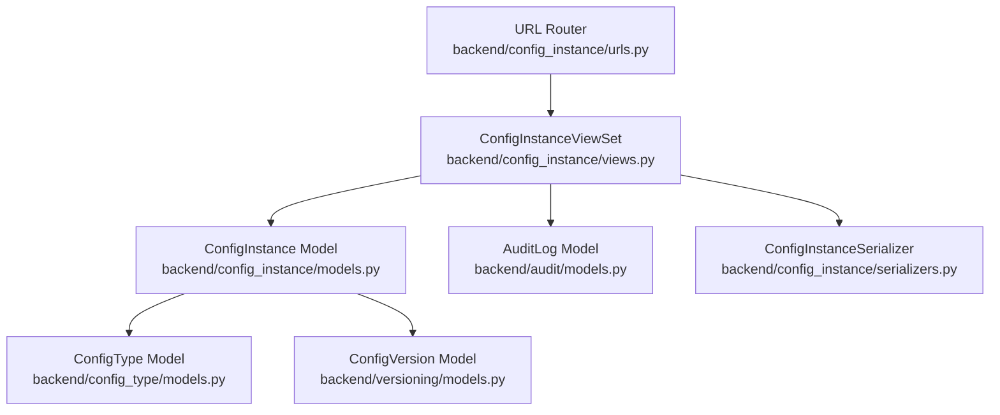
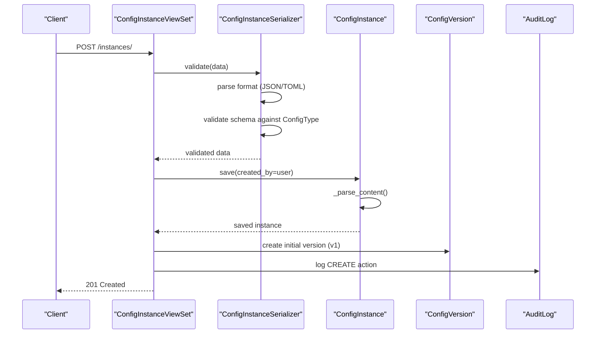
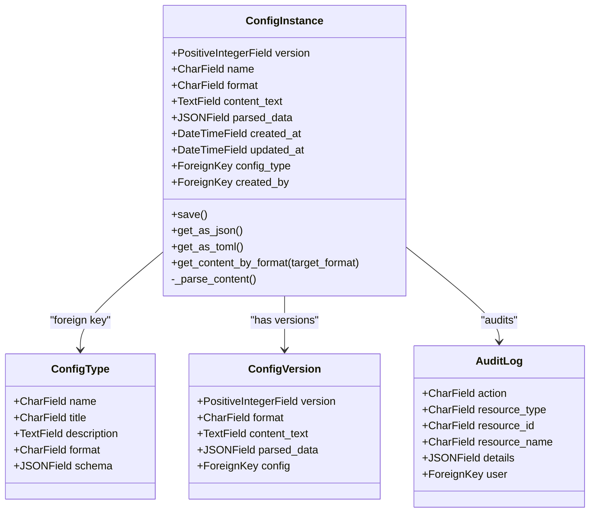
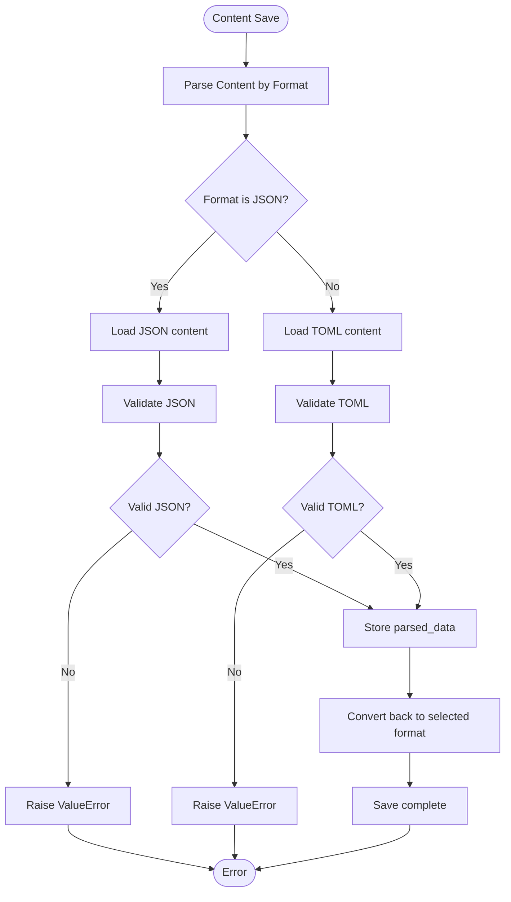
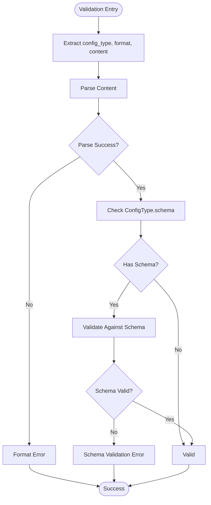
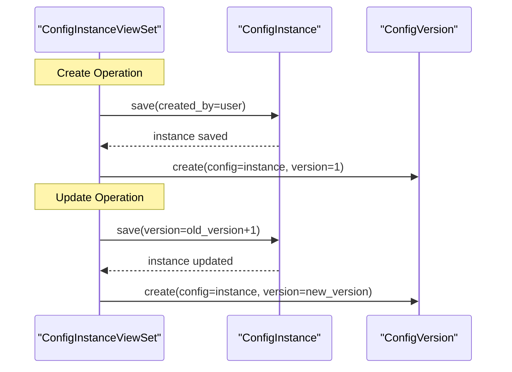
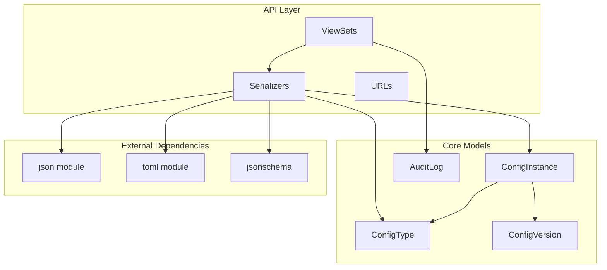

# Configuration Instance Model

<cite>
**Referenced Files in This Document**
- [models.py](file://backend/config_instance/models.py)
- [migrations/0001_initial.py](file://backend/config_instance/migrations/0001_initial.py)
- [serializers.py](file://backend/config_instance/serializers.py)
- [views.py](file://backend/config_instance/views.py)
- [urls.py](file://backend/config_instance/urls.py)
- [models.py](file://backend/config_type/models.py)
- [migrations/0001_initial.py](file://backend/config_type/migrations/0001_initial.py)
- [models.py](file://backend/versioning/models.py)
- [migrations/0001_initial.py](file://backend/versioning/migrations/0001_initial.py)
- [models.py](file://backend/audit/models.py)
</cite>

## Table of Contents
1. [Introduction](#introduction)
2. [Project Structure](#project-structure)
3. [Core Components](#core-components)
4. [Architecture Overview](#architecture-overview)
5. [Detailed Component Analysis](#detailed-component-analysis)
6. [Dependency Analysis](#dependency-analysis)
7. [Performance Considerations](#performance-considerations)
8. [Troubleshooting Guide](#troubleshooting-guide)
9. [Conclusion](#conclusion)

## Introduction
This document provides comprehensive data model documentation for the ConfigInstance model, focusing on its relationship with ConfigType, content storage mechanisms, format conversion logic, validation processes, and operational workflows. It explains how configuration instances are persisted, validated, transformed between JSON and TOML formats, and managed through versioning and auditing systems.

## Project Structure
The configuration management system is organized into modular Django applications:
- config_instance: Defines the ConfigInstance model and its API endpoints
- config_type: Defines the ConfigType model that governs schema and format policies
- versioning: Manages historical versions of configuration instances
- audit: Records audit logs for configuration operations
- Frontend: Vue.js components for user interaction with the API

**Diagram sources**
- [models.py:7-69](file://backend/config_instance/models.py#L7-L69)
- [models.py:4-25](file://backend/config_type/models.py#L4-L25)
- [models.py:5-23](file://backend/versioning/models.py#L5-L23)
- [models.py:5-31](file://backend/audit/models.py#L5-L31)
- [serializers.py:7-60](file://backend/config_instance/serializers.py#L7-L60)
- [views.py:11-150](file://backend/config_instance/views.py#L11-L150)
- [urls.py:1-11](file://backend/config_instance/urls.py#L1-L11)

**Section sources**
- [models.py:1-69](file://backend/config_instance/models.py#L1-L69)
- [models.py:1-25](file://backend/config_type/models.py#L1-L25)
- [models.py:1-23](file://backend/versioning/models.py#L1-L23)
- [models.py:1-31](file://backend/audit/models.py#L1-L31)
- [serializers.py:1-60](file://backend/config_instance/serializers.py#L1-L60)
- [views.py:1-150](file://backend/config_instance/views.py#L1-L150)
- [urls.py:1-11](file://backend/config_instance/urls.py#L1-L11)

## Core Components
This section documents the ConfigInstance model and its associated components, including relationships, fields, and behaviors.

- Relationship with ConfigType
  - Foreign key constraint: ConfigInstance.config_type references ConfigType.id with CASCADE delete behavior
  - Unique constraint: Composite unique_together on (config_type, name) ensures per-type uniqueness of instance names
  - Cascade behavior: Deleting a ConfigType deletes all associated ConfigInstances

- Content Storage Mechanisms
  - Raw content storage: content_text stores the original configuration text
  - Parsed data storage: parsed_data stores normalized JSON for querying and indexing
  - Format specification: format field restricts accepted formats to JSON and TOML

- Auto-generated Version Association
  - Initial version: version defaults to 1 upon creation
  - Version increments: Each update increases version by 1
  - Historical tracking: New versions are recorded in ConfigVersion table

- Validation Processes
  - Format validation: Ensures content matches declared format (JSON/TOML)
  - Schema validation: Validates parsed content against ConfigType.schema using JSON Schema
  - Error handling: Raises validation errors for malformed content or schema violations

- Field Definitions
  - name: CharField up to 100 characters; part of unique constraint with config_type
  - title: Not present in ConfigInstance; ConfigType has title field
  - description: Not present in ConfigInstance; ConfigType has description field
  - content: Write-only field in serializer; maps to content_text in model
  - format: Choice field restricted to JSON/TOML

**Section sources**
- [models.py:7-32](file://backend/config_instance/models.py#L7-L32)
- [migrations/0001_initial.py:18-36](file://backend/config_instance/migrations/0001_initial.py#L18-L36)
- [models.py:4-17](file://backend/config_type/models.py#L4-L17)
- [serializers.py:20-48](file://backend/config_instance/serializers.py#L20-L48)

## Architecture Overview
The configuration management workflow integrates multiple components to provide robust configuration lifecycle management.

**Diagram sources**
- [views.py:36-60](file://backend/config_instance/views.py#L36-L60)
- [serializers.py:20-48](file://backend/config_instance/serializers.py#L20-L48)
- [models.py:37-41](file://backend/config_instance/models.py#L37-L41)
- [models.py:5-19](file://backend/versioning/models.py#L5-L19)
- [models.py:5-31](file://backend/audit/models.py#L5-L31)

## Detailed Component Analysis

### ConfigInstance Model
The ConfigInstance model encapsulates configuration data with strong typing, validation, and transformation capabilities.

**Diagram sources**
- [models.py:7-69](file://backend/config_instance/models.py#L7-L69)
- [models.py:4-25](file://backend/config_type/models.py#L4-L25)
- [models.py:5-23](file://backend/versioning/models.py#L5-L23)
- [models.py:5-31](file://backend/audit/models.py#L5-L31)

#### Content Storage and Format Conversion
The model implements bidirectional conversion between JSON and TOML formats while maintaining normalized parsed data.

**Diagram sources**
- [models.py:42-61](file://backend/config_instance/models.py#L42-L61)

#### Validation Logic
Validation occurs at two levels: format validation and schema validation.

**Diagram sources**
- [serializers.py:20-48](file://backend/config_instance/serializers.py#L20-L48)

#### Version Management Workflow
Each create/update operation triggers version history creation and incrementation.

**Diagram sources**
- [views.py:36-90](file://backend/config_instance/views.py#L36-L90)
- [models.py:5-19](file://backend/versioning/models.py#L5-L19)

**Section sources**
- [models.py:7-69](file://backend/config_instance/models.py#L7-L69)
- [serializers.py:7-60](file://backend/config_instance/serializers.py#L7-L60)
- [views.py:11-150](file://backend/config_instance/views.py#L11-L150)

### ConfigType Model
ConfigType defines the schema and format policy that governs validation for ConfigInstance.

- Fields
  - name: Unique identifier for the configuration type
  - title: Human-readable display name
  - description: Optional description
  - format: Default format (JSON/TOML) for instances of this type
  - schema: JSON Schema used for validation
- Relationships
  - One-to-many with ConfigInstance via config_type foreign key

**Section sources**
- [models.py:4-25](file://backend/config_type/models.py#L4-L25)
- [migrations/0001_initial.py:14-30](file://backend/config_type/migrations/0001_initial.py#L14-L30)

### Versioning Model
ConfigVersion maintains historical snapshots of configuration instances.

- Fields
  - version: Integer version number
  - format: Format of the snapshot
  - content_text: Original content at time of snapshot
  - parsed_data: Normalized data at time of snapshot
  - change_reason: Optional reason for change
  - changed_by: User who made the change
  - changed_at: Timestamp of change
- Constraints
  - Composite unique_together on (config, version)
  - Ordering by version descending

**Section sources**
- [models.py:5-23](file://backend/versioning/models.py#L5-L23)
- [migrations/0001_initial.py:18-36](file://backend/versioning/migrations/0001_initial.py#L18-L36)

### Audit Model
AuditLog records all configuration-related actions for compliance and traceability.

- Fields
  - action: Type of action (CREATE, UPDATE, DELETE, VIEW, EXPORT, IMPORT)
  - resource_type: Resource type (e.g., ConfigInstance)
  - resource_id: ID of affected resource
  - resource_name: Display name of resource
  - details: Additional metadata (e.g., format, version)
  - user: User who performed the action
  - ip_address: Client IP address
  - created_at: Timestamp
- Ordering
  - Latest entries first

**Section sources**
- [models.py:5-31](file://backend/audit/models.py#L5-L31)

## Dependency Analysis
The system exhibits clear separation of concerns with explicit dependencies between modules.

**Diagram sources**
- [models.py:1-69](file://backend/config_instance/models.py#L1-L69)
- [models.py:1-25](file://backend/config_type/models.py#L1-L25)
- [models.py:1-23](file://backend/versioning/models.py#L1-L23)
- [models.py:1-31](file://backend/audit/models.py#L1-L31)
- [serializers.py:1-60](file://backend/config_instance/serializers.py#L1-L60)
- [views.py:1-150](file://backend/config_instance/views.py#L1-L150)
- [urls.py:1-11](file://backend/config_instance/urls.py#L1-L11)

**Section sources**
- [models.py:1-69](file://backend/config_instance/models.py#L1-L69)
- [models.py:1-25](file://backend/config_type/models.py#L1-L25)
- [models.py:1-23](file://backend/versioning/models.py#L1-L23)
- [models.py:1-31](file://backend/audit/models.py#L1-L31)
- [serializers.py:1-60](file://backend/config_instance/serializers.py#L1-L60)
- [views.py:1-150](file://backend/config_instance/views.py#L1-L150)
- [urls.py:1-11](file://backend/config_instance/urls.py#L1-L11)

## Performance Considerations
- Content parsing overhead: Parsing occurs on every save; consider caching parsed_data for frequently accessed instances
- JSON vs TOML parsing: TOML parsing may be slower than JSON; optimize by minimizing unnecessary conversions
- Query optimization: Use select_related('config_type') in views to prevent N+1 queries
- Indexing: Consider adding database indexes on frequently filtered fields (config_type, name, format)
- Memory usage: Large configuration files may consume significant memory during parsing; implement streaming for very large documents if needed

## Troubleshooting Guide

### Common Validation Errors
- Format validation failures: Occur when content does not match declared format
  - Symptoms: ValidationError indicating invalid JSON or TOML
  - Resolution: Correct the content format or update the format field
- Schema validation failures: Occur when parsed content violates JSON Schema
  - Symptoms: ValidationError with schema validation message
  - Resolution: Fix content according to ConfigType.schema requirements

### Content Conversion Issues
- Malformed JSON/TOML: Parser raises decoding errors
  - Symptoms: ValueError with parsing error details
  - Resolution: Validate content format and fix syntax errors
- Encoding problems: Non-ASCII characters may cause serialization issues
  - Symptoms: Unicode encoding errors
  - Resolution: Ensure proper UTF-8 encoding and use appropriate serialization flags

### Version Management Problems
- Version conflicts: Duplicate version numbers in history
  - Symptoms: IntegrityError on version creation
  - Resolution: Verify version increment logic and handle concurrent updates
- Missing versions: Attempted rollback to non-existent version
  - Symptoms: 404 response for rollback endpoint
  - Resolution: Check available versions using the versions endpoint

### Audit and Logging Issues
- Missing user context: Operations without authenticated user
  - Symptoms: Null user in audit logs
  - Resolution: Ensure proper authentication middleware is configured
- Excessive audit volume: High-frequency operations generate large audit trails
  - Symptoms: Slow audit queries and large storage usage
  - Resolution: Implement audit log rotation and filtering policies

**Section sources**
- [serializers.py:20-48](file://backend/config_instance/serializers.py#L20-L48)
- [models.py:42-61](file://backend/config_instance/models.py#L42-L61)
- [views.py:106-136](file://backend/config_instance/views.py#L106-L136)
- [models.py:5-31](file://backend/audit/models.py#L5-L31)

## Conclusion
The ConfigInstance model provides a robust foundation for configuration management with strong validation, flexible format support, and comprehensive versioning. Its integration with ConfigType enables schema-driven validation, while the versioning and audit systems ensure traceability and compliance. The design balances flexibility with safety, supporting both JSON and TOML formats while maintaining data integrity through rigorous validation processes.