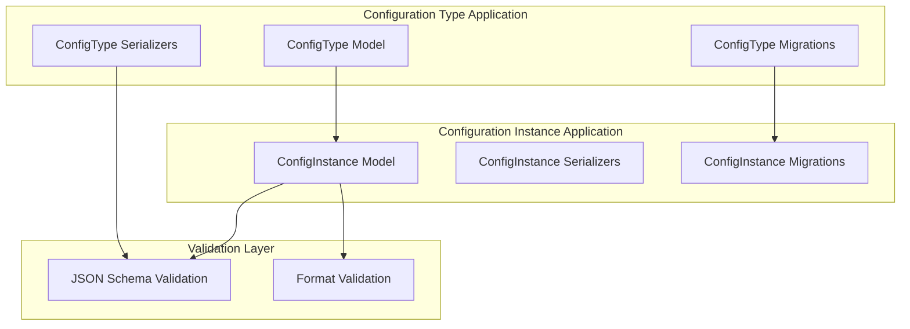
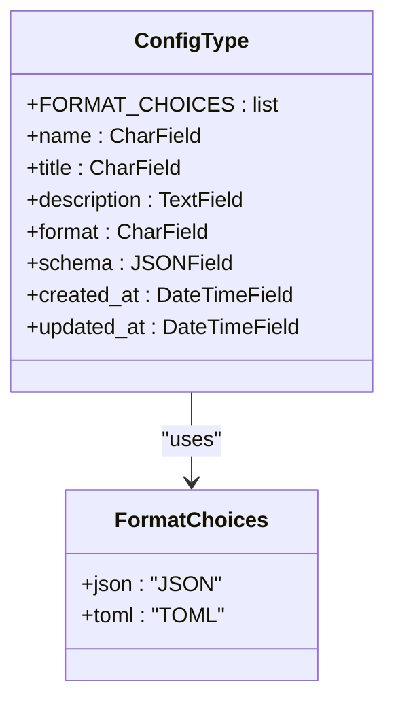
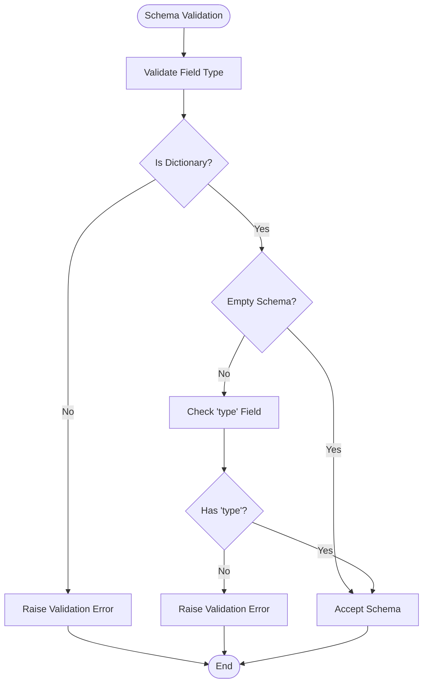
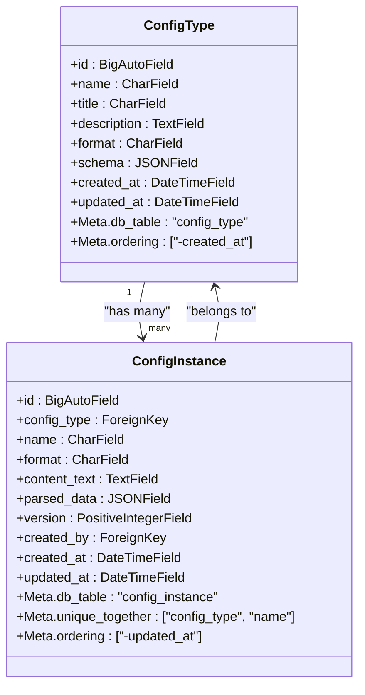
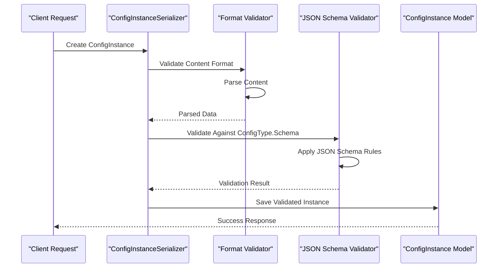
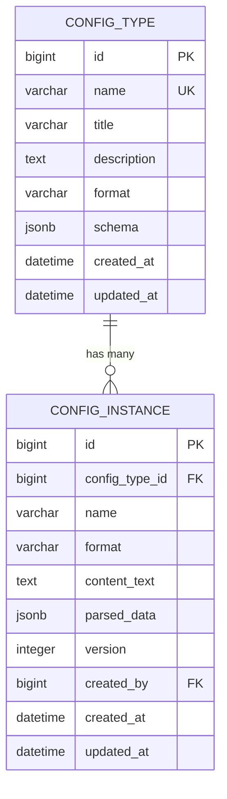
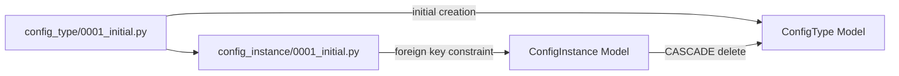

# Configuration Type Model

<cite>
**Referenced Files in This Document**
- [models.py](file://backend/config_type/models.py)
- [0001_initial.py](file://backend/config_type/migrations/0001_initial.py)
- [models.py](file://backend/config_instance/models.py)
- [0001_initial.py](file://backend/config_instance/migrations/0001_initial.py)
- [serializers.py](file://backend/config_type/serializers.py)
- [serializers.py](file://backend/config_instance/serializers.py)
</cite>

## Table of Contents
1. [Introduction](#introduction)
2. [Project Structure](#project-structure)
3. [Core Components](#core-components)
4. [Architecture Overview](#architecture-overview)
5. [Detailed Component Analysis](#detailed-component-analysis)
6. [Dependency Analysis](#dependency-analysis)
7. [Performance Considerations](#performance-considerations)
8. [Troubleshooting Guide](#troubleshooting-guide)
9. [Conclusion](#conclusion)

## Introduction
This document provides comprehensive data model documentation for the ConfigType model, which serves as the foundational configuration definition system in the AI Ops platform. The ConfigType model establishes standardized configuration schemas and formats that drive validation for configuration instances. It defines the authoritative structure for configuration metadata, format specifications, and JSON Schema validation rules that ensure consistency across all configuration deployments.

The model operates within a two-tier architecture where ConfigType acts as the master schema repository while ConfigInstance serves as the operational deployment container. This separation enables centralized schema management with flexible instance creation and validation workflows.

## Project Structure
The configuration system follows a modular Django application structure with clear separation of concerns:

**Diagram sources**
- [models.py:1-25](file://backend/config_type/models.py#L1-L25)
- [models.py:1-69](file://backend/config_instance/models.py#L1-L69)

**Section sources**
- [models.py:1-25](file://backend/config_type/models.py#L1-L25)
- [models.py:1-69](file://backend/config_instance/models.py#L1-L69)

## Core Components

### ConfigType Model Definition
The ConfigType model serves as the central schema repository for configuration definitions. It establishes the authoritative structure for configuration metadata and validation rules.

**Primary Fields:**
- **name**: Unique identifier for configuration types (max length: 100 characters)
- **title**: Human-readable display name (max length: 200 characters)
- **description**: Optional detailed description field
- **format**: Enumerated format specification (JSON or TOML)
- **schema**: JSONField containing validation schema definitions
- **timestamps**: Automatic creation and update tracking

**Section sources**
- [models.py:11-17](file://backend/config_type/models.py#L11-L17)

### FORMAT_CHOICES Enumeration
The format specification uses a controlled vocabulary with two supported formats:

**Diagram sources**
- [models.py:6-9](file://backend/config_type/models.py#L6-L9)

**Section sources**
- [models.py:6-9](file://backend/config_type/models.py#L6-L9)

### JSONField Schema Validation
The schema field utilizes Django's native JSONField with comprehensive validation:

**Diagram sources**
- [serializers.py:24-30](file://backend/config_type/serializers.py#L24-L30)

**Section sources**
- [serializers.py:24-30](file://backend/config_type/serializers.py#L24-L30)

## Architecture Overview

### Model Relationship Architecture
The ConfigType and ConfigInstance models establish a parent-child relationship with cascading deletion semantics:

**Diagram sources**
- [models.py:4-25](file://backend/config_type/models.py#L4-L25)
- [models.py:7-35](file://backend/config_instance/models.py#L7-L35)

### Validation Workflow Architecture
The validation system implements a multi-layered approach combining format validation and JSON Schema enforcement:

**Diagram sources**
- [serializers.py:20-48](file://backend/config_instance/serializers.py#L20-L48)

**Section sources**
- [models.py:37-69](file://backend/config_instance/models.py#L37-L69)
- [serializers.py:20-48](file://backend/config_instance/serializers.py#L20-L48)

## Detailed Component Analysis

### Field Specifications and Constraints

#### Identity and Metadata Fields
| Field | Type | Size Limit | Constraints | Description |
|-------|------|------------|-------------|-------------|
| name | CharField | 100 characters | unique=True | Unique identifier for configuration type |
| title | CharField | 200 characters | - | Human-readable display name |
| description | TextField | Unlimited | blank=True | Optional detailed description |

**Section sources**
- [models.py:11-13](file://backend/config_type/models.py#L11-L13)

#### Format and Schema Fields
| Field | Type | Size Limit | Constraints | Description |
|-------|------|------------|-------------|-------------|
| format | CharField | 10 characters | choices=FORMAT_CHOICES, default='json' | Configuration format specification |
| schema | JSONField | Unlimited | default=dict | JSON Schema validation rules |

**Section sources**
- [models.py:14-15](file://backend/config_type/models.py#L14-L15)

#### Timestamp and Auto-generated Fields
| Field | Type | Constraints | Behavior |
|-------|------|-------------|----------|
| created_at | DateTimeField | auto_now_add=True | Automatic creation timestamp |
| updated_at | DateTimeField | auto_now=True | Automatic update timestamp |

**Section sources**
- [models.py:16-17](file://backend/config_type/models.py#L16-L17)

### Validation Rules and Business Logic

#### Name Validation Rules
The serializer enforces strict naming conventions:
- Only alphanumeric characters and underscores permitted
- Must contain at least one alphanumeric character
- No special characters or spaces allowed

#### Schema Validation Rules
The JSON Schema validation ensures structural integrity:
- Schema must be a dictionary/object type
- Must contain essential 'type' field for validation
- Empty schemas are permitted for flexible configurations

**Section sources**
- [serializers.py:18-30](file://backend/config_type/serializers.py#L18-L30)

### Model Meta Options and Database Configuration

#### ConfigType Meta Options
- **db_table**: 'config_type'
- **ordering**: ['-created_at'] (newest first)
- **verbose_name**: 'Configuration Type'

#### ConfigInstance Meta Options
- **db_table**: 'config_instance'
- **ordering**: ['-updated_at'] (most recent first)
- **unique_together**: ['config_type', 'name'] (ensures unique instance names per type)
- **verbose_name**: 'Configuration Instance'

**Section sources**
- [models.py:19-21](file://backend/config_type/models.py#L19-L21)
- [models.py:29-32](file://backend/config_instance/models.py#L29-L32)

## Dependency Analysis

### Foreign Key Relationships
The ConfigInstance model maintains a mandatory relationship with ConfigType:

**Diagram sources**
- [models.py:4-25](file://backend/config_type/models.py#L4-L25)
- [models.py:7-35](file://backend/config_instance/models.py#L7-L35)

### Migration Dependencies and Evolution
The migration system establishes clear dependency chains:

**Diagram sources**
- [0001_initial.py:10-11](file://backend/config_type/migrations/0001_initial.py#L10-L11)
- [0001_initial.py:12-15](file://backend/config_instance/migrations/0001_initial.py#L12-L15)

**Section sources**
- [0001_initial.py:1-32](file://backend/config_type/migrations/0001_initial.py#L1-L32)
- [0001_initial.py:1-39](file://backend/config_instance/migrations/0001_initial.py#L1-L39)

### Database Indexing Strategies
Current indexing implementation focuses on query optimization:

#### ConfigType Indexes
- **Unique Index**: name field for fast lookups and uniqueness enforcement
- **Ordering Index**: created_at field for chronological queries

#### ConfigInstance Indexes  
- **Composite Index**: (config_type, name) for unique constraint and efficient filtering
- **Ordering Index**: updated_at field for recent activity queries

**Section sources**
- [0001_initial.py:18-24](file://backend/config_type/migrations/0001_initial.py#L18-L24)
- [0001_initial.py:29-36](file://backend/config_instance/migrations/0001_initial.py#L29-L36)

## Performance Considerations

### Query Optimization Patterns
- **Index Utilization**: Unique constraints on name fields enable O(log n) lookups
- **Ordering Efficiency**: Creation/update timestamps support efficient pagination
- **Foreign Key Joins**: Optimized joins between ConfigType and ConfigInstance tables

### Memory and Storage Considerations
- **JSONField Storage**: Efficient binary storage of JSON schemas
- **Text Field Management**: Separate content_text and parsed_data fields optimize storage patterns
- **Validation Overhead**: JSON Schema validation occurs during write operations to ensure data integrity

## Troubleshooting Guide

### Common Validation Issues

#### Schema Validation Failures
- **Missing 'type' field**: Ensure all schemas include essential type definitions
- **Invalid JSON format**: Verify schema content is properly formatted JSON
- **Empty schema acceptance**: Empty dictionaries are valid but provide no validation rules

#### Format Validation Problems
- **Unsupported format values**: Only 'json' and 'toml' are recognized
- **Name format violations**: Ensure names contain only alphanumeric characters and underscores
- **Unique constraint conflicts**: Resolve duplicate names within the same configuration type

**Section sources**
- [serializers.py:24-30](file://backend/config_type/serializers.py#L24-L30)
- [serializers.py:20-48](file://backend/config_instance/serializers.py#L20-L48)

### Migration and Database Issues
- **Foreign key constraint errors**: Ensure ConfigType records exist before creating ConfigInstance records
- **Index creation failures**: Verify database permissions for index operations
- **Data type mismatches**: Confirm JSONField compatibility with database backend

**Section sources**
- [0001_initial.py:12-15](file://backend/config_instance/migrations/0001_initial.py#L12-L15)

## Conclusion
The ConfigType model provides a robust foundation for configuration management through its comprehensive field definitions, strict validation rules, and well-defined relationships. The model's design emphasizes data integrity through multiple validation layers while maintaining flexibility for diverse configuration scenarios. The established relationships with ConfigInstance ensure scalable deployment patterns with centralized schema management and distributed instance handling.

The current implementation supports both JSON and TOML formats with extensible validation capabilities, making it suitable for modern configuration management requirements. Future enhancements could include additional format support, advanced schema validation features, and enhanced indexing strategies for improved query performance.