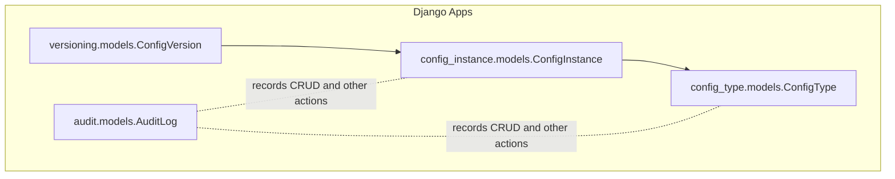
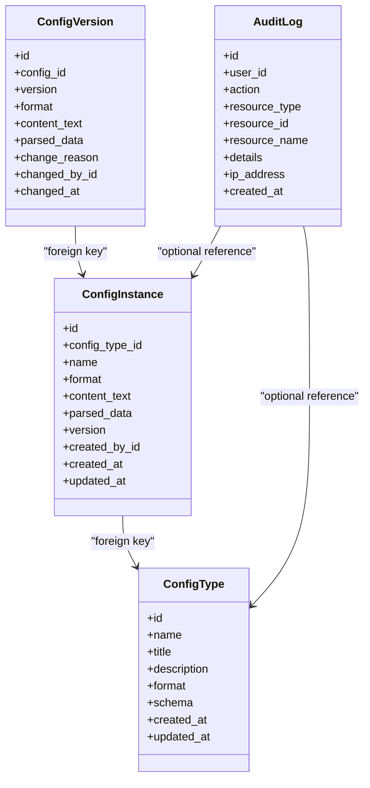
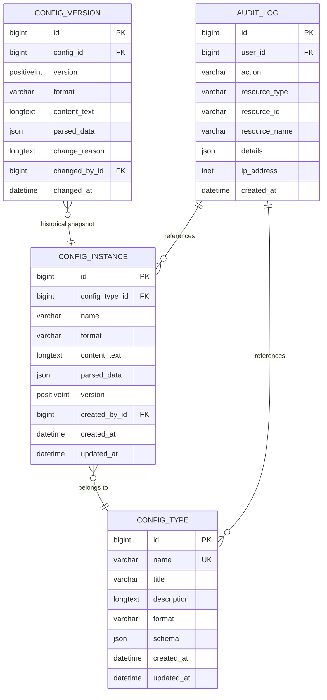
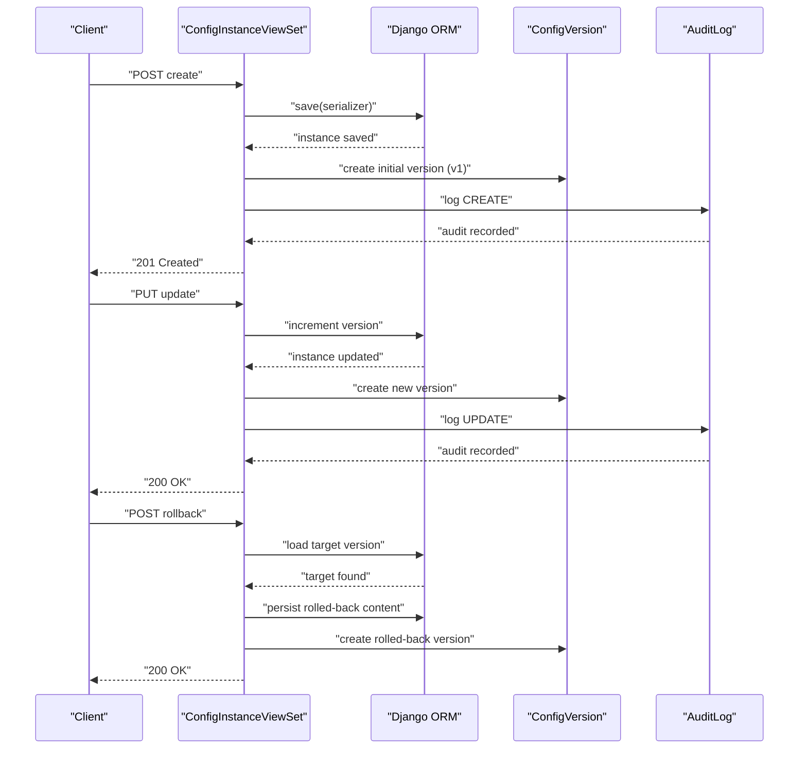
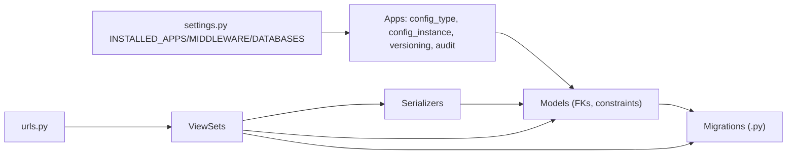

# Data Models & Database Schema

<cite>
**Referenced Files in This Document**
- [settings.py](file://backend/confighub/settings.py)
- [urls.py](file://backend/confighub/urls.py)
- [models.py](file://backend/config_type/models.py)
- [serializers.py](file://backend/config_type/serializers.py)
- [views.py](file://backend/config_type/views.py)
- [0001_initial.py](file://backend/config_type/migrations/0001_initial.py)
- [models.py](file://backend/config_instance/models.py)
- [serializers.py](file://backend/config_instance/serializers.py)
- [views.py](file://backend/config_instance/views.py)
- [0001_initial.py](file://backend/config_instance/migrations/0001_initial.py)
- [models.py](file://backend/versioning/models.py)
- [0001_initial.py](file://backend/versioning/migrations/0001_initial.py)
- [models.py](file://backend/audit/models.py)
- [0001_initial.py](file://backend/audit/migrations/0001_initial.py)
</cite>

## Table of Contents
1. [Introduction](#introduction)
2. [Project Structure](#project-structure)
3. [Core Components](#core-components)
4. [Architecture Overview](#architecture-overview)
5. [Detailed Component Analysis](#detailed-component-analysis)
6. [Dependency Analysis](#dependency-analysis)
7. [Performance Considerations](#performance-considerations)
8. [Troubleshooting Guide](#troubleshooting-guide)
9. [Conclusion](#conclusion)
10. [Appendices](#appendices)

## Introduction
This document describes the AI-Ops Configuration Hub database schema and data models. It covers entity definitions, relationships, constraints, validation rules, and operational patterns. It also documents the migration system, schema evolution, audit logging, and data lifecycle management. The backend is a Django application with Django REST Framework APIs and SQLite by default, with optional MySQL 8 support.

## Project Structure
The data model spans four Django apps:
- config_type: Defines configuration types and their JSON Schemas.
- config_instance: Stores configuration instances with parsed content and versioning metadata.
- versioning: Maintains historical versions of configuration instances.
- audit: Records user actions and system events for compliance and traceability.

**Diagram sources**
- [models.py:4-25](file://backend/config_type/models.py#L4-L25)
- [models.py:7-69](file://backend/config_instance/models.py#L7-L69)
- [models.py:5-23](file://backend/versioning/models.py#L5-L23)
- [models.py:5-31](file://backend/audit/models.py#L5-L31)

**Section sources**
- [settings.py:44-57](file://backend/confighub/settings.py#L44-L57)
- [urls.py:20-24](file://backend/confighub/urls.py#L20-L24)

## Core Components
This section defines each entity, its fields, data types, constraints, and behaviors.

### ConfigType
- Purpose: Defines a configuration type with a human-friendly title, a machine-friendly unique name, a format (JSON or TOML), a JSON Schema for validation, and timestamps.
- Fields
  - id: Big integer, auto-incrementing primary key.
  - name: String (unique), used as the lookup key for type APIs.
  - title: String, display label.
  - description: Text, optional.
  - format: Choice of JSON or TOML.
  - schema: JSON field containing a JSON Schema object.
  - created_at: DateTime (auto-on-create).
  - updated_at: DateTime (auto-on-update).
- Constraints
  - Unique name enforced at database level.
  - Ordering by created_at descending by default.
- Validation
  - Serializer enforces name pattern (alphanumeric and underscore only) and ensures schema is a dict with a type field when present.

**Section sources**
- [models.py:4-25](file://backend/config_type/models.py#L4-L25)
- [0001_initial.py:14-31](file://backend/config_type/migrations/0001_initial.py#L14-L31)
- [serializers.py:5-31](file://backend/config_type/serializers.py#L5-L31)

### ConfigInstance
- Purpose: Stores a single configuration instance under a ConfigType, preserving original content and a parsed JSON representation for querying and indexing.
- Fields
  - id: Big integer, auto-incrementing primary key.
  - config_type: Foreign key to ConfigType; CASCADE delete.
  - name: String; combined with config_type forms a unique constraint.
  - format: Choice of JSON or TOML.
  - content_text: Text storing the raw content as entered.
  - parsed_data: JSON field storing normalized data for queries.
  - version: Positive integer; incremented on updates.
  - created_by: Foreign key to User; SET NULL on user deletion.
  - created_at: DateTime (auto-on-create).
  - updated_at: DateTime (auto-on-update).
- Constraints
  - Unique constraint on (config_type, name).
  - Ordering by updated_at descending by default.
- Validation and Parsing
  - On save, content is parsed according to format; invalid content raises an error.
  - Serializers validate content format and apply the associated ConfigType’s JSON Schema.
- Business Logic
  - Creation and update create a ConfigVersion record.
  - Content retrieval supports format conversion via parsed_data.

**Section sources**
- [models.py:7-69](file://backend/config_instance/models.py#L7-L69)
- [0001_initial.py:18-38](file://backend/config_instance/migrations/0001_initial.py#L18-L38)
- [serializers.py:7-60](file://backend/config_instance/serializers.py#L7-L60)
- [views.py:11-150](file://backend/config_instance/views.py#L11-L150)

### ConfigVersion
- Purpose: Historical snapshot of a ConfigInstance at a specific version.
- Fields
  - id: Big integer, auto-incrementing primary key.
  - config: Foreign key to ConfigInstance; CASCADE delete; reverse relation name “versions”.
  - version: Positive integer; unique per config.
  - format: String indicating the stored format.
  - content_text: Text storing the raw content at that version.
  - parsed_data: JSON field storing normalized data at that version.
  - change_reason: Text, optional note for the change.
  - changed_by: Foreign key to User; SET NULL on user deletion.
  - changed_at: DateTime (auto-on-create).
- Constraints
  - Unique constraint on (config, version).
  - Ordering by version descending by default.

**Section sources**
- [models.py:5-23](file://backend/versioning/models.py#L5-L23)
- [0001_initial.py:18-37](file://backend/versioning/migrations/0001_initial.py#L18-L37)

### AuditLog
- Purpose: Captures user actions and system events for auditing and compliance.
- Fields
  - id: Big integer, auto-incrementing primary key.
  - user: Foreign key to User; SET NULL on user deletion.
  - action: Choice among CREATE, UPDATE, DELETE, VIEW, EXPORT, IMPORT.
  - resource_type: String identifying the resource category.
  - resource_id: String identifier for the resource.
  - resource_name: String friendly name of the resource.
  - details: JSON field for structured event details.
  - ip_address: Generic IP address; nullable.
  - created_at: DateTime (auto-on-create).
- Ordering
  - Ordered by created_at descending by default.

**Section sources**
- [models.py:5-31](file://backend/audit/models.py#L5-L31)
- [0001_initial.py:17-35](file://backend/audit/migrations/0001_initial.py#L17-L35)

## Architecture Overview
The system follows a layered Django architecture with explicit separation of concerns:
- Models define entities and constraints.
- Serializers validate and transform data for API consumption.
- ViewSets orchestrate business logic, transactions, and audit/versioning.
- Migrations define schema evolution.

**Diagram sources**
- [models.py:4-25](file://backend/config_type/models.py#L4-L25)
- [models.py:7-69](file://backend/config_instance/models.py#L7-L69)
- [models.py:5-23](file://backend/versioning/models.py#L5-L23)
- [models.py:5-31](file://backend/audit/models.py#L5-L31)

## Detailed Component Analysis

### Entity Relationship Diagram

**Diagram sources**
- [models.py:4-25](file://backend/config_type/models.py#L4-L25)
- [models.py:7-69](file://backend/config_instance/models.py#L7-L69)
- [models.py:5-23](file://backend/versioning/models.py#L5-L23)
- [models.py:5-31](file://backend/audit/models.py#L5-L31)

### Data Validation and Business Rules
- ConfigType
  - Name must be unique and match a strict alphanumeric-and-underscore pattern.
  - Schema must be a JSON object and must include a type field when present.
- ConfigInstance
  - Content must parse successfully to either JSON or TOML.
  - Content must satisfy the associated ConfigType’s JSON Schema when defined.
  - Version increments on update; initial version is 1 on creation.
  - Unique constraint prevents duplicate names per type.
- ConfigVersion
  - Per-config uniqueness of version numbers ensures ordered history.
- AuditLog
  - Action types enumerate supported operations.
  - Optional user reference allows attribution; user deletion sets foreign keys to NULL.

**Section sources**
- [serializers.py:18-31](file://backend/config_type/serializers.py#L18-L31)
- [serializers.py:20-48](file://backend/config_instance/serializers.py#L20-L48)
- [models.py:37-69](file://backend/config_instance/models.py#L37-L69)
- [models.py:16-19](file://backend/versioning/models.py#L16-L19)
- [models.py:7-14](file://backend/audit/models.py#L7-L14)

### Data Lifecycle: Create, Update, Rollback

**Diagram sources**
- [views.py:36-136](file://backend/config_instance/views.py#L36-L136)

### API Workflows and Data Access Patterns
- ConfigType
  - List and filter by search and format.
  - Retrieve instances under a type by name (lookup by name configured).
- ConfigInstance
  - List with filters: config_type, search, format.
  - Retrieve formatted content endpoint supports JSON/TOML conversion.
  - Versions endpoint lists historical versions.
  - Rollback endpoint restores a previous version and creates a new version.
- AuditLog
  - Centralized logging of user actions against resources.

**Section sources**
- [views.py:8-39](file://backend/config_type/views.py#L8-L39)
- [views.py:11-150](file://backend/config_instance/views.py#L11-L150)
- [urls.py:20-24](file://backend/confighub/urls.py#L20-L24)

## Dependency Analysis
- App registration and middleware are defined in settings.
- URLs route API endpoints to app-specific routers.
- Models define foreign keys and constraints; migrations materialize them.
- Serializers depend on models and enforce validation rules.
- Views orchestrate transactions, versioning, and auditing.

**Diagram sources**
- [settings.py:44-117](file://backend/confighub/settings.py#L44-L117)
- [urls.py:20-24](file://backend/confighub/urls.py#L20-L24)

**Section sources**
- [settings.py:44-117](file://backend/confighub/settings.py#L44-L117)
- [urls.py:20-24](file://backend/confighub/urls.py#L20-L24)

## Performance Considerations
- Indexing
  - Unique constraints on (config_type, name) and (config, version) provide efficient lookups and prevent duplicates.
  - Ordering by created_at or updated_at reduces need for manual sorting in queries.
- Query Patterns
  - Filtering by config_type name and format is supported in views; consider adding database indexes on frequently filtered fields if traffic grows.
  - select_related('config_type') reduces N+1 queries in list views.
- Storage
  - content_text and parsed_data are stored separately; parsed_data enables efficient querying while content_text preserves fidelity.
- Transactions
  - Atomic operations around create/update/rollback ensure consistency and avoid partial writes.
- Pagination
  - REST framework pagination is enabled globally; tune PAGE_SIZE for large datasets.

[No sources needed since this section provides general guidance]

## Troubleshooting Guide
- Validation Failures
  - ConfigType name must match allowed pattern; schema must be a dict with type when provided.
  - ConfigInstance content must parse and satisfy the associated type’s schema.
- Duplicate Instance Names
  - Creating or updating an instance with a name that conflicts for the same type will fail due to unique constraint.
- Version History
  - If rolling back to a non-existent version, the API returns a 404 response.
- Audit Visibility
  - Audit entries are ordered by created_at desc; ensure user context is available for logged actions.

**Section sources**
- [serializers.py:18-31](file://backend/config_type/serializers.py#L18-L31)
- [serializers.py:20-48](file://backend/config_instance/serializers.py#L20-L48)
- [views.py:106-136](file://backend/config_instance/views.py#L106-L136)

## Conclusion
The AI-Ops Configuration Hub employs a clean, relational schema with JSON fields for flexible content storage and robust validation via JSON Schema. The design emphasizes auditability, versioning, and user-driven configuration management. Migrations provide deterministic schema evolution, while serializers and views encapsulate validation and business logic.

[No sources needed since this section summarizes without analyzing specific files]

## Appendices

### Database Schema Evolution and Migration Patterns
- Initial schema creation is defined in each app’s migration files.
- Dependencies ensure correct order: config_type precedes config_instance; config_instance precedes versioning; audit stands alone.
- Future migrations should preserve existing constraints and add indexes as needed.

**Section sources**
- [0001_initial.py:10-15](file://backend/config_type/migrations/0001_initial.py#L10-L15)
- [0001_initial.py:12-15](file://backend/config_instance/migrations/0001_initial.py#L12-L15)
- [0001_initial.py:12-15](file://backend/versioning/migrations/0001_initial.py#L12-L15)
- [0001_initial.py:12-14](file://backend/audit/migrations/0001_initial.py#L12-L14)

### Data Access Patterns and Indexing Strategies
- Primary Keys
  - All models use BigAutoField as primary key.
- Foreign Keys
  - ConfigInstance.config_type: CASCADE delete.
  - ConfigVersion.config: CASCADE delete; reverse relation “versions”.
  - created_by and changed_by: SET NULL on user deletion.
- Unique Constraints
  - ConfigInstance: (config_type, name).
  - ConfigVersion: (config, version).
  - ConfigType: (name).
- Ordering
  - ConfigType: [-created_at]
  - ConfigInstance: [-updated_at]
  - ConfigVersion: [-version]
  - AuditLog: [-created_at]

**Section sources**
- [models.py:19-21](file://backend/config_type/models.py#L19-L21)
- [models.py:29-32](file://backend/config_instance/models.py#L29-L32)
- [models.py:16-19](file://backend/versioning/models.py#L16-L19)

### Sample Data Examples
- ConfigType
  - name: "app_settings"
  - title: "Application Settings"
  - format: "json"
  - schema: {"type": "object", "properties": {"port": {"type": "integer"}}, "required": ["port"]}
- ConfigInstance
  - config_type: reference to the above type
  - name: "prod_cluster"
  - format: "json"
  - content_text: "{...}"
  - parsed_data: {...}
  - version: 1
- ConfigVersion
  - config: reference to the instance
  - version: 1
  - format: "json"
  - content_text: "{...}"
  - parsed_data: {...}
  - changed_by: reference to user
  - changed_at: timestamp
- AuditLog
  - user: reference to user
  - action: "CREATE"
  - resource_type: "ConfigInstance"
  - resource_id: "1"
  - resource_name: "Application Settings/prod_cluster"
  - details: {"format": "json"}
  - created_at: timestamp

[No sources needed since this section provides general guidance]

### Data Transformation Rules
- Content parsing
  - JSON or TOML content is parsed into parsed_data during save/validation.
- Format conversion
  - API content endpoint returns requested format using parsed_data.
- Versioning
  - New versions are created on updates; rollback re-applies a prior version and increments the version number.

**Section sources**
- [models.py:42-69](file://backend/config_instance/models.py#L42-L69)
- [views.py:138-149](file://backend/config_instance/views.py#L138-L149)

### Backup and Restore Procedures
- SQLite
  - Copy the sqlite database file for backup; restore by replacing the file.
- MySQL
  - Use logical backups (mysqldump) or physical backups; restore by importing dump or copying data directory as appropriate.
- Django
  - Use Django’s dumpdata/loaddata for application-level backups/restores.

[No sources needed since this section provides general guidance]

### Security, Privacy, and Access Control
- Authentication and Authorization
  - REST framework permission defaults are permissive; consider tightening permissions for production deployments.
  - AuditLog captures user actions; ensure user context is propagated to log entries.
- Database Security
  - Environment variables drive database engine selection and credentials; ensure secrets are managed securely.
- CORS and Hosts
  - CORS and ALLOWED_HOSTS are configured broadly for development; restrict in production environments.

**Section sources**
- [settings.py:33-39](file://backend/confighub/settings.py#L33-L39)
- [settings.py:94-117](file://backend/confighub/settings.py#L94-L117)
- [settings.py](file://backend/confighub/settings.py#L29)
- [settings.py](file://backend/confighub/settings.py#L31)