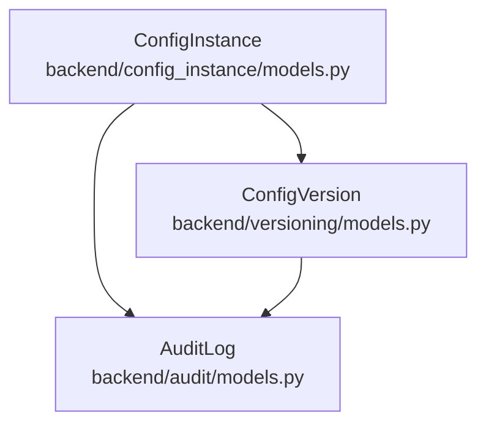
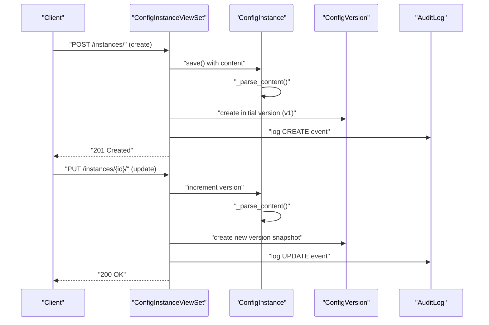
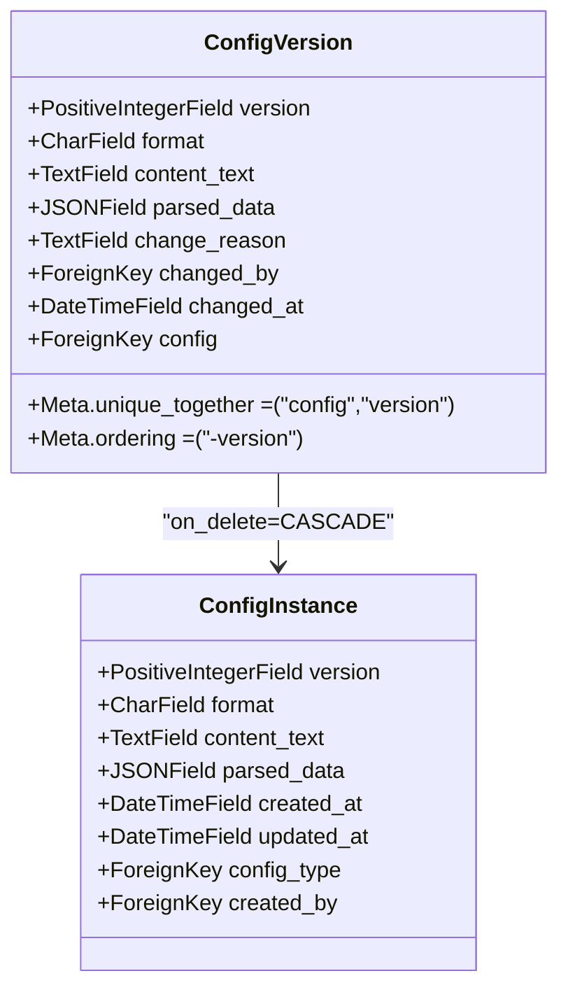
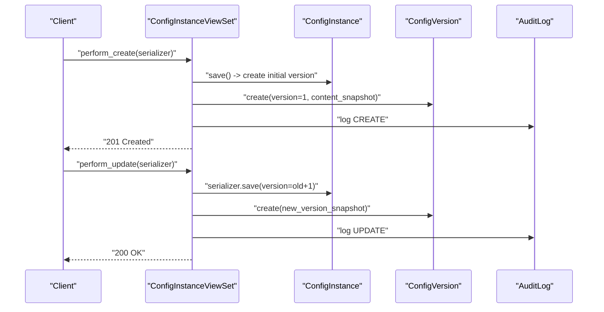
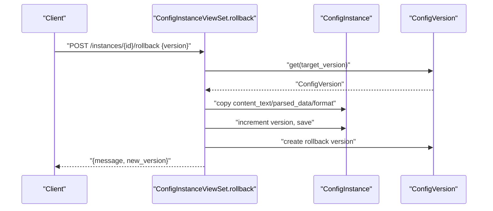
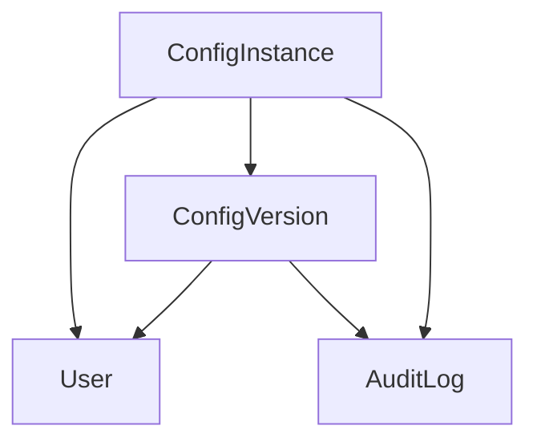

# Version History Model

<cite>
**Referenced Files in This Document**
- [models.py](file://backend/versioning/models.py)
- [models.py](file://backend/config_instance/models.py)
- [0001_initial.py](file://backend/versioning/migrations/0001_initial.py)
- [0001_initial.py](file://backend/config_instance/migrations/0001_initial.py)
- [views.py](file://backend/config_instance/views.py)
- [serializers.py](file://backend/config_instance/serializers.py)
- [models.py](file://backend/audit/models.py)
- [urls.py](file://backend/config_instance/urls.py)
</cite>

## Table of Contents
1. [Introduction](#introduction)
2. [Project Structure](#project-structure)
3. [Core Components](#core-components)
4. [Architecture Overview](#architecture-overview)
5. [Detailed Component Analysis](#detailed-component-analysis)
6. [Dependency Analysis](#dependency-analysis)
7. [Performance Considerations](#performance-considerations)
8. [Troubleshooting Guide](#troubleshooting-guide)
9. [Conclusion](#conclusion)

## Introduction
This document provides comprehensive data model documentation for the ConfigVersion model and the configuration versioning system. It explains how automatic version creation is triggered by configuration instance updates, documents the historical data storage mechanism, version numbering strategy, and rollback functionality implementation. It also details the relationship between ConfigVersion and ConfigInstance, including cascade delete behavior, and covers field definitions for version numbers, content snapshots, and timestamp tracking. Additionally, it outlines version comparison algorithms, historical content retrieval, performance considerations for large version histories, and practical examples of version creation and rollback operations.

## Project Structure
The versioning system spans two Django applications:
- ConfigInstance application: Manages configuration instances and triggers version creation during create/update operations.
- Versioning application: Stores historical versions of configuration instances with snapshot-like fields for content and metadata.

**Diagram sources**
- [models.py:7-69](file://backend/config_instance/models.py#L7-L69)
- [models.py:5-23](file://backend/versioning/models.py#L5-L23)
- [models.py:5-31](file://backend/audit/models.py#L5-L31)

**Section sources**
- [models.py:1-69](file://backend/config_instance/models.py#L1-L69)
- [models.py:1-23](file://backend/versioning/models.py#L1-L23)
- [models.py:1-31](file://backend/audit/models.py#L1-L31)

## Core Components
This section documents the core data models and their relationships.

- ConfigInstance
  - Purpose: Represents a configuration instance with content in either JSON or TOML format.
  - Key fields:
    - name: Unique within a ConfigType.
    - format: Either JSON or TOML.
    - content_text: Raw content string.
    - parsed_data: JSONField storing normalized data for querying and linking.
    - version: Positive integer representing the current version number.
    - created_by, created_at, updated_at: Timestamps and creator tracking.
  - Behavior:
    - On save, content is parsed into parsed_data based on format.
    - Provides convenience methods to export content in JSON or TOML.

- ConfigVersion
  - Purpose: Stores historical snapshots of configuration instances.
  - Key fields:
    - config: Foreign key to ConfigInstance with CASCADE deletion.
    - version: Positive integer snapshot version number.
    - format: Format of the snapshot (JSON/TOML).
    - content_text: Snapshot of raw content at time of version creation.
    - parsed_data: Snapshot of parsed data at time of version creation.
    - change_reason: Optional reason for the change.
    - changed_by: User who made the change.
    - changed_at: Timestamp when the version was created.
  - Constraints:
    - Unique constraint on (config, version) ensures no duplicate versions per instance.
    - Ordering by -version for descending order by version.

- AuditLog
  - Purpose: Tracks user actions on resources (including ConfigInstance).
  - Used alongside versioning to record create/update events and details.

**Section sources**
- [models.py:7-69](file://backend/config_instance/models.py#L7-L69)
- [models.py:5-23](file://backend/versioning/models.py#L5-L23)
- [models.py:5-31](file://backend/audit/models.py#L5-L31)

## Architecture Overview
The versioning architecture integrates with the ConfigInstance API to automatically capture historical snapshots and support rollback operations.

**Diagram sources**
- [views.py:36-90](file://backend/config_instance/views.py#L36-L90)
- [models.py:37-54](file://backend/config_instance/models.py#L37-L54)
- [models.py:5-23](file://backend/versioning/models.py#L5-L23)
- [models.py:5-31](file://backend/audit/models.py#L5-L31)

## Detailed Component Analysis

### ConfigVersion Model
The ConfigVersion model captures historical snapshots of configuration instances.

Key design decisions:
- Snapshot fields (content_text, parsed_data, format) preserve historical content state.
- change_reason allows auditors to track intent behind changes.
- changed_by links versions to users for accountability.
- changed_at timestamps each snapshot creation.
- Unique constraint on (config, version) prevents duplicates and enables fast lookups.
- Ordering by -version ensures newest versions appear first.

**Diagram sources**
- [models.py:5-23](file://backend/versioning/models.py#L5-L23)
- [models.py:7-69](file://backend/config_instance/models.py#L7-L69)

**Section sources**
- [models.py:5-23](file://backend/versioning/models.py#L5-L23)

### Automatic Version Creation on Updates
The ConfigInstanceViewSet orchestrates automatic version creation during create and update operations.

- Create flow:
  - Validates and saves the new ConfigInstance.
  - Immediately creates an initial ConfigVersion with version=1.
  - Logs the CREATE action in AuditLog.

- Update flow:
  - Increments the instance version by 1.
  - Saves the updated instance with the new version.
  - Creates a new ConfigVersion snapshot capturing the current state.
  - Logs the UPDATE action in AuditLog.

**Diagram sources**
- [views.py:36-90](file://backend/config_instance/views.py#L36-L90)
- [models.py:5-23](file://backend/versioning/models.py#L5-L23)
- [models.py:5-31](file://backend/audit/models.py#L5-L31)

**Section sources**
- [views.py:36-90](file://backend/config_instance/views.py#L36-L90)

### Historical Data Storage Mechanism
Historical data is stored as snapshots in ConfigVersion:
- content_text: Preserves the exact raw content string at the time of the snapshot.
- parsed_data: Stores the normalized JSON representation captured at the time of the snapshot.
- format: Captures the format (JSON/TOML) at the time of the snapshot.

These fields enable:
- Accurate historical retrieval of content in original format.
- Consistent parsing behavior for historical versions even if the current format changes.
- Efficient querying and filtering by format or content characteristics.

**Section sources**
- [models.py:5-23](file://backend/versioning/models.py#L5-L23)

### Version Numbering Strategy
- Initial version: Every new ConfigInstance starts with version=1 and an initial ConfigVersion is created immediately upon creation.
- Incremental numbering: Each update increments the instance version by 1, ensuring monotonically increasing version numbers.
- Uniqueness: The unique_together constraint on (config, version) guarantees no duplicate versions for the same instance.

Rollback behavior:
- Rollback does not reuse old version numbers; it creates a new version (new_version = target_version + 1) to preserve historical continuity and avoid gaps in the version sequence.

**Section sources**
- [views.py:42-50](file://backend/config_instance/views.py#L42-L50)
- [views.py:68-70](file://backend/config_instance/views.py#L68-L70)
- [models.py:16-18](file://backend/versioning/models.py#L16-L18)

### Cascade Delete Behavior
- ConfigVersion has a foreign key to ConfigInstance with on_delete=CASCADE.
- When a ConfigInstance is deleted, all associated ConfigVersion records are automatically removed.
- This ensures referential integrity and prevents orphaned version history.

**Section sources**
- [models.py:7-8](file://backend/versioning/models.py#L7-L8)
- [0001_initial.py:29-29](file://backend/versioning/migrations/0001_initial.py#L29-L29)

### Rollback Functionality Implementation
The rollback endpoint retrieves a target ConfigVersion and recreates the current ConfigInstance state from that snapshot:
- Validates existence of the target version.
- Copies content_text, parsed_data, and format from the target version to the current instance.
- Increments the version number and saves the instance.
- Creates a new ConfigVersion snapshot labeled as a rollback to the target version.
- Returns success with the new version number.

**Diagram sources**
- [views.py:106-136](file://backend/config_instance/views.py#L106-L136)
- [models.py:5-23](file://backend/versioning/models.py#L5-L23)

**Section sources**
- [views.py:106-136](file://backend/config_instance/views.py#L106-L136)

### Field Definitions and Data Types
- ConfigVersion fields:
  - version: Positive integer (unique per instance).
  - format: String (JSON/TOML).
  - content_text: Text field for raw content snapshot.
  - parsed_data: JSONField for normalized data snapshot.
  - change_reason: Text field for optional change description.
  - changed_by: ForeignKey to User (nullable).
  - changed_at: DateTimeField auto-populated on creation.

- ConfigInstance fields:
  - version: Positive integer (current version).
  - format: String (JSON/TOML).
  - content_text: Text field for raw content.
  - parsed_data: JSONField for normalized data.
  - created_by: ForeignKey to User (nullable).
  - created_at, updated_at: DateTimeFields for lifecycle tracking.

**Section sources**
- [models.py:5-23](file://backend/versioning/models.py#L5-L23)
- [models.py:7-69](file://backend/config_instance/models.py#L7-L69)

### Version Comparison Algorithms
- Equality: Two versions are equal if their content_text and parsed_data match exactly.
- Ordering: Versions are ordered by version number descending (-version) to show newest first.
- Filtering: Queries can filter by format, changed_by, or date ranges using standard Django ORM filters.

Note: The current implementation does not include explicit diff computation; comparisons rely on direct field equality checks.

**Section sources**
- [models.py:16-19](file://backend/versioning/models.py#L16-L19)
- [views.py:92-104](file://backend/config_instance/views.py#L92-L104)

### Historical Content Retrieval
- List versions: GET /instances/{id}/versions returns a compact list of version metadata (version, format, change_reason, changed_by, changed_at).
- Get content in specific format: GET /instances/{id}/content?format=json or toml returns the current content in the requested format, derived from parsed_data.

**Section sources**
- [views.py:92-104](file://backend/config_instance/views.py#L92-L104)
- [views.py:138-149](file://backend/config_instance/views.py#L138-L149)
- [models.py:55-69](file://backend/config_instance/models.py#L55-L69)

### API Endpoints and Usage Patterns
- Create instance: POST /instances/
- Update instance: PUT /instances/{id}/
- List versions: GET /instances/{id}/versions
- Get content: GET /instances/{id}/content?format=json|toml
- Rollback: POST /instances/{id}/rollback {version}

**Section sources**
- [urls.py:1-11](file://backend/config_instance/urls.py#L1-L11)
- [views.py:11-150](file://backend/config_instance/views.py#L11-L150)

## Dependency Analysis
The versioning system depends on:
- ConfigInstance: Source of truth for current content and version.
- User model: For changed_by and created_by tracking.
- AuditLog: For logging create/update actions.

**Diagram sources**
- [models.py:7-69](file://backend/config_instance/models.py#L7-L69)
- [models.py:5-23](file://backend/versioning/models.py#L5-L23)
- [models.py:5-31](file://backend/audit/models.py#L5-L31)

**Section sources**
- [models.py:1-69](file://backend/config_instance/models.py#L1-L69)
- [models.py:1-23](file://backend/versioning/models.py#L1-L23)
- [models.py:1-31](file://backend/audit/models.py#L1-L31)

## Performance Considerations
- Snapshot size: content_text and parsed_data are stored for each version. Large configurations will increase storage footprint over time.
- Indexing: Unique constraint on (config, version) supports efficient lookups. Consider adding indexes on frequently filtered fields (e.g., changed_by, changed_at) if query volume grows.
- Pagination: For large version histories, implement pagination on the versions endpoint to limit response sizes.
- Deletion: CASCADE deletion ensures cleanup but may trigger cascading deletes for large histories; monitor performance during bulk deletions.
- Serialization: Keep serialized content minimal in list endpoints; only include essential metadata (as currently implemented).

[No sources needed since this section provides general guidance]

## Troubleshooting Guide
Common issues and resolutions:
- Version not found during rollback:
  - Symptom: 404 error when rolling back to a non-existent version.
  - Cause: Target version number does not exist for the instance.
  - Resolution: Verify the version exists using the versions endpoint.

- Duplicate version error:
  - Symptom: IntegrityError on version creation.
  - Cause: Attempting to create a version that already exists for the instance.
  - Resolution: Ensure version increment logic is followed and no manual duplicate creation occurs.

- Content mismatch after rollback:
  - Symptom: Parsed data differs from expected after rollback.
  - Cause: The rollback copies content_text, parsed_data, and format from the target version.
  - Resolution: Confirm the target version snapshot contains the intended content.

- Audit log missing:
  - Symptom: No audit record for create/update.
  - Cause: Audit logging is performed alongside version creation; ensure AuditLog model is migrated and accessible.
  - Resolution: Verify migrations and permissions.

**Section sources**
- [views.py:106-136](file://backend/config_instance/views.py#L106-L136)
- [models.py:16-18](file://backend/versioning/models.py#L16-L18)
- [models.py:5-31](file://backend/audit/models.py#L5-L31)

## Conclusion
The ConfigVersion model and versioning system provide robust historical tracking of configuration instances. Automatic version creation during create/update operations, combined with snapshot storage and rollback capabilities, ensures traceability and recoverability. The design balances simplicity with extensibility, enabling future enhancements such as diff computation, selective pruning of old versions, and advanced filtering. Proper indexing and pagination strategies should be considered as version histories grow to maintain performance.