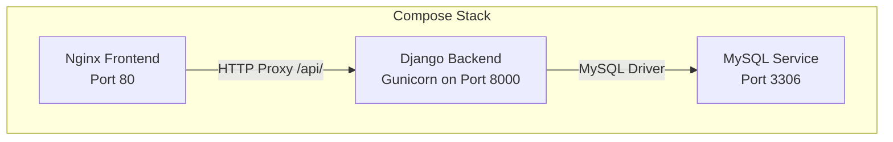
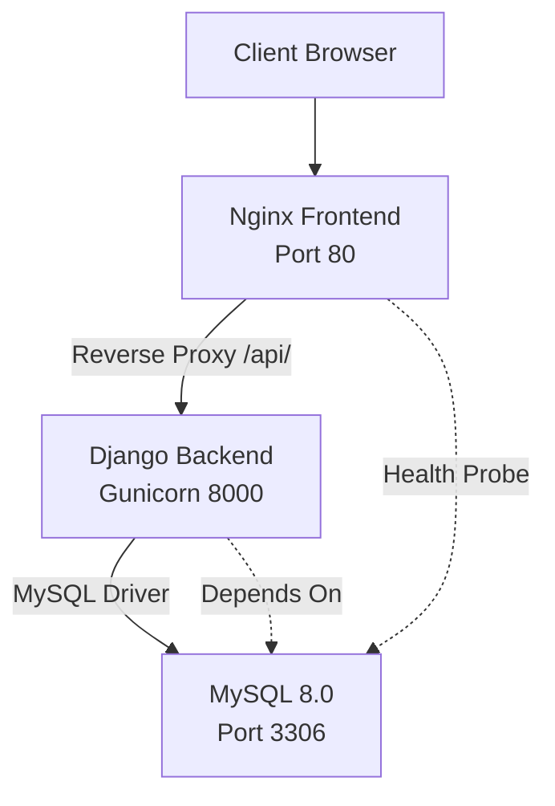

# Container Orchestration and Scaling

<cite>
**Referenced Files in This Document**
- [docker-compose.yml](file://docker-compose.yml)
- [backend/Dockerfile](file://backend/Dockerfile)
- [frontend/Dockerfile](file://frontend/Dockerfile)
- [backend/confighub/settings.py](file://backend/confighub/settings.py)
- [backend/requirements.txt](file://backend/requirements.txt)
- [frontend/nginx.conf](file://frontend/nginx.conf)
- [frontend/package.json](file://frontend/package.json)
- [backend/confighub/wsgi.py](file://backend/confighub/wsgi.py)
- [backend/confighub/asgi.py](file://backend/confighub/asgi.py)
</cite>

## Table of Contents
1. [Introduction](#introduction)
2. [Project Structure](#project-structure)
3. [Core Components](#core-components)
4. [Architecture Overview](#architecture-overview)
5. [Detailed Component Analysis](#detailed-component-analysis)
6. [Dependency Analysis](#dependency-analysis)
7. [Performance Considerations](#performance-considerations)
8. [Troubleshooting Guide](#troubleshooting-guide)
9. [Conclusion](#conclusion)
10. [Appendices](#appendices)

## Introduction
This document provides comprehensive container orchestration and scaling guidance for the AI-Ops Configuration Hub. It focuses on Docker Compose service definitions optimized for horizontal scaling, including service replicas, networking configuration, and inter-service communication. It explains load balancing strategies, session affinity considerations, and health check implementations. It also details container resource management, restart policies, graceful shutdown procedures, service discovery mechanisms, DNS configuration, and network segmentation for security. Scaling patterns for different components (web servers, background workers, database connections) and auto-scaling considerations are addressed, along with container security practices, privilege management, and runtime isolation.

## Project Structure
The project is organized into a backend Django application, a frontend Vue.js application, and a shared Docker Compose orchestration file. The backend is containerized with Gunicorn as the WSGI server, while the frontend is built with Vite and served via Nginx. A MySQL database is provisioned as a separate service.

**Diagram sources**
- [docker-compose.yml:1-50](file://docker-compose.yml#L1-L50)
- [frontend/nginx.conf:13-18](file://frontend/nginx.conf#L13-L18)
- [backend/Dockerfile:26](file://backend/Dockerfile#L26)

**Section sources**
- [docker-compose.yml:1-50](file://docker-compose.yml#L1-L50)
- [backend/Dockerfile:1-27](file://backend/Dockerfile#L1-L27)
- [frontend/Dockerfile:1-26](file://frontend/Dockerfile#L1-L26)

## Core Components
- Database service: MySQL 8.0 configured with environment variables, persistent volume, health checks, and port exposure.
- Backend service: Django application built with Python slim base image, Gunicorn WSGI server, static collection, and exposed port.
- Frontend service: Nginx serving a static Vue.js build with reverse proxy to backend API endpoints.

Key orchestration elements:
- Environment-driven configuration for database connectivity and Django settings.
- Health checks for database readiness.
- Reverse proxy configuration for API routing and static asset delivery.

**Section sources**
- [docker-compose.yml:4-19](file://docker-compose.yml#L4-L19)
- [docker-compose.yml:21-38](file://docker-compose.yml#L21-L38)
- [docker-compose.yml:40-46](file://docker-compose.yml#L40-L46)
- [backend/confighub/settings.py:94-117](file://backend/confighub/settings.py#L94-L117)
- [backend/requirements.txt:1-8](file://backend/requirements.txt#L1-L8)

## Architecture Overview
The stack consists of three primary services orchestrated together:
- Frontend Nginx service proxies API requests to the backend and serves static assets.
- Backend Django service runs Gunicorn and connects to the MySQL database.
- Database service provides persistence and health-checked availability.

**Diagram sources**
- [docker-compose.yml:40-46](file://docker-compose.yml#L40-L46)
- [frontend/nginx.conf:13-18](file://frontend/nginx.conf#L13-L18)
- [backend/Dockerfile:26](file://backend/Dockerfile#L26)
- [docker-compose.yml:16-19](file://docker-compose.yml#L16-L19)
- [docker-compose.yml:32-34](file://docker-compose.yml#L32-L34)

## Detailed Component Analysis

### Database Service (MySQL)
- Image and credentials are configured via environment variables.
- Persistent storage is mounted to a named volume for durability.
- Health checks use the MySQL administrative ping command with retry thresholds.
- Port mapping exposes the database on host port 3306.

Scaling considerations:
- Horizontal scaling of the database is not enabled in the current compose file. For production, consider a managed MySQL cluster or replication setup outside this compose scope.

Security and isolation:
- Root password and application user credentials are set via environment variables.
- Network isolation relies on Docker Compose default bridge networking.

Operational notes:
- The database command sets the authentication plugin for compatibility.

**Section sources**
- [docker-compose.yml:4-19](file://docker-compose.yml#L4-L19)

### Backend Service (Django + Gunicorn)
- Built from a Python slim base image with system dependencies installed.
- Static files are collected during the build process.
- Exposed port 8000 is mapped for container access.
- Gunicorn is configured with a fixed worker count and binds to 0.0.0.0:8000.

Application configuration:
- Database engine selection is controlled by an environment variable.
- MySQL connection parameters are supplied via environment variables.
- Django settings include CORS and REST framework defaults.

Scaling considerations:
- The current compose file does not define replicas for the backend service.
- Gunicorn workers are fixed; dynamic scaling requires external orchestration or process manager adjustments.

Load balancing:
- No internal load balancer is defined in the compose file. Requests are routed through the frontend Nginx.

Graceful shutdown:
- The Dockerfile uses a simple CMD instruction. For graceful shutdown, consider signal handling and a process manager that respects SIGTERM.

**Section sources**
- [backend/Dockerfile:1-27](file://backend/Dockerfile#L1-L27)
- [backend/confighub/settings.py:94-117](file://backend/confighub/settings.py#L94-L117)
- [backend/confighub/settings.py:23-27](file://backend/confighub/settings.py#L23-L27)
- [backend/requirements.txt:6](file://backend/requirements.txt#L6)

### Frontend Service (Nginx)
- Multi-stage build: Node stage installs dependencies and builds the app; Nginx stage serves the static assets.
- Nginx configuration proxies API requests to the backend service and handles SPA routing.
- Exposed port 80 is mapped for client access.

Routing and caching:
- API routes under /api/ are proxied to the backend service.
- Static assets receive long-term caching headers.

**Section sources**
- [frontend/Dockerfile:1-26](file://frontend/Dockerfile#L1-L26)
- [frontend/nginx.conf:1-26](file://frontend/nginx.conf#L1-L26)

### Inter-Service Communication
- Services communicate over Docker Compose’s default network using service names as hostnames.
- The frontend Nginx uses the backend service name for proxying API requests.
- The backend Django service resolves the database hostname using the service name.

DNS and service discovery:
- Docker Compose provides automatic DNS resolution for service names within the same network.

**Section sources**
- [docker-compose.yml:28](file://docker-compose.yml#L28)
- [frontend/nginx.conf:14](file://frontend/nginx.conf#L14)

### Load Balancing Strategies
Current state:
- No explicit load balancer is defined in the compose file.
- Requests are handled by a single backend instance and a single Nginx instance.

Recommended strategies for horizontal scaling:
- External load balancer: Place a reverse proxy (e.g., HAProxy, NGINX Plus, or cloud LB) in front of multiple backend instances.
- Internal load balancing: Use a service mesh or Kubernetes ingress controller for advanced routing and health checks.
- Sticky sessions: Configure session affinity if sticky sessions are required for stateful operations.

Note: The current compose file does not enable replicas for backend or frontend services.

**Section sources**
- [docker-compose.yml:21-38](file://docker-compose.yml#L21-L38)
- [docker-compose.yml:40-46](file://docker-compose.yml#L40-L46)

### Session Affinity Considerations
- The current Nginx configuration does not enforce sticky sessions.
- If sticky sessions are required, configure session affinity at the load balancer level.

**Section sources**
- [frontend/nginx.conf:13-18](file://frontend/nginx.conf#L13-L18)

### Health Check Implementations
- Database health checks use the MySQL administrative ping command with a defined timeout and retry count.
- Backend and frontend services do not define explicit health checks in the compose file.

Recommendations:
- Add health checks for backend and frontend services to integrate with external load balancers or orchestrators.

**Section sources**
- [docker-compose.yml:16-19](file://docker-compose.yml#L16-L19)
- [docker-compose.yml:21-38](file://docker-compose.yml#L21-L38)
- [docker-compose.yml:40-46](file://docker-compose.yml#L40-L46)

### Container Resource Management
- CPU and memory limits are not defined in the compose file.
- Restart policies are not specified; default behavior applies.

Recommendations:
- Define resource limits and reservations for each service.
- Set restart policies (e.g., unless-stopped) to improve resilience.
- Use placement constraints and scheduling directives if moving to a platform with advanced scheduling.

**Section sources**
- [docker-compose.yml:1-50](file://docker-compose.yml#L1-L50)

### Graceful Shutdown Procedures
- The backend Dockerfile uses a simple CMD instruction without explicit signal handling.
- Implement signal handling in the application or use a process manager that respects SIGTERM for graceful shutdown.

**Section sources**
- [backend/Dockerfile:26](file://backend/Dockerfile#L26)

### Scaling Patterns for Different Components
- Web servers: Scale horizontally behind a load balancer; ensure stateless application behavior.
- Background workers: Use a separate queue-backed worker service with autoscaling based on queue depth.
- Database connections: Limit concurrent connections and use connection pooling; scale reads via read replicas if needed.

Note: The current compose file does not include replicas or autoscaling directives.

**Section sources**
- [docker-compose.yml:21-38](file://docker-compose.yml#L21-L38)
- [docker-compose.yml:40-46](file://docker-compose.yml#L40-L46)

### Auto-Scaling Considerations
- Metrics-based scaling: Track CPU, memory, and request latency for backend services.
- Queue-based scaling: Scale workers based on queue length for background tasks.
- Database scaling: Use read replicas and connection pooling; monitor connection counts.

[No sources needed since this section provides general guidance]

### Security Practices, Privilege Management, and Runtime Isolation
- Use non-root users in containers where possible.
- Minimize privileges by dropping unnecessary capabilities.
- Restrict filesystem access using read-only root filesystems and minimal mount points.
- Enforce network segmentation using Compose networks and firewall rules.
- Rotate secrets regularly and avoid hardcoding sensitive values in images.

[No sources needed since this section provides general guidance]

## Dependency Analysis
The backend depends on the database service and the frontend depends on the backend. Health checks ensure the database is ready before the backend starts.

**Diagram sources**
- [docker-compose.yml:32-34](file://docker-compose.yml#L32-L34)
- [frontend/nginx.conf:13-18](file://frontend/nginx.conf#L13-L18)

**Section sources**
- [docker-compose.yml:32-34](file://docker-compose.yml#L32-L34)
- [frontend/nginx.conf:13-18](file://frontend/nginx.conf#L13-L18)

## Performance Considerations
- Backend worker tuning: Adjust Gunicorn worker count and threads based on CPU cores and workload characteristics.
- Database connection pooling: Configure Django database connections to reuse pooled connections efficiently.
- Caching: Enable application-level caching and CDN caching for static assets.
- Compression: Enable gzip compression in Nginx for reduced bandwidth usage.

[No sources needed since this section provides general guidance]

## Troubleshooting Guide
Common issues and resolutions:
- Database connectivity failures: Verify environment variables and service health checks.
- Backend startup delays: Confirm database readiness using depends_on with health checks.
- API proxy errors: Check Nginx proxy configuration and backend service availability.
- Static asset loading: Ensure static files are collected and served by Nginx.

**Section sources**
- [docker-compose.yml:23-34](file://docker-compose.yml#L23-L34)
- [frontend/nginx.conf:13-18](file://frontend/nginx.conf#L13-L18)
- [backend/Dockerfile:20](file://backend/Dockerfile#L20)

## Conclusion
The AI-Ops Configuration Hub is currently configured for a single-instance deployment with basic health checks and reverse proxying. To achieve horizontal scaling, introduce replicas for backend and frontend services, deploy an external load balancer, and implement health checks for all services. Add resource limits, restart policies, and graceful shutdown handling. Enhance security through non-root containers, minimal privileges, and network segmentation. Plan auto-scaling around application metrics and queue depths, and consider database read replicas and connection pooling for improved performance.

[No sources needed since this section summarizes without analyzing specific files]

## Appendices

### Appendix A: Environment Variables Reference
- Database configuration: DB_ENGINE, DB_NAME, DB_USER, DB_PASSWORD, DB_HOST, DB_PORT
- Django configuration: DJANGO_SECRET_KEY, DJANGO_DEBUG

**Section sources**
- [docker-compose.yml:23-31](file://docker-compose.yml#L23-L31)
- [backend/confighub/settings.py:94-117](file://backend/confighub/settings.py#L94-L117)
- [backend/confighub/settings.py:23-27](file://backend/confighub/settings.py#L23-L27)

### Appendix B: Ports and Services
- Frontend: Port 80 (Nginx)
- Backend: Port 8000 (Gunicorn)
- Database: Port 3306 (MySQL)

**Section sources**
- [docker-compose.yml:13-14](file://docker-compose.yml#L13-L14)
- [docker-compose.yml:37-38](file://docker-compose.yml#L37-L38)
- [docker-compose.yml:45](file://docker-compose.yml#L45)