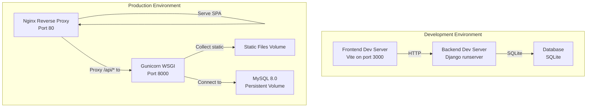
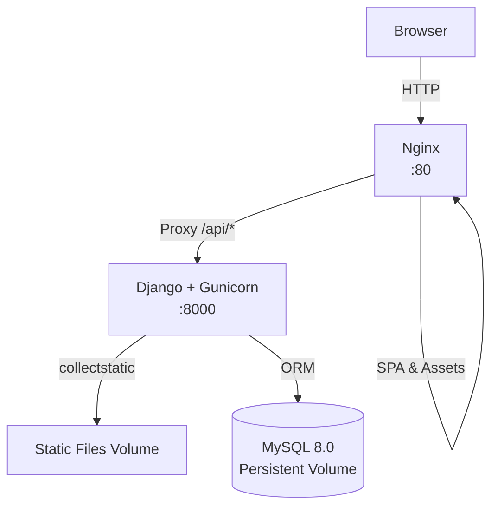
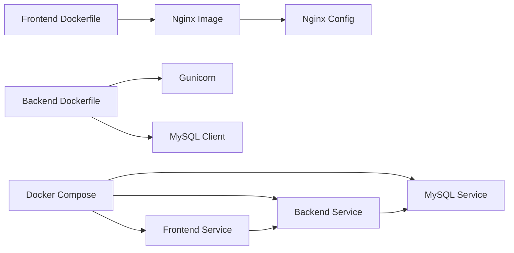

# Deployment & Operations

<cite>
**Referenced Files in This Document**
- [docker-compose.yml](file://docker-compose.yml)
- [backend/Dockerfile](file://backend/Dockerfile)
- [backend/confighub/settings.py](file://backend/confighub/settings.py)
- [backend/confighub/wsgi.py](file://backend/confighub/wsgi.py)
- [backend/manage.py](file://backend/manage.py)
- [backend/requirements.txt](file://backend/requirements.txt)
- [frontend/Dockerfile](file://frontend/Dockerfile)
- [frontend/nginx.conf](file://frontend/nginx.conf)
- [frontend/package.json](file://frontend/package.json)
- [frontend/vite.config.js](file://frontend/vite.config.js)
- [backend/config_type/migrations/0001_initial.py](file://backend/config_type/migrations/0001_initial.py)
- [backend/config_instance/migrations/0001_initial.py](file://backend/config_instance/migrations/0001_initial.py)
</cite>

## Table of Contents
1. [Introduction](#introduction)
2. [Project Structure](#project-structure)
3. [Core Components](#core-components)
4. [Architecture Overview](#architecture-overview)
5. [Detailed Component Analysis](#detailed-component-analysis)
6. [Dependency Analysis](#dependency-analysis)
7. [Performance Considerations](#performance-considerations)
8. [Troubleshooting Guide](#troubleshooting-guide)
9. [Conclusion](#conclusion)
10. [Appendices](#appendices)

## Introduction
This document provides comprehensive deployment and operations guidance for the AI-Ops Configuration Hub. It covers containerized deployment using Docker and Docker Compose for development and production environments, including Nginx reverse proxy configuration, Gunicorn WSGI server setup, static file serving, environment variable configuration, database setup (SQLite for development, MySQL for production), and security hardening practices. It also documents the production deployment workflow, health checks, logging configuration, monitoring setup, scaling considerations, load balancing strategies, disaster recovery procedures, troubleshooting, performance optimization, and maintenance procedures.

## Project Structure
The project is organized into three main parts:
- Backend: Django application with REST APIs, packaged with Gunicorn and served via Nginx in production.
- Frontend: Vue-based single-page application built with Vite and served by Nginx.
- Orchestration: Docker Compose defines services for database, backend, and frontend, with persistent volumes and health checks.

**Diagram sources**
- [docker-compose.yml:1-50](file://docker-compose.yml#L1-L50)
- [backend/Dockerfile:1-27](file://backend/Dockerfile#L1-L27)
- [frontend/Dockerfile:1-26](file://frontend/Dockerfile#L1-L26)
- [frontend/nginx.conf:1-26](file://frontend/nginx.conf#L1-L26)

**Section sources**
- [docker-compose.yml:1-50](file://docker-compose.yml#L1-L50)
- [backend/Dockerfile:1-27](file://backend/Dockerfile#L1-L27)
- [frontend/Dockerfile:1-26](file://frontend/Dockerfile#L1-L26)
- [frontend/nginx.conf:1-26](file://frontend/nginx.conf#L1-L26)

## Core Components
- Database
  - Development: SQLite managed by Django ORM.
  - Production: MySQL 8.0 configured via environment variables and health-checked.
- Backend
  - Django application served by Gunicorn with a fixed worker count.
  - Static files collected into a volume for efficient serving.
- Frontend
  - Built once and served by Nginx with SPA routing and long-lived caching for assets.
- Reverse Proxy
  - Nginx handles API proxying to the backend and serves static assets.

Key configuration touchpoints:
- Environment variables for database selection and credentials.
- Django settings controlling database engine, static files, and security flags.
- Gunicorn command-line arguments and worker configuration.
- Nginx proxy and caching directives.

**Section sources**
- [backend/confighub/settings.py:90-118](file://backend/confighub/settings.py#L90-L118)
- [backend/Dockerfile:22-26](file://backend/Dockerfile#L22-L26)
- [frontend/nginx.conf:12-24](file://frontend/nginx.conf#L12-L24)
- [docker-compose.yml:23-31](file://docker-compose.yml#L23-L31)

## Architecture Overview
The production stack consists of:
- Nginx reverse proxy listening on port 80, routing API requests to the backend and serving SPA static assets.
- Django backend served by Gunicorn on port 8000, collecting static files into a shared volume.
- MySQL 8.0 with persistent storage and health checks.
- Optional development mode using Django’s development server and SQLite.

**Diagram sources**
- [docker-compose.yml:3-46](file://docker-compose.yml#L3-L46)
- [backend/Dockerfile:19-20](file://backend/Dockerfile#L19-L20)
- [frontend/nginx.conf:12-24](file://frontend/nginx.conf#L12-L24)

## Detailed Component Analysis

### Database Configuration
- Engine selection
  - Environment variable controls engine: MySQL for production, SQLite for development.
- MySQL defaults
  - Credentials and database name set via environment variables.
  - Character set and SQL mode configured for strictness.
- SQLite fallback
  - Local file-based database for local development without external dependencies.

Operational notes:
- Health checks ensure MySQL readiness before backend startup.
- Persistent volumes protect against data loss across deployments.

**Section sources**
- [backend/confighub/settings.py:94-117](file://backend/confighub/settings.py#L94-L117)
- [docker-compose.yml:4-19](file://docker-compose.yml#L4-L19)
- [docker-compose.yml:23-31](file://docker-compose.yml#L23-L31)

### Backend Container (Django + Gunicorn)
- Base image and dependencies
  - Python slim image with system packages for MySQL client support.
- Static collection
  - Django static files are collected during build into a dedicated directory.
- Port exposure and runtime
  - Exposes port 8000; runs Gunicorn with a fixed worker count bound to 0.0.0.0:8000.

Environment variables:
- Database connection parameters and engine selection.
- Django secret key and debug flag.

**Section sources**
- [backend/Dockerfile:1-27](file://backend/Dockerfile#L1-L27)
- [backend/confighub/settings.py:23-29](file://backend/confighub/settings.py#L23-L29)
- [backend/confighub/settings.py:94-117](file://backend/confighub/settings.py#L94-L117)
- [docker-compose.yml:23-31](file://docker-compose.yml#L23-L31)

### Frontend Container (Nginx)
- Build pipeline
  - Node Alpine stage installs dependencies and builds the app.
  - Final stage copies built assets and Nginx configuration into an Nginx Alpine image.
- Nginx configuration
  - SPA routing support for deep links.
  - API proxy to backend on port 8000.
  - Long-term caching for static assets.

Ports and volumes:
- Exposes port 80.
- Depends on backend service availability.

**Section sources**
- [frontend/Dockerfile:1-26](file://frontend/Dockerfile#L1-L26)
- [frontend/nginx.conf:1-26](file://frontend/nginx.conf#L1-L26)
- [docker-compose.yml:40-46](file://docker-compose.yml#L40-L46)

### Reverse Proxy and API Gateway (Nginx)
- Proxy behavior
  - Routes API requests under /api/ to the backend service.
  - Passes client headers for upstream logging and tracing.
- SPA routing
  - Fallback to index.html for client-side routes.
- Asset caching
  - Sets far-future expiration and immutable cache-control for static assets.

**Section sources**
- [frontend/nginx.conf:7-24](file://frontend/nginx.conf#L7-L24)
- [docker-compose.yml:40-46](file://docker-compose.yml#L40-L46)

### Development vs Production Differences
- Development
  - Uses Django development server and SQLite by default.
  - Vite dev server on port 3000 proxies API to backend.
- Production
  - Uses Gunicorn and Nginx.
  - MySQL 8.0 with health checks and persistent storage.

**Section sources**
- [frontend/vite.config.js:6-14](file://frontend/vite.config.js#L6-L14)
- [backend/confighub/settings.py:94-117](file://backend/confighub/settings.py#L94-L117)
- [docker-compose.yml:1-50](file://docker-compose.yml#L1-L50)

## Dependency Analysis
- Internal dependencies
  - Backend depends on database connectivity and static file collection.
  - Frontend depends on backend being reachable for API calls.
- External dependencies
  - MySQL client libraries in backend image.
  - Nginx and Node ecosystems for containers.

**Diagram sources**
- [backend/Dockerfile:1-27](file://backend/Dockerfile#L1-L27)
- [frontend/Dockerfile:1-26](file://frontend/Dockerfile#L1-L26)
- [frontend/nginx.conf:1-26](file://frontend/nginx.conf#L1-L26)
- [docker-compose.yml:1-50](file://docker-compose.yml#L1-L50)

**Section sources**
- [backend/requirements.txt:1-8](file://backend/requirements.txt#L1-L8)
- [backend/Dockerfile:6-10](file://backend/Dockerfile#L6-L10)
- [frontend/Dockerfile:15-25](file://frontend/Dockerfile#L15-L25)
- [docker-compose.yml:1-50](file://docker-compose.yml#L1-L50)

## Performance Considerations
- Static asset delivery
  - Enable long-term caching and immutable cache-control for JS/CSS assets to reduce bandwidth and improve perceived latency.
- Worker sizing
  - Adjust Gunicorn worker count based on CPU cores and memory capacity. Monitor response times and concurrency.
- Database tuning
  - Use MySQL 8.0 with appropriate buffer pool and connection limits. Consider read replicas for heavy read workloads.
- Caching
  - Introduce CDN for static assets and consider application-level caching for frequently accessed API responses.
- Network and TLS
  - Terminate TLS at Nginx and enable HTTP/2. Configure keep-alive and compression.
- Monitoring and profiling
  - Instrument Gunicorn and Django to track throughput, latency, and error rates.

[No sources needed since this section provides general guidance]

## Troubleshooting Guide
Common deployment issues and resolutions:
- Backend fails to start due to database unavailability
  - Verify MySQL health checks pass and credentials match environment variables.
  - Confirm the backend waits for the database to be healthy before starting.
- API requests return errors
  - Check Nginx proxy configuration and backend port binding.
  - Validate CORS and allowed hosts settings in Django.
- Static assets not loading
  - Ensure static files are collected and served from the mounted volume.
  - Confirm Nginx root and index directives align with the built output.
- SPA route failures after refresh
  - Verify Nginx try_files directive supports client-side routing.
- Health checks failing
  - Inspect MySQL command-line options and network connectivity between services.

**Section sources**
- [docker-compose.yml:16-19](file://docker-compose.yml#L16-L19)
- [docker-compose.yml:32-34](file://docker-compose.yml#L32-L34)
- [frontend/nginx.conf:7-18](file://frontend/nginx.conf#L7-L18)
- [backend/Dockerfile:19-20](file://backend/Dockerfile#L19-L20)
- [backend/confighub/settings.py:29-29](file://backend/confighub/settings.py#L29-L29)

## Conclusion
The AI-Ops Configuration Hub provides a straightforward, container-first deployment model using Docker and Docker Compose. The production stack leverages Nginx for reverse proxying and static delivery, Gunicorn for WSGI hosting, and MySQL for persistence. By following the environment variable configuration, health checks, and security hardening practices outlined here, teams can reliably deploy, operate, scale, and recover the platform across development and production environments.

[No sources needed since this section summarizes without analyzing specific files]

## Appendices

### Environment Variables Reference
- Database selection and connection
  - DB_ENGINE: selects database engine (e.g., mysql8 for MySQL).
  - DB_NAME, DB_USER, DB_PASSWORD, DB_HOST, DB_PORT: MySQL connection parameters.
- Django runtime
  - DJANGO_SECRET_KEY: cryptographic key for signing cookies and tokens.
  - DJANGO_DEBUG: toggles debug mode.

Security and operational notes:
- Change the default secret key in production.
- Restrict ALLOWED_HOSTS in production to domain names.
- Disable DEBUG in production.

**Section sources**
- [backend/confighub/settings.py:23-29](file://backend/confighub/settings.py#L23-L29)
- [backend/confighub/settings.py:94-117](file://backend/confighub/settings.py#L94-L117)
- [docker-compose.yml:23-31](file://docker-compose.yml#L23-L31)

### Database Initialization and Migrations
- Initial schema creation
  - Migrations define the configuration type and instance models with constraints and indexes.
- Applying migrations
  - Use Django management commands to apply migrations against the selected database.

**Section sources**
- [backend/config_type/migrations/0001_initial.py:14-31](file://backend/config_type/migrations/0001_initial.py#L14-L31)
- [backend/config_instance/migrations/0001_initial.py:18-37](file://backend/config_instance/migrations/0001_initial.py#L18-L37)
- [backend/manage.py:7-18](file://backend/manage.py#L7-L18)

### Development Workflow
- Frontend development
  - Use Vite dev server on port 3000 with proxy to backend API.
- Backend development
  - Use Django development server with SQLite by default.
- Database
  - SQLite is sufficient for local development without external dependencies.

**Section sources**
- [frontend/vite.config.js:6-14](file://frontend/vite.config.js#L6-L14)
- [backend/confighub/settings.py:94-117](file://backend/confighub/settings.py#L94-L117)

### Production Deployment Workflow
- Prerequisites
  - Set secure environment variables for secrets and database credentials.
  - Prepare persistent volumes for MySQL and static files.
- Steps
  - Start services with Docker Compose.
  - Wait for database health checks to pass.
  - Collect static files and confirm Nginx serves assets.
  - Validate API proxying and SPA routing.
- Post-deployment
  - Configure TLS termination at Nginx.
  - Set up monitoring and alerting for services and database.
  - Back up MySQL data regularly.

**Section sources**
- [docker-compose.yml:1-50](file://docker-compose.yml#L1-L50)
- [backend/Dockerfile:19-20](file://backend/Dockerfile#L19-L20)
- [frontend/nginx.conf:12-24](file://frontend/nginx.conf#L12-L24)

### Scaling and Load Balancing
- Horizontal scaling
  - Scale Gunicorn workers per CPU core and memory headroom.
  - Use multiple backend instances behind a load balancer.
- Load balancing strategies
  - Layer 7 load balancing at Nginx for sticky sessions if needed; otherwise round-robin for stateless APIs.
- Stateless design
  - Keep sessions and stateless where possible; rely on database for shared state.

[No sources needed since this section provides general guidance]

### Disaster Recovery Procedures
- Backup strategy
  - Regularly back up MySQL data and static files volume snapshots.
- Restore procedure
  - Restore database from backups and re-run migrations if schema changed.
  - Re-deploy containers and verify health checks and API responses.
- Testing
  - Periodically test restores in a staging environment.

[No sources needed since this section provides general guidance]