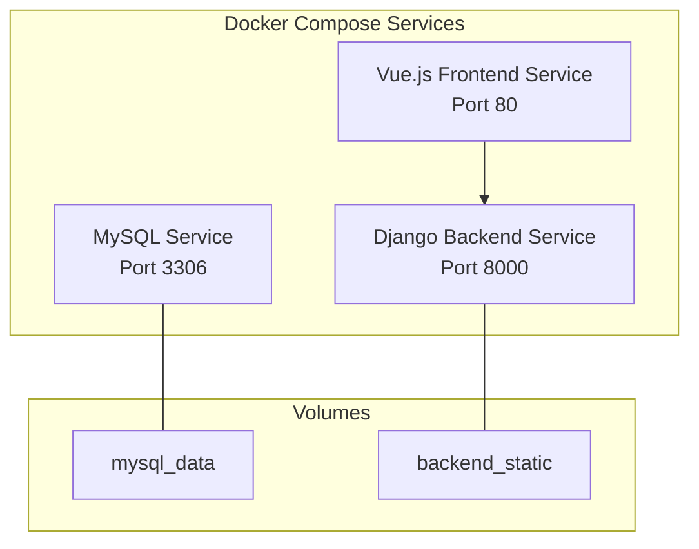
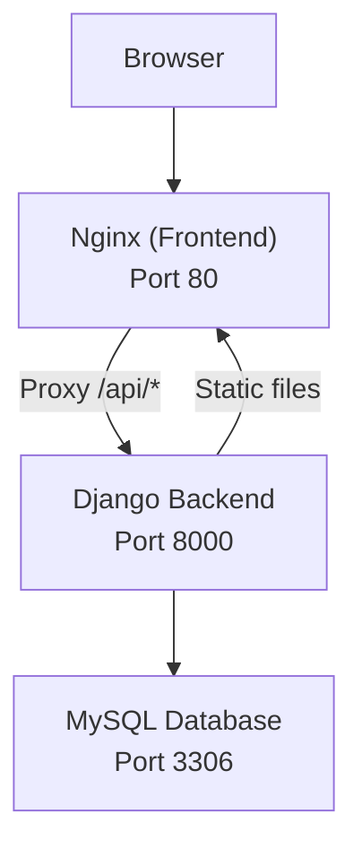
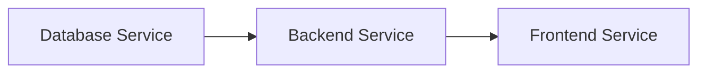

# Development Environment Setup

<cite>
**Referenced Files in This Document**
- [docker-compose.yml](file://docker-compose.yml)
- [backend/Dockerfile](file://backend/Dockerfile)
- [frontend/Dockerfile](file://frontend/Dockerfile)
- [backend/confighub/settings.py](file://backend/confighub/settings.py)
- [frontend/vite.config.js](file://frontend/vite.config.js)
- [backend/requirements.txt](file://backend/requirements.txt)
- [frontend/package.json](file://frontend/package.json)
- [frontend/nginx.conf](file://frontend/nginx.conf)
- [backend/manage.py](file://backend/manage.py)
- [backend/config_type/migrations/0001_initial.py](file://backend/config_type/migrations/0001_initial.py)
- [backend/config_instance/migrations/0001_initial.py](file://backend/config_instance/migrations/0001_initial.py)
- [backend/audit/migrations/0001_initial.py](file://backend/audit/migrations/0001_initial.py)
</cite>

## Table of Contents
1. [Introduction](#introduction)
2. [Project Structure](#project-structure)
3. [Core Components](#core-components)
4. [Architecture Overview](#architecture-overview)
5. [Detailed Component Analysis](#detailed-component-analysis)
6. [Dependency Analysis](#dependency-analysis)
7. [Performance Considerations](#performance-considerations)
8. [Troubleshooting Guide](#troubleshooting-guide)
9. [Conclusion](#conclusion)
10. [Appendices](#appendices)

## Introduction
This document provides end-to-end guidance for setting up the AI-Ops Configuration Hub development environment using Docker Compose. It covers service composition, environment variables, database configuration, static asset handling, and development server setup for both the Django backend and Vue.js frontend. It also includes first-time setup steps, common development commands, debugging tips, and local security considerations.

## Project Structure
The repository is organized into three main parts:
- Backend: Django application with REST APIs, packaged in a Python slim image and served via Gunicorn.
- Frontend: Vue.js single-page application built with Vite and served via Nginx.
- Infrastructure: Docker Compose orchestrating MySQL, backend, and frontend services with persistent volumes and health checks.

**Diagram sources**
- [docker-compose.yml:3-49](file://docker-compose.yml#L3-L49)

**Section sources**
- [docker-compose.yml:1-50](file://docker-compose.yml#L1-L50)

## Core Components
- Database service: MySQL 8.0 configured with health checks and persistent storage.
- Backend service: Django app built from the backend directory, exposing port 8000 and collecting static assets during build.
- Frontend service: Nginx serving a compiled Vue.js SPA with API proxying to the backend.

Key environment variables and ports:
- Backend environment variables include database connection settings and Django runtime flags.
- Port mappings expose MySQL (3306), Django (8000), and Nginx (80).

**Section sources**
- [docker-compose.yml:4-45](file://docker-compose.yml#L4-L45)
- [backend/Dockerfile:1-27](file://backend/Dockerfile#L1-L27)
- [frontend/Dockerfile:1-26](file://frontend/Dockerfile#L1-L26)

## Architecture Overview
The development stack runs three containers orchestrated by Docker Compose:
- MySQL holds the application data with a dedicated volume.
- Django backend exposes APIs and static assets.
- Nginx serves the frontend and proxies API requests to the backend.

**Diagram sources**
- [docker-compose.yml:3-49](file://docker-compose.yml#L3-L49)
- [frontend/nginx.conf:12-18](file://frontend/nginx.conf#L12-L18)

## Detailed Component Analysis

### Database Service (MySQL)
- Image: MySQL 8.0 with explicit authentication plugin.
- Environment variables: root password, database name, user, and password.
- Health check: uses mysqladmin ping to verify readiness.
- Persistence: named volume for MySQL data directory.
- Port exposure: host 3306 mapped to container 3306.

Operational notes:
- The backend reads database credentials from environment variables and selects the MySQL engine when DB_ENGINE equals a specific value.
- SQLite fallback is available when DB_ENGINE is not set to the MySQL engine.

**Section sources**
- [docker-compose.yml:4-19](file://docker-compose.yml#L4-L19)
- [backend/confighub/settings.py:94-117](file://backend/confighub/settings.py#L94-L117)

### Backend Service (Django)
- Build context: backend directory.
- Environment variables:
  - DB_ENGINE: selects MySQL engine.
  - DB_NAME, DB_USER, DB_PASSWORD, DB_HOST, DB_PORT: database connection details.
  - DJANGO_SECRET_KEY: Django secret key.
  - DJANGO_DEBUG: controls debug mode.
- Dependencies: waits for the database service to become healthy.
- Static assets: collects static files during build and persists them via a named volume.
- Port exposure: host 8000 mapped to container 8000.
- Runtime: Gunicorn with multiple workers.

Development server alternatives:
- While the production container runs Gunicorn, local development can use Django’s development server by overriding the CMD in the backend service or by running Django locally outside Docker.

**Section sources**
- [docker-compose.yml:21-38](file://docker-compose.yml#L21-L38)
- [backend/Dockerfile:25-26](file://backend/Dockerfile#L25-L26)
- [backend/confighub/settings.py:23-29](file://backend/confighub/settings.py#L23-L29)

### Frontend Service (Vue.js + Nginx)
- Build context: frontend directory.
- Multi-stage build:
  - Builder stage: Node.js Alpine with npm install and build.
  - Production stage: Nginx Alpine serving the built SPA.
- Nginx configuration:
  - Serves static assets from /usr/share/nginx/html.
  - Proxies API requests under /api/ to the backend service.
  - Enables HTML5 history mode for client-side routing.
- Port exposure: host 80 mapped to container 80.

Local development:
- The frontend uses Vite for development with a proxy targeting the backend on port 8000.
- The Dockerized frontend is intended for production-like builds; local iteration often uses the Vite dev server.

**Section sources**
- [frontend/Dockerfile:1-26](file://frontend/Dockerfile#L1-L26)
- [frontend/nginx.conf:12-18](file://frontend/nginx.conf#L12-L18)
- [frontend/vite.config.js:6-14](file://frontend/vite.config.js#L6-L14)

### Development Server Setup

#### Django Backend Development
- Use Django’s development server locally by invoking the manage.py entry point with appropriate environment variables.
- The settings module is set via the environment variable for manage.py.
- Debug mode and allowed hosts are controlled by environment variables.

Recommended local invocation:
- Set environment variables matching the compose file (DB_ENGINE, DB_NAME, DB_USER, DB_PASSWORD, DB_HOST, DB_PORT, DJANGO_SECRET_KEY, DJANGO_DEBUG).
- Run the Django development server using the manage.py entry point.

**Section sources**
- [backend/manage.py:9](file://backend/manage.py#L9)
- [backend/confighub/settings.py:23-29](file://backend/confighub/settings.py#L23-L29)

#### Vue.js Frontend Development
- Use Vite’s development server on port 3000 with proxy configuration to the backend.
- The proxy forwards /api/ requests to http://localhost:8000.
- Install dependencies from the frontend package manifest and run the dev script.

**Section sources**
- [frontend/vite.config.js:6-14](file://frontend/vite.config.js#L6-L14)
- [frontend/package.json:6-10](file://frontend/package.json#L6-L10)

### Hot Reload and Development Workflow
- Frontend hot reload: Vite dev server automatically refreshes the browser on file changes.
- Backend hot reload: Django’s development server supports automatic restarts on code changes.
- Database persistence: MySQL data remains intact across container restarts.

Note: The Dockerized backend collects static assets at build time; for local development, consider mounting the backend directory to enable live reload of static files.

**Section sources**
- [frontend/vite.config.js:6-14](file://frontend/vite.config.js#L6-L14)
- [backend/Dockerfile:19-20](file://backend/Dockerfile#L19-L20)

### Environment Variables Reference
- Backend variables:
  - DB_ENGINE: selects MySQL engine.
  - DB_NAME, DB_USER, DB_PASSWORD, DB_HOST, DB_PORT: database connection details.
  - DJANGO_SECRET_KEY: Django secret key.
  - DJANGO_DEBUG: enables debug mode.
- Frontend variables:
  - None required at runtime; relies on Vite dev server and proxy configuration.

**Section sources**
- [docker-compose.yml:23-31](file://docker-compose.yml#L23-L31)
- [backend/confighub/settings.py:94-117](file://backend/confighub/settings.py#L94-L117)

### Database Setup and Initial Data Seeding
- Database engine selection:
  - MySQL: selected when DB_ENGINE equals the configured value.
  - SQLite: fallback when DB_ENGINE is not set to the MySQL engine.
- Initial migrations:
  - The repository includes initial migration files for ConfigType, ConfigInstance, and AuditLog models.
  - These migrations define the schema for configuration types, instances, and audit logs.
- Applying migrations:
  - Use Django’s migrate command after connecting to the database.
  - The backend Dockerfile collects static assets during build; for local development, run migrations and collectstatic manually.

**Section sources**
- [backend/confighub/settings.py:94-117](file://backend/confighub/settings.py#L94-L117)
- [backend/config_type/migrations/0001_initial.py:14-31](file://backend/config_type/migrations/0001_initial.py#L14-L31)
- [backend/config_instance/migrations/0001_initial.py:18-37](file://backend/config_instance/migrations/0001_initial.py#L18-L37)
- [backend/audit/migrations/0001_initial.py:17-34](file://backend/audit/migrations/0001_initial.py#L17-L34)

### First-Time Setup Instructions
1. Prerequisites
   - Docker and Docker Compose installed on your machine.
2. Start the stack
   - Bring up the services defined in the compose file.
3. Initialize the database
   - Apply Django migrations to create tables.
   - Collect static files if running locally.
4. Access the application
   - Frontend: http://localhost
   - Backend API: http://localhost/api/ (proxied by Nginx)
   - Django admin: http://localhost/admin/ (when enabled)

Optional: For local development, run the Django development server and Vite dev server separately with the environment variables shown in the compose file.

**Section sources**
- [docker-compose.yml:3-49](file://docker-compose.yml#L3-L49)
- [backend/confighub/settings.py:94-117](file://backend/confighub/settings.py#L94-L117)

### Common Development Commands
- Start services: bring up the stack with compose.
- Rebuild images: rebuild backend and frontend images after code changes.
- View logs: inspect logs for any service to troubleshoot startup or runtime issues.
- Apply migrations: run Django migrations against the database.
- Collect static files: gather static assets for the backend.
- Frontend development: run the Vite dev server on port 3000 with proxy to the backend.

**Section sources**
- [frontend/package.json:6-10](file://frontend/package.json#L6-L10)
- [backend/Dockerfile:19-20](file://backend/Dockerfile#L19-L20)

### Debugging Techniques
- Health checks: verify the database health check passes before starting the backend.
- Logs: inspect service logs to diagnose startup failures or runtime errors.
- Network connectivity: ensure the backend can reach the database hostname and port.
- Proxy configuration: confirm the frontend proxy forwards /api/ requests to the backend.
- Static files: when running locally, ensure static files are collected and served correctly.

**Section sources**
- [docker-compose.yml:16-19](file://docker-compose.yml#L16-L19)
- [frontend/nginx.conf:12-18](file://frontend/nginx.conf#L12-L18)

### Security Considerations
- Development defaults:
  - Django debug mode is disabled in the compose file but can be toggled via environment variables.
  - Allowed hosts are permissive in development settings.
- Production hardening:
  - Change the Django secret key before deploying to production.
  - Restrict ALLOWED_HOSTS and disable debug mode in production.
  - Use HTTPS and secure cookies in production environments.

**Section sources**
- [docker-compose.yml:30-31](file://docker-compose.yml#L30-L31)
- [backend/confighub/settings.py:23-29](file://backend/confighub/settings.py#L23-L29)

## Dependency Analysis
The services depend on each other as follows:
- Backend depends on the database being healthy.
- Frontend depends on the backend being reachable.

**Diagram sources**
- [docker-compose.yml:32-43](file://docker-compose.yml#L32-L43)

**Section sources**
- [docker-compose.yml:32-43](file://docker-compose.yml#L32-L43)

## Performance Considerations
- Use SQLite for local development to avoid network overhead.
- Enable caching and compression in production via Nginx.
- Keep static assets optimized and cached appropriately.
- Monitor database connections and tune worker counts for the backend.

[No sources needed since this section provides general guidance]

## Troubleshooting Guide
- Database not ready
  - Confirm the health check passes and the backend waits for the database to be healthy.
- Backend cannot connect to database
  - Verify DB_HOST, DB_PORT, DB_NAME, DB_USER, and DB_PASSWORD match the database service configuration.
- Frontend cannot reach API
  - Ensure the proxy target matches the backend service name and port.
- Static files missing
  - Run collectstatic in the backend or mount the backend directory for live reloading.

**Section sources**
- [docker-compose.yml:16-19](file://docker-compose.yml#L16-L19)
- [docker-compose.yml:32-34](file://docker-compose.yml#L32-L34)
- [frontend/nginx.conf:12-18](file://frontend/nginx.conf#L12-L18)

## Conclusion
The AI-Ops Configuration Hub provides a containerized development environment with clear separation of concerns between the database, backend, and frontend. By leveraging Docker Compose, environment variables, and the provided configuration files, developers can quickly stand up a reproducible local environment, iterate efficiently with hot reload, and maintain security hygiene during development.

## Appendices

### Appendix A: Backend Container Build Details
- Base image: Python 3.11 slim.
- System dependencies: compiler and MariaDB client headers for MySQL client.
- Static collection: performed at build time.
- Runtime: Gunicorn with multiple workers.

**Section sources**
- [backend/Dockerfile:1-27](file://backend/Dockerfile#L1-L27)

### Appendix B: Frontend Container Build Details
- Multi-stage build: Node.js builder stage followed by Nginx production stage.
- Build artifacts: Vue.js SPA output placed in /usr/share/nginx/html.
- Nginx configuration: API proxy and SPA routing support.

**Section sources**
- [frontend/Dockerfile:1-26](file://frontend/Dockerfile#L1-L26)
- [frontend/nginx.conf:12-18](file://frontend/nginx.conf#L12-L18)

### Appendix C: Requirements and Scripts
- Backend requirements include Django, DRF, CORS headers, gunicorn, and MySQL client.
- Frontend scripts include dev, build, and preview commands.

**Section sources**
- [backend/requirements.txt:1-8](file://backend/requirements.txt#L1-L8)
- [frontend/package.json:6-10](file://frontend/package.json#L6-L10)