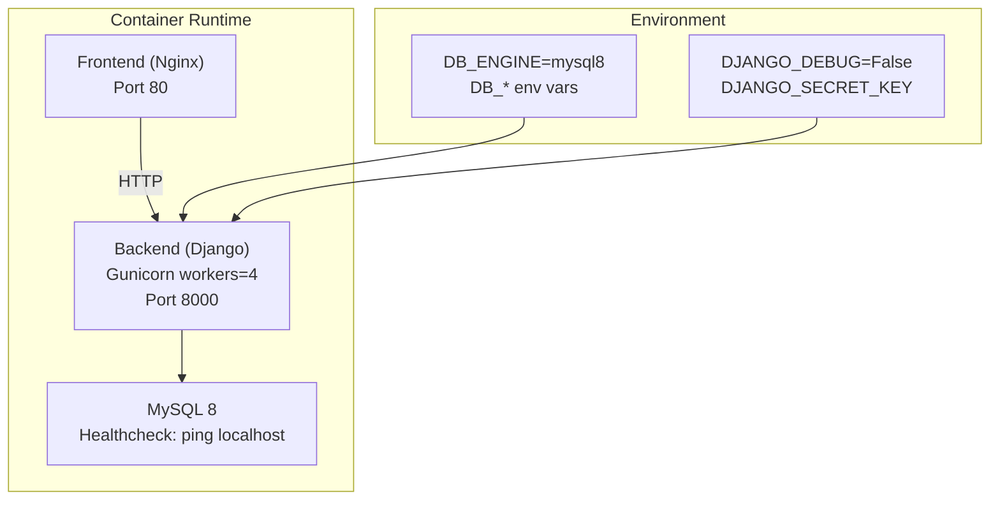
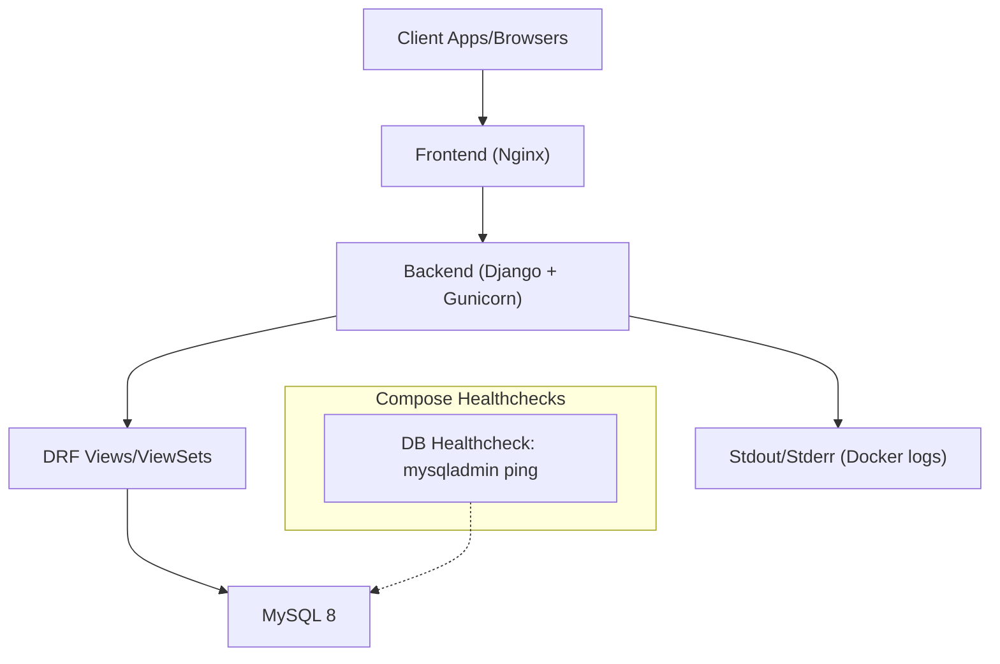
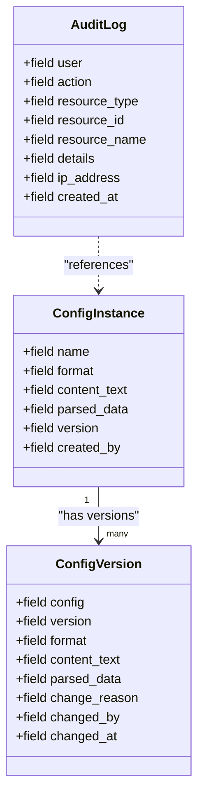
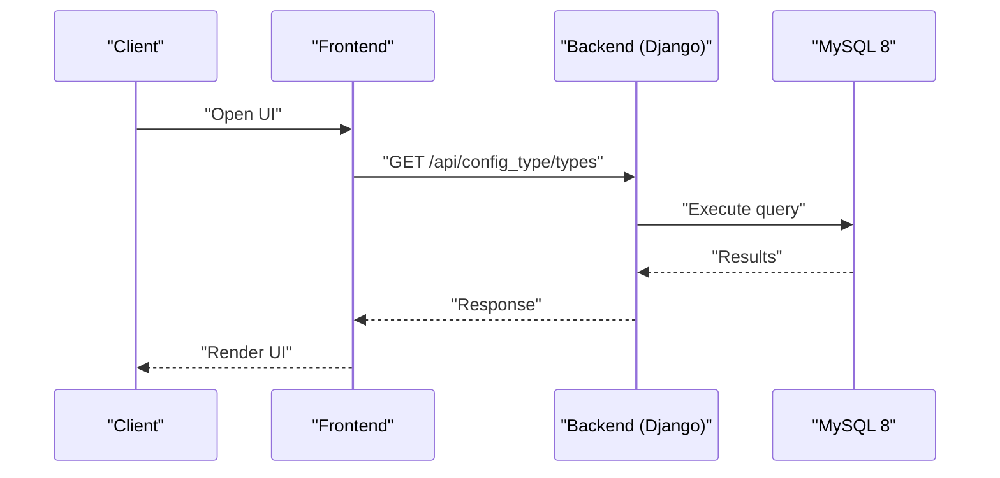
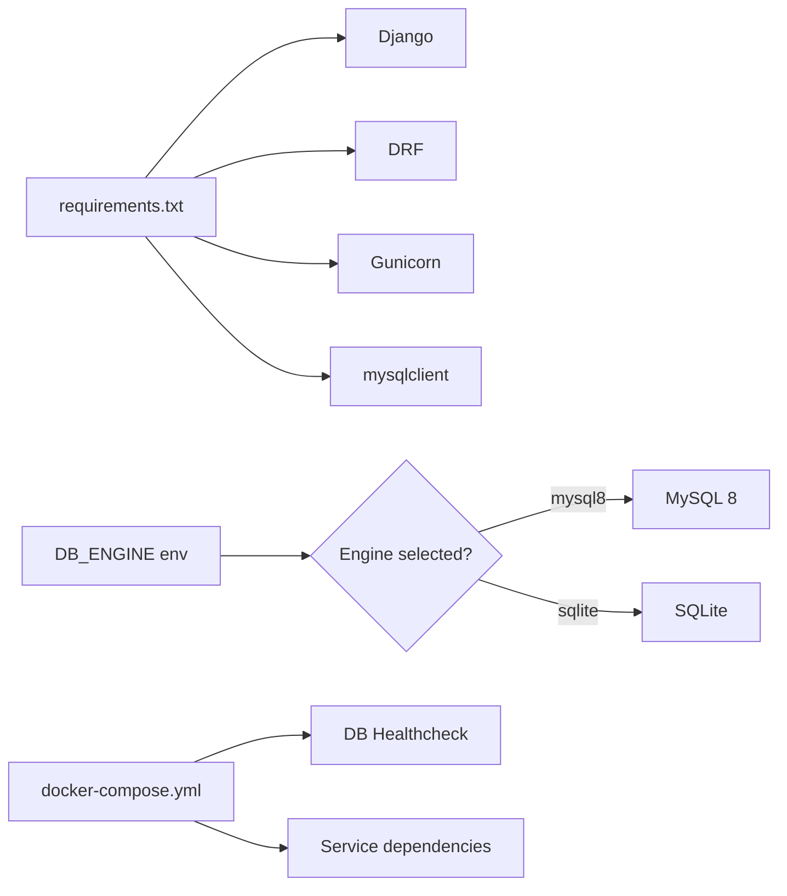

# Monitoring and Logging

<cite>
**Referenced Files in This Document**
- [settings.py](file://backend/confighub/settings.py)
- [Dockerfile](file://backend/Dockerfile)
- [docker-compose.yml](file://docker-compose.yml)
- [wsgi.py](file://backend/confighub/wsgi.py)
- [asgi.py](file://backend/confighub/asgi.py)
- [urls.py](file://backend/confighub/urls.py)
- [requirements.txt](file://backend/requirements.txt)
- [views.py](file://backend/config_instance/views.py)
- [models.py](file://backend/audit/models.py)
- [models.py](file://backend/versioning/models.py)
- [Home.vue](file://frontend/src/views/Home.vue)
</cite>

## Table of Contents
1. [Introduction](#introduction)
2. [Project Structure](#project-structure)
3. [Core Components](#core-components)
4. [Architecture Overview](#architecture-overview)
5. [Detailed Component Analysis](#detailed-component-analysis)
6. [Dependency Analysis](#dependency-analysis)
7. [Performance Considerations](#performance-considerations)
8. [Troubleshooting Guide](#troubleshooting-guide)
9. [Conclusion](#conclusion)
10. [Appendices](#appendices)

## Introduction
This document provides comprehensive monitoring and logging guidance for the AI-Ops Configuration Hub. It covers application logging configuration, container logging, health checks, performance monitoring, alerting, distributed tracing, dashboards, and troubleshooting workflows. The guidance is grounded in the repository’s current configuration and implementation.

## Project Structure
The system consists of:
- Backend service built with Django and Django REST Framework, served via Gunicorn.
- Frontend built with Vue.js and Element Plus, served by Nginx in the provided compose stack.
- A MySQL 8 database managed by Docker Compose with health checks.
- Container orchestration via Docker Compose with explicit health checks and environment configuration.

**Diagram sources**
- [docker-compose.yml:1-50](file://docker-compose.yml#L1-L50)
- [Dockerfile:1-27](file://backend/Dockerfile#L1-L27)
- [settings.py:94-117](file://backend/confighub/settings.py#L94-L117)

**Section sources**
- [docker-compose.yml:1-50](file://docker-compose.yml#L1-L50)
- [Dockerfile:1-27](file://backend/Dockerfile#L1-L27)
- [settings.py:94-117](file://backend/confighub/settings.py#L94-L117)

## Core Components
- Django application settings define database selection, static assets, and CORS/permissions for APIs.
- WSGI/ASGI applications expose the Django app for Gunicorn.
- REST endpoints are registered under a base API path.
- Views implement CRUD operations and versioning/audit actions.
- Audit and versioning models persist operational history and changes.

Key implementation references:
- Database engine selection and connection parameters
- Static asset collection and serving
- REST framework pagination and permissions
- ViewSet actions for versions and rollbacks

**Section sources**
- [settings.py:94-117](file://backend/confighub/settings.py#L94-L117)
- [settings.py:152-156](file://backend/confighub/settings.py#L152-L156)
- [settings.py:33-39](file://backend/confighub/settings.py#L33-L39)
- [wsgi.py:10-16](file://backend/confighub/wsgi.py#L10-L16)
- [asgi.py:10-16](file://backend/confighub/asgi.py#L10-L16)
- [urls.py:20-24](file://backend/confighub/urls.py#L20-L24)
- [views.py:11-149](file://backend/config_instance/views.py#L11-L149)
- [models.py:5-30](file://backend/audit/models.py#L5-L30)
- [models.py:5-22](file://backend/versioning/models.py#L5-L22)

## Architecture Overview
The monitoring and logging architecture integrates container-level observability with application-level telemetry and auditing.

**Diagram sources**
- [docker-compose.yml:16-19](file://docker-compose.yml#L16-L19)
- [Dockerfile:25-26](file://backend/Dockerfile#L25-L26)
- [settings.py:96-117](file://backend/confighub/settings.py#L96-L117)

## Detailed Component Analysis

### Application Logging Configuration
- Log destinations: The backend runs Gunicorn and emits logs to stdout/stderr, which Docker captures automatically.
- Log levels: Not explicitly configured in the repository; defaults apply. Production-grade deployments should set explicit log levels and handlers.
- Structured logging: No structured logging configuration is present; consider adding JSON formatters for easier parsing.
- Log rotation: No rotation configuration is present; configure Docker logging driver policies or host-level logrotate.

Operational references:
- Gunicorn invocation and port binding
- Environment variables controlling debug and secrets

Recommendations:
- Set explicit log level via environment variables or a dedicated logging configuration file.
- Add JSON formatter to capture timestamps, severity, module, and correlation IDs.
- Configure Docker logging driver with rotation policies (e.g., json-file with max-size and max-file).

**Section sources**
- [Dockerfile:25-26](file://backend/Dockerfile#L25-L26)
- [settings.py](file://backend/confighub/settings.py#L27)
- [settings.py:23-24](file://backend/confighub/settings.py#L23-L24)

### Container Logging with Docker
- Backend container uses Gunicorn and exposes logs to stdout/stderr.
- Frontend container is defined but does not include an explicit Nginx configuration file in the provided paths; ensure Nginx is configured to emit access/error logs to stdout/stderr for Docker to capture them.
- Healthcheck for the database service uses a ping command; this enables Compose to report readiness.

Recommendations:
- Verify Nginx access/error logs are directed to stdout/stderr in the frontend container.
- Configure Docker logging driver with rotation and size limits.
- Centralize container logs using a logging agent or platform-native logging.

**Section sources**
- [Dockerfile:25-26](file://backend/Dockerfile#L25-L26)
- [docker-compose.yml:40-45](file://docker-compose.yml#L40-L45)
- [docker-compose.yml:16-19](file://docker-compose.yml#L16-L19)

### Health Checks and Database Connectivity
- Database healthcheck uses a ping command against localhost with a timeout and retry policy.
- Backend depends on the database being healthy before starting.
- Frontend depends on the backend being reachable.

Recommendations:
- Add application-level health endpoints (e.g., readiness/liveness) to complement container healthchecks.
- Include database connectivity checks in application health endpoints.

**Section sources**
- [docker-compose.yml:16-19](file://docker-compose.yml#L16-L19)
- [docker-compose.yml:32-34](file://docker-compose.yml#L32-L34)
- [docker-compose.yml:42-43](file://docker-compose.yml#L42-L43)

### Performance Monitoring
- Current repository does not include application metrics, database query performance instrumentation, or resource utilization tracking.
- To implement performance monitoring:
  - Expose Prometheus metrics from the Django application.
  - Instrument database queries and track slow queries.
  - Track CPU/memory usage via OS-level metrics or process-level exporters.

[No sources needed since this section provides general guidance]

### Alerting Configuration
- No alerting configuration is present in the repository.
- Recommended thresholds and triggers:
  - Backend response latency p95 > threshold.
  - Error rate > threshold per minute.
  - Database connection failures or slow query counts.
  - Container restarts or healthcheck failures.
  - Disk usage > threshold.

[No sources needed since this section provides general guidance]

### Distributed Tracing
- No tracing configuration is present in the repository.
- Recommended approach:
  - Integrate a tracing library (e.g., OpenTelemetry) to propagate trace IDs across requests.
  - Export traces to a tracing backend (e.g., Jaeger, Tempo).

[No sources needed since this section provides general guidance]

### Monitoring Dashboards (Grafana/Prometheus)
- No dashboards or metrics configuration is present in the repository.
- Recommended setup:
  - Scrape Prometheus metrics from the backend.
  - Visualize database performance, request rates, errors, and resource utilization.
  - Add alert rules for critical thresholds.

[No sources needed since this section provides general guidance]

### Log Aggregation and Centralized Logging
- No centralized logging configuration is present in the repository.
- Recommended approach:
  - Ship container logs to a log aggregator (e.g., ELK/EFK, Loki/Grafana stack).
  - Parse and enrich logs with correlation IDs and service metadata.

[No sources needed since this section provides general guidance]

### Audit and Versioning for Operational Visibility
The system maintains audit logs and version history for configuration changes, enabling postmortem analysis and compliance visibility.

**Diagram sources**
- [models.py:5-30](file://backend/audit/models.py#L5-L30)
- [models.py:5-22](file://backend/versioning/models.py#L5-L22)

**Section sources**
- [models.py:5-30](file://backend/audit/models.py#L5-L30)
- [models.py:5-22](file://backend/versioning/models.py#L5-L22)
- [views.py:36-90](file://backend/config_instance/views.py#L36-L90)

### API Workflows and Request Flow Tracking
The backend exposes REST endpoints under a base API path. Requests flow from the frontend to the backend, which interacts with the database and audit/versioning models.

**Diagram sources**
- [urls.py:20-24](file://backend/confighub/urls.py#L20-L24)
- [settings.py:96-117](file://backend/confighub/settings.py#L96-L117)

**Section sources**
- [urls.py:20-24](file://backend/confighub/urls.py#L20-L24)
- [settings.py:96-117](file://backend/confighub/settings.py#L96-L117)

### Database Connectivity and External Dependencies Monitoring
- Database engine selection supports SQLite or MySQL 8.
- MySQL 8 is configured with health checks and environment variables for credentials and host/port.
- Frontend depends on backend availability.

Recommendations:
- Add application-level database connectivity checks in health endpoints.
- Monitor external dependency health (e.g., database, storage) via metrics and alerts.

**Section sources**
- [settings.py:94-117](file://backend/confighub/settings.py#L94-L117)
- [docker-compose.yml:4-19](file://docker-compose.yml#L4-L19)
- [docker-compose.yml:42-43](file://docker-compose.yml#L42-L43)

### Frontend System Status Indicators
The frontend displays system status indicators for API server, database, storage, and version. These can serve as manual health indicators during development or basic operational awareness.

**Section sources**
- [Home.vue:83-130](file://frontend/src/views/Home.vue#L83-L130)

## Dependency Analysis
- Backend depends on Django, DRF, Gunicorn, and MySQL client libraries.
- Database selection is controlled by environment variables.
- Frontend depends on backend endpoints; container orchestration enforces service dependencies and health conditions.

**Diagram sources**
- [requirements.txt:1-8](file://backend/requirements.txt#L1-L8)
- [settings.py:94-117](file://backend/confighub/settings.py#L94-L117)
- [docker-compose.yml:1-50](file://docker-compose.yml#L1-L50)

**Section sources**
- [requirements.txt:1-8](file://backend/requirements.txt#L1-L8)
- [settings.py:94-117](file://backend/confighub/settings.py#L94-L117)
- [docker-compose.yml:1-50](file://docker-compose.yml#L1-L50)

## Performance Considerations
- Database engine choice affects performance characteristics; MySQL 8 offers advanced features suitable for production.
- Gunicorn workers are configured in the Dockerfile; adjust worker count based on CPU cores and workload.
- Static assets are collected and served; ensure caching headers and CDN usage for optimal delivery.
- Consider adding database query profiling and slow query logging for performance tuning.

[No sources needed since this section provides general guidance]

## Troubleshooting Guide
Common issues and resolutions based on repository configuration:

- Backend fails to start due to database unavailability:
  - Verify database healthcheck passes and environment variables are set correctly.
  - Confirm backend depends_on health condition in Compose.

- Database connectivity errors:
  - Check DB_ENGINE and DB_* environment variables.
  - Validate network connectivity between backend and database containers.

- Frontend cannot reach backend:
  - Ensure backend port is exposed and mapped.
  - Confirm frontend depends_on backend in Compose.

- Logs not appearing in centralized system:
  - Ensure container logs are emitted to stdout/stderr.
  - Configure Docker logging driver or deploy a log shipper.

- Audit/version data missing:
  - Confirm audit and versioning models are migrated and accessible.
  - Review view actions that create audit/version records.

**Section sources**
- [docker-compose.yml:23-34](file://docker-compose.yml#L23-L34)
- [docker-compose.yml:16-19](file://docker-compose.yml#L16-L19)
- [settings.py:94-117](file://backend/confighub/settings.py#L94-L117)
- [views.py:52-90](file://backend/config_instance/views.py#L52-L90)
- [models.py:5-30](file://backend/audit/models.py#L5-L30)
- [models.py:5-22](file://backend/versioning/models.py#L5-L22)

## Conclusion
The AI-Ops Configuration Hub provides a solid foundation for monitoring and logging through container healthchecks, stdout logging, and operational models for audit and versioning. To achieve comprehensive observability, integrate application metrics, structured logging, centralized log aggregation, distributed tracing, and alerting. The recommendations in this document offer practical steps to enhance visibility and reliability.

## Appendices
- Deployment checklist:
  - Set production-safe environment variables (DEBUG, SECRET_KEY).
  - Configure Docker logging driver with rotation.
  - Add application health endpoints and metrics.
  - Deploy centralized logging and tracing.
  - Define alerting rules for critical thresholds.

[No sources needed since this section provides general guidance]