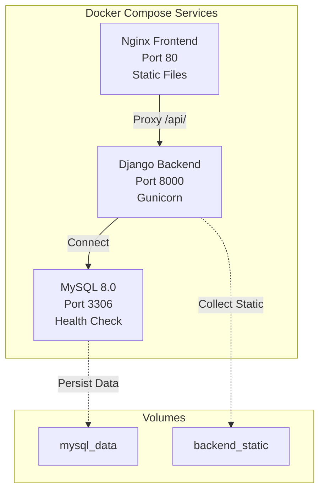
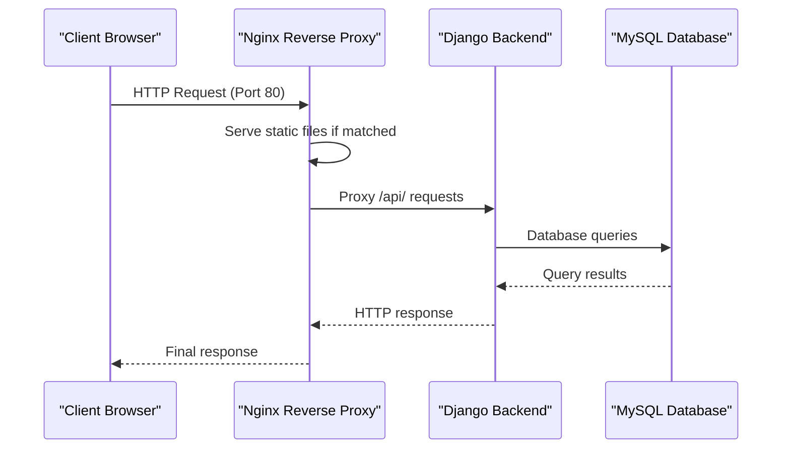
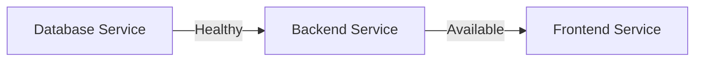

# Production Deployment Configuration

<cite>
**Referenced Files in This Document**
- [docker-compose.yml](file://docker-compose.yml)
- [backend/Dockerfile](file://backend/Dockerfile)
- [frontend/Dockerfile](file://frontend/Dockerfile)
- [frontend/nginx.conf](file://frontend/nginx.conf)
- [backend/confighub/settings.py](file://backend/confighub/settings.py)
- [backend/confighub/wsgi.py](file://backend/confighub/wsgi.py)
- [backend/confighub/asgi.py](file://backend/confighub/asgi.py)
- [backend/requirements.txt](file://backend/requirements.txt)
- [backend/manage.py](file://backend/manage.py)
</cite>

## Table of Contents
1. [Introduction](#introduction)
2. [Project Structure](#project-structure)
3. [Core Components](#core-components)
4. [Architecture Overview](#architecture-overview)
5. [Detailed Component Analysis](#detailed-component-analysis)
6. [Dependency Analysis](#dependency-analysis)
7. [Performance Considerations](#performance-considerations)
8. [Security Hardening](#security-hardening)
9. [Environment Management](#environment-management)
10. [Database Configuration](#database-configuration)
11. [Reverse Proxy Configuration](#reverse-proxy-configuration)
12. [Application Server Configuration](#application-server-configuration)
13. [Deployment Checklist](#deployment-checklist)
14. [Conclusion](#conclusion)

## Introduction
This document provides comprehensive production deployment configuration guidance for the AI-Ops Configuration Hub. It covers Docker Compose setup, service definitions, resource considerations, security hardening, reverse proxy configuration with Nginx, Django application server configuration with Gunicorn, optional ASGI server setup, database configuration for MySQL, and environment variable management for production secrets.

## Project Structure
The deployment consists of three primary services orchestrated via Docker Compose:
- Database service (MySQL 8.0) with persistent volume and health checks
- Backend service (Django) built with Python 3.11 slim, exposing port 8000
- Frontend service (Nginx) serving static assets and proxying API requests to the backend

**Diagram sources**
- [docker-compose.yml:3-49](file://docker-compose.yml#L3-L49)
- [backend/Dockerfile:1-27](file://backend/Dockerfile#L1-L27)
- [frontend/Dockerfile:1-26](file://frontend/Dockerfile#L1-L26)

**Section sources**
- [docker-compose.yml:1-50](file://docker-compose.yml#L1-L50)

## Core Components
- Database service configured with MySQL 8.0, health checking, and persistent storage
- Backend service using Gunicorn as the WSGI server with static file collection
- Frontend service using Nginx for static file serving and API proxying

Key production considerations:
- Environment variables for database credentials and Django configuration
- Health checks for reliable startup sequencing
- Volume mounts for persistence and static asset sharing

**Section sources**
- [docker-compose.yml:4-38](file://docker-compose.yml#L4-L38)
- [backend/Dockerfile:25-26](file://backend/Dockerfile#L25-L26)
- [frontend/Dockerfile:15-25](file://frontend/Dockerfile#L15-L25)

## Architecture Overview
The production architecture follows a reverse proxy pattern:
- Nginx handles inbound HTTP traffic, serves static assets, and proxies API requests to the Django backend
- Django runs under Gunicorn as the WSGI server
- MySQL serves as the primary datastore with health checks and persistent volumes

**Diagram sources**
- [frontend/nginx.conf:13-18](file://frontend/nginx.conf#L13-L18)
- [backend/Dockerfile](file://backend/Dockerfile#L26)
- [docker-compose.yml:21-38](file://docker-compose.yml#L21-L38)

## Detailed Component Analysis

### Database Service (MySQL)
- Image: mysql:8.0 with explicit authentication plugin
- Environment variables for root password, database name, user, and password
- Health check using mysqladmin ping
- Persistent volume for data durability
- Port exposure for connectivity

Production recommendations:
- Change default root password and application user passwords
- Configure backup schedules and retention policies
- Set up replication for high availability if needed

**Section sources**
- [docker-compose.yml:4-19](file://docker-compose.yml#L4-L19)

### Backend Service (Django with Gunicorn)
- Built on Python 3.11 slim with system dependencies for MariaDB/MySQL
- Installs Python dependencies from requirements.txt
- Collects static files during build
- Exposes port 8000
- Runs Gunicorn with 4 workers bound to 0.0.0.0:8000

Optimization considerations:
- Adjust worker count based on CPU cores and memory
- Configure timeout settings for long-running requests
- Enable graceful shutdown and reload mechanisms

**Section sources**
- [backend/Dockerfile:1-27](file://backend/Dockerfile#L1-L27)
- [backend/requirements.txt:1-8](file://backend/requirements.txt#L1-L8)

### Frontend Service (Nginx)
- Multi-stage build: Node for building, Nginx for serving
- Copies built assets to /usr/share/nginx/html
- Uses custom nginx.conf for routing and proxying
- Exposes port 80

Key configuration highlights:
- API proxying from /api/ to backend:8000
- Static asset caching with far-future expires
- SPA routing support with try_files

**Section sources**
- [frontend/Dockerfile:1-26](file://frontend/Dockerfile#L1-L26)
- [frontend/nginx.conf:1-26](file://frontend/nginx.conf#L1-L26)

## Dependency Analysis
The services have clear dependency relationships:
- Frontend depends on backend being available
- Backend depends on database health

**Diagram sources**
- [docker-compose.yml:32-43](file://docker-compose.yml#L32-L43)

**Section sources**
- [docker-compose.yml:32-43](file://docker-compose.yml#L32-L43)

## Performance Considerations
- Worker scaling: Adjust Gunicorn worker count based on CPU cores and memory capacity
- Connection pooling: Configure Django database OPTIONS for connection pooling
- Static asset optimization: Leverage Nginx caching headers and compression
- Health checks: Use compose healthchecks to ensure readiness before traffic routing

## Security Hardening
Current security posture and recommendations:
- Django settings allow all hosts and broad CORS origins in development mode
- Production should restrict ALLOWED_HOSTS and tighten CORS policy
- Environment variables for secrets should be managed externally (e.g., Docker secrets or external secret manager)
- Disable DEBUG mode in production and set a strong SECRET_KEY

Recommended adjustments:
- Restrict ALLOWED_HOSTS to production domain(s)
- Configure CORS_ALLOW_ALL_ORIGINS to False and specify allowed origins
- Enforce HTTPS and secure headers in production deployments

**Section sources**
- [backend/confighub/settings.py:29-39](file://backend/confighub/settings.py#L29-L39)
- [docker-compose.yml:30-31](file://docker-compose.yml#L30-L31)

## Environment Management
Environment variables currently used:
- Database: DB_ENGINE, DB_NAME, DB_USER, DB_PASSWORD, DB_HOST, DB_PORT
- Django: DJANGO_SECRET_KEY, DJANGO_DEBUG

Production best practices:
- Externalize secrets using Docker secrets or environment files
- Use separate environment files for different environments
- Rotate secrets regularly and maintain audit logs

**Section sources**
- [docker-compose.yml:23-31](file://docker-compose.yml#L23-L31)
- [backend/confighub/settings.py:23-27](file://backend/confighub/settings.py#L23-L27)

## Database Configuration
Django database configuration supports MySQL 8.0:
- Engine selection via DB_ENGINE environment variable
- UTF8MB4 charset and strict SQL mode initialization
- Connection parameters from environment variables

Production enhancements:
- Add connection pooling configuration in Django OPTIONS
- Configure read replicas and failover strategies
- Implement automated backups with point-in-time recovery

**Section sources**
- [backend/confighub/settings.py:94-117](file://backend/confighub/settings.py#L94-L117)

## Reverse Proxy Configuration
Nginx configuration for production:
- Listen on port 80 with server_name localhost
- Serve static assets from /usr/share/nginx/html
- Proxy API requests from /api/ to backend:8000
- Apply cache headers for static assets
- Enable SPA routing fallback

Recommendations:
- Add SSL/TLS termination with certificate management
- Implement rate limiting and request size limits
- Add security headers and HSTS for HTTPS deployments

**Section sources**
- [frontend/nginx.conf:1-26](file://frontend/nginx.conf#L1-L26)

## Application Server Configuration
Gunicorn configuration in production:
- Bind address 0.0.0.0:8000
- Worker processes set to 4
- Static file collection during container build

Optimization guidelines:
- Tune workers based on CPU cores: typically (2 × cores) + 1
- Set timeout values appropriate for request patterns
- Enable keepalive and adjust backlog settings
- Use process management with restart signals

**Section sources**
- [backend/Dockerfile:25-26](file://backend/Dockerfile#L25-L26)

## ASGI Server Configuration
The Django project includes ASGI configuration but is not currently used in production. If real-time features are required:
- Configure ASGI application in deployment
- Use an ASGI server like Daphne or Uvicorn
- Scale WebSocket connections separately from HTTP workers

Current ASGI setup:
- ASGI application loaded from Django core
- No dedicated ASGI service in compose

**Section sources**
- [backend/confighub/asgi.py:1-17](file://backend/confighub/asgi.py#L1-L17)

## Deployment Checklist
- [ ] Replace default database and Django secrets with strong, unique values
- [ ] Configure production ALLOWED_HOSTS and CORS settings
- [ ] Set DJANGO_DEBUG to False in production
- [ ] Implement SSL/TLS termination with valid certificates
- [ ] Configure database backup and recovery procedures
- [ ] Set up monitoring and logging for all services
- [ ] Validate health checks and readiness probes
- [ ] Test horizontal scaling and load balancing setup

## Conclusion
The current deployment provides a solid foundation for development and staging environments. For production, focus on tightening security configurations, implementing proper secrets management, adding SSL/TLS termination, configuring robust database backup strategies, and optimizing performance through proper worker scaling and connection pooling. The modular Docker Compose setup allows for easy scaling and maintenance while ensuring consistent deployments across environments.