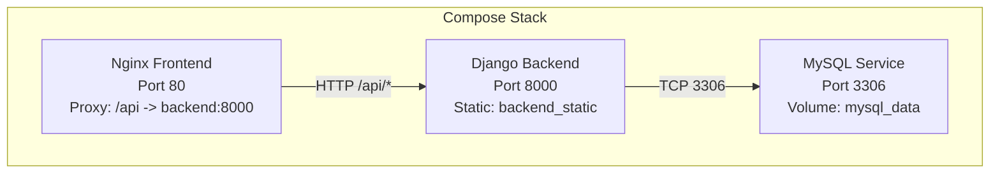
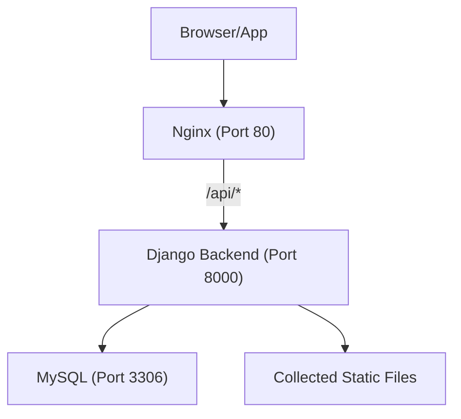
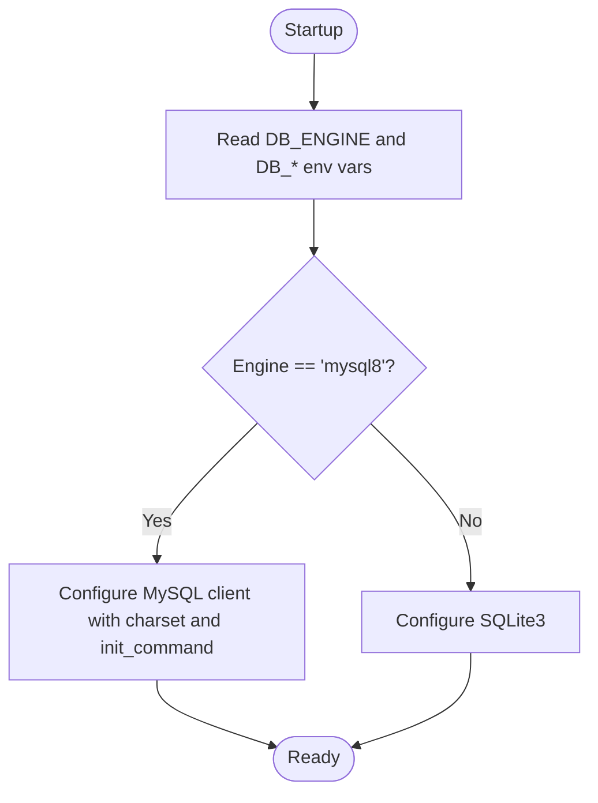
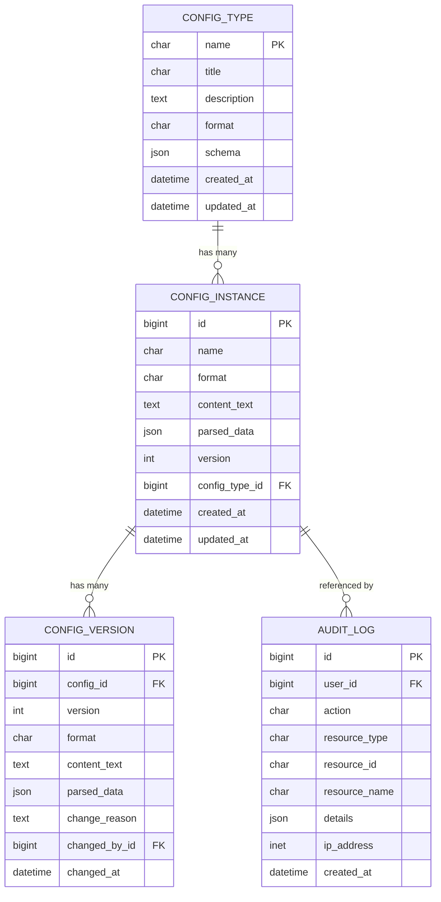
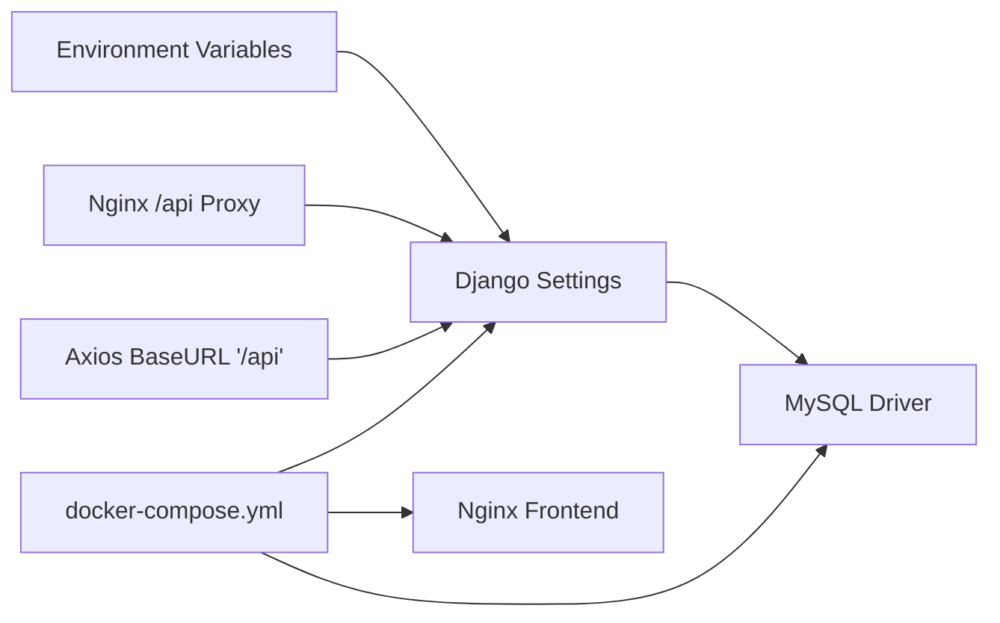
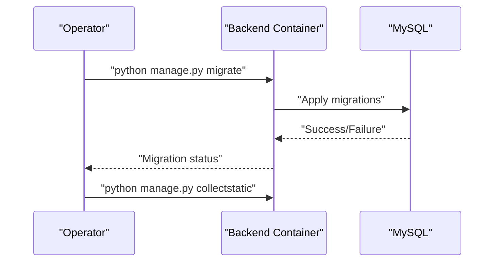

# Troubleshooting and Maintenance

<cite>
**Referenced Files in This Document**
- [docker-compose.yml](file://docker-compose.yml)
- [backend/Dockerfile](file://backend/Dockerfile)
- [frontend/Dockerfile](file://frontend/Dockerfile)
- [backend/confighub/settings.py](file://backend/confighub/settings.py)
- [backend/confighub/urls.py](file://backend/confighub/urls.py)
- [backend/manage.py](file://backend/manage.py)
- [backend/requirements.txt](file://backend/requirements.txt)
- [frontend/src/api/config.js](file://frontend/src/api/config.js)
- [frontend/vite.config.js](file://frontend/vite.config.js)
- [frontend/nginx.conf](file://frontend/nginx.conf)
- [backend/config_type/models.py](file://backend/config_type/models.py)
- [backend/config_instance/models.py](file://backend/config_instance/models.py)
- [backend/versioning/models.py](file://backend/versioning/models.py)
- [backend/audit/models.py](file://backend/audit/models.py)
- [backend/config_type/migrations/0001_initial.py](file://backend/config_type/migrations/0001_initial.py)
</cite>

## Table of Contents
1. [Introduction](#introduction)
2. [Project Structure](#project-structure)
3. [Core Components](#core-components)
4. [Architecture Overview](#architecture-overview)
5. [Detailed Component Analysis](#detailed-component-analysis)
6. [Dependency Analysis](#dependency-analysis)
7. [Performance Considerations](#performance-considerations)
8. [Troubleshooting Guide](#troubleshooting-guide)
9. [Maintenance Procedures](#maintenance-procedures)
10. [Backup and Restore](#backup-and-restore)
11. [Emergency Procedures](#emergency-procedures)
12. [Conclusion](#conclusion)

## Introduction
This document provides comprehensive troubleshooting and maintenance guidance for the AI-Ops Configuration Hub. It covers deployment issues, backend API and frontend build problems, container networking, database connectivity, performance tuning, maintenance procedures (migrations, updates, patches), backups/restores, and emergency operations including rollbacks and disaster recovery. The goal is to enable reliable operation and rapid recovery for both development and production environments.

## Project Structure
The system is a two-service stack orchestrated via Docker Compose:
- Database service (MySQL 8.0) with persistent volume and health checks
- Backend service (Django + Gunicorn) exposing port 8000
- Frontend service (Nginx static site with API proxy) exposing port 80

**Diagram sources**
- [docker-compose.yml:1-50](file://docker-compose.yml#L1-L50)

**Section sources**
- [docker-compose.yml:1-50](file://docker-compose.yml#L1-L50)

## Core Components
- Backend
  - Django application with REST framework and CORS enabled
  - Database selection via environment variables (MySQL or SQLite)
  - Static files collected for production serving
  - WSGI entrypoint configured for Gunicorn workers
- Frontend
  - NPM/Vite build pipeline producing a static site
  - Nginx serving static assets with SPA routing fallback
  - API proxy configured to forward /api requests to backend
- Database
  - MySQL 8.0 with strict SQL mode and UTF-8MB4 charset
  - Health check using mysqladmin ping
  - Persistent storage via named volume

**Section sources**
- [backend/confighub/settings.py:90-118](file://backend/confighub/settings.py#L90-L118)
- [backend/Dockerfile:1-27](file://backend/Dockerfile#L1-L27)
- [frontend/Dockerfile:1-26](file://frontend/Dockerfile#L1-L26)
- [docker-compose.yml:4-19](file://docker-compose.yml#L4-L19)

## Architecture Overview
High-level runtime flow:
- Clients connect to Nginx on port 80
- Nginx proxies API requests under /api to backend on port 8000
- Backend connects to MySQL on port 3306 using configured credentials
- Backend serves static assets and responds to API requests

**Diagram sources**
- [frontend/nginx.conf:1-26](file://frontend/nginx.conf#L1-L26)
- [backend/Dockerfile:22-26](file://backend/Dockerfile#L22-L26)
- [docker-compose.yml:4-19](file://docker-compose.yml#L4-L19)

## Detailed Component Analysis

### Backend: Django Settings and Database Configuration
Key operational aspects:
- Database engine selection via environment variable
- MySQL configuration with charset and strict SQL mode
- SQLite fallback for local development
- Static files collection and serving
- CORS and REST framework defaults

**Diagram sources**
- [backend/confighub/settings.py:94-117](file://backend/confighub/settings.py#L94-L117)

**Section sources**
- [backend/confighub/settings.py:90-118](file://backend/confighub/settings.py#L90-L118)

### Backend: URL Routing and API Surface
- Admin at /admin/
- API endpoints under /api/ routed to app-specific URL patterns
- Centralized routing aggregates app endpoints

**Section sources**
- [backend/confighub/urls.py:20-24](file://backend/confighub/urls.py#L20-L24)

### Frontend: API Client and Proxy Configuration
- Axios base URL set to /api
- Vue/Vite dev server proxies /api to backend on port 8000
- Nginx production proxy forwards /api to backend container

**Section sources**
- [frontend/src/api/config.js:3-9](file://frontend/src/api/config.js#L3-L9)
- [frontend/vite.config.js:6-14](file://frontend/vite.config.js#L6-L14)
- [frontend/nginx.conf:12-18](file://frontend/nginx.conf#L12-L18)

### Data Models and Migrations
- ConfigType defines configuration type metadata and schema
- ConfigInstance stores raw content, parsed JSON, and maintains version history
- Versioning tracks historical snapshots per instance
- Audit captures user actions and resources affected

**Diagram sources**
- [backend/config_type/models.py:4-24](file://backend/config_type/models.py#L4-L24)
- [backend/config_instance/models.py:7-35](file://backend/config_instance/models.py#L7-L35)
- [backend/versioning/models.py:5-22](file://backend/versioning/models.py#L5-L22)
- [backend/audit/models.py:5-30](file://backend/audit/models.py#L5-L30)

**Section sources**
- [backend/config_type/models.py:1-25](file://backend/config_type/models.py#L1-L25)
- [backend/config_instance/models.py:1-69](file://backend/config_instance/models.py#L1-L69)
- [backend/versioning/models.py:1-23](file://backend/versioning/models.py#L1-L23)
- [backend/audit/models.py:1-31](file://backend/audit/models.py#L1-L31)
- [backend/config_type/migrations/0001_initial.py:14-31](file://backend/config_type/migrations/0001_initial.py#L14-L31)

## Dependency Analysis
- Backend depends on:
  - Database driver matching MySQL client requirement
  - Environment variables for database and Django configuration
- Frontend depends on:
  - Nginx proxy configuration to reach backend
  - Axios base URL aligned with backend route prefix
- Docker Compose orchestrates:
  - Health checks for database readiness
  - Service dependencies and port exposure

**Diagram sources**
- [backend/confighub/settings.py:94-117](file://backend/confighub/settings.py#L94-L117)
- [frontend/nginx.conf:12-18](file://frontend/nginx.conf#L12-L18)
- [frontend/src/api/config.js:3-9](file://frontend/src/api/config.js#L3-L9)
- [docker-compose.yml:21-45](file://docker-compose.yml#L21-L45)

**Section sources**
- [backend/requirements.txt:1-8](file://backend/requirements.txt#L1-L8)
- [backend/confighub/settings.py:94-117](file://backend/confighub/settings.py#L94-L117)
- [frontend/nginx.conf:12-18](file://frontend/nginx.conf#L12-L18)
- [frontend/src/api/config.js:3-9](file://frontend/src/api/config.js#L3-L9)
- [docker-compose.yml:21-45](file://docker-compose.yml#L21-L45)

## Performance Considerations
- Database
  - Use MySQL with UTF-8MB4 and strict SQL mode for data integrity
  - Monitor slow queries and index usage; ensure appropriate indexes on frequently filtered fields
- Backend
  - Tune Gunicorn worker count and timeouts based on CPU and memory capacity
  - Enable connection pooling for database clients
  - Monitor static file serving and cache headers
- Frontend
  - Leverage Nginx caching for JS/CSS assets
  - Minimize payload sizes and avoid unnecessary re-renders
- Observability
  - Enable Django logging and consider structured logs
  - Use metrics and tracing for API latency and error rates

[No sources needed since this section provides general guidance]

## Troubleshooting Guide

### Container Startup Failures
Common symptoms:
- Backend exits immediately or fails health checks
- Frontend returns 502/504 for API calls
- Database container restarts continuously

Checklist:
- Verify environment variables for database connectivity and Django secret key
- Confirm database health check passes and port 3306 is reachable
- Review backend logs for import errors or missing dependencies
- Ensure static collection completes during backend build

Operational steps:
- Inspect service logs for the failing component
- Validate compose dependency order and health checks
- Rebuild images after fixing environment mismatches

**Section sources**
- [docker-compose.yml:21-45](file://docker-compose.yml#L21-L45)
- [backend/Dockerfile:12-20](file://backend/Dockerfile#L12-L20)
- [backend/confighub/settings.py:23-27](file://backend/confighub/settings.py#L23-L27)

### Database Connection Problems
Symptoms:
- Backend reports database connection refused or authentication failure
- Django migrations fail with connection errors

Checklist:
- Confirm DB_HOST and DB_PORT match compose network
- Verify credentials and database name align with compose environment
- Ensure MySQL is healthy and accepting connections
- Check charset and init_command compatibility

Resolution:
- Adjust environment variables to match database service
- Recreate database service if health checks fail
- Run migrations after confirming connectivity

**Section sources**
- [docker-compose.yml:24-29](file://docker-compose.yml#L24-L29)
- [backend/confighub/settings.py:96-117](file://backend/confighub/settings.py#L96-L117)

### Service Communication Errors
Symptoms:
- Frontend receives 404/502 for /api endpoints
- Nginx cannot proxy requests to backend

Checklist:
- Confirm Nginx proxy_pass targets backend:8000
- Validate backend exposes port 8000 and is reachable from frontend network
- Ensure backend is healthy and responding to HTTP requests

Resolution:
- Fix Nginx proxy configuration if host/port mismatch exists
- Restart backend and frontend after correcting configuration

**Section sources**
- [frontend/nginx.conf:12-18](file://frontend/nginx.conf#L12-L18)
- [docker-compose.yml:37-45](file://docker-compose.yml#L37-L45)

### Backend API Issues
Symptoms:
- 500 errors on API endpoints
- Authentication or permission errors
- Slow response times

Checklist:
- Review Django logs for exceptions
- Verify REST framework pagination and permissions
- Check CORS settings for cross-origin requests
- Validate static file serving and collectstatic completion

Resolution:
- Apply migrations and ensure database is up-to-date
- Adjust pagination and permissions as needed
- Confirm static files are served from the correct path

**Section sources**
- [backend/confighub/settings.py:33-39](file://backend/confighub/settings.py#L33-L39)
- [backend/confighub/settings.py:151-156](file://backend/confighub/settings.py#L151-L156)
- [backend/Dockerfile:19-20](file://backend/Dockerfile#L19-L20)

### Frontend Build Problems
Symptoms:
- Dev server cannot proxy /api to backend
- Production Nginx returns 404 for SPA routes

Checklist:
- Confirm Vite dev server proxy target matches backend port
- Validate Nginx try_files directive for SPA routing
- Ensure build artifacts are generated and served by Nginx

Resolution:
- Correct Vite proxy target and restart dev server
- Verify Nginx configuration and mounted dist directory

**Section sources**
- [frontend/vite.config.js:6-14](file://frontend/vite.config.js#L6-L14)
- [frontend/nginx.conf:7-10](file://frontend/nginx.conf#L7-L10)

### Container Networking Challenges
Symptoms:
- Containers cannot resolve service names
- Port conflicts on host

Checklist:
- Use service names as hostnames within the compose network
- Avoid port conflicts by adjusting exposed ports
- Confirm depends_on conditions and health checks

Resolution:
- Align DNS resolution with compose service names
- Change host ports or remove conflicts

**Section sources**
- [docker-compose.yml:32-34](file://docker-compose.yml#L32-L34)
- [docker-compose.yml:13-14](file://docker-compose.yml#L13-L14)

## Maintenance Procedures

### Database Migrations
- Prepare environment variables for database connectivity
- Run Django migrations inside the backend container
- Collect static files after migrations

**Diagram sources**
- [backend/manage.py:7-18](file://backend/manage.py#L7-L18)
- [backend/Dockerfile:19-20](file://backend/Dockerfile#L19-L20)

**Section sources**
- [backend/manage.py:7-18](file://backend/manage.py#L7-L18)
- [backend/Dockerfile:19-20](file://backend/Dockerfile#L19-L20)

### Application Updates
- Update requirements and rebuild backend image
- Recreate containers after image changes
- Validate API and UI after rollout

**Section sources**
- [backend/requirements.txt:1-8](file://backend/requirements.txt#L1-L8)
- [backend/Dockerfile:12-14](file://backend/Dockerfile#L12-L14)

### Security Patches
- Pin dependency versions and monitor advisories
- Rotate DJANGO_SECRET_KEY and database credentials
- Enforce ALLOWED_HOSTS and HTTPS in production

**Section sources**
- [backend/confighub/settings.py:23-29](file://backend/confighub/settings.py#L23-L29)
- [backend/confighub/settings.py:157-158](file://backend/confighub/settings.py#L157-L158)

## Backup and Restore

### Database Backups
- Use logical backups (mysqldump) for point-in-time recovery
- Store backups in a durable location outside the container
- Schedule periodic automated backups

### Configuration Data Preservation
- Preserve static asset volume for UI consistency
- Back up any application-specific configuration files

### Restore Procedure
- Stop services and restore database from backup
- Recreate containers and re-run migrations if schema changed
- Verify API and UI availability post-restore

**Section sources**
- [docker-compose.yml:11-12](file://docker-compose.yml#L11-L12)
- [docker-compose.yml:35-36](file://docker-compose.yml#L35-L36)

## Emergency Procedures

### System Failure Recovery
- Identify failing service via health checks and logs
- Isolate database issues and restore from backups
- Rollback application to last known good image/tag

### Rollback Strategy
- Tag and promote known-good images
- Downgrade dependencies if necessary
- Re-run migrations down to previous schema

### Disaster Recovery
- Maintain offsite backups and documented restore steps
- Test DR procedures periodically
- Establish RTO/RPO targets and monitoring alerts

[No sources needed since this section provides general guidance]

## Conclusion
By following the troubleshooting workflows, maintenance procedures, and emergency protocols outlined here, operators can maintain a reliable AI-Ops Configuration Hub. Regular monitoring, adherence to backup and update schedules, and documented recovery steps are essential for minimizing downtime and ensuring data integrity.