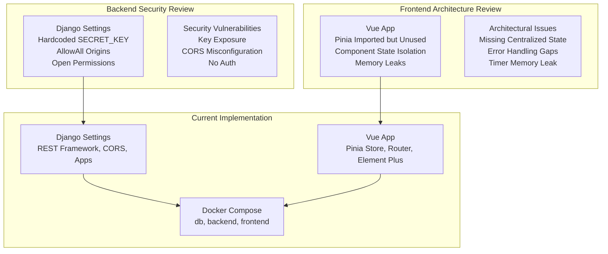
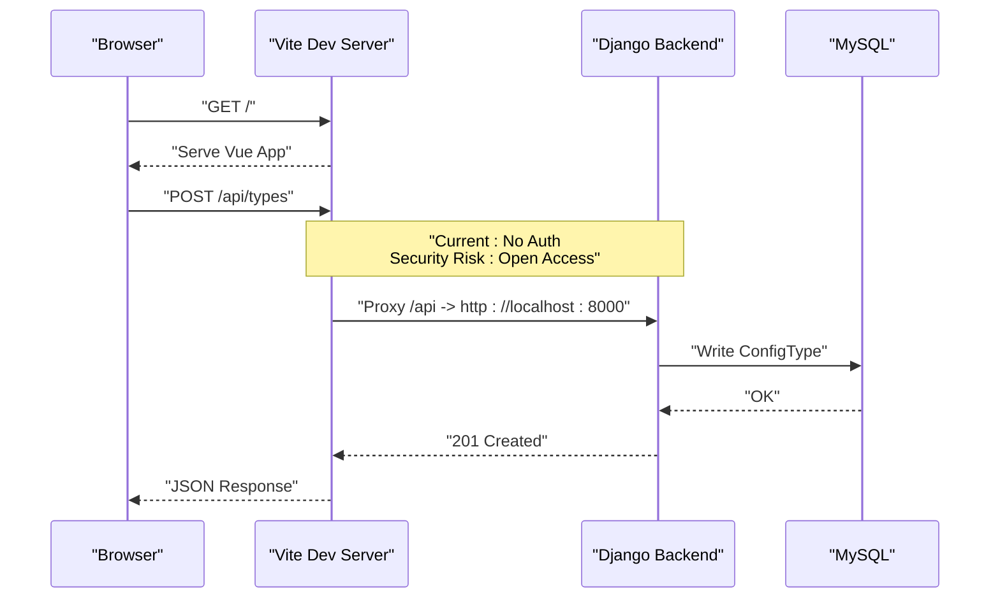
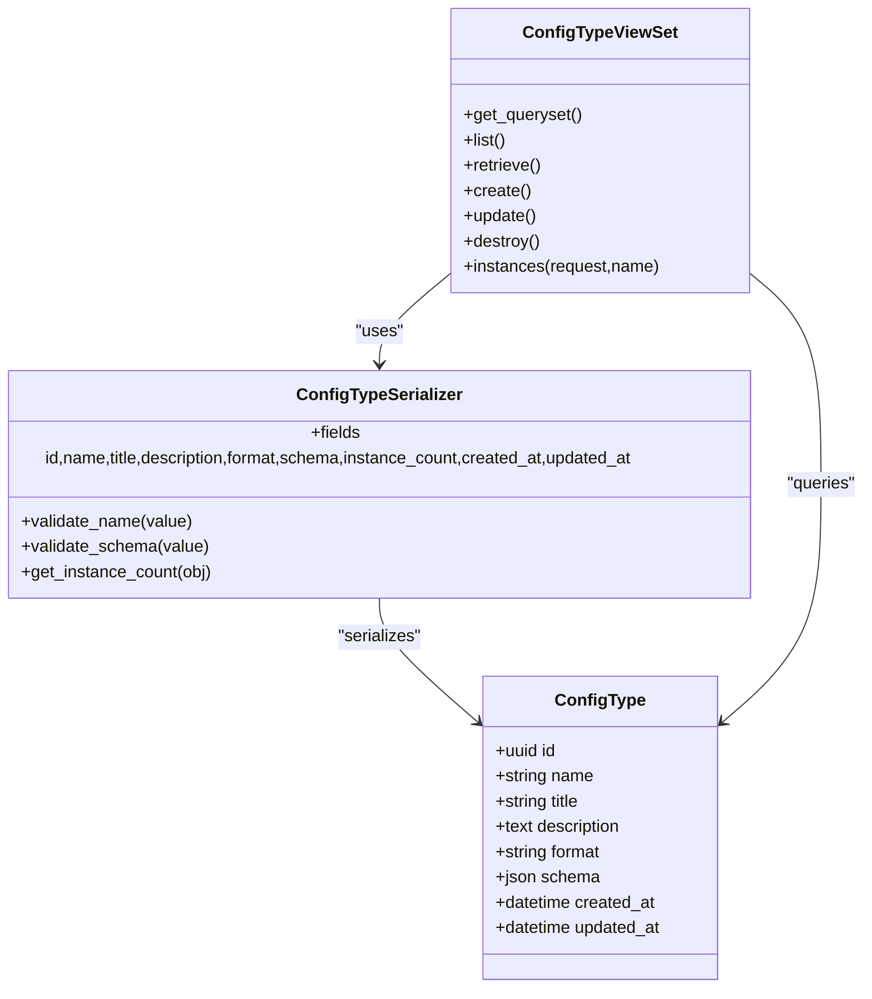
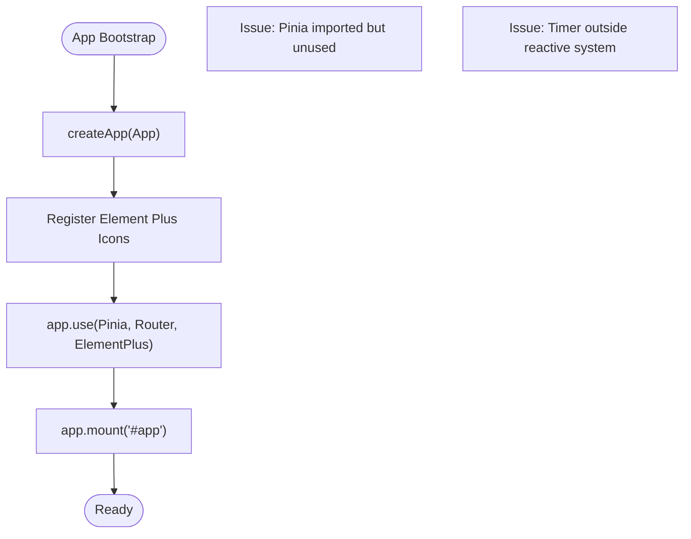
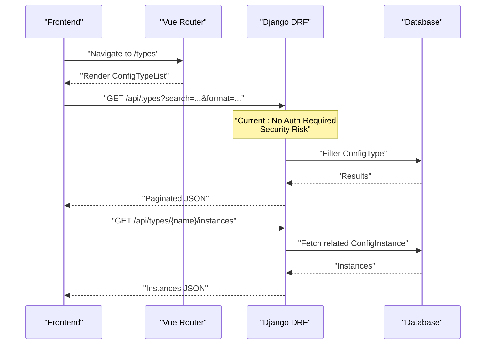
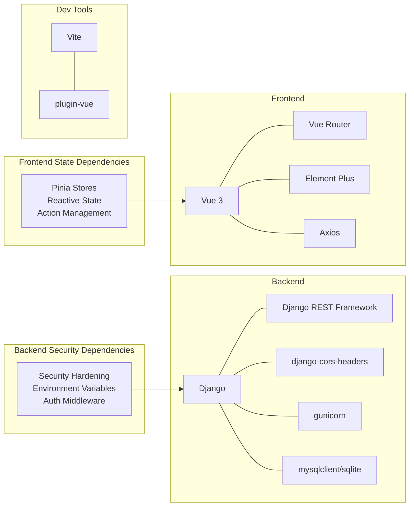

# Development Guidelines

<cite>
**Referenced Files in This Document**
- [backend/confighub/settings.py](file://backend/confighub/settings.py)
- [backend/confighub/urls.py](file://backend/confighub/urls.py)
- [backend/confighub/asgi.py](file://backend/confighub/asgi.py)
- [backend/confighub/wsgi.py](file://backend/confighub/wsgi.py)
- [backend/requirements.txt](file://backend/requirements.txt)
- [backend/manage.py](file://backend/manage.py)
- [backend/config_type/models.py](file://backend/config_type/models.py)
- [backend/config_type/serializers.py](file://backend/config_type/serializers.py)
- [backend/config_type/views.py](file://backend/config_type/views.py)
- [backend/config_type/urls.py](file://backend/config_type/urls.py)
- [frontend/src/main.js](file://frontend/src/main.js)
- [frontend/src/router/index.js](file://frontend/src/router/index.js)
- [frontend/src/api/config.js](file://frontend/src/api/config.js)
- [frontend/src/App.vue](file://frontend/src/App.vue)
- [frontend/src/views/Home.vue](file://frontend/src/views/Home.vue)
- [frontend/src/views/ConfigTypeList.vue](file://frontend/src/views/ConfigTypeList.vue)
- [frontend/src/views/ConfigInstanceList.vue](file://frontend/src/views/ConfigInstanceList.vue)
- [frontend/vite.config.js](file://frontend/vite.config.js)
- [frontend/package.json](file://frontend/package.json)
- [design/review/backend-review.md](file://design/review/backend-review.md)
- [design/review/frontend-review.md](file://design/review/frontend-review.md)
- [docker-compose.yml](file://docker-compose.yml)
</cite>

## Update Summary
**Changes Made**
- Added comprehensive security review section based on Chinese backend security assessment
- Added detailed frontend architecture review section with state management recommendations
- Updated security considerations with production hardening guidelines
- Enhanced error handling and state management documentation
- Added performance optimization recommendations for N+1 query problems
- Integrated Chinese technical documentation findings into development guidelines

## Table of Contents
1. [Introduction](#introduction)
2. [Project Structure](#project-structure)
3. [Core Components](#core-components)
4. [Architecture Overview](#architecture-overview)
5. [Security Review and Hardening](#security-review-and-hardening)
6. [Detailed Component Analysis](#detailed-component-analysis)
7. [State Management Architecture](#state-management-architecture)
8. [Dependency Analysis](#dependency-analysis)
9. [Performance Considerations](#performance-considerations)
10. [Testing Strategies](#testing-strategies)
11. [Development Workflow](#development-workflow)
12. [Debugging and Profiling](#debugging-and-profiling)
13. [Contribution and Release Management](#contribution-and-release-management)
14. [Code Quality Tools and Linting](#code-quality-tools-and-linting)
15. [Troubleshooting Guide](#troubleshooting-guide)
16. [Conclusion](#conclusion)

## Introduction
This document provides comprehensive development guidelines for the AI-Ops Configuration Hub project. It covers backend standards for Python/Django, REST API design patterns, and frontend standards for Vue.js with Pinia and Vue Router. The guidelines now include enhanced security review recommendations and frontend architecture improvements based on comprehensive Chinese technical documentation. It also outlines development workflow, testing strategies, debugging and profiling techniques, contribution and release processes, and code quality tooling.

## Project Structure
The project follows a clear separation between a Django backend and a Vue.js frontend, orchestrated via Docker Compose. The backend exposes REST APIs under /api/, while the frontend runs on Vite and proxies API requests to the backend. Current implementation shows good structural separation but requires security hardening and state management improvements.



**Diagram sources**
- [backend/confighub/settings.py:23-39](file://backend/confighub/settings.py#L23-L39)
- [frontend/src/main.js:17](file://frontend/src/main.js#L17)
- [frontend/src/App.vue:98-106](file://frontend/src/App.vue#L98-L106)

**Section sources**
- [backend/confighub/settings.py:23-39](file://backend/confighub/settings.py#L23-L39)
- [frontend/src/main.js:17](file://frontend/src/main.js#L17)
- [frontend/src/App.vue:98-106](file://frontend/src/App.vue#L98-L106)

## Core Components
- Backend Django application:
  - REST Framework configuration for pagination and permissions.
  - Installed apps include DRF, CORS headers, and domain apps (config_type, config_instance, versioning, audit).
  - Middleware stack includes CORS and security middleware.
  - Environment-driven database selection (SQLite by default, MySQL optional).
  - **Critical Security Issues**: Hardcoded SECRET_KEY, allow-any-origin CORS, no authentication, wildcard ALLOWED_HOSTS.
- Frontend Vue application:
  - Pinia for state management (imported but unused), Vue Router for navigation, Element Plus for UI.
  - Vite dev server with proxy for /api to backend.
  - **Architectural Issues**: Missing centralized state management, inadequate error handling, memory leak in timer.
- Docker Compose:
  - MySQL service, Django backend service, and Nginx-like frontend service.

**Section sources**
- [backend/confighub/settings.py:23-39](file://backend/confighub/settings.py#L23-L39)
- [backend/confighub/settings.py:96-117](file://backend/confighub/settings.py#L96-L117)
- [frontend/src/main.js:1-22](file://frontend/src/main.js#L1-L22)
- [frontend/src/router/index.js:8-49](file://frontend/src/router/index.js#L8-L49)
- [frontend/src/App.vue:98-106](file://frontend/src/App.vue#L98-L106)
- [docker-compose.yml:3-46](file://docker-compose.yml#L3-L46)

## Architecture Overview
The system architecture integrates a Vue.js SPA with a Django REST backend. The frontend communicates with the backend via HTTP, with Vite proxying API calls during development. Current implementation requires immediate security hardening and state management improvements.



**Diagram sources**
- [frontend/vite.config.js:8-12](file://frontend/vite.config.js#L8-L12)
- [backend/confighub/urls.py:22-23](file://backend/confighub/urls.py#L22-L23)
- [backend/config_type/urls.py:5-10](file://backend/config_type/urls.py#L5-L10)
- [backend/config_type/views.py:8-12](file://backend/config_type/views.py#L8-L12)
- [backend/config_type/models.py:4-24](file://backend/config_type/models.py#L4-L24)

## Security Review and Hardening

### Critical Security Vulnerabilities Identified

**1. Hardcoded SECRET_KEY (Critical)**
- **Issue**: Secret key exposed in source code with development default
- **Risk**: Complete system compromise if source code is leaked
- **Recommendation**: Environment variable driven configuration with mandatory validation

**2. Allow-All CORS Configuration (Critical)**
- **Issue**: `CORS_ALLOW_ALL_ORIGINS = True` allows any domain access
- **Risk**: CSRF attacks, data exfiltration, cross-domain request forgery
- **Recommendation**: Whitelist specific origins with environment variable configuration

**3. No Authentication/Authorization (Critical)**
- **Issue**: All endpoints accessible without authentication
- **Risk**: Unauthorized modification of configuration data
- **Recommendation**: Implement TokenAuthentication with IsAuthenticated permission classes

**4. Wildcard ALLOWED_HOSTS (High)**
- **Issue**: `ALLOWED_HOSTS = ['*']` vulnerable to Host header injection
- **Risk**: HTTP Host header attacks, request smuggling
- **Recommendation**: Specific hostnames with environment variable configuration

### Security Hardening Implementation

```python
# Recommended Security Configuration
import os
from django.core.exceptions import ImproperlyConfigured

# Security Key Management
SECRET_KEY = os.getenv('DJANGO_SECRET_KEY')
if not SECRET_KEY:
    raise ImproperlyConfigured('DJANGO_SECRET_KEY environment variable is required')

# Production Security Settings
DEBUG = os.getenv('DJANGO_DEBUG', 'False').lower() == 'true'
ALLOWED_HOSTS = os.getenv('ALLOWED_HOSTS', 'localhost,127.0.0.1').split(',')

# Secure CORS Configuration
CORS_ALLOWED_ORIGINS = os.getenv('CORS_ALLOWED_ORIGINS', 'http://localhost:3000').split(',')

# Authentication and Authorization
REST_FRAMEWORK = {
    'DEFAULT_PERMISSION_CLASSES': [
        'rest_framework.permissions.IsAuthenticated',
    ],
    'DEFAULT_AUTHENTICATION_CLASSES': [
        'rest_framework.authentication.TokenAuthentication',
        'rest_framework.authentication.SessionAuthentication',
    ],
    'DEFAULT_PAGINATION_CLASS': 'rest_framework.pagination.PageNumberPagination',
    'PAGE_SIZE': 20,
}
```

**Section sources**
- [design/review/backend-review.md:21-86](file://design/review/backend-review.md#L21-L86)
- [backend/confighub/settings.py:23-39](file://backend/confighub/settings.py#L23-L39)

## Detailed Component Analysis

### Django REST API: ConfigType
- ViewSet pattern:
  - Uses ModelViewSet with lookup by name.
  - Custom filtering by search and format query params.
  - Custom action to list related instances.
- Serializer validations:
  - Name validation restricts characters.
  - Schema validation ensures JSON object with required fields.
- URL routing:
  - Default router registers the ConfigTypeViewSet under a base route.



**Diagram sources**
- [backend/config_type/models.py:4-24](file://backend/config_type/models.py#L4-L24)
- [backend/config_type/serializers.py:5-30](file://backend/config_type/serializers.py#L5-L30)
- [backend/config_type/views.py:8-38](file://backend/config_type/views.py#L8-L38)

**Section sources**
- [backend/config_type/views.py:8-38](file://backend/config_type/views.py#L8-L38)
- [backend/config_type/serializers.py:5-30](file://backend/config_type/serializers.py#L5-L30)
- [backend/config_type/models.py:4-24](file://backend/config_type/models.py#L4-L24)
- [backend/config_type/urls.py:5-10](file://backend/config_type/urls.py#L5-L10)

### Vue.js Frontend: Current State and Issues

**Pinia Store Not Implemented (High Priority)**
- **Issue**: Pinia imported and initialized but never used
- **Impact**: Each component manages its own state independently
- **Solution**: Implement centralized state management with dedicated stores

**Memory Leak in Timer (Critical)**
- **Issue**: Timer declared outside reactive system in App.vue
- **Impact**: Potential memory leaks and inconsistent cleanup
- **Solution**: Move timer to reactive ref system with proper cleanup

**Inadequate Error Handling**
- **Issue**: Generic error messages without context
- **Impact**: Poor user experience and debugging difficulty
- **Solution**: Context-specific error messages and error boundary components



**Diagram sources**
- [frontend/src/main.js:1-22](file://frontend/src/main.js#L1-L22)
- [frontend/src/App.vue:98-106](file://frontend/src/App.vue#L98-L106)

**Section sources**
- [frontend/src/main.js:1-22](file://frontend/src/main.js#L1-L22)
- [frontend/src/router/index.js:8-49](file://frontend/src/router/index.js#L8-L49)
- [frontend/src/App.vue:98-106](file://frontend/src/App.vue#L98-L106)
- [design/review/frontend-review.md:15-54](file://design/review/frontend-review.md#L15-L54)

### API Request Flow: ConfigType List and Instance Action


**Diagram sources**
- [frontend/src/router/index.js:14-28](file://frontend/src/router/index.js#L14-L28)
- [backend/config_type/views.py:14-25](file://backend/config_type/views.py#L14-L25)
- [backend/config_type/views.py:27-38](file://backend/config_type/views.py#L27-L38)

## State Management Architecture

### Proposed Pinia Store Implementation

**Store Structure Recommendation:**
```
src/stores/
├── configTypes.js     # Config types CRUD operations
├── configInstances.js # Config instances CRUD operations  
├── ui.js             # Global UI state (loading, notifications)
└── auth.js           # Authentication state (future implementation)
```

**Config Types Store Example:**
```javascript
// src/stores/configTypes.js
import { defineStore } from 'pinia'
import { configTypeApi } from '@/api/config'

export const useConfigTypesStore = defineStore('configTypes', {
  state: () => ({
    types: [],
    loading: false,
    selectedType: null,
    filters: {
      search: '',
      format: ''
    }
  }),
  
  actions: {
    async fetchTypes() {
      this.loading = true
      try {
        const response = await configTypeApi.list(this.filters)
        this.types = response.data.results || response.data
      } catch (error) {
        throw new Error(`Failed to fetch config types: ${error.message}`)
      } finally {
        this.loading = false
      }
    },
    
    async createType(data) {
      const response = await configTypeApi.create(data)
      this.types.push(response.data)
      return response.data
    }
  }
})
```

**Section sources**
- [design/review/frontend-review.md:147-176](file://design/review/frontend-review.md#L147-L176)
- [frontend/src/views/ConfigTypeList.vue](file://frontend/src/views/ConfigTypeList.vue)

## Dependency Analysis
- Backend dependencies include Django, DRF, CORS headers, gunicorn, and optional MySQL client.
- Frontend dependencies include Vue 3, Vue Router, Pinia, Element Plus, Axios, and Vite plugin for Vue.
- Docker Compose defines three services: db (MySQL), backend (Django), and frontend (static serving).



**Diagram sources**
- [backend/requirements.txt:1-8](file://backend/requirements.txt#L1-L8)
- [frontend/package.json:11-24](file://frontend/package.json#L11-L24)
- [docker-compose.yml:3-46](file://docker-compose.yml#L3-L46)

**Section sources**
- [backend/requirements.txt:1-8](file://backend/requirements.txt#L1-L8)
- [frontend/package.json:11-24](file://frontend/package.json#L11-L24)
- [docker-compose.yml:3-46](file://docker-compose.yml#L3-L46)

## Performance Considerations

### N+1 Query Problem Resolution
**Current Issue**: ConfigTypeSerializer.get_instance_count() executes individual COUNT queries for each type
**Impact**: 100 types = 100 additional database queries
**Solution**: Use annotate() with Count() aggregation

```python
# In views.py - Optimized queryset
from django.db.models import Count

def get_queryset(self):
    return ConfigType.objects.annotate(
        instance_count_value=Count('configinstance')
    )
```

**Database Index Recommendations:**
```python
# Add indexes to frequently queried fields
class ConfigType(models.Model):
    name = models.CharField(max_length=100, unique=True, db_index=True)
    format = models.CharField(max_length=10, choices=FORMAT_CHOICES, db_index=True)

class ConfigInstance(models.Model):
    name = models.CharField(max_length=100, db_index=True)
    config_type = models.ForeignKey(ConfigType, on_delete=models.CASCADE, db_index=True)
```

**Section sources**
- [design/review/backend-review.md:89-116](file://design/review/backend-review.md#L89-L116)
- [backend/config_type/serializers.py:15](file://backend/config_type/serializers.py#L15)

## Testing Strategies
- Backend:
  - Unit tests for models, serializers, and views using Django's test runner.
  - Integration tests for API endpoints using the built-in test client or pytest-django.
  - Consider factory libraries for deterministic fixtures.
  - **Security Testing**: Test authentication flows, CORS configuration, and input validation.
- Frontend:
  - Unit tests for composables and helpers using Vitest.
  - Component tests for Vue components using @vue/test-utils.
  - End-to-end tests using Playwright or Cypress against a test database and mocked backend.
  - **State Management Testing**: Test Pinia store actions and state mutations.
- CI:
  - Run backend tests with coverage and frontend tests in a single job.
  - Use matrix builds for Python and Node versions if needed.
  - **Security Scanning**: Include dependency vulnerability scanning and security linting.

## Development Workflow
- Branching:
  - Feature branches per task; rebase or merge commit-free history.
- Commit messages:
  - Use imperative mood; reference issues.
- Code review:
  - Require at least one reviewer; address comments before merging.
  - **Security Review**: Critical security changes require additional security review.
- Continuous Integration:
  - Automated checks on pull requests: lint, backend tests, frontend tests, and static analysis.
  - **Security Checks**: Include security scanning and dependency vulnerability checks.
- Local development:
  - Use Docker Compose to spin up db, backend, and frontend; mount volumes for hot reload.
  - **Environment Setup**: Use separate .env files for different environments.

## Debugging and Profiling
- Backend:
  - Enable DEBUG in development; use Django Debug Toolbar for SQL and cache insights.
  - Add structured logging; use gunicorn workers with process/thread tuning.
  - Profile views with django-silk or cProfile.
  - **Security Debugging**: Monitor authentication attempts and CORS violations.
- Frontend:
  - Use Vue DevTools; enable strict mode in Pinia for development.
  - Network tab in browser devtools to inspect API calls.
  - **State Debugging**: Monitor Pinia store state changes and mutations.
- Containerized debugging:
  - Tail logs with docker compose logs; exec into containers for interactive sessions.

## Contribution and Release Management
- Contributions:
  - Fork and branch; open PRs early; keep diffs focused.
  - **Security Contributions**: Include security review checklist for security-related changes.
- Issue reporting:
  - Use templates for bug reports and feature requests; include environment details.
  - **Security Issues**: Use dedicated security issue template with vulnerability disclosure.
- Releases:
  - Tag releases; update changelog; bump versions in package.json and pyproject metadata.
  - **Pre-Release Security Audit**: Conduct security review before major releases.
- Post-release:
  - Monitor logs and metrics; cut hotfixes as needed.
  - **Security Patches**: Rapid response to security vulnerabilities.

## Code Quality Tools and Linting
- Backend:
  - Python: flake8, black, isort, and mypy for type hints.
  - **Security Linting**: bandit for security vulnerability detection.
  - Pre-commit hooks to enforce style and basic checks.
- Frontend:
  - ESLint (recommended config), Prettier, and optional TypeScript for stricter typing.
  - **Security Scanning**: npm audit, snyk for dependency vulnerability scanning.
  - Pre-commit hooks to auto-format and lint.
- CI:
  - Integrate linters and type checks as mandatory steps.
  - **Security Scanning**: Automated security vulnerability scanning in CI pipeline.

## Troubleshooting Guide
- Django settings:
  - Verify SECRET_KEY and DEBUG environment variables.
  - Confirm ALLOWED_HOSTS and CORS settings.
  - **Security Verification**: Test authentication and authorization flows.
- Database:
  - Ensure DB_ENGINE matches environment; check credentials and network connectivity.
- Frontend proxy:
  - Confirm Vite proxy target and port match backend host/port.
  - **State Management**: Verify Pinia store initialization and state persistence.
- Docker:
  - Check service health checks and volume mounts; verify port bindings.
  - **Security**: Verify environment variable injection and file permissions.

**Section sources**
- [backend/confighub/settings.py:23-29](file://backend/confighub/settings.py#L23-L29)
- [backend/confighub/settings.py:96-117](file://backend/confighub/settings.py#L96-L117)
- [frontend/vite.config.js:8-12](file://frontend/vite.config.js#L8-L12)
- [docker-compose.yml:16-19](file://docker-compose.yml#L16-L19)

## Conclusion
These guidelines establish a consistent, maintainable development process for the AI-Ops Configuration Hub. The recent security review and frontend architecture assessment have identified critical areas for improvement. By implementing the recommended security hardening measures, establishing proper state management with Pinia, and following the enhanced testing and development workflows, the team can deliver a secure, scalable, and maintainable system. The integration of Chinese technical documentation findings provides comprehensive coverage of both security and architectural concerns, ensuring the project meets enterprise-grade standards.