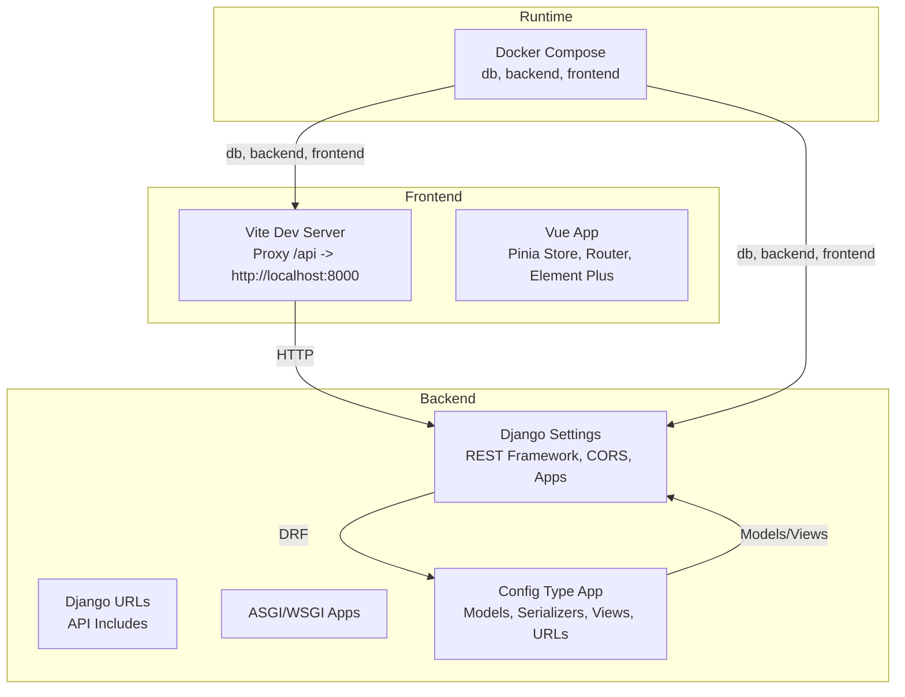
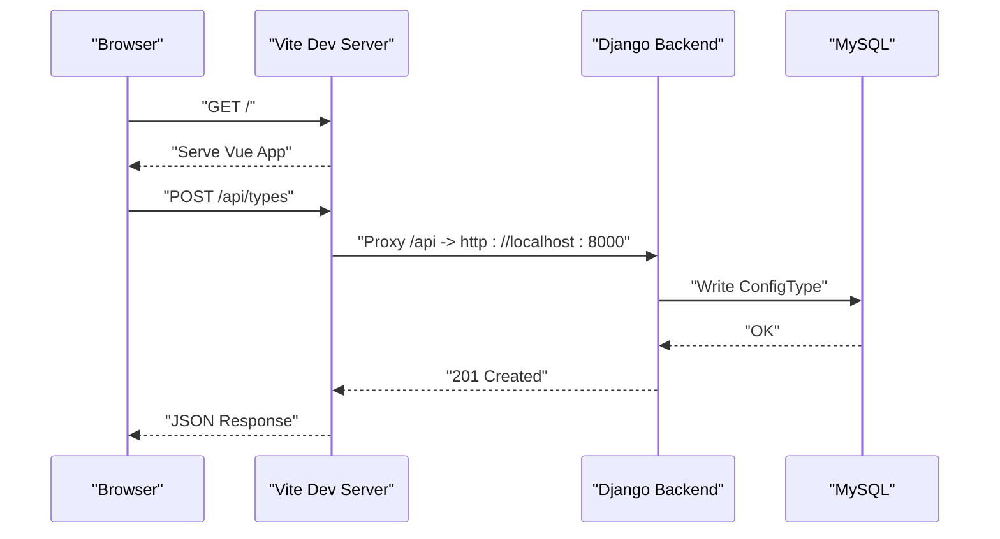
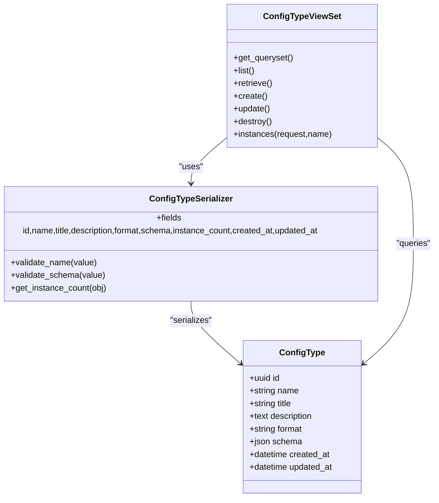
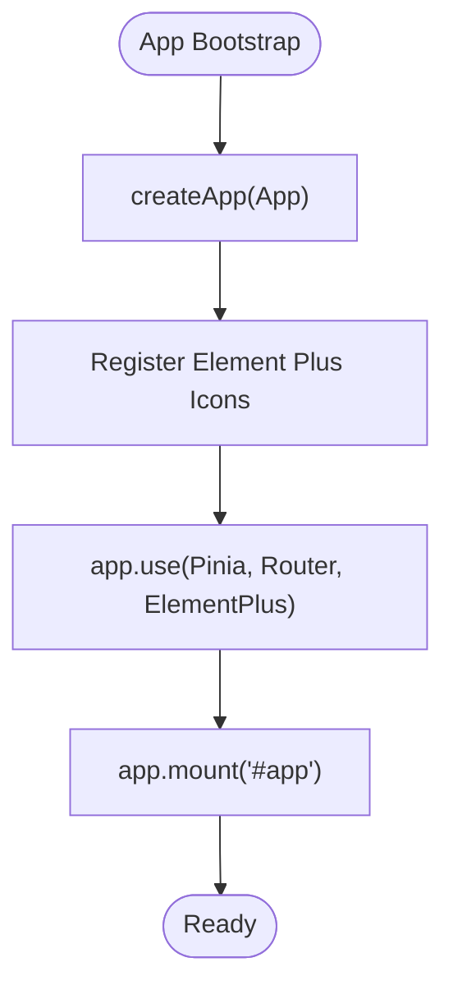
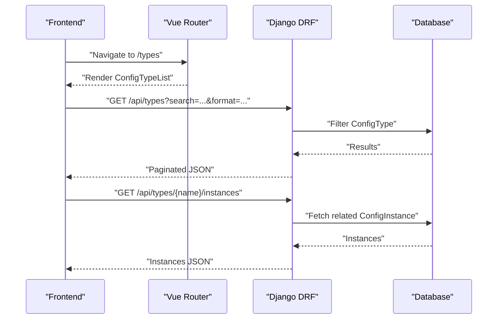
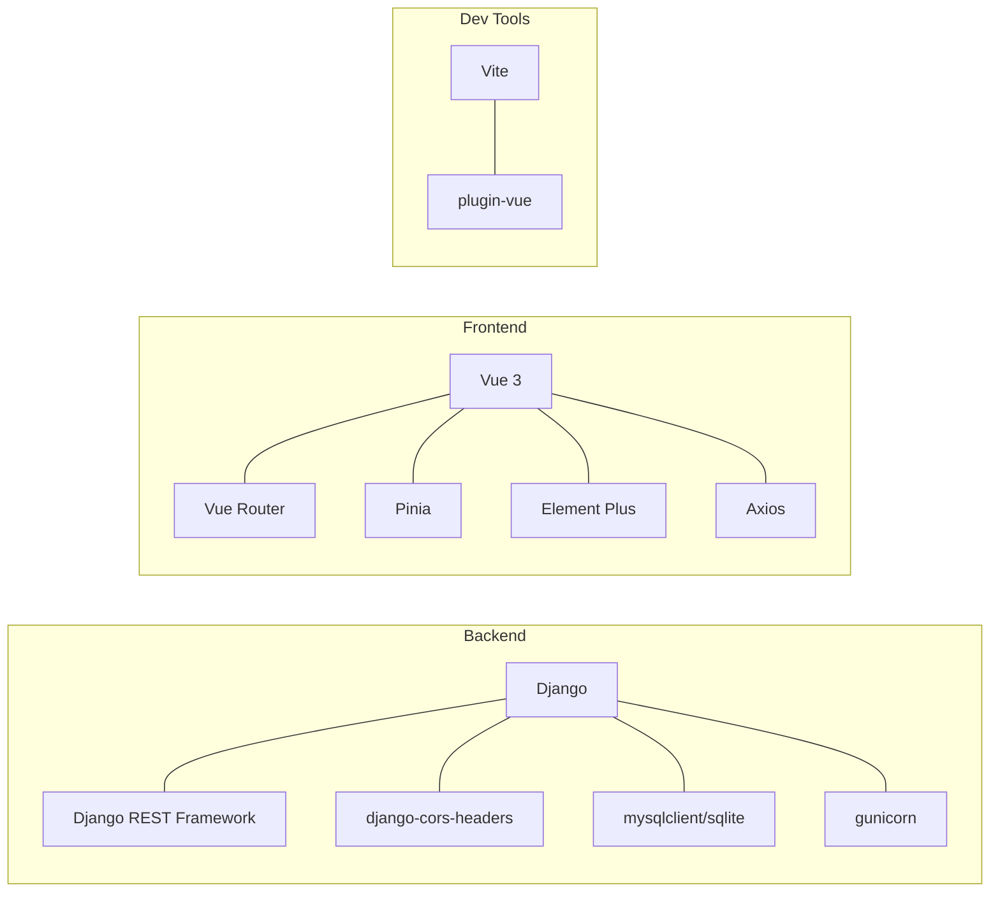

# Development Guidelines

<cite>
**Referenced Files in This Document**
- [backend/confighub/settings.py](file://backend/confighub/settings.py)
- [backend/confighub/urls.py](file://backend/confighub/urls.py)
- [backend/confighub/asgi.py](file://backend/confighub/asgi.py)
- [backend/confighub/wsgi.py](file://backend/confighub/wsgi.py)
- [backend/requirements.txt](file://backend/requirements.txt)
- [backend/manage.py](file://backend/manage.py)
- [backend/config_type/models.py](file://backend/config_type/models.py)
- [backend/config_type/serializers.py](file://backend/config_type/serializers.py)
- [backend/config_type/views.py](file://backend/config_type/views.py)
- [backend/config_type/urls.py](file://backend/config_type/urls.py)
- [frontend/src/main.js](file://frontend/src/main.js)
- [frontend/src/router/index.js](file://frontend/src/router/index.js)
- [frontend/vite.config.js](file://frontend/vite.config.js)
- [frontend/package.json](file://frontend/package.json)
- [docker-compose.yml](file://docker-compose.yml)
</cite>

## Table of Contents
1. [Introduction](#introduction)
2. [Project Structure](#project-structure)
3. [Core Components](#core-components)
4. [Architecture Overview](#architecture-overview)
5. [Detailed Component Analysis](#detailed-component-analysis)
6. [Dependency Analysis](#dependency-analysis)
7. [Performance Considerations](#performance-considerations)
8. [Testing Strategies](#testing-strategies)
9. [Development Workflow](#development-workflow)
10. [Debugging and Profiling](#debugging-and-profiling)
11. [Contribution and Release Management](#contribution-and-release-management)
12. [Code Quality Tools and Linting](#code-quality-tools-and-linting)
13. [Troubleshooting Guide](#troubleshooting-guide)
14. [Conclusion](#conclusion)

## Introduction
This document provides comprehensive development guidelines for the AI-Ops Configuration Hub project. It covers backend standards for Python/Django, REST API design patterns, and frontend standards for Vue.js with Pinia and Vue Router. It also outlines development workflow, testing strategies, debugging and profiling techniques, contribution and release processes, and code quality tooling.

## Project Structure
The project follows a clear separation between a Django backend and a Vue.js frontend, orchestrated via Docker Compose. The backend exposes REST APIs under /api/, while the frontend runs on Vite and proxies API requests to the backend.

**Diagram sources**
- [backend/confighub/settings.py:33-57](file://backend/confighub/settings.py#L33-L57)
- [backend/confighub/urls.py:20-24](file://backend/confighub/urls.py#L20-L24)
- [backend/config_type/urls.py:5-10](file://backend/config_type/urls.py#L5-L10)
- [frontend/vite.config.js:6-14](file://frontend/vite.config.js#L6-L14)
- [frontend/src/main.js:1-22](file://frontend/src/main.js#L1-L22)
- [docker-compose.yml:3-46](file://docker-compose.yml#L3-L46)

**Section sources**
- [backend/confighub/settings.py:44-57](file://backend/confighub/settings.py#L44-L57)
- [backend/confighub/urls.py:20-24](file://backend/confighub/urls.py#L20-L24)
- [frontend/vite.config.js:6-14](file://frontend/vite.config.js#L6-L14)
- [docker-compose.yml:3-46](file://docker-compose.yml#L3-L46)

## Core Components
- Backend Django application:
  - REST Framework configuration for pagination and permissions.
  - Installed apps include DRF, CORS headers, and domain apps (config_type, config_instance, versioning, audit).
  - Middleware stack includes CORS and security middleware.
  - Environment-driven database selection (SQLite by default, MySQL optional).
- Frontend Vue application:
  - Pinia for state management, Vue Router for navigation, Element Plus for UI.
  - Vite dev server with proxy for /api to backend.
- Docker Compose:
  - MySQL service, Django backend service, and Nginx-like frontend service.

**Section sources**
- [backend/confighub/settings.py:33-57](file://backend/confighub/settings.py#L33-L57)
- [backend/confighub/settings.py:96-117](file://backend/confighub/settings.py#L96-L117)
- [frontend/src/main.js:1-22](file://frontend/src/main.js#L1-L22)
- [frontend/vite.config.js:6-14](file://frontend/vite.config.js#L6-L14)
- [docker-compose.yml:3-46](file://docker-compose.yml#L3-L46)

## Architecture Overview
The system architecture integrates a Vue.js SPA with a Django REST backend. The frontend communicates with the backend via HTTP, with Vite proxying API calls during development.

**Diagram sources**
- [frontend/vite.config.js:8-12](file://frontend/vite.config.js#L8-L12)
- [backend/confighub/urls.py:22-23](file://backend/confighub/urls.py#L22-L23)
- [backend/config_type/urls.py:5-10](file://backend/config_type/urls.py#L5-L10)
- [backend/config_type/views.py:8-12](file://backend/config_type/views.py#L8-L12)
- [backend/config_type/models.py:4-24](file://backend/config_type/models.py#L4-L24)

## Detailed Component Analysis

### Django REST API: ConfigType
- ViewSet pattern:
  - Uses ModelViewSet with lookup by name.
  - Custom filtering by search and format query params.
  - Custom action to list related instances.
- Serializer validations:
  - Name validation restricts characters.
  - Schema validation ensures JSON object with required fields.
- URL routing:
  - Default router registers the ConfigTypeViewSet under a base route.

**Diagram sources**
- [backend/config_type/models.py:4-24](file://backend/config_type/models.py#L4-L24)
- [backend/config_type/serializers.py:5-30](file://backend/config_type/serializers.py#L5-L30)
- [backend/config_type/views.py:8-38](file://backend/config_type/views.py#L8-L38)

**Section sources**
- [backend/config_type/views.py:8-38](file://backend/config_type/views.py#L8-L38)
- [backend/config_type/serializers.py:5-30](file://backend/config_type/serializers.py#L5-L30)
- [backend/config_type/models.py:4-24](file://backend/config_type/models.py#L4-L24)
- [backend/config_type/urls.py:5-10](file://backend/config_type/urls.py#L5-L10)

### Vue.js Frontend: App Initialization and Routing
- App initialization:
  - Creates Vue app, installs Pinia, Router, and Element Plus.
  - Registers Element Plus icons globally.
- Router:
  - Defines routes for home, config types, and config instances (list, create, edit).
  - Uses history mode with createWebHistory.

**Diagram sources**
- [frontend/src/main.js:1-22](file://frontend/src/main.js#L1-L22)

**Section sources**
- [frontend/src/main.js:1-22](file://frontend/src/main.js#L1-L22)
- [frontend/src/router/index.js:8-49](file://frontend/src/router/index.js#L8-L49)

### API Request Flow: ConfigType List and Instance Action

**Diagram sources**
- [frontend/src/router/index.js:14-28](file://frontend/src/router/index.js#L14-L28)
- [backend/config_type/views.py:14-25](file://backend/config_type/views.py#L14-L25)
- [backend/config_type/views.py:27-38](file://backend/config_type/views.py#L27-L38)

## Dependency Analysis
- Backend dependencies include Django, DRF, CORS headers, gunicorn, and optional MySQL client.
- Frontend dependencies include Vue 3, Vue Router, Pinia, Element Plus, Axios, and Vite plugin for Vue.
- Docker Compose defines three services: db (MySQL), backend (Django), and frontend (static serving).

**Diagram sources**
- [backend/requirements.txt:1-8](file://backend/requirements.txt#L1-L8)
- [frontend/package.json:11-24](file://frontend/package.json#L11-L24)
- [docker-compose.yml:3-46](file://docker-compose.yml#L3-L46)

**Section sources**
- [backend/requirements.txt:1-8](file://backend/requirements.txt#L1-L8)
- [frontend/package.json:11-24](file://frontend/package.json#L11-L24)
- [docker-compose.yml:3-46](file://docker-compose.yml#L3-L46)

## Performance Considerations
- Pagination:
  - REST Framework pagination is configured with a page size; ensure consumers use pagination for large datasets.
- Database:
  - SQLite is default for simplicity; switch to MySQL in production and tune connection pooling and charset options.
- CORS:
  - Allow-all origins is enabled for development; tighten origins in production.
- Static files:
  - Static root is set; ensure collectstatic is run in production deployments.
- ASGI/WSGI:
  - ASGI app is configured; use an ASGI server (e.g., Daphne) behind a reverse proxy in production.

[No sources needed since this section provides general guidance]

## Testing Strategies
- Backend:
  - Unit tests for models, serializers, and views using Django’s test runner.
  - Integration tests for API endpoints using the built-in test client or pytest-django.
  - Consider factory libraries for deterministic fixtures.
- Frontend:
  - Unit tests for composables and helpers using Vitest.
  - Component tests for Vue components using @vue/test-utils.
  - End-to-end tests using Playwright or Cypress against a test database and mocked backend.
- CI:
  - Run backend tests with coverage and frontend tests in a single job.
  - Use matrix builds for Python and Node versions if needed.

[No sources needed since this section provides general guidance]

## Development Workflow
- Branching:
  - Feature branches per task; rebase or merge commit-free history.
- Commit messages:
  - Use imperative mood; reference issues.
- Code review:
  - Require at least one reviewer; address comments before merging.
- Continuous Integration:
  - Automated checks on pull requests: lint, backend tests, frontend tests, and static analysis.
- Local development:
  - Use Docker Compose to spin up db, backend, and frontend; mount volumes for hot reload.

[No sources needed since this section provides general guidance]

## Debugging and Profiling
- Backend:
  - Enable DEBUG in development; use Django Debug Toolbar for SQL and cache insights.
  - Add structured logging; use gunicorn workers with process/thread tuning.
  - Profile views with django-silk or cProfile.
- Frontend:
  - Use Vue DevTools; enable strict mode in Pinia for development.
  - Network tab in browser devtools to inspect API calls.
- Containerized debugging:
  - Tail logs with docker compose logs; exec into containers for interactive sessions.

[No sources needed since this section provides general guidance]

## Contribution and Release Management
- Contributions:
  - Fork and branch; open PRs early; keep diffs focused.
- Issue reporting:
  - Use templates for bug reports and feature requests; include environment details.
- Releases:
  - Tag releases; update changelog; bump versions in package.json and pyproject metadata.
- Post-release:
  - Monitor logs and metrics; cut hotfixes as needed.

[No sources needed since this section provides general guidance]

## Code Quality Tools and Linting
- Backend:
  - Python: flake8, black, isort, and mypy for type hints.
  - Pre-commit hooks to enforce style and basic checks.
- Frontend:
  - ESLint (recommended config), Prettier, and optional TypeScript for stricter typing.
  - Pre-commit hooks to auto-format and lint.
- CI:
  - Integrate linters and type checks as mandatory steps.

[No sources needed since this section provides general guidance]

## Troubleshooting Guide
- Django settings:
  - Verify SECRET_KEY and DEBUG environment variables.
  - Confirm ALLOWED_HOSTS and CORS settings.
- Database:
  - Ensure DB_ENGINE matches environment; check credentials and network connectivity.
- Frontend proxy:
  - Confirm Vite proxy target and port match backend host/port.
- Docker:
  - Check service health checks and volume mounts; verify port bindings.

**Section sources**
- [backend/confighub/settings.py:23-29](file://backend/confighub/settings.py#L23-L29)
- [backend/confighub/settings.py:96-117](file://backend/confighub/settings.py#L96-L117)
- [frontend/vite.config.js:8-12](file://frontend/vite.config.js#L8-L12)
- [docker-compose.yml:16-19](file://docker-compose.yml#L16-L19)

## Conclusion
These guidelines establish a consistent, maintainable development process for the AI-Ops Configuration Hub. By adhering to Django REST best practices, Vue.js component architecture, robust testing, and CI/CD automation, the team can deliver reliable features quickly and safely.