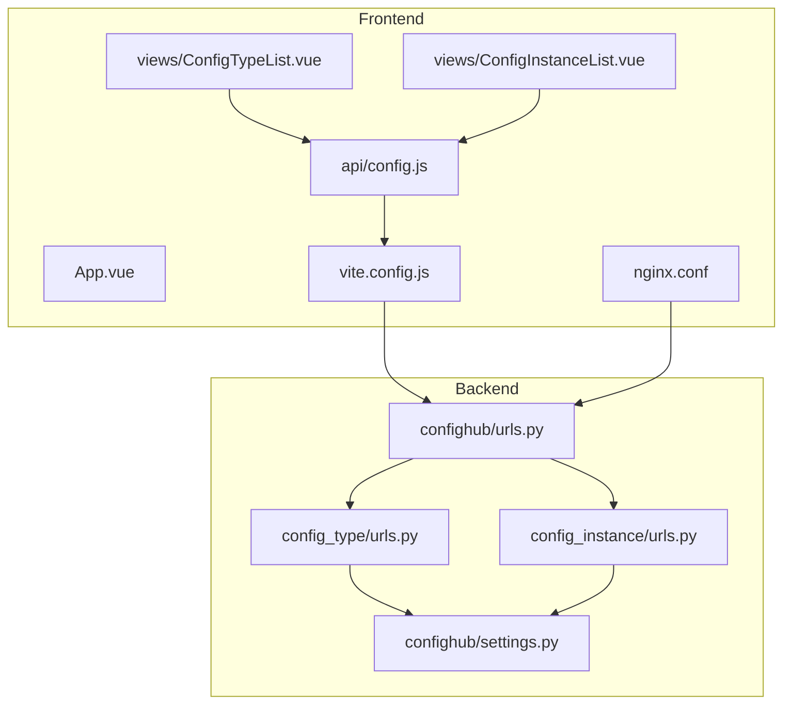
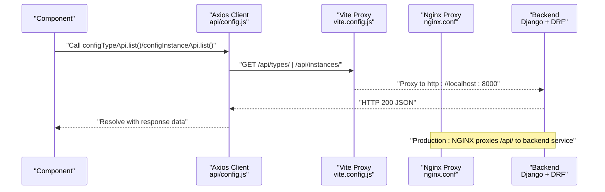
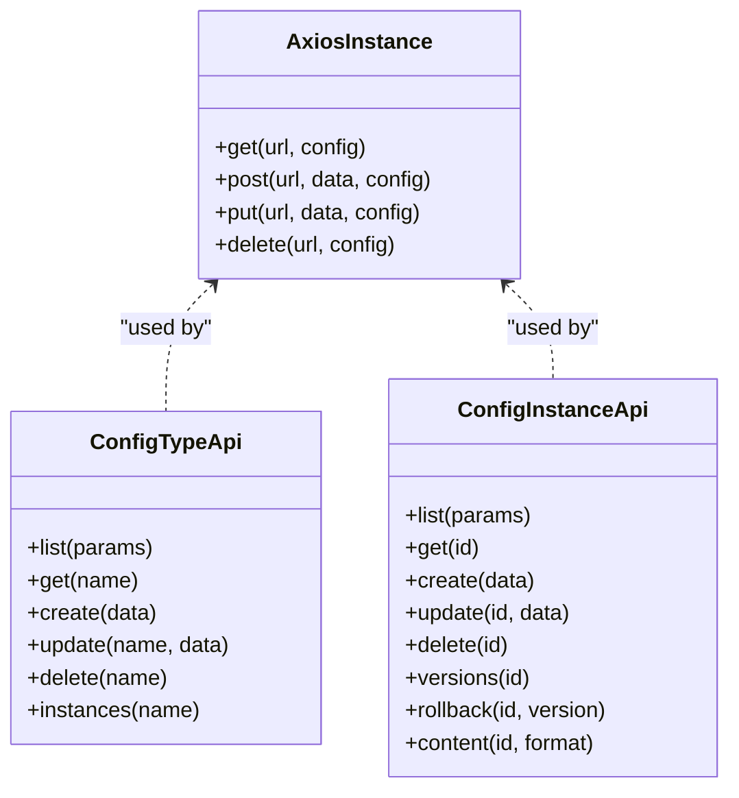
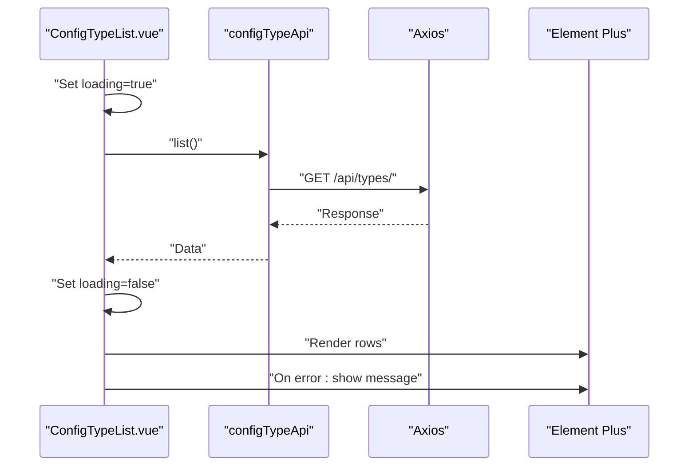
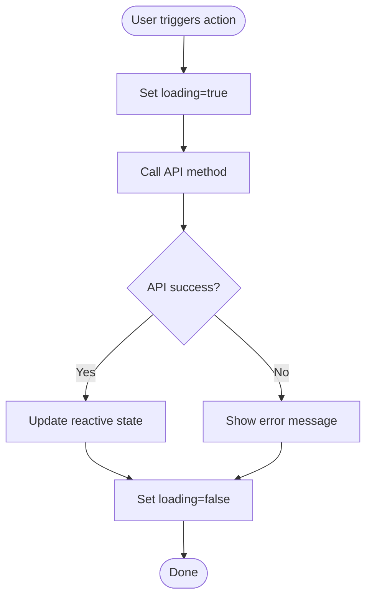
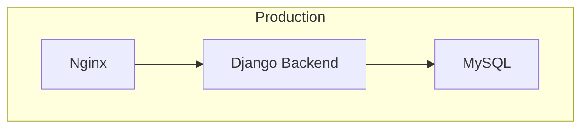
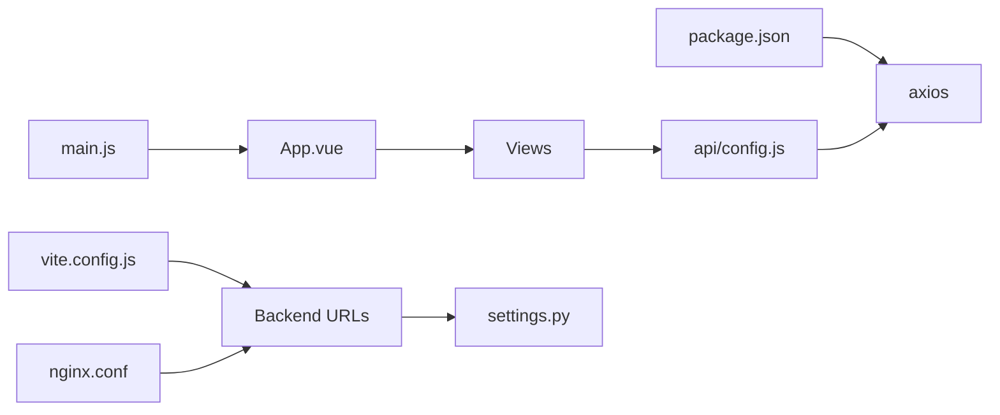

# API Integration & HTTP Client

<cite>
**Referenced Files in This Document**
- [config.js](file://frontend/src/api/config.js)
- [ConfigTypeList.vue](file://frontend/src/views/ConfigTypeList.vue)
- [ConfigInstanceList.vue](file://frontend/src/views/ConfigInstanceList.vue)
- [vite.config.js](file://frontend/vite.config.js)
- [nginx.conf](file://frontend/nginx.conf)
- [main.js](file://frontend/src/main.js)
- [App.vue](file://frontend/src/App.vue)
- [settings.py](file://backend/confighub/settings.py)
- [urls.py](file://backend/confighub/urls.py)
- [config_type urls.py](file://backend/config_type/urls.py)
- [config_instance urls.py](file://backend/config_instance/urls.py)
- [docker-compose.yml](file://docker-compose.yml)
- [package.json](file://frontend/package.json)
</cite>

## Table of Contents
1. [Introduction](#introduction)
2. [Project Structure](#project-structure)
3. [Core Components](#core-components)
4. [Architecture Overview](#architecture-overview)
5. [Detailed Component Analysis](#detailed-component-analysis)
6. [Dependency Analysis](#dependency-analysis)
7. [Performance Considerations](#performance-considerations)
8. [Troubleshooting Guide](#troubleshooting-guide)
9. [Conclusion](#conclusion)
10. [Appendices](#appendices)

## Introduction
This document explains the API integration patterns and HTTP client implementation used by the frontend application. It covers Axios configuration, request/response handling, error management, authentication, REST integration patterns, data transformation, caching strategies, error boundaries, retry mechanisms, loading state management, API versioning, request throttling, performance optimization, usage examples in components, mock data integration, testing strategies, security considerations, CORS handling, and production deployment patterns.

## Project Structure
The frontend integrates with a Django backend via a reverse proxy. The HTTP client is configured with a base URL and development-time proxy to the backend. Components consume typed API modules for configuration types and instances, and handle loading and error states.

**Diagram sources**
- [App.vue:1-288](file://frontend/src/App.vue#L1-L288)
- [config.js:1-34](file://frontend/src/api/config.js#L1-L34)
- [ConfigTypeList.vue:1-149](file://frontend/src/views/ConfigTypeList.vue#L1-L149)
- [ConfigInstanceList.vue:1-298](file://frontend/src/views/ConfigInstanceList.vue#L1-L298)
- [vite.config.js:1-19](file://frontend/vite.config.js#L1-L19)
- [nginx.conf:1-25](file://frontend/nginx.conf#L1-L25)
- [settings.py:1-159](file://backend/confighub/settings.py#L1-L159)
- [urls.py:1-25](file://backend/confighub/urls.py#L1-L25)
- [config_type urls.py:1-11](file://backend/config_type/urls.py#L1-L11)
- [config_instance urls.py:1-11](file://backend/config_instance/urls.py#L1-L11)

**Section sources**
- [config.js:1-34](file://frontend/src/api/config.js#L1-L34)
- [vite.config.js:1-19](file://frontend/vite.config.js#L1-L19)
- [nginx.conf:1-25](file://frontend/nginx.conf#L1-L25)
- [settings.py:1-159](file://backend/confighub/settings.py#L1-L159)
- [urls.py:1-25](file://backend/confighub/urls.py#L1-L25)
- [config_type urls.py:1-11](file://backend/config_type/urls.py#L1-L11)
- [config_instance urls.py:1-11](file://backend/config_instance/urls.py#L1-L11)

## Core Components
- HTTP client module: Creates an Axios instance with base URL, timeout, and default headers. Exposes typed API modules for configuration types and instances.
- API modules: Provide convenience methods for list/get/create/update/delete operations and specialized endpoints (instances/versions, instances/rollback, instances/content).
- Frontend components: Consume the API modules, manage loading/error states, and trigger navigation or actions.
- Development proxy: Vite dev server proxies requests under /api to the backend.
- Production proxy: Nginx forwards /api to the backend service.

Key implementation references:
- Axios instance creation and defaults: [config.js:3-9](file://frontend/src/api/config.js#L3-L9)
- API method definitions: [config.js:12-31](file://frontend/src/api/config.js#L12-L31)
- Component usage of API modules: [ConfigTypeList.vue:76](file://frontend/src/views/ConfigTypeList.vue#L76), [ConfigInstanceList.vue:156](file://frontend/src/views/ConfigInstanceList.vue#L156)
- Dev proxy configuration: [vite.config.js:8-13](file://frontend/vite.config.js#L8-L13)
- Production proxy configuration: [nginx.conf:12-18](file://frontend/nginx.conf#L12-L18)

**Section sources**
- [config.js:1-34](file://frontend/src/api/config.js#L1-L34)
- [ConfigTypeList.vue:71-124](file://frontend/src/views/ConfigTypeList.vue#L71-L124)
- [ConfigInstanceList.vue:151-235](file://frontend/src/views/ConfigInstanceList.vue#L151-L235)
- [vite.config.js:1-19](file://frontend/vite.config.js#L1-L19)
- [nginx.conf:1-25](file://frontend/nginx.conf#L1-L25)

## Architecture Overview
The frontend communicates with the backend through Axios using a base URL of /api. During development, Vite’s proxy forwards /api to the backend. In production, Nginx handles the proxying. The backend exposes REST endpoints via Django REST Framework routers mounted under /api.

**Diagram sources**
- [config.js:12-31](file://frontend/src/api/config.js#L12-L31)
- [vite.config.js:8-13](file://frontend/vite.config.js#L8-L13)
- [nginx.conf:12-18](file://frontend/nginx.conf#L12-L18)
- [settings.py:33-39](file://backend/confighub/settings.py#L33-L39)

## Detailed Component Analysis

### HTTP Client Module
- Axios instance: Base URL set to /api, timeout 10 seconds, default Content-Type header.
- API modules:
  - configTypeApi: list, get, create, update, delete, instances.
  - configInstanceApi: list, get, create, update, delete, versions, rollback, content.
- Export default Axios instance for direct usage if needed.

**Diagram sources**
- [config.js:3-31](file://frontend/src/api/config.js#L3-L31)

**Section sources**
- [config.js:1-34](file://frontend/src/api/config.js#L1-L34)

### Component Usage Patterns
- ConfigTypeList.vue:
  - Imports configTypeApi.
  - Uses a loading flag during fetch.
  - Handles errors via UI messages.
  - Supports pagination and search-like filters.
- ConfigInstanceList.vue:
  - Imports both configTypeApi and configInstanceApi.
  - Manages search form state and pagination.
  - Displays loading and empty states.
  - Uses confirmation dialogs for destructive actions.

**Diagram sources**
- [ConfigTypeList.vue:82-92](file://frontend/src/views/ConfigTypeList.vue#L82-L92)
- [config.js:12-18](file://frontend/src/api/config.js#L12-L18)

**Section sources**
- [ConfigTypeList.vue:71-124](file://frontend/src/views/ConfigTypeList.vue#L71-L124)
- [ConfigInstanceList.vue:151-235](file://frontend/src/views/ConfigInstanceList.vue#L151-L235)
- [config.js:12-31](file://frontend/src/api/config.js#L12-L31)

### Loading States and Error Handling
- Loading flags: Components set a reactive loading flag before API calls and reset it in finally blocks.
- Error handling: Try/catch around API calls; UI messages indicate failure; confirmation dialogs prevent accidental deletions.
- Empty/loading UI: Dedicated templates render loading bars and empty state placeholders.

**Diagram sources**
- [ConfigTypeList.vue:82-92](file://frontend/src/views/ConfigTypeList.vue#L82-L92)
- [ConfigInstanceList.vue:172-187](file://frontend/src/views/ConfigInstanceList.vue#L172-L187)

**Section sources**
- [ConfigTypeList.vue:50-65](file://frontend/src/views/ConfigTypeList.vue#L50-L65)
- [ConfigInstanceList.vue:107-123](file://frontend/src/views/ConfigInstanceList.vue#L107-L123)

### Authentication Handling
- Current configuration does not include explicit authentication headers or tokens in the Axios instance.
- Backend settings enable CORS and allow any origin; no CSRF restrictions are enforced in the current setup.
- Recommendation: Integrate bearer token injection via request interceptors and secure headers in production.

**Section sources**
- [config.js:3-9](file://frontend/src/api/config.js#L3-L9)
- [settings.py:31](file://backend/confighub/settings.py#L31)

### REST API Integration Patterns
- Resource endpoints:
  - Config types: list, get, create, update, delete, nested instances.
  - Config instances: list, get, create, update, delete, versions, rollback, content with format parameter.
- Pagination: Backend uses page-number pagination with page size 20.
- Filtering: Components pass filters as query parameters.

**Section sources**
- [config.js:12-31](file://frontend/src/api/config.js#L12-L31)
- [settings.py:37-39](file://backend/confighub/settings.py#L37-L39)
- [ConfigInstanceList.vue:175-178](file://frontend/src/views/ConfigInstanceList.vue#L175-L178)

### Data Transformation
- Components normalize backend responses by extracting results/count or falling back to raw data.
- Date formatting is performed locally for display.

**Section sources**
- [ConfigTypeList.vue:86](file://frontend/src/views/ConfigTypeList.vue#L86)
- [ConfigInstanceList.vue:180-181](file://frontend/src/views/ConfigInstanceList.vue#L180-L181)
- [ConfigTypeList.vue:119-121](file://frontend/src/views/ConfigTypeList.vue#L119-L121)
- [ConfigInstanceList.vue:227-229](file://frontend/src/views/ConfigInstanceList.vue#L227-L229)

### Caching Strategies
- No client-side caching is implemented in the current code.
- Recommendations: Implement in-memory cache keyed by endpoint+params, with TTL and invalidation on mutations.

**Section sources**
- [config.js:12-31](file://frontend/src/api/config.js#L12-L31)

### Error Boundary Implementation
- Current components surface errors via UI messages and guard against cancel actions.
- Recommended: Centralized error boundary component to capture unhandled errors and present actionable feedback.

**Section sources**
- [ConfigTypeList.vue:87-88](file://frontend/src/views/ConfigTypeList.vue#L87-L88)
- [ConfigInstanceList.vue:182-183](file://frontend/src/views/ConfigInstanceList.vue#L182-L183)

### Retry Mechanisms
- No automatic retry logic exists in the current implementation.
- Recommended: Implement exponential backoff for transient network errors and idempotent operations.

**Section sources**
- [config.js:3-9](file://frontend/src/api/config.js#L3-L9)

### Request Throttling
- No client-side throttling is implemented.
- Recommended: Use debounce for search inputs and rate-limit concurrent identical requests.

**Section sources**
- [ConfigInstanceList.vue:166-170](file://frontend/src/views/ConfigInstanceList.vue#L166-L170)

### API Versioning
- No explicit versioning is applied in the current configuration.
- Recommended: Prefix endpoints with /api/v1/ and/or use Accept-Version headers.

**Section sources**
- [config.js:4](file://frontend/src/api/config.js#L4)
- [urls.py:22-23](file://backend/confighub/urls.py#L22-L23)

### Security Considerations
- CORS: Enabled for all origins in development; tighten in production.
- CSRF: Not enabled in current settings; ensure backend CSRF protections are appropriate for your needs.
- HTTPS: Enable TLS in production and enforce secure cookies.
- Tokens: Add bearer token injection via interceptors and refresh logic.

**Section sources**
- [settings.py:31](file://backend/confighub/settings.py#L31)
- [config.js:3-9](file://frontend/src/api/config.js#L3-L9)

### CORS Handling
- Development: Vite proxy avoids CORS issues by serving both frontend and backend on the same origin during dev.
- Production: Nginx proxy preserves CORS headers; backend allows all origins.

**Section sources**
- [vite.config.js:8-13](file://frontend/vite.config.js#L8-L13)
- [nginx.conf:12-18](file://frontend/nginx.conf#L12-L18)
- [settings.py:31](file://backend/confighub/settings.py#L31)

### Production Deployment Patterns
- Nginx serves static assets and proxies /api to the backend service.
- Docker Compose runs MySQL, backend, and frontend services; ports exposed for local testing.

**Diagram sources**
- [nginx.conf:12-18](file://frontend/nginx.conf#L12-L18)
- [docker-compose.yml:21-46](file://docker-compose.yml#L21-L46)

**Section sources**
- [nginx.conf:1-25](file://frontend/nginx.conf#L1-L25)
- [docker-compose.yml:1-50](file://docker-compose.yml#L1-L50)

## Dependency Analysis
- Frontend depends on Axios for HTTP requests and Element Plus for UI components.
- Components depend on API modules for data access.
- Development relies on Vite proxy; production relies on Nginx proxy.
- Backend exposes endpoints via Django REST Framework routers.

**Diagram sources**
- [package.json:11-20](file://frontend/package.json#L11-L20)
- [main.js:1-22](file://frontend/src/main.js#L1-L22)
- [App.vue:1-288](file://frontend/src/App.vue#L1-L288)
- [ConfigTypeList.vue:76](file://frontend/src/views/ConfigTypeList.vue#L76)
- [ConfigInstanceList.vue:156](file://frontend/src/views/ConfigInstanceList.vue#L156)
- [config.js:1-34](file://frontend/src/api/config.js#L1-L34)
- [vite.config.js:1-19](file://frontend/vite.config.js#L1-L19)
- [nginx.conf:1-25](file://frontend/nginx.conf#L1-L25)
- [settings.py:1-159](file://backend/confighub/settings.py#L1-L159)

**Section sources**
- [package.json:1-26](file://frontend/package.json#L1-L26)
- [main.js:1-22](file://frontend/src/main.js#L1-L22)
- [App.vue:1-288](file://frontend/src/App.vue#L1-L288)
- [ConfigTypeList.vue:71-124](file://frontend/src/views/ConfigTypeList.vue#L71-L124)
- [ConfigInstanceList.vue:151-235](file://frontend/src/views/ConfigInstanceList.vue#L151-L235)
- [config.js:1-34](file://frontend/src/api/config.js#L1-L34)
- [vite.config.js:1-19](file://frontend/vite.config.js#L1-L19)
- [nginx.conf:1-25](file://frontend/nginx.conf#L1-L25)
- [settings.py:1-159](file://backend/confighub/settings.py#L1-L159)

## Performance Considerations
- Timeout: Axios timeout is set to 10 seconds; adjust per environment.
- Pagination: Backend paginates responses; frontend consumes page size 20.
- Static caching: Nginx sets long cache headers for static assets.
- Recommendations: Lazy-load heavy components, virtualize lists, and implement request deduplication.

**Section sources**
- [config.js:5](file://frontend/src/api/config.js#L5)
- [settings.py:37-39](file://backend/confighub/settings.py#L37-L39)
- [nginx.conf:21-24](file://frontend/nginx.conf#L21-L24)

## Troubleshooting Guide
- Network errors: Inspect browser network tab; verify Vite/Nginx proxy targets.
- CORS errors: Confirm backend CORS settings and proxy headers.
- Pagination issues: Ensure page and filters are passed correctly to API.
- Authentication failures: Verify token presence and interceptor logic.

**Section sources**
- [vite.config.js:8-13](file://frontend/vite.config.js#L8-L13)
- [nginx.conf:12-18](file://frontend/nginx.conf#L12-L18)
- [settings.py:31](file://backend/confighub/settings.py#L31)
- [ConfigInstanceList.vue:175-178](file://frontend/src/views/ConfigInstanceList.vue#L175-L178)

## Conclusion
The frontend implements a clean separation between HTTP client configuration and component logic. Axios is configured with sensible defaults and typed API modules encapsulate REST endpoints. Development and production rely on proxy configurations to avoid CORS concerns. To harden the integration, add authentication interceptors, centralized error handling, retry logic, throttling, caching, and strict CORS policies for production.

## Appendices

### Example API Usage in Components
- Fetch config types: [ConfigTypeList.vue:82-92](file://frontend/src/views/ConfigTypeList.vue#L82-L92)
- Fetch config instances with filters: [ConfigInstanceList.vue:172-187](file://frontend/src/views/ConfigInstanceList.vue#L172-L187)

### Mock Data Integration
- Replace API calls with mock data during development by swapping API module exports with in-memory datasets and preserving method signatures.

### Testing Strategies
- Unit tests: Mock Axios instance and assert method calls and parameters.
- Component tests: Stub API modules and simulate loading/error states.
- E2E tests: Use proxy to intercept /api traffic and inject controlled responses.