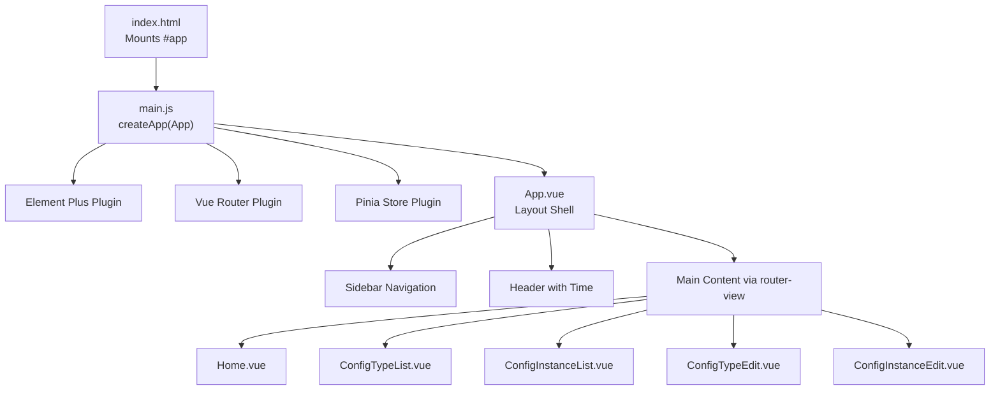
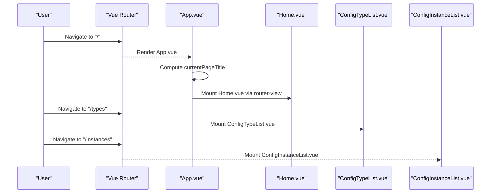
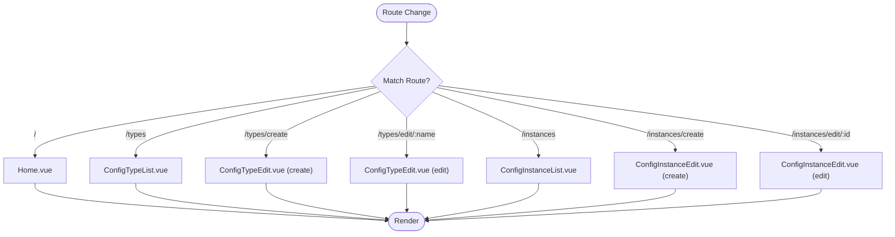
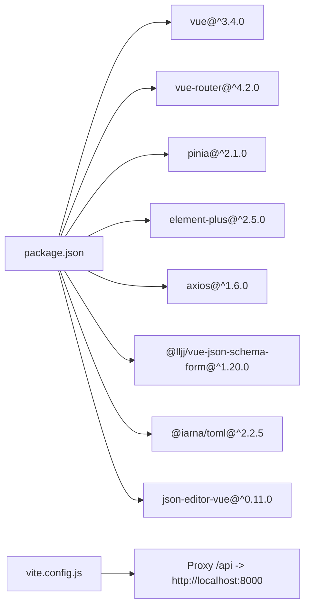

# Application Architecture & Routing

<cite>
**Referenced Files in This Document**
- [App.vue](file://frontend/src/App.vue)
- [main.js](file://frontend/src/main.js)
- [router/index.js](file://frontend/src/router/index.js)
- [Home.vue](file://frontend/src/views/Home.vue)
- [ConfigTypeList.vue](file://frontend/src/views/ConfigTypeList.vue)
- [ConfigInstanceList.vue](file://frontend/src/views/ConfigInstanceList.vue)
- [ConfigTypeEdit.vue](file://frontend/src/views/ConfigTypeEdit.vue)
- [ConfigInstanceEdit.vue](file://frontend/src/views/ConfigInstanceEdit.vue)
- [config.js](file://frontend/src/api/config.js)
- [sci-fi-theme.css](file://frontend/src/styles/sci-fi-theme.css)
- [package.json](file://frontend/package.json)
- [vite.config.js](file://frontend/vite.config.js)
- [index.html](file://frontend/index.html)
</cite>

## Table of Contents
1. [Introduction](#introduction)
2. [Project Structure](#project-structure)
3. [Core Components](#core-components)
4. [Architecture Overview](#architecture-overview)
5. [Detailed Component Analysis](#detailed-component-analysis)
6. [Dependency Analysis](#dependency-analysis)
7. [Performance Considerations](#performance-considerations)
8. [Troubleshooting Guide](#troubleshooting-guide)
9. [Conclusion](#conclusion)

## Introduction
This document explains the AI-Ops frontend architecture built with Vue.js 3, focusing on the application shell, routing system, layout composition, and styling. It covers how the main App component orchestrates the sidebar navigation, header, and main content area, how routes are configured and navigated, and how Element Plus and a custom sci-fi theme are integrated. It also documents lifecycle management, global styles, and the application entry point.

## Project Structure
The frontend is organized around a single-page application (SPA) pattern:
- Entry point initializes the Vue app, registers plugins, and mounts the root component.
- Router defines routes for dashboard, configuration types, and configuration instances (including create/edit).
- Views implement the page-level logic and UI using Element Plus components.
- Global styles define a cohesive sci-fi theme with neon aesthetics and responsive-friendly layouts.

**Diagram sources**
- [index.html:1-14](file://frontend/index.html#L1-L14)
- [main.js:1-22](file://frontend/src/main.js#L1-L22)
- [App.vue:1-288](file://frontend/src/App.vue#L1-L288)
- [router/index.js:1-52](file://frontend/src/router/index.js#L1-L52)
- [Home.vue:1-192](file://frontend/src/views/Home.vue#L1-L192)
- [ConfigTypeList.vue:1-99](file://frontend/src/views/ConfigTypeList.vue#L1-L99)
- [ConfigInstanceList.vue:1-170](file://frontend/src/views/ConfigInstanceList.vue#L1-L170)
- [ConfigTypeEdit.vue:1-171](file://frontend/src/views/ConfigTypeEdit.vue#L1-L171)
- [ConfigInstanceEdit.vue:1-237](file://frontend/src/views/ConfigInstanceEdit.vue#L1-L237)

**Section sources**
- [index.html:1-14](file://frontend/index.html#L1-L14)
- [main.js:1-22](file://frontend/src/main.js#L1-L22)
- [router/index.js:1-52](file://frontend/src/router/index.js#L1-L52)

## Core Components
- App.vue: Provides the application shell with a sci-fi sidebar, header with dynamic time display, and main content area driven by router-view. It computes the current page title based on the active route and manages a real-time clock.
- Views: Home.vue renders statistics and quick actions; ConfigTypeList.vue and ConfigInstanceList.vue present tabular data with filters and pagination; ConfigTypeEdit.vue and ConfigInstanceEdit.vue handle creation and editing forms with validation and content generation.

Key behaviors:
- Sidebar navigation items are bound to routes and highlight the active route.
- Header displays the current page title derived from the route path.
- Main content area is a scrollable container that hosts routed views.

**Section sources**
- [App.vue:1-288](file://frontend/src/App.vue#L1-L288)
- [Home.vue:1-192](file://frontend/src/views/Home.vue#L1-L192)
- [ConfigTypeList.vue:1-99](file://frontend/src/views/ConfigTypeList.vue#L1-L99)
- [ConfigInstanceList.vue:1-170](file://frontend/src/views/ConfigInstanceList.vue#L1-L170)
- [ConfigTypeEdit.vue:1-171](file://frontend/src/views/ConfigTypeEdit.vue#L1-L171)
- [ConfigInstanceEdit.vue:1-237](file://frontend/src/views/ConfigInstanceEdit.vue#L1-L237)

## Architecture Overview
The SPA follows a classic Vue 3 + Element Plus + Vue Router architecture:
- Entry point registers Element Plus, Vue Router, Pinia, and globally registers icons.
- App.vue composes the layout using Element Plus containers (Container/Header/Main/Sidebar).
- Router maps logical paths to view components, enabling programmatic navigation and deep-linking.
- Views consume Axios-based APIs to fetch and mutate data.

**Diagram sources**
- [router/index.js:1-52](file://frontend/src/router/index.js#L1-L52)
- [App.vue:77-86](file://frontend/src/App.vue#L77-L86)
- [Home.vue:1-192](file://frontend/src/views/Home.vue#L1-L192)
- [ConfigTypeList.vue:1-99](file://frontend/src/views/ConfigTypeList.vue#L1-L99)
- [ConfigInstanceList.vue:1-170](file://frontend/src/views/ConfigInstanceList.vue#L1-L170)

## Detailed Component Analysis

### App.vue Layout and Navigation
App.vue implements a three-section layout:
- Sidebar: Logo, navigation menu, and status panel. Menu items are reactive and reflect the current route.
- Header: Page title computed from the current route and a live clock.
- Main content: A scrollable container rendering the active route’s view.

Responsive design:
- Uses Element Plus layout components (el-container, el-aside, el-header, el-main) to structure the layout.
- Scoped styles apply a sci-fi theme with neon accents, grid background, and scanline overlay.

Lifecycle management:
- Initializes and updates the time display every second while mounted.
- Clears the interval on unmount to prevent memory leaks.

Navigation patterns:
- Clicking a menu item programmatically navigates to the associated path.
- Active state is determined by comparing the current route path to the menu item path.

**Section sources**
- [App.vue:1-288](file://frontend/src/App.vue#L1-L288)
- [sci-fi-theme.css:1-494](file://frontend/src/styles/sci-fi-theme.css#L1-L494)

### Router Configuration and Navigation Patterns
Routes are defined with explicit paths and components:
- Home, Config Types list, Config Types create/edit, Config Instances list, Instances create/edit.
- Parameterized routes support editing by name or id.

Navigation patterns:
- Programmatic navigation via $router.push in views and sidebar items.
- Dynamic page titles computed from the current route.

**Diagram sources**
- [router/index.js:8-44](file://frontend/src/router/index.js#L8-L44)

**Section sources**
- [router/index.js:1-52](file://frontend/src/router/index.js#L1-L52)

### View Components and Data Flow
- Home.vue: Fetches counts from two APIs concurrently and renders stats panels, quick actions, and system status.
- ConfigTypeList.vue: Loads configuration types, supports inline editing and deletion with confirmation.
- ConfigInstanceList.vue: Implements filtering by type/format/search, pagination, and related CRUD operations.
- ConfigTypeEdit.vue: Manages creation/editing of configuration types with JSON Schema validation and form rules.
- ConfigInstanceEdit.vue: Manages creation/editing of configuration instances, selects type/format, and validates content.

API integration:
- Axios client configured with base URL pointing to /api, proxied by Vite during development.

**Section sources**
- [Home.vue:134-158](file://frontend/src/views/Home.vue#L134-L158)
- [ConfigTypeList.vue:52-89](file://frontend/src/views/ConfigTypeList.vue#L52-L89)
- [ConfigInstanceList.vue:97-157](file://frontend/src/views/ConfigInstanceList.vue#L97-L157)
- [ConfigTypeEdit.vue:120-143](file://frontend/src/views/ConfigTypeEdit.vue#L120-L143)
- [ConfigInstanceEdit.vue:161-185](file://frontend/src/views/ConfigInstanceEdit.vue#L161-L185)
- [config.js:1-34](file://frontend/src/api/config.js#L1-L34)

### Component Composition and Slots
- Views commonly wrap content in Element Plus cards and use named slots for card headers.
- The App.vue main content area uses router-view as a slot outlet for routed components.

**Section sources**
- [ConfigTypeList.vue:3-11](file://frontend/src/views/ConfigTypeList.vue#L3-L11)
- [ConfigInstanceList.vue:3-11](file://frontend/src/views/ConfigInstanceList.vue#L3-L11)
- [App.vue:56](file://frontend/src/App.vue#L56)

### Styling, Themes, and Responsive Design
- Global theme variables define a sci-fi palette with neon colors, dark backgrounds, and subtle borders.
- App.vue applies the theme via scoped styles and overrides Element Plus component styles using :deep selectors.
- Layout components from Element Plus provide responsive behavior out-of-the-box.

**Section sources**
- [sci-fi-theme.css:1-494](file://frontend/src/styles/sci-fi-theme.css#L1-L494)
- [App.vue:109-287](file://frontend/src/App.vue#L109-L287)

## Dependency Analysis
External libraries and integrations:
- Vue 3, Vue Router 4, Pinia for state and routing.
- Element Plus for UI components and icons.
- Axios for API communication.
- Vite for dev server and build, with proxy configuration for /api.

**Diagram sources**
- [package.json:11-24](file://frontend/package.json#L11-L24)
- [vite.config.js:8-13](file://frontend/vite.config.js#L8-L13)

**Section sources**
- [package.json:1-26](file://frontend/package.json#L1-L26)
- [vite.config.js:1-19](file://frontend/vite.config.js#L1-L19)

## Performance Considerations
- Prefer lazy loading for heavy views if the application grows; currently all views are imported synchronously.
- Debounce or throttle frequent UI updates (e.g., the clock interval is appropriate at 1-second intervals).
- Use virtual lists or pagination for large datasets (already implemented in ConfigInstanceList.vue).
- Minimize re-renders by avoiding unnecessary reactive updates and using computed properties where possible.

## Troubleshooting Guide
Common issues and resolutions:
- Icons not rendering: Ensure all Element Plus icons are registered globally in main.js.
- API requests failing: Verify the /api proxy is active in development and the backend is reachable.
- Navigation not updating active state: Confirm menu item paths match route paths exactly.
- Time not updating: Check that the interval is cleared on component unmount.

**Section sources**
- [main.js:12-15](file://frontend/src/main.js#L12-L15)
- [vite.config.js:8-13](file://frontend/vite.config.js#L8-L13)
- [App.vue:98-106](file://frontend/src/App.vue#L98-L106)

## Conclusion
The AI-Ops frontend employs a clean, modular architecture leveraging Vue 3, Element Plus, and Vue Router. App.vue provides a cohesive layout with a sci-fi theme, while the router enables straightforward navigation across feature views. The views encapsulate business logic and integrate with Axios-based APIs. The design emphasizes readability, maintainability, and a consistent user experience across devices.