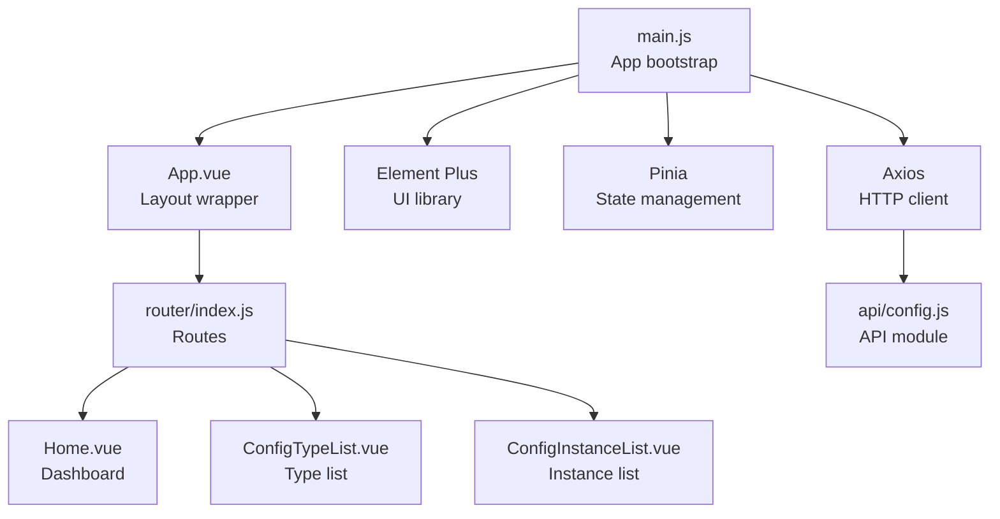
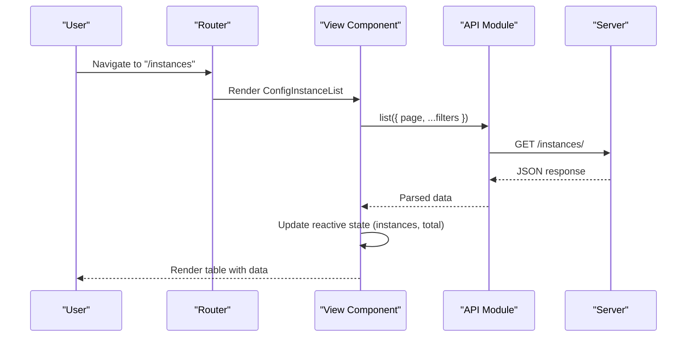
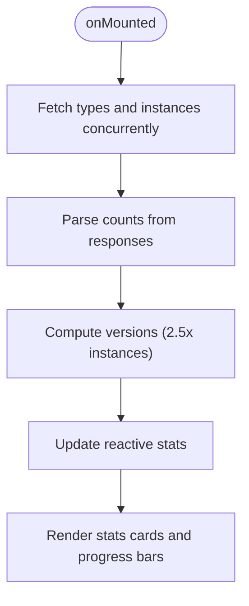
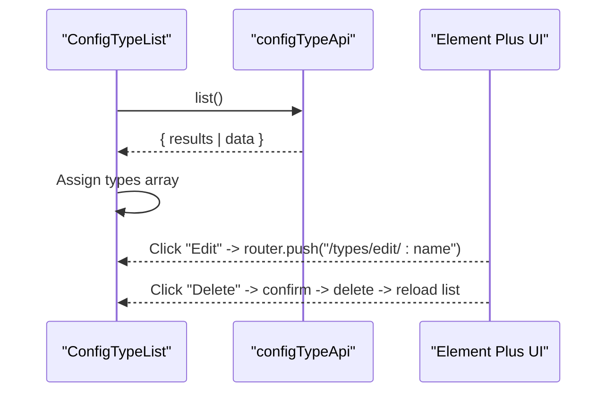
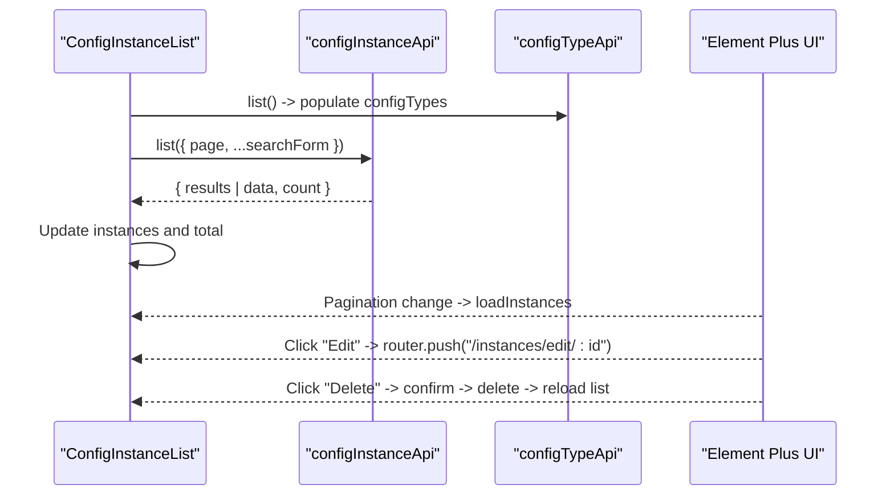
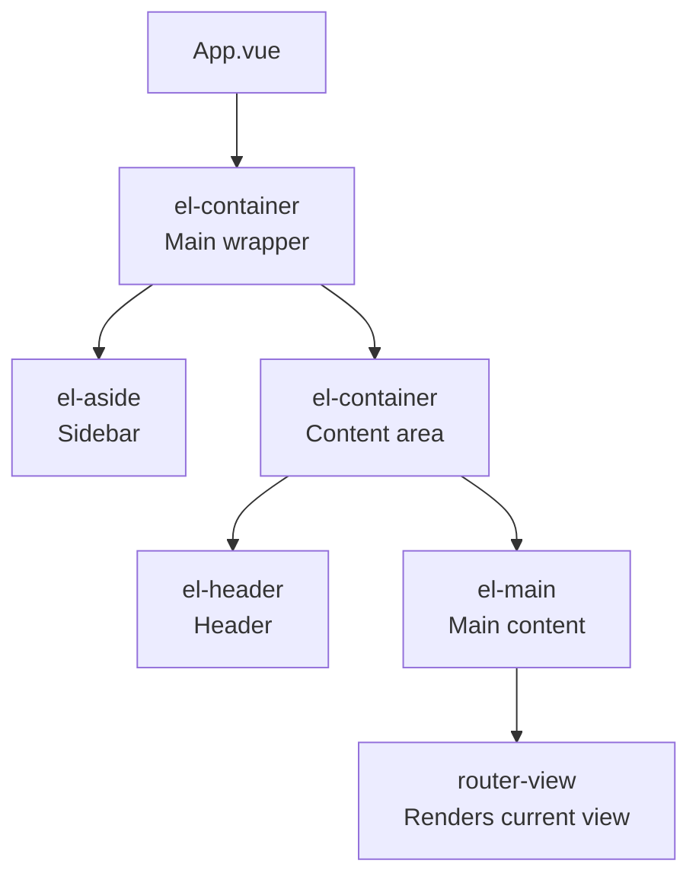
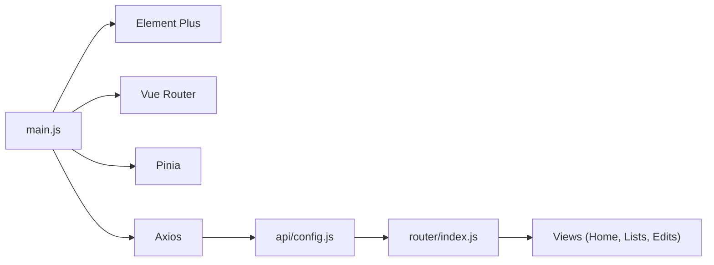

# Core UI Components & Layouts

<cite>
**Referenced Files in This Document**
- [Home.vue](file://frontend/src/views/Home.vue)
- [ConfigTypeList.vue](file://frontend/src/views/ConfigTypeList.vue)
- [ConfigInstanceList.vue](file://frontend/src/views/ConfigInstanceList.vue)
- [App.vue](file://frontend/src/App.vue)
- [main.js](file://frontend/src/main.js)
- [config.js](file://frontend/src/api/config.js)
- [index.js](file://frontend/src/router/index.js)
- [ConfigTypeEdit.vue](file://frontend/src/views/ConfigTypeEdit.vue)
- [ConfigInstanceEdit.vue](file://frontend/src/views/ConfigInstanceEdit.vue)
- [sci-fi-theme.css](file://frontend/src/styles/sci-fi-theme.css)
</cite>

## Table of Contents
1. [Introduction](#introduction)
2. [Project Structure](#project-structure)
3. [Core Components](#core-components)
4. [Architecture Overview](#architecture-overview)
5. [Detailed Component Analysis](#detailed-component-analysis)
6. [Dependency Analysis](#dependency-analysis)
7. [Performance Considerations](#performance-considerations)
8. [Accessibility Features](#accessibility-features)
9. [Responsive Design & Mobile-First Approach](#responsive-design--mobile-first-approach)
10. [Component Composition Patterns](#component-composition-patterns)
11. [Troubleshooting Guide](#troubleshooting-guide)
12. [Conclusion](#conclusion)

## Introduction
This document provides comprehensive documentation for the core UI components and layout system of the ConfigHub application. It focuses on the Home dashboard, configuration type list, and configuration instance list components, detailing props, data binding, event handling, Element Plus integration, responsive design, accessibility, and component composition patterns. The goal is to help developers understand how these components work together and how to extend or customize them effectively.

## Project Structure
The frontend is built with Vue 3, Vue Router, Pinia, and Element Plus. The application follows a feature-based structure with views representing pages and a central layout wrapper. The routing defines the navigation between the dashboard, configuration types, and configuration instances.

**Diagram sources**
- [main.js:1-22](file://frontend/src/main.js#L1-L22)
- [App.vue:1-288](file://frontend/src/App.vue#L1-L288)
- [index.js:1-52](file://frontend/src/router/index.js#L1-L52)
- [Home.vue:1-192](file://frontend/src/views/Home.vue#L1-L192)
- [ConfigTypeList.vue:1-99](file://frontend/src/views/ConfigTypeList.vue#L1-L99)
- [ConfigInstanceList.vue:1-170](file://frontend/src/views/ConfigInstanceList.vue#L1-L170)
- [config.js:1-34](file://frontend/src/api/config.js#L1-L34)

**Section sources**
- [main.js:1-22](file://frontend/src/main.js#L1-L22)
- [App.vue:1-288](file://frontend/src/App.vue#L1-L288)
- [index.js:1-52](file://frontend/src/router/index.js#L1-L52)

## Core Components
This section documents the three primary UI components: Home dashboard, configuration type list, and configuration instance list. It explains props, data binding, events, and Element Plus integrations.

- Home Dashboard (Home.vue)
  - Purpose: Displays system statistics, quick actions, and system status.
  - Data binding: Reactive stats object loaded on mount using concurrent API calls.
  - Events: Navigation via router links; hover effects on panels.
  - Element Plus: el-row, el-col, el-icon, el-card, custom progress bars.
  - Props: None (no external props passed).
  - Accessibility: Uses semantic icons and labels; relies on Element Plus for keyboard navigation.

- Configuration Type List (ConfigTypeList.vue)
  - Purpose: Lists configuration types with metadata, format badges, and action buttons.
  - Data binding: types array, loading state; search form model.
  - Events: Edit and delete actions; navigation to create/edit routes.
  - Element Plus: el-card, el-table, el-table-column, el-tag, el-button, el-message, el-message-box.
  - Props: None (no external props passed).
  - Accessibility: Table headers and buttons are keyboard accessible via Element Plus.

- Configuration Instance List (ConfigInstanceList.vue)
  - Purpose: Lists configuration instances with filters, pagination, and actions.
  - Data binding: instances array, total count, page, page size; search form model; configTypes list.
  - Events: Load instances on mount and pagination change; edit/view versions/delete actions.
  - Element Plus: el-card, el-form, el-form-item, el-select, el-input, el-table, el-pagination, el-button, el-message, el-message-box.
  - Props: None (no external props passed).
  - Accessibility: Form controls and pagination are keyboard accessible via Element Plus.

**Section sources**
- [Home.vue:1-192](file://frontend/src/views/Home.vue#L1-L192)
- [ConfigTypeList.vue:1-99](file://frontend/src/views/ConfigTypeList.vue#L1-L99)
- [ConfigInstanceList.vue:1-170](file://frontend/src/views/ConfigInstanceList.vue#L1-L170)

## Architecture Overview
The application uses a layered architecture:
- Presentation layer: Vue components (views) render UI and handle user interactions.
- Routing layer: Vue Router manages navigation between views.
- State layer: Pinia is initialized but not actively used in the referenced components.
- Data layer: Axios-based API module encapsulates HTTP requests to the backend.

**Diagram sources**
- [index.js:1-52](file://frontend/src/router/index.js#L1-L52)
- [ConfigInstanceList.vue:76-157](file://frontend/src/views/ConfigInstanceList.vue#L76-L157)
- [config.js:21-31](file://frontend/src/api/config.js#L21-L31)

## Detailed Component Analysis

### Home Dashboard (Home.vue)
- Data model: stats object with types, instances, and versions.
- Lifecycle: onMounted triggers concurrent API calls to load counts.
- UI layout: Element Plus grid system (el-row, el-col) for stats cards; custom panels with corner accents and glow effects.
- Interactions: Buttons navigate to creation routes; hover effects enhance UX.
- Styling: Scoped styles integrate with sci-fi theme variables and animations.

**Diagram sources**
- [Home.vue:134-158](file://frontend/src/views/Home.vue#L134-L158)

**Section sources**
- [Home.vue:1-192](file://frontend/src/views/Home.vue#L1-L192)
- [config.js:11-19](file://frontend/src/api/config.js#L11-L19)

### Configuration Type List (ConfigTypeList.vue)
- Data model: types array, loading flag.
- Filters: None in template; can be extended via form bindings.
- Actions: Edit and delete with confirmation dialog; navigation to edit route.
- UI: Card header with primary button; table with format badges and formatted dates.

**Diagram sources**
- [ConfigTypeList.vue:41-90](file://frontend/src/views/ConfigTypeList.vue#L41-L90)
- [config.js:11-19](file://frontend/src/api/config.js#L11-L19)

**Section sources**
- [ConfigTypeList.vue:1-99](file://frontend/src/views/ConfigTypeList.vue#L1-L99)
- [config.js:11-19](file://frontend/src/api/config.js#L11-L19)

### Configuration Instance List (ConfigInstanceList.vue)
- Data model: instances array, total, page, page size, searchForm, configTypes.
- Filters: config_type, format, search; applied to list endpoint.
- Pagination: v-model bindings for current page and page size; emits current-change.
- Actions: Edit, view versions (placeholder), delete with confirmation; navigation to edit route.

**Diagram sources**
- [ConfigInstanceList.vue:76-157](file://frontend/src/views/ConfigInstanceList.vue#L76-L157)
- [config.js:21-31](file://frontend/src/api/config.js#L21-L31)

**Section sources**
- [ConfigInstanceList.vue:1-170](file://frontend/src/views/ConfigInstanceList.vue#L1-L170)
- [config.js:21-31](file://frontend/src/api/config.js#L21-L31)

### Layout Wrapper (App.vue)
- Layout: Element Plus container with sidebar, header, and main content area.
- Navigation: Menu items mapped to routes; active state based on current route.
- Header: Page title computed from route; time display updates every second.
- Theming: Extensive scoped styles override Element Plus defaults; integrates sci-fi theme.

**Diagram sources**
- [App.vue:1-288](file://frontend/src/App.vue#L1-L288)

**Section sources**
- [App.vue:1-288](file://frontend/src/App.vue#L1-L288)

### Edit Components (ConfigTypeEdit.vue, ConfigInstanceEdit.vue)
- ConfigTypeEdit.vue
  - Purpose: Create or edit configuration types with JSON/TOML format and JSON Schema.
  - Data binding: form object with validation rules; schema editor with live validation.
  - Events: Submit saves or updates; navigation back on cancel.
  - UI: Form with radio groups, textarea, alerts, and validation feedback.

- ConfigInstanceEdit.vue
  - Purpose: Create or edit configuration instances with dynamic content editor modes.
  - Data binding: form with type selection, name, format, and content; generates example content from schema.
  - Events: Submit saves or updates; navigation back on cancel.
  - UI: Tabs for code/form editing; content validation and error feedback.

**Section sources**
- [ConfigTypeEdit.vue:1-171](file://frontend/src/views/ConfigTypeEdit.vue#L1-L171)
- [ConfigInstanceEdit.vue:1-237](file://frontend/src/views/ConfigInstanceEdit.vue#L1-L237)

## Dependency Analysis
- Runtime dependencies: Vue 3, Vue Router, Pinia, Element Plus, Axios.
- Build-time dependencies: Vite, Vue plugin for Vite.
- Element Plus icons are globally registered in main.js.
- API module centralizes HTTP calls with base URL and shared headers.

**Diagram sources**
- [main.js:1-22](file://frontend/src/main.js#L1-L22)
- [config.js:1-34](file://frontend/src/api/config.js#L1-L34)
- [index.js:1-52](file://frontend/src/router/index.js#L1-L52)

**Section sources**
- [main.js:1-22](file://frontend/src/main.js#L1-L22)
- [package.json:11-24](file://frontend/package.json#L11-L24)

## Performance Considerations
- Concurrent API loads: Home dashboard uses Promise.all to fetch counts efficiently.
- Loading states: Lists set loading flags during network requests to prevent redundant calls.
- Pagination: Instance list uses server-side pagination to limit payload sizes.
- Virtualization: Consider adding virtualized lists for large datasets if performance becomes an issue.
- Debouncing: Add debounced search for filters if needed to reduce API calls.

## Accessibility Features
- Keyboard navigation: Element Plus components provide built-in keyboard support for tables, forms, and dialogs.
- Screen reader support: Semantic markup and labels are used; ensure custom components announce state changes.
- Focus management: Maintain focus after modal confirmations and navigation.
- Color contrast: Theme variables ensure sufficient contrast for neon colors against dark backgrounds.
- ARIA attributes: Add explicit aria-labels for icons and buttons if needed for assistive technologies.

## Responsive Design & Mobile-First Approach
- Grid system: Element Plus el-row and el-col provide responsive breakpoints; components use span-based layouts.
- Container sizing: App.vue sets full viewport height; main content area scrolls independently.
- Typography: Orbitron and Share Tech Mono fonts adapt across devices; ensure fallbacks are available.
- Touch targets: Buttons and form controls are sized for touch interaction; consider increasing hit areas if needed.
- Orientation changes: Panels and tables adapt to smaller screens; consider stacking layout for very small widths.

## Component Composition Patterns
- Layout composition: App.vue composes sidebar, header, and main content; router-view renders page-specific views.
- Data fetching: Views encapsulate their own data loading; API module centralizes HTTP logic.
- Event-driven UI: Components emit events (e.g., pagination) and handle user actions via handlers.
- Reusable utilities: The API module can be extended for shared logic; consider extracting common UI patterns into reusable components.

## Troubleshooting Guide
- Network errors: API module throws errors; handle gracefully with Element Plus messages.
- Validation failures: Forms use Element Plus validation; ensure error messages are user-friendly.
- Navigation issues: Verify routes exist and parameters match component expectations.
- Theme inconsistencies: Ensure sci-fi theme variables are defined and Element Plus overrides are applied.

**Section sources**
- [Home.vue:145-157](file://frontend/src/views/Home.vue#L145-L157)
- [ConfigTypeList.vue:52-83](file://frontend/src/views/ConfigTypeList.vue#L52-L83)
- [ConfigInstanceList.vue:97-147](file://frontend/src/views/ConfigInstanceList.vue#L97-L147)

## Conclusion
The core UI components demonstrate a clean separation of concerns, leveraging Element Plus for robust UI primitives while maintaining a cohesive sci-fi aesthetic. The layout wrapper ensures consistent navigation and theming, and the list components implement efficient data fetching, filtering, and pagination. By following the documented patterns and addressing the accessibility and responsiveness considerations, developers can extend the system with confidence.