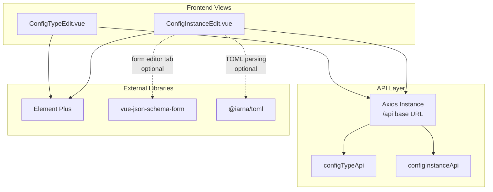
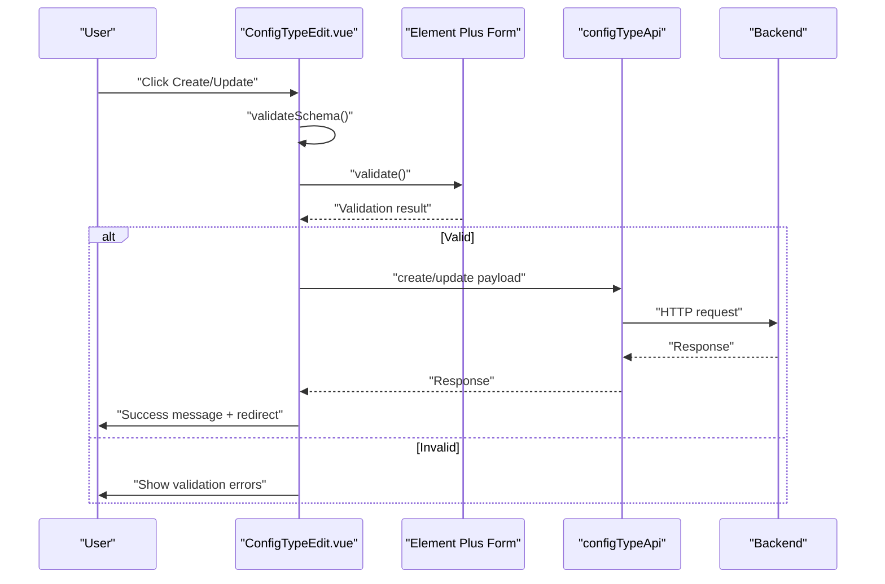
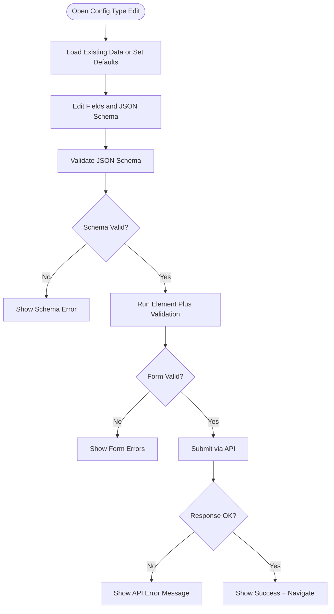
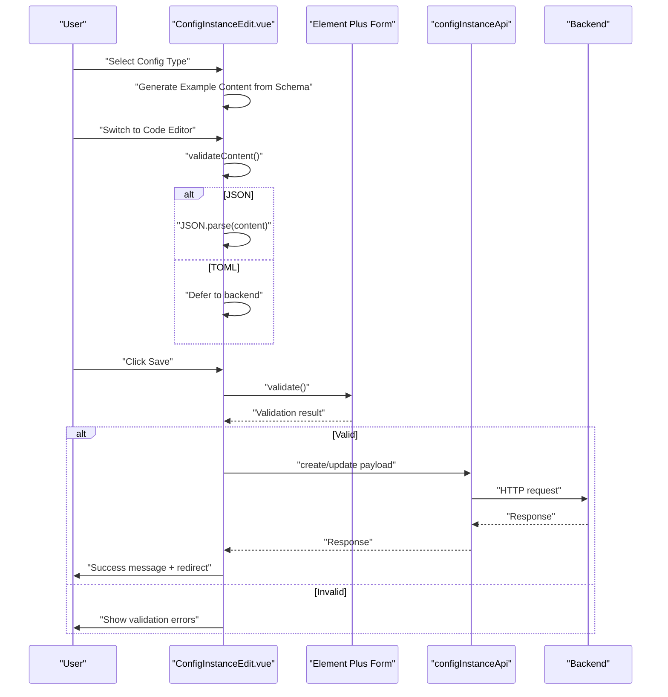
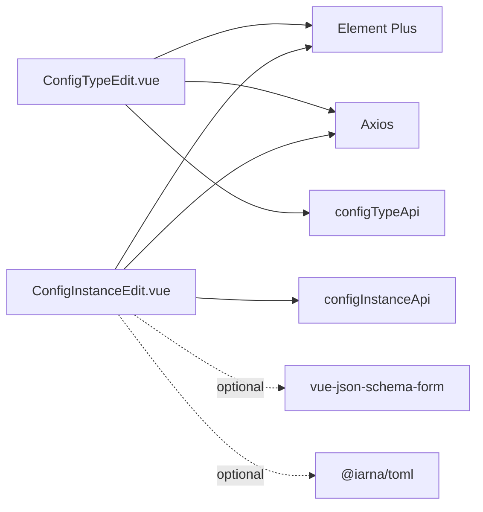

# Form Components & Validation

<cite>
**Referenced Files in This Document**
- [ConfigTypeEdit.vue](file://frontend/src/views/ConfigTypeEdit.vue)
- [ConfigInstanceEdit.vue](file://frontend/src/views/ConfigInstanceEdit.vue)
- [config.js](file://frontend/src/api/config.js)
- [package.json](file://frontend/package.json)
</cite>

## Table of Contents
1. [Introduction](#introduction)
2. [Project Structure](#project-structure)
3. [Core Components](#core-components)
4. [Architecture Overview](#architecture-overview)
5. [Detailed Component Analysis](#detailed-component-analysis)
6. [Dependency Analysis](#dependency-analysis)
7. [Performance Considerations](#performance-considerations)
8. [Troubleshooting Guide](#troubleshooting-guide)
9. [Conclusion](#conclusion)
10. [Appendices](#appendices)

## Introduction
This document explains the form components and validation systems used to create and edit configuration types and instances. It covers the configuration type edit component and configuration instance edit component, detailing form validation patterns, input handling, error display mechanisms, JSON Schema validation integration, dynamic form generation, field mapping, form state management, data binding, submission workflows, validation rules, custom validators, real-time feedback patterns, accessibility considerations, and practical examples for customization and complex validation scenarios.

## Project Structure
The relevant frontend components are single-file Vue 3 components with script setup and Element Plus form controls. They communicate with backend APIs via Axios and use reactive composition APIs for state management.

**Diagram sources**
- [ConfigTypeEdit.vue:100-205](file://frontend/src/views/ConfigTypeEdit.vue#L100-L205)
- [ConfigInstanceEdit.vue:67-213](file://frontend/src/views/ConfigInstanceEdit.vue#L67-L213)
- [config.js:1-34](file://frontend/src/api/config.js#L1-L34)
- [package.json:11-20](file://frontend/package.json#L11-L20)

**Section sources**
- [ConfigTypeEdit.vue:1-273](file://frontend/src/views/ConfigTypeEdit.vue#L1-L273)
- [ConfigInstanceEdit.vue:1-237](file://frontend/src/views/ConfigInstanceEdit.vue#L1-L237)
- [config.js:1-34](file://frontend/src/api/config.js#L1-L34)
- [package.json:1-26](file://frontend/package.json#L1-L26)

## Core Components
- Configuration Type Edit Component
  - Purpose: Create or update a configuration type with a JSON Schema that defines the structure for auto-generated forms.
  - Key features:
    - Two-column layout for metadata (Type ID, Display Name).
    - Format selector for JSON/TOML.
    - JSON Schema editor with real-time validation and error display.
    - Built-in validation rules for required fields and naming conventions.
    - Submission workflow with success/error messaging and navigation.

- Configuration Instance Edit Component
  - Purpose: Create or update a configuration instance bound to a configuration type, supporting JSON and TOML formats.
  - Key features:
    - Selectable configuration type with format propagation.
    - Dual editing modes: code editor and form editor (placeholder for JSON Schema-based form).
    - Example content generation from a configuration type’s schema.
    - Content validation for JSON and deferred TOML validation to backend.
    - Submission workflow with success/error messaging and navigation.

**Section sources**
- [ConfigTypeEdit.vue:10-98](file://frontend/src/views/ConfigTypeEdit.vue#L10-L98)
- [ConfigInstanceEdit.vue:1-65](file://frontend/src/views/ConfigInstanceEdit.vue#L1-L65)

## Architecture Overview
The forms integrate Element Plus form controls with reactive state and API clients. Validation occurs both at the UI level (Element Plus rules) and at the content level (JSON parse checks). The configuration instance component demonstrates a hybrid approach: code-first editing with a placeholder for a JSON Schema–based form editor.

**Diagram sources**
- [ConfigTypeEdit.vue:155-190](file://frontend/src/views/ConfigTypeEdit.vue#L155-L190)
- [config.js:12-19](file://frontend/src/api/config.js#L12-L19)

**Section sources**
- [ConfigTypeEdit.vue:167-190](file://frontend/src/views/ConfigTypeEdit.vue#L167-L190)
- [ConfigInstanceEdit.vue:161-185](file://frontend/src/views/ConfigInstanceEdit.vue#L161-L185)

## Detailed Component Analysis

### Configuration Type Edit Component
- State and Binding
  - Reactive form object holds name, title, format, description, and schema.
  - Watcher synchronizes the schema object to a textarea for editing.
  - Computed flag determines edit vs. new mode.

- Validation Patterns
  - Element Plus form rules enforce required fields and naming patterns.
  - Custom validator ensures JSON Schema is syntactically valid before submission.
  - Real-time feedback via schema error display.

- Dynamic Behavior
  - Format selector toggles between JSON and TOML.
  - On creation, a default JSON Schema is injected into the editor.
  - On edit, existing data is loaded and displayed.

- Submission Workflow
  - Validates schema, then validates the Element Plus form.
  - Dispatches create or update via API client.
  - Handles success and error messages; navigates on success.

- Accessibility and UX
  - Clear labels and placeholders.
  - Disabled states during save operations.
  - Visual feedback for active format selection.

**Diagram sources**
- [ConfigTypeEdit.vue:149-190](file://frontend/src/views/ConfigTypeEdit.vue#L149-L190)

**Section sources**
- [ConfigTypeEdit.vue:100-205](file://frontend/src/views/ConfigTypeEdit.vue#L100-L205)
- [ConfigTypeEdit.vue:140-147](file://frontend/src/views/ConfigTypeEdit.vue#L140-L147)
- [ConfigTypeEdit.vue:155-165](file://frontend/src/views/ConfigTypeEdit.vue#L155-L165)

### Configuration Instance Edit Component
- State and Binding
  - Reactive form object holds config_type, name, format, and content.
  - Loads configuration types for selection and propagates format on change.
  - Generates example content from the selected type’s schema.

- Validation Patterns
  - JSON content validated via parse check; TOML validated server-side.
  - Element Plus rules for required fields and format selection.
  - Real-time error display for content formatting issues.

- Dynamic Behavior
  - Edit mode switch between code and form (placeholder).
  - Placeholder indicates optional integration with a JSON Schema form library.
  - Content placeholder adapts to selected format.

- Submission Workflow
  - Validates content, then validates the Element Plus form.
  - Dispatches create or update via API client.
  - Handles success and error messages; navigates on success.

- Accessibility and UX
  - Tabs for switching editing modes.
  - Disabled states when appropriate.
  - Clear hints for JSON Schema–based form editor.

**Diagram sources**
- [ConfigInstanceEdit.vue:108-185](file://frontend/src/views/ConfigInstanceEdit.vue#L108-L185)
- [config.js:22-31](file://frontend/src/api/config.js#L22-L31)

**Section sources**
- [ConfigInstanceEdit.vue:67-213](file://frontend/src/views/ConfigInstanceEdit.vue#L67-L213)
- [ConfigInstanceEdit.vue:102-106](file://frontend/src/views/ConfigInstanceEdit.vue#L102-L106)
- [ConfigInstanceEdit.vue:145-159](file://frontend/src/views/ConfigInstanceEdit.vue#L145-L159)

### JSON Schema Validation Integration
- Configuration Type Edit
  - The schema is edited as text and validated on blur.
  - On successful parse, the schema object is bound to the form model.
  - Submission proceeds only after both schema and form validations pass.

- Configuration Instance Edit
  - JSON content is validated locally; TOML is validated server-side.
  - The component prepares example content from the selected type’s schema to aid creation.

**Section sources**
- [ConfigTypeEdit.vue:56-74](file://frontend/src/views/ConfigTypeEdit.vue#L56-L74)
- [ConfigTypeEdit.vue:155-165](file://frontend/src/views/ConfigTypeEdit.vue#L155-L165)
- [ConfigInstanceEdit.vue:31-56](file://frontend/src/views/ConfigInstanceEdit.vue#L31-L56)
- [ConfigInstanceEdit.vue:117-143](file://frontend/src/views/ConfigInstanceEdit.vue#L117-L143)
- [ConfigInstanceEdit.vue:145-159](file://frontend/src/views/ConfigInstanceEdit.vue#L145-L159)

### Dynamic Form Generation and Field Mapping
- Configuration Type Edit
  - Uses Element Plus form items mapped to fields in the reactive form object.
  - Format selector updates the schema editor and UI affordances.

- Configuration Instance Edit
  - Provides a placeholder for a JSON Schema–based form editor.
  - Field mapping is derived from the selected configuration type’s schema for example generation.

**Section sources**
- [ConfigTypeEdit.vue:10-98](file://frontend/src/views/ConfigTypeEdit.vue#L10-L98)
- [ConfigInstanceEdit.vue:42-52](file://frontend/src/views/ConfigInstanceEdit.vue#L42-L52)
- [ConfigInstanceEdit.vue:117-143](file://frontend/src/views/ConfigInstanceEdit.vue#L117-L143)

### Form State Management and Data Binding
- Both components use reactive refs and watchers to maintain synchronization between the form model and UI controls.
- Computed properties derive UI state (e.g., edit mode, selected type, content placeholder).
- Watchers keep the schema text synchronized with the schema object.

**Section sources**
- [ConfigTypeEdit.vue:149-153](file://frontend/src/views/ConfigTypeEdit.vue#L149-L153)
- [ConfigInstanceEdit.vue:82-93](file://frontend/src/views/ConfigInstanceEdit.vue#L82-L93)

### Submission Workflows
- Both components validate content and form rules before dispatching API requests.
- Error handling displays user-friendly messages and prevents navigation until resolved.
- Success triggers navigation to lists and displays confirmation.

**Section sources**
- [ConfigTypeEdit.vue:167-190](file://frontend/src/views/ConfigTypeEdit.vue#L167-L190)
- [ConfigInstanceEdit.vue:161-185](file://frontend/src/views/ConfigInstanceEdit.vue#L161-L185)

### Validation Rules and Custom Validators
- Required fields enforced via Element Plus rules.
- Pattern validation for naming conventions in configuration type edit.
- Custom validators:
  - JSON Schema parse validation in configuration type edit.
  - JSON parse validation and TOML placeholder in configuration instance edit.

**Section sources**
- [ConfigTypeEdit.vue:140-147](file://frontend/src/views/ConfigTypeEdit.vue#L140-L147)
- [ConfigInstanceEdit.vue:102-106](file://frontend/src/views/ConfigInstanceEdit.vue#L102-L106)
- [ConfigInstanceEdit.vue:145-159](file://frontend/src/views/ConfigInstanceEdit.vue#L145-L159)

### Real-Time Feedback Patterns
- Immediate schema validation on blur in configuration type edit.
- Content validation on demand in configuration instance edit.
- Visual indicators for active selections and error states.

**Section sources**
- [ConfigTypeEdit.vue:65](file://frontend/src/views/ConfigTypeEdit.vue#L65)
- [ConfigInstanceEdit.vue:33-56](file://frontend/src/views/ConfigInstanceEdit.vue#L33-L56)

### Accessibility, ARIA Attributes, and UX Considerations
- Clear labels and placeholders for all form controls.
- Disabled states during submission to prevent duplicate submissions.
- Visual feedback for active selections and error highlights.
- Tabbed interface for dual editing modes with accessible tab panes.

**Section sources**
- [ConfigTypeEdit.vue:264-272](file://frontend/src/views/ConfigTypeEdit.vue#L264-L272)
- [ConfigInstanceEdit.vue:33-56](file://frontend/src/views/ConfigInstanceEdit.vue#L33-L56)

### Examples of Customization, Conditional Fields, and Complex Validation
- Customizing validation rules:
  - Add or modify Element Plus rules for specific fields.
  - Introduce asynchronous validators for uniqueness checks.
- Conditional fields:
  - Show/hide content editor tabs based on format selection.
  - Enable/disable controls based on edit/new mode.
- Complex validation scenarios:
  - Cross-field validation (e.g., ensuring content matches schema structure).
  - Format-specific validation (e.g., JSON vs. TOML).
  - Integration with external libraries for advanced JSON Schema–based forms.

**Section sources**
- [ConfigTypeEdit.vue:140-147](file://frontend/src/views/ConfigTypeEdit.vue#L140-L147)
- [ConfigInstanceEdit.vue:108-115](file://frontend/src/views/ConfigInstanceEdit.vue#L108-L115)
- [ConfigInstanceEdit.vue:42-52](file://frontend/src/views/ConfigInstanceEdit.vue#L42-L52)

## Dependency Analysis
- External libraries:
  - Element Plus for form controls and UI components.
  - vue-json-schema-form for potential JSON Schema–based form rendering.
  - @iarna/toml for TOML parsing utilities.
- Internal dependencies:
  - API clients encapsulate HTTP interactions with the backend.

**Diagram sources**
- [package.json:11-20](file://frontend/package.json#L11-L20)
- [config.js:12-31](file://frontend/src/api/config.js#L12-L31)

**Section sources**
- [package.json:11-20](file://frontend/package.json#L11-L20)
- [config.js:12-31](file://frontend/src/api/config.js#L12-L31)

## Performance Considerations
- Debounce schema validation on blur to avoid excessive revalidation during typing.
- Use computed properties for derived UI state to minimize unnecessary renders.
- Lazy-load the JSON Schema form editor to reduce initial bundle size.
- Cache API responses for configuration types to speed up selection and example generation.

## Troubleshooting Guide
- Schema validation fails:
  - Ensure the JSON Schema is syntactically valid before submission.
  - Check for trailing commas or incorrect data types.
- Content validation fails:
  - Verify JSON syntax or defer to backend for TOML validation.
  - Confirm the selected format matches the content.
- API errors:
  - Inspect error messages returned by the backend and display user-friendly messages.
  - Confirm network connectivity and endpoint availability.

**Section sources**
- [ConfigTypeEdit.vue:155-165](file://frontend/src/views/ConfigTypeEdit.vue#L155-L165)
- [ConfigInstanceEdit.vue:145-159](file://frontend/src/views/ConfigInstanceEdit.vue#L145-L159)
- [ConfigInstanceEdit.vue:179-184](file://frontend/src/views/ConfigInstanceEdit.vue#L179-L184)

## Conclusion
The form components implement robust validation patterns combining Element Plus rules, custom content validators, and JSON Schema integration. They support dynamic editing modes, real-time feedback, and clear user guidance. Extending these components with advanced JSON Schema–based forms and enhanced accessibility features can further improve usability and developer experience.

## Appendices
- API Endpoints Used
  - Configuration Types: list, get, create, update, delete, instances.
  - Configuration Instances: list, get, create, update, delete, versions, rollback, content.

**Section sources**
- [config.js:12-31](file://frontend/src/api/config.js#L12-L31)