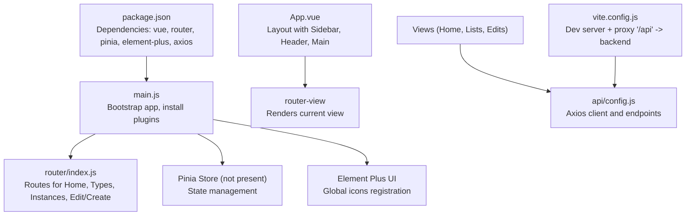
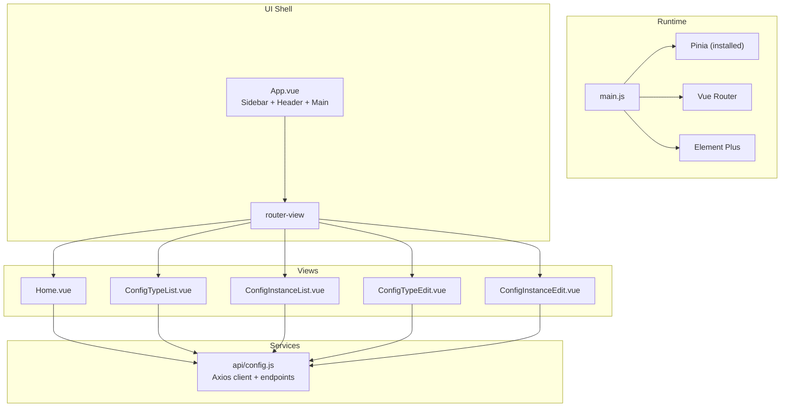
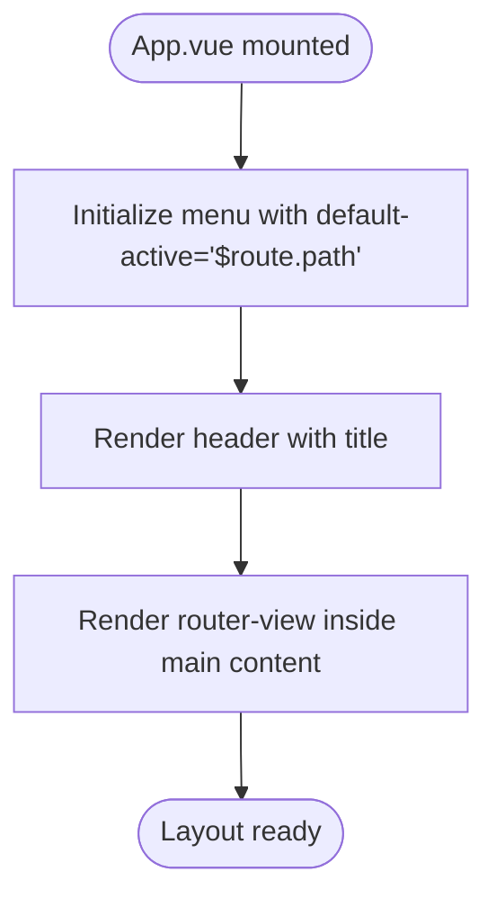
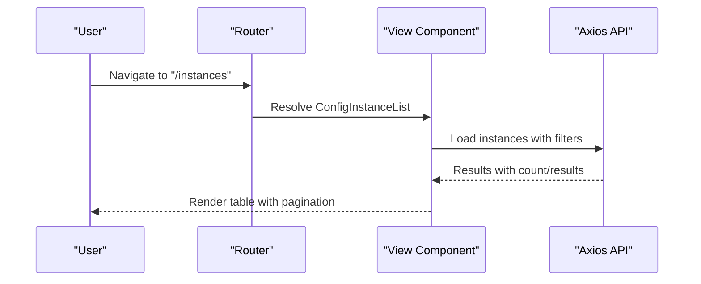
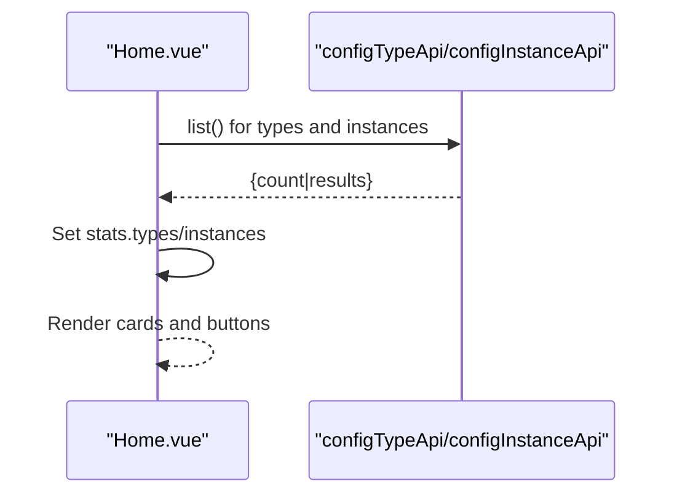
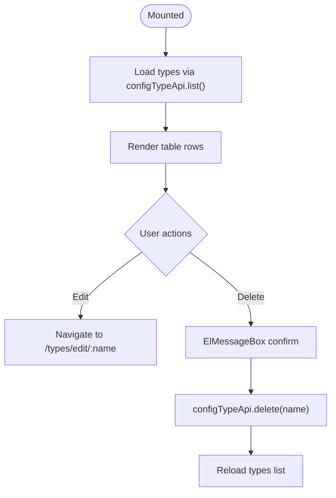
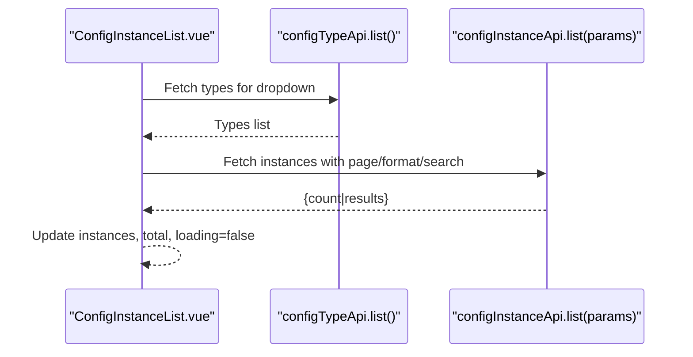
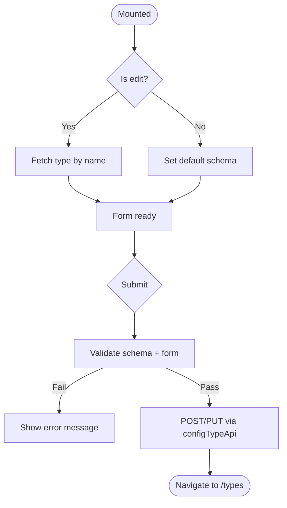
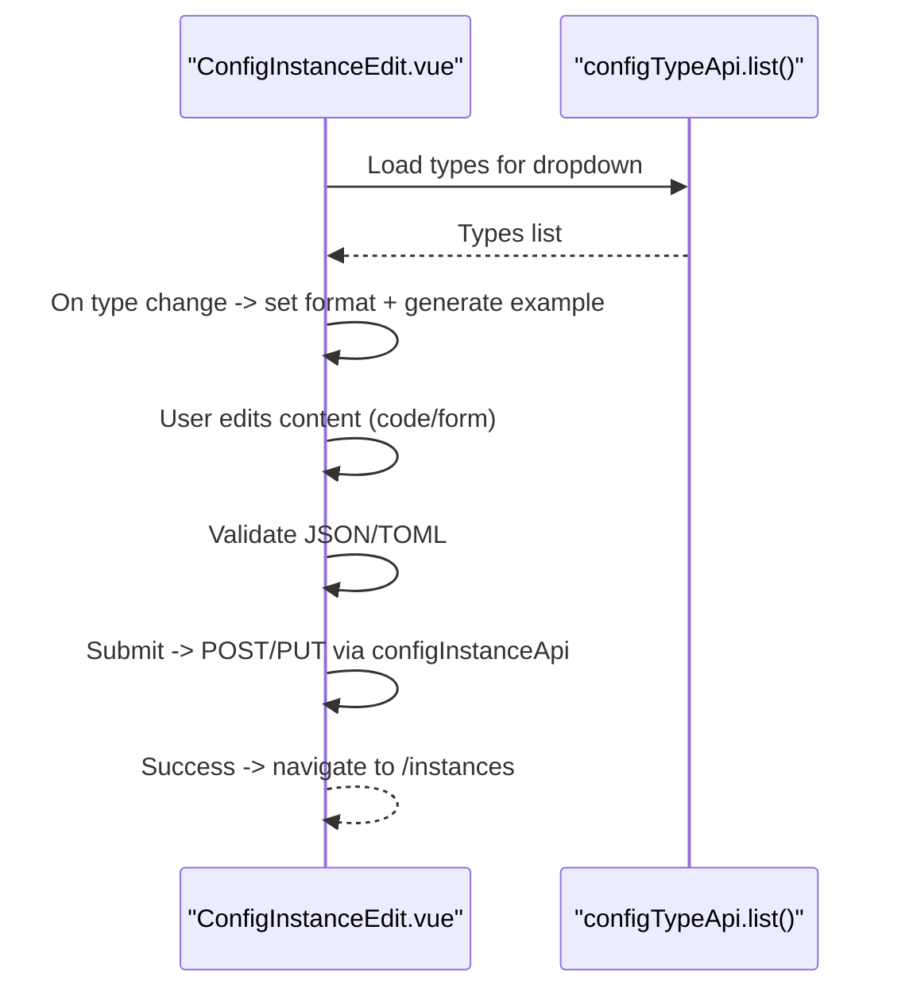
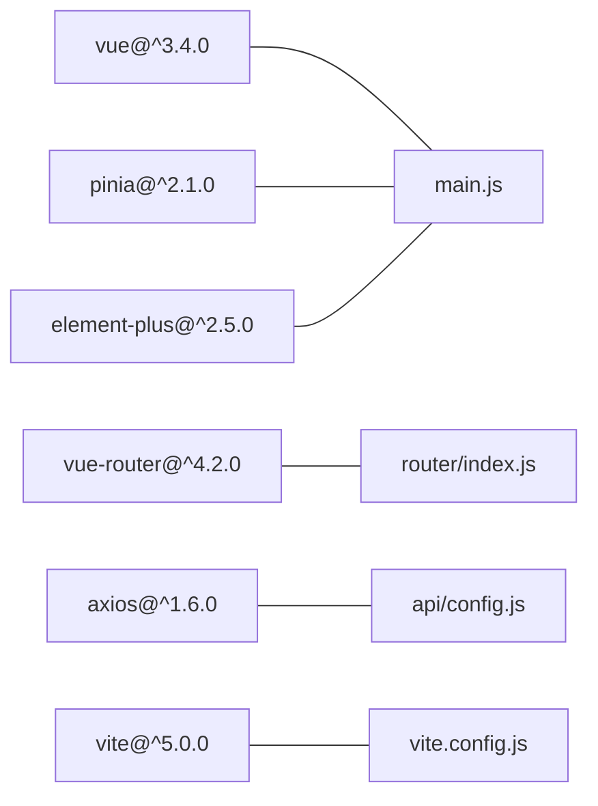

# Frontend Components

<cite>
**Referenced Files in This Document**
- [main.js](file://frontend/src/main.js)
- [App.vue](file://frontend/src/App.vue)
- [router/index.js](file://frontend/src/router/index.js)
- [Home.vue](file://frontend/src/views/Home.vue)
- [ConfigTypeList.vue](file://frontend/src/views/ConfigTypeList.vue)
- [ConfigInstanceList.vue](file://frontend/src/views/ConfigInstanceList.vue)
- [ConfigTypeEdit.vue](file://frontend/src/views/ConfigTypeEdit.vue)
- [ConfigInstanceEdit.vue](file://frontend/src/views/ConfigInstanceEdit.vue)
- [config.js](file://frontend/src/api/config.js)
- [package.json](file://frontend/package.json)
- [vite.config.js](file://frontend/vite.config.js)
</cite>

## Table of Contents
1. [Introduction](#introduction)
2. [Project Structure](#project-structure)
3. [Core Components](#core-components)
4. [Architecture Overview](#architecture-overview)
5. [Detailed Component Analysis](#detailed-component-analysis)
6. [Dependency Analysis](#dependency-analysis)
7. [Performance Considerations](#performance-considerations)
8. [Troubleshooting Guide](#troubleshooting-guide)
9. [Conclusion](#conclusion)
10. [Appendices](#appendices)

## Introduction
This document describes the AI-Ops Configuration Hub frontend built with Vue 3, Vue Router, Pinia, and Element Plus. It explains the application layout, navigation, routing, and the component hierarchy for the main views: Home/Dashboard, Configuration Type List, Configuration Instance List, Configuration Type Edit, and Configuration Instance Edit. It also documents data binding patterns, UI integration with Element Plus, API integration via Axios, and practical guidance for accessibility, performance, and cross-browser compatibility.

## Project Structure
The frontend is organized around a single-page application (SPA) shell with a sidebar navigation and a router outlet rendering views. Routing is configured for five primary pages: Home, Configuration Types list, Configuration Instances list, and two edit pages (create and edit) for each entity. The application integrates Element Plus for UI components and uses Axios to communicate with the backend API.

**Diagram sources**
- [main.js:1-22](file://frontend/src/main.js#L1-L22)
- [router/index.js:1-52](file://frontend/src/router/index.js#L1-L52)
- [App.vue:1-84](file://frontend/src/App.vue#L1-L84)
- [config.js:1-34](file://frontend/src/api/config.js#L1-L34)
- [package.json:1-26](file://frontend/package.json#L1-L26)
- [vite.config.js:1-19](file://frontend/vite.config.js#L1-L19)

**Section sources**
- [main.js:1-22](file://frontend/src/main.js#L1-L22)
- [router/index.js:1-52](file://frontend/src/router/index.js#L1-L52)
- [App.vue:1-84](file://frontend/src/App.vue#L1-L84)
- [config.js:1-34](file://frontend/src/api/config.js#L1-L34)
- [package.json:1-26](file://frontend/package.json#L1-L26)
- [vite.config.js:1-19](file://frontend/vite.config.js#L1-L19)

## Core Components
- Application bootstrap initializes Vue, Pinia, Element Plus, and registers global icons. It mounts the root component to the DOM.
- Layout component defines the main container with a vertical sidebar menu, header, and a main content area that renders the active route view.
- Router defines routes for Home, Configuration Type List, Configuration Type Create/Edit, Configuration Instance List, and Configuration Instance Create/Edit.
- Views implement CRUD operations for configuration types and instances, integrate Element Plus components (tables, forms, cards, pagination), and consume Axios-based APIs.

Key integration points:
- Element Plus provides UI primitives (menu, table, form, pagination, message, alert).
- Axios client configured with a base URL and timeout, exposing typed endpoints for types and instances.
- Vite dev server proxies requests under /api to the backend service.

**Section sources**
- [main.js:1-22](file://frontend/src/main.js#L1-L22)
- [App.vue:1-84](file://frontend/src/App.vue#L1-L84)
- [router/index.js:1-52](file://frontend/src/router/index.js#L1-L52)
- [config.js:1-34](file://frontend/src/api/config.js#L1-L34)
- [vite.config.js:1-19](file://frontend/vite.config.js#L1-L19)

## Architecture Overview
The SPA architecture follows a classic Vue 3 + Router + Composition API pattern. The layout component hosts the navigation menu and routes to views. Each view encapsulates its own state, user interactions, and API calls. There is no Pinia store module present in the repository; state is local to components.

**Diagram sources**
- [main.js:1-22](file://frontend/src/main.js#L1-L22)
- [App.vue:1-84](file://frontend/src/App.vue#L1-L84)
- [router/index.js:1-52](file://frontend/src/router/index.js#L1-L52)
- [Home.vue:1-111](file://frontend/src/views/Home.vue#L1-L111)
- [ConfigTypeList.vue:1-99](file://frontend/src/views/ConfigTypeList.vue#L1-L99)
- [ConfigInstanceList.vue:1-170](file://frontend/src/views/ConfigInstanceList.vue#L1-L170)
- [ConfigTypeEdit.vue:1-171](file://frontend/src/views/ConfigTypeEdit.vue#L1-L171)
- [ConfigInstanceEdit.vue:1-237](file://frontend/src/views/ConfigInstanceEdit.vue#L1-L237)
- [config.js:1-34](file://frontend/src/api/config.js#L1-L34)

## Detailed Component Analysis

### Application Layout and Navigation
- The layout component sets up a left sidebar with a logo and a vertical menu. The menu items are bound to routes and highlight the active route automatically.
- The main content area renders the current route view via router-view.
- Responsive layout uses Element Plus container components and scoped styles for consistent spacing and colors.

**Diagram sources**
- [App.vue:1-84](file://frontend/src/App.vue#L1-L84)

**Section sources**
- [App.vue:1-84](file://frontend/src/App.vue#L1-L84)

### Routing Configuration
- Routes cover Home, Configuration Type List, Create Type, Edit Type, Configuration Instance List, Create Instance, and Edit Instance.
- History mode is used for clean URLs.
- Route guards or middleware are not implemented; navigation is straightforward.

**Diagram sources**
- [router/index.js:1-52](file://frontend/src/router/index.js#L1-L52)
- [ConfigInstanceList.vue:1-170](file://frontend/src/views/ConfigInstanceList.vue#L1-L170)
- [config.js:1-34](file://frontend/src/api/config.js#L1-L34)

**Section sources**
- [router/index.js:1-52](file://frontend/src/router/index.js#L1-L52)

### Home/Dashboard View
- Displays three statistics cards for configuration types, instances, and versions.
- Uses concurrent API calls to fetch counts and renders them in a responsive grid.
- Provides quick action buttons to navigate to create flows for types and instances.

**Diagram sources**
- [Home.vue:1-111](file://frontend/src/views/Home.vue#L1-L111)
- [config.js:1-34](file://frontend/src/api/config.js#L1-L34)

**Section sources**
- [Home.vue:1-111](file://frontend/src/views/Home.vue#L1-L111)

### Configuration Type List View
- Renders a table of configuration types with columns for identifier, title, format, instance count, description, and updated time.
- Supports inline editing and deletion with confirmation dialogs.
- Uses a loading indicator during fetches and displays errors via Element Plus messages.

**Diagram sources**
- [ConfigTypeList.vue:1-99](file://frontend/src/views/ConfigTypeList.vue#L1-L99)
- [config.js:1-34](file://frontend/src/api/config.js#L1-L34)

**Section sources**
- [ConfigTypeList.vue:1-99](file://frontend/src/views/ConfigTypeList.vue#L1-L99)

### Configuration Instance List View
- Provides a filterable table of instances with search by type, format, and name.
- Implements pagination with page and page size state.
- Offers actions to edit, view versions (placeholder), and delete instances with confirmation.

**Diagram sources**
- [ConfigInstanceList.vue:1-170](file://frontend/src/views/ConfigInstanceList.vue#L1-L170)
- [config.js:1-34](file://frontend/src/api/config.js#L1-L34)

**Section sources**
- [ConfigInstanceList.vue:1-170](file://frontend/src/views/ConfigInstanceList.vue#L1-L170)

### Configuration Type Edit View
- Form-driven creation and editing of configuration types with validation rules.
- JSON Schema field supports manual editing with real-time validation feedback.
- On submit, validates schema and form, then posts to the appropriate endpoint.

**Diagram sources**
- [ConfigTypeEdit.vue:1-171](file://frontend/src/views/ConfigTypeEdit.vue#L1-L171)
- [config.js:1-34](file://frontend/src/api/config.js#L1-L34)

**Section sources**
- [ConfigTypeEdit.vue:1-171](file://frontend/src/views/ConfigTypeEdit.vue#L1-L171)

### Configuration Instance Edit View
- Allows selecting a configuration type, entering a name, choosing a format, and editing content in either code or form modes.
- Generates example content based on the selected type’s schema and format.
- Validates content format (JSON/TOML) and submits to the backend.

**Diagram sources**
- [ConfigInstanceEdit.vue:1-237](file://frontend/src/views/ConfigInstanceEdit.vue#L1-L237)
- [config.js:1-34](file://frontend/src/api/config.js#L1-L34)

**Section sources**
- [ConfigInstanceEdit.vue:1-237](file://frontend/src/views/ConfigInstanceEdit.vue#L1-L237)

## Dependency Analysis
- Runtime dependencies include Vue 3, Vue Router 4, Pinia 2, Element Plus 2, Axios 1, and JSON editors.
- Vite plugin for Vue enables hot reload and builds the app.
- Dev server proxies /api to the backend service running on port 8000.

**Diagram sources**
- [package.json:1-26](file://frontend/package.json#L1-L26)
- [main.js:1-22](file://frontend/src/main.js#L1-L22)
- [router/index.js:1-52](file://frontend/src/router/index.js#L1-L52)
- [config.js:1-34](file://frontend/src/api/config.js#L1-L34)
- [vite.config.js:1-19](file://frontend/vite.config.js#L1-L19)

**Section sources**
- [package.json:1-26](file://frontend/package.json#L1-L26)
- [vite.config.js:1-19](file://frontend/vite.config.js#L1-L19)

## Performance Considerations
- Concurrent API loads: Home view uses Promise.all to fetch counts efficiently.
- Local state management: Components manage their own reactive state with refs and computed properties, avoiding unnecessary global store overhead.
- Pagination: Instance list uses pagination to limit payload sizes and improve responsiveness.
- Loading indicators: Tables show loading state while fetching data to prevent redundant requests.
- Icon registration: Global registration avoids repeated imports and reduces bundle bloat.

Recommendations:
- Lazy-load heavy editor components (e.g., JSON Schema form) only when needed.
- Debounce search inputs in lists to reduce network churn.
- Consider virtual scrolling for very large tables.
- Add caching strategies at the API level and leverage browser cache headers.

**Section sources**
- [Home.vue:70-81](file://frontend/src/views/Home.vue#L70-L81)
- [ConfigInstanceList.vue:97-112](file://frontend/src/views/ConfigInstanceList.vue#L97-L112)

## Troubleshooting Guide
Common issues and resolutions:
- API connectivity: Verify /api proxy is active and backend is reachable. Check Vite dev server configuration and CORS settings.
- Validation errors: Schema and content validation errors surface via Element Plus messages; ensure JSON/TOML syntax is correct.
- Navigation failures: Confirm route names and parameters match router definitions (e.g., :name, :id).
- Missing icons: Icons are registered globally; ensure icon names are correct and imported from Element Plus.

Operational checks:
- Network tab: Inspect /api endpoints for 2xx/4xx responses.
- Console logs: Errors thrown during fetches or parsing are logged.
- Element Plus messages: Errors and successes are surfaced via message boxes and alerts.

**Section sources**
- [vite.config.js:8-13](file://frontend/vite.config.js#L8-L13)
- [ConfigTypeEdit.vue:108-118](file://frontend/src/views/ConfigTypeEdit.vue#L108-L118)
- [ConfigInstanceEdit.vue:145-159](file://frontend/src/views/ConfigInstanceEdit.vue#L145-L159)
- [ConfigTypeList.vue:68-83](file://frontend/src/views/ConfigTypeList.vue#L68-L83)
- [ConfigInstanceList.vue:132-147](file://frontend/src/views/ConfigInstanceList.vue#L132-L147)

## Conclusion
The AI-Ops Configuration Hub frontend is a well-structured Vue 3 application leveraging Element Plus for UI and Axios for API communication. The layout and routing provide a clear navigation model, while individual views encapsulate CRUD logic with robust validation and user feedback. There is no Pinia store module present; state is managed locally within components. The design emphasizes responsiveness, usability, and maintainability, with room for future enhancements such as centralized state, lazy-loaded editors, and advanced filtering.

## Appendices

### API Endpoints Reference
- Configuration Types
  - GET /types/
  - GET /types/:name/
  - POST /types/
  - PUT /types/:name/
  - DELETE /types/:name/
  - GET /types/:name/instances/
- Configuration Instances
  - GET /instances/
  - GET /instances/:id/
  - POST /instances/
  - PUT /instances/:id/
  - DELETE /instances/:id/
  - GET /instances/:id/versions/
  - POST /instances/:id/rollback/
  - GET /instances/:id/content/?format=...

**Section sources**
- [config.js:11-31](file://frontend/src/api/config.js#L11-L31)

### Accessibility Considerations
- Use semantic HTML and labels for form controls.
- Ensure sufficient color contrast for text and interactive elements.
- Provide keyboard navigation support for menus and forms.
- Announce dynamic content updates (messages, loading states) for assistive technologies.
- Avoid relying solely on color to convey meaning; pair with text or icons.

### Cross-Browser Compatibility
- Test with modern browsers (Chrome, Firefox, Safari, Edge).
- Polyfills may be needed for older environments; rely on Vue and Element Plus’ built-in compatibility.
- Validate CSS Grid/Flexbox usage in older browsers if targeting legacy systems.