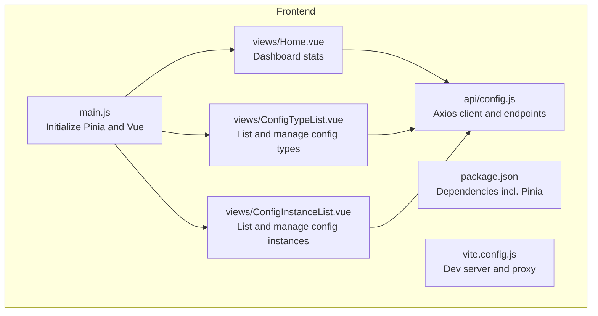
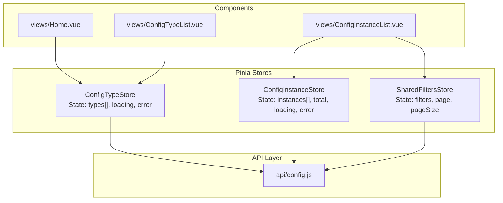
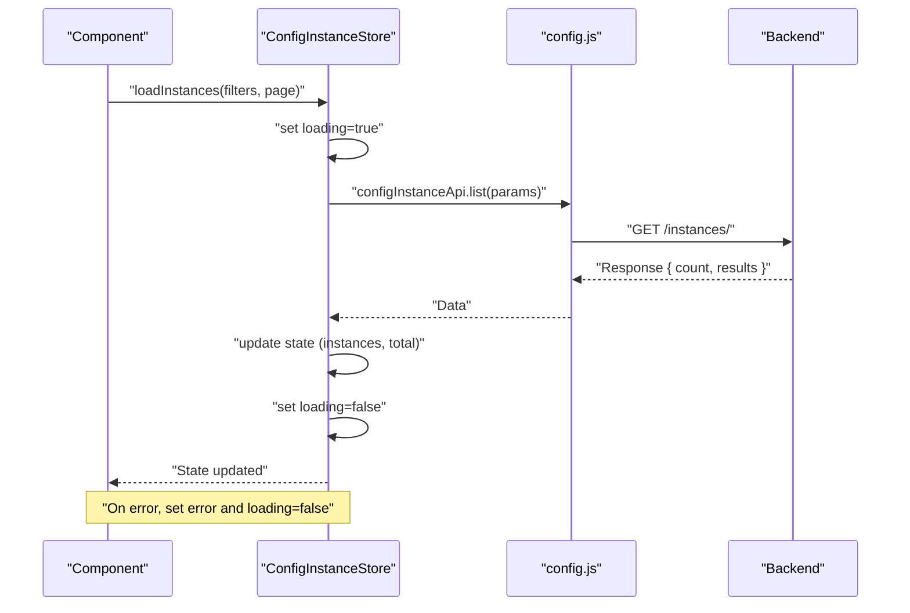
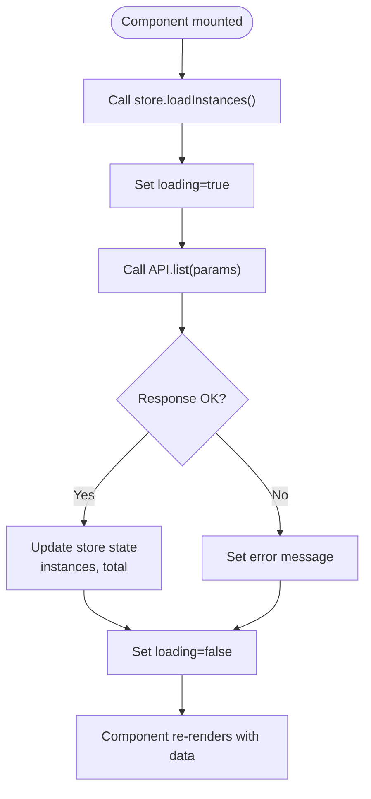
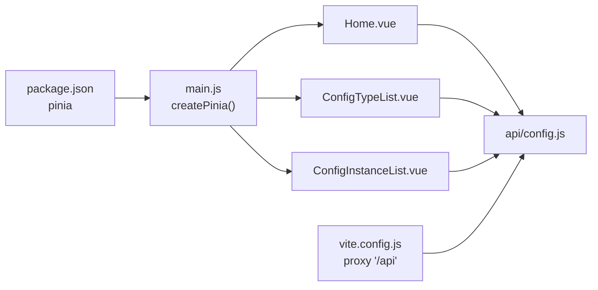

# State Management with Pinia

<cite>
**Referenced Files in This Document**
- [main.js](file://frontend/src/main.js)
- [package.json](file://frontend/package.json)
- [vite.config.js](file://frontend/vite.config.js)
- [config.js](file://frontend/src/api/config.js)
- [Home.vue](file://frontend/src/views/Home.vue)
- [ConfigTypeList.vue](file://frontend/src/views/ConfigTypeList.vue)
- [ConfigInstanceList.vue](file://frontend/src/views/ConfigInstanceList.vue)
</cite>

## Table of Contents
1. [Introduction](#introduction)
2. [Project Structure](#project-structure)
3. [Core Components](#core-components)
4. [Architecture Overview](#architecture-overview)
5. [Detailed Component Analysis](#detailed-component-analysis)
6. [Dependency Analysis](#dependency-analysis)
7. [Performance Considerations](#performance-considerations)
8. [Troubleshooting Guide](#troubleshooting-guide)
9. [Conclusion](#conclusion)
10. [Appendices](#appendices)

## Introduction
This document explains how state is managed in the frontend using Pinia. It covers the store architecture, state definitions, and action implementations. It documents data flow patterns, reactive state updates, and component store integration. It also details configuration type store, configuration instance store, and shared state management, along with store modules organization, state persistence, and cross-component communication. Async actions, loading states, and error handling in stores are addressed, alongside examples of store usage in components, state mutations, and computed properties. Finally, it outlines store testing strategies and debugging techniques.

## Project Structure
The frontend initializes Pinia globally and integrates it with Vue and Element Plus. The application uses Axios to communicate with the backend API and renders pages for configuration types and instances. The current implementation does not include Pinia stores in the provided files; state is handled reactively via refs and reactive objects inside components. This document therefore focuses on how to introduce and organize Pinia stores to manage configuration types and instances consistently across the application.

**Diagram sources**
- [main.js:1-22](file://frontend/src/main.js#L1-L22)
- [package.json:11-20](file://frontend/package.json#L11-L20)
- [vite.config.js:4-18](file://frontend/vite.config.js#L4-L18)
- [config.js:1-34](file://frontend/src/api/config.js#L1-L34)
- [Home.vue:134-157](file://frontend/src/views/Home.vue#L134-L157)
- [ConfigTypeList.vue:71-124](file://frontend/src/views/ConfigTypeList.vue#L71-L124)
- [ConfigInstanceList.vue:151-235](file://frontend/src/views/ConfigInstanceList.vue#L151-L235)

**Section sources**
- [main.js:1-22](file://frontend/src/main.js#L1-L22)
- [package.json:11-20](file://frontend/package.json#L11-L20)
- [vite.config.js:4-18](file://frontend/vite.config.js#L4-L18)
- [config.js:1-34](file://frontend/src/api/config.js#L1-L34)

## Core Components
- Pinia initialization: The application creates Pinia and installs it globally so stores can be used across components.
- Axios client: A centralized Axios instance defines base URLs and endpoints for configuration types and instances.
- Views: Components fetch data from the API and manage local reactive state for UI rendering and user interactions.

Key observations:
- No Pinia stores are present in the current codebase; state is managed locally with refs.
- The API module exports functions for listing, retrieving, creating, updating, and deleting configuration types and instances.
- Components trigger navigation and handle UI feedback (messages and confirmations).

**Section sources**
- [main.js:17](file://frontend/src/main.js#L17)
- [config.js:11-31](file://frontend/src/api/config.js#L11-L31)
- [Home.vue:139-157](file://frontend/src/views/Home.vue#L139-L157)
- [ConfigTypeList.vue:78-123](file://frontend/src/views/ConfigTypeList.vue#L78-L123)
- [ConfigInstanceList.vue:166-234](file://frontend/src/views/ConfigInstanceList.vue#L166-L234)

## Architecture Overview
The current architecture is component-centric: components call API functions directly and maintain local reactive state. To adopt Pinia, we propose introducing dedicated stores for configuration types and instances, with shared state for filters and pagination. This enables:
- Centralized state management
- Cross-component communication
- Async actions with loading/error states
- Optional persistence for filters and pagination

[No sources needed since this diagram shows conceptual architecture, not actual code structure]

## Detailed Component Analysis

### Store Modules Organization
Proposed modules:
- ConfigTypeStore: Manages configuration types list, counts, and CRUD operations.
- ConfigInstanceStore: Manages instances list, pagination, versions, and CRUD operations.
- SharedFiltersStore: Manages filters, pagination state, and shared UI preferences.

Each store encapsulates:
- State: Reactive data (lists, counts, loading flags, errors).
- Getters: Derived data (filtered lists, formatted counts).
- Actions: Async operations (fetch, create, update, delete) with loading/error handling.

[No sources needed since this section proposes structure without analyzing specific files]

### State Definitions and Reactive Updates
- Local state in components mirrors reactive state that would live in stores:
  - Lists: arrays of items
  - Counts: totals derived from API responses
  - Loading flags: booleans controlling loading UI
  - Errors: messages surfaced to users

Examples of reactive state patterns in existing components:
- Dashboard statistics: reactive object holding counts and derived values.
- Type list: reactive array and loading flag.
- Instance list: reactive arrays for instances, config types, pagination, and filters.

**Section sources**
- [Home.vue:139-157](file://frontend/src/views/Home.vue#L139-L157)
- [ConfigTypeList.vue:79-92](file://frontend/src/views/ConfigTypeList.vue#L79-L92)
- [ConfigInstanceList.vue:159-171](file://frontend/src/views/ConfigInstanceList.vue#L159-L171)

### Action Implementations and Async Flows
- Fetch actions: call API functions, set loading flags, populate state, and handle errors.
- Mutation actions: update lists, counts, and pagination after successful operations.
- Deletion actions: confirm deletion, call API, update state, and show feedback.

**Diagram sources**
- [ConfigInstanceList.vue:172-187](file://frontend/src/views/ConfigInstanceList.vue#L172-L187)
- [config.js:22-31](file://frontend/src/api/config.js#L22-L31)

**Section sources**
- [ConfigTypeList.vue:82-92](file://frontend/src/views/ConfigTypeList.vue#L82-L92)
- [ConfigInstanceList.vue:172-187](file://frontend/src/views/ConfigInstanceList.vue#L172-L187)
- [config.js:11-31](file://frontend/src/api/config.js#L11-L31)

### Data Flow Patterns and Component Integration
- Components trigger store actions on mount or button clicks.
- Stores update reactive state and propagate changes to components via reactivity.
- UI components render loading states, empty states, and error messages based on store state.

**Diagram sources**
- [ConfigInstanceList.vue:172-187](file://frontend/src/views/ConfigInstanceList.vue#L172-L187)

**Section sources**
- [Home.vue:145-157](file://frontend/src/views/Home.vue#L145-L157)
- [ConfigTypeList.vue:82-92](file://frontend/src/views/ConfigTypeList.vue#L82-L92)
- [ConfigInstanceList.vue:172-187](file://frontend/src/views/ConfigInstanceList.vue#L172-L187)

### Shared State Management and Cross-Component Communication
- SharedFiltersStore centralizes filters and pagination to coordinate between components.
- Components subscribe to shared state to reflect global filters and pagination.
- Changes in one component update shared state, enabling cross-component synchronization.

[No sources needed since this section proposes structure without analyzing specific files]

### Configuration Type Store and Configuration Instance Store
- ConfigTypeStore: maintains types list, counts, and CRUD operations; supports fetching instances per type.
- ConfigInstanceStore: maintains instances list, pagination, counts, and CRUD operations; supports versions and rollbacks.

[No sources needed since this section proposes structure without analyzing specific files]

### State Persistence
- Optional: persist shared filters and pagination to localStorage/sessionStorage.
- On app load, restore persisted filters to pre-populate UI and trigger filtered queries.

[No sources needed since this section proposes structure without analyzing specific files]

## Dependency Analysis
- Pinia is installed and initialized in the application entry point.
- Components depend on API functions exported from the Axios client.
- The development server proxies API requests to the backend service.

**Diagram sources**
- [package.json:14](file://frontend/package.json#L14)
- [main.js:17](file://frontend/src/main.js#L17)
- [Home.vue:137](file://frontend/src/views/Home.vue#L137)
- [ConfigTypeList.vue:76](file://frontend/src/views/ConfigTypeList.vue#L76)
- [ConfigInstanceList.vue:156](file://frontend/src/views/ConfigInstanceList.vue#L156)
- [vite.config.js:8-13](file://frontend/vite.config.js#L8-L13)

**Section sources**
- [package.json:11-20](file://frontend/package.json#L11-L20)
- [main.js:17](file://frontend/src/main.js#L17)
- [vite.config.js:8-13](file://frontend/vite.config.js#L8-L13)

## Performance Considerations
- Prefer batching API calls when possible (already demonstrated with Promise.all in the dashboard).
- Use debounced search filters to reduce unnecessary network requests.
- Virtualize large lists to minimize DOM rendering overhead.
- Cache frequently accessed small datasets (e.g., config types) to avoid repeated fetches.

[No sources needed since this section provides general guidance]

## Troubleshooting Guide
Common issues and remedies:
- API timeouts or CORS errors: verify proxy configuration and backend availability.
- Unexpected empty lists: check response shape and fallback logic in components.
- UI not reflecting updates: ensure actions update reactive state and components subscribe to store state.
- Memory leaks: avoid long-running timers or intervals in components; clean up on unmount.

**Section sources**
- [vite.config.js:6-14](file://frontend/vite.config.js#L6-L14)
- [Home.vue:145-157](file://frontend/src/views/Home.vue#L145-L157)
- [ConfigTypeList.vue:87-91](file://frontend/src/views/ConfigTypeList.vue#L87-L91)
- [ConfigInstanceList.vue:182-186](file://frontend/src/views/ConfigInstanceList.vue#L182-L186)

## Conclusion
The current frontend uses component-local reactive state and direct API calls. Adopting Pinia involves introducing dedicated stores for configuration types and instances, centralizing async actions, and managing shared state for filters and pagination. This approach improves maintainability, enables cross-component communication, and simplifies testing and debugging.

[No sources needed since this section summarizes without analyzing specific files]

## Appendices

### Store Testing Strategies
- Unit tests for store actions: mock API responses, assert state mutations, and verify error handling.
- Integration tests: simulate user interactions and verify UI updates driven by store state.
- Snapshot tests: capture UI state under various conditions (loading, empty, error).

[No sources needed since this section provides general guidance]

### Debugging Techniques
- Enable Vue DevTools and Pinia DevTools to inspect state, actions, and getters.
- Add logging in actions around API calls and state updates.
- Use browser devtools to monitor network requests and response shapes.

[No sources needed since this section provides general guidance]