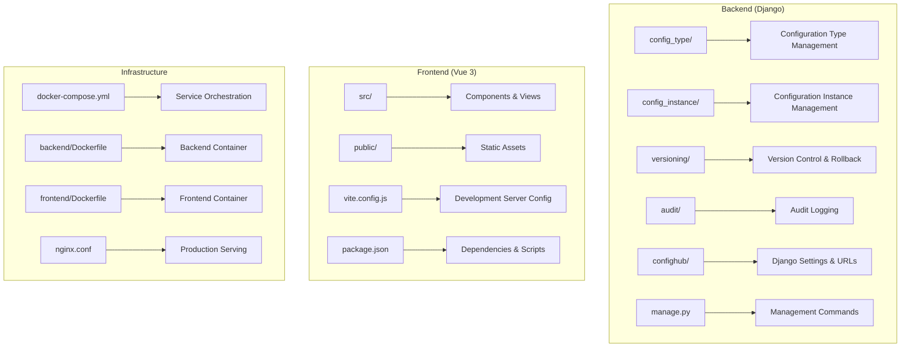

# Getting Started

<cite>
**Referenced Files in This Document**
- [README.md](file://README.md)
- [docker-compose.yml](file://docker-compose.yml)
- [backend/Dockerfile](file://backend/Dockerfile)
- [frontend/Dockerfile](file://frontend/Dockerfile)
- [backend/requirements.txt](file://backend/requirements.txt)
- [frontend/package.json](file://frontend/package.json)
- [backend/confighub/settings.py](file://backend/confighub/settings.py)
- [backend/manage.py](file://backend/manage.py)
- [backend/confighub/urls.py](file://backend/confighub/urls.py)
- [backend/config_type/urls.py](file://backend/config_type/urls.py)
- [backend/config_instance/urls.py](file://backend/config_instance/urls.py)
- [frontend/vite.config.js](file://frontend/vite.config.js)
- [frontend/src/api/config.js](file://frontend/src/api/config.js)
</cite>

## Update Summary
**Changes Made**
- Added comprehensive admin credentials and management interface information
- Updated API endpoint documentation with complete endpoint list
- Enhanced quick start examples with backend and frontend development guides
- Added detailed project structure and technology stack information
- Included default data and security considerations
- Updated troubleshooting guide with new configuration details

## Table of Contents
1. [Introduction](#introduction)
2. [System Access](#system-access)
3. [Project Structure](#project-structure)
4. [Prerequisites](#prerequisites)
5. [Installation and Setup](#installation-and-setup)
6. [Development Workflow](#development-workflow)
7. [Quick Start Examples](#quick-start-examples)
8. [API Reference](#api-reference)
9. [Troubleshooting Guide](#troubleshooting-guide)
10. [Conclusion](#conclusion)

## Introduction
AI-Ops Configuration Hub is a Django-powered backend with a Vue 3 frontend, designed to manage configuration types and instances. It uses Docker Compose to orchestrate a MySQL database, a Django backend service, and an Nginx-based frontend service. The system exposes REST APIs for managing configuration metadata and instances, with a web UI for browsing and editing.

The platform supports JSON and TOML configuration formats, provides automatic version control with rollback capabilities, and maintains comprehensive audit logs for all operations.

**Section sources**
- [README.md:1-3](file://README.md#L1-L3)
- [README.md:51-59](file://README.md#L51-L59)

## System Access
Access the system through multiple interfaces depending on your needs:

### Management Interface (Django Admin)
- **Address**: http://localhost:8000/admin/
- **Credentials**: 
  - Username: `admin`
  - Password: `admin123`

### API Endpoints
- **Root**: http://localhost:8000/
- **Configuration Types**: http://localhost:8000/api/types/
- **Configuration Instances**: http://localhost:8000/api/instances/

### Frontend Interface
- **Address**: http://localhost
- **Development Server**: http://localhost:3000

**Section sources**
- [README.md:7-15](file://README.md#L7-L15)
- [backend/confighub/urls.py:21-32](file://backend/confighub/urls.py#L21-L32)

## Project Structure
The repository is organized into three main parts with clear separation of concerns:



**Diagram sources**
- [README.md:67-84](file://README.md#L67-L84)
- [backend/config_type/apps.py](file://backend/config_type/apps.py)
- [backend/config_instance/apps.py](file://backend/config_instance/apps.py)
- [backend/versioning/apps.py](file://backend/versioning/apps.py)
- [backend/audit/apps.py](file://backend/audit/apps.py)

**Section sources**
- [README.md:67-84](file://README.md#L67-L84)

## Prerequisites
Before setting up AI-Ops Configuration Hub, ensure you have the following prerequisites:

### Core Requirements
- **Python 3.8+** (for backend development and Django)
- **Node.js 20.x** (for frontend development and Vue.js)
- **Docker Engine** (for containerized deployment)
- **Docker Compose** (for service orchestration)
- **Git** (for repository cloning)

### Technology Stack Details
- **Backend**: Django 6.0 + Django REST Framework
- **Frontend**: Vue 3 + Vite + Element Plus
- **Database**: SQLite (development) / MySQL 8.0 (production)
- **Deployment**: Docker + Docker Compose

**Section sources**
- [README.md:60-66](file://README.md#L60-L66)
- [backend/Dockerfile:1](file://backend/Dockerfile#L1)
- [frontend/Dockerfile:2](file://frontend/Dockerfile#L2)
- [backend/requirements.txt](file://backend/requirements.txt)
- [frontend/package.json:11-24](file://frontend/package.json#L11-L24)

## Installation and Setup
Follow these steps to set up AI-Ops Configuration Hub locally using Docker Compose.

### Step 1: Clone and Prepare
```bash
git clone <repository-url>
cd ai-ops
```

### Step 2: Start Services with Docker Compose
```bash
# Start all services in detached mode
docker compose up -d

# Verify service status
docker compose ps

# View service logs
docker compose logs -f
```

### Step 3: Initialize Database and Static Files
```bash
# Run database migrations
docker compose exec backend python manage.py migrate

# Collect static files
docker compose exec backend python manage.py collectstatic --noinput
```

### Step 4: Access Services
- **Backend API**: http://localhost:8000/
- **Admin Interface**: http://localhost:8000/admin/
- **Frontend UI**: http://localhost

### Environment Variables and Ports
- **Database**: MySQL 8.0 (port 3306)
- **Backend**: Django (port 8000)
- **Frontend**: Nginx (port 80)
- **Database Credentials**: confighub/confighub123

**Section sources**
- [docker-compose.yml:1-50](file://docker-compose.yml#L1-L50)
- [docker-compose.yml:21-45](file://docker-compose.yml#L21-L45)
- [backend/confighub/settings.py:94-117](file://backend/confighub/settings.py#L94-L117)

## Development Workflow
There are two primary development approaches: Docker Compose (recommended) and native development.

### Option A: Docker Compose Development (Recommended)
```bash
# Start all services
docker compose up -d

# Monitor backend logs
docker compose logs -f backend

# Apply migrations after initial setup
docker compose exec backend python manage.py migrate
docker compose exec backend python manage.py collectstatic --noinput

# Make changes to code, services will restart automatically
```

### Option B: Native Development
#### Backend Development
```bash
# Navigate to backend directory
cd backend

# Activate virtual environment (Windows)
venv\Scripts\activate

# Install dependencies
pip install -r requirements.txt

# Set environment variables
set DJANGO_SECRET_KEY=your-secret-key
set DJANGO_DEBUG=True

# Run migrations
python manage.py migrate

# Start development server
python manage.py runserver 0.0.0.0:8000
```

#### Frontend Development
```bash
# Navigate to frontend directory
cd frontend

# Install dependencies
npm install

# Start development server
npm run dev  # Runs on port 3000

# Frontend proxy automatically forwards /api to backend
```

### Networking and Proxies
- **Frontend Dev Server**: Proxies `/api` requests to backend on port 8000
- **Production Frontend**: Served via Nginx with static asset optimization
- **Backend**: Uses Gunicorn with 4 workers for production

**Section sources**
- [frontend/vite.config.js:6-14](file://frontend/vite.config.js#L6-L14)
- [frontend/src/api/config.js:3-9](file://frontend/src/api/config.js#L3-L9)
- [backend/confighub/settings.py:94-117](file://backend/confighub/settings.py#L94-L117)
- [backend/manage.py:9-18](file://backend/manage.py#L9-L18)

## Quick Start Examples
Create your first configuration type and instance to verify the system works correctly.

### Backend Development Quick Start
```bash
# Navigate to backend
cd backend

# Start Django development server
.\venv\Scripts\python.exe manage.py runserver 0.0.0.0:8000
```

### Admin Interface Usage
1. Visit http://localhost:8000/admin/
2. Login with username: `admin`, password: `admin123`
3. Manage the following modules:
   - **Config Types** - Define configuration templates
   - **Config Instances** - Create actual configuration data
   - **Audit Logs** - View operation history
   - **Config Versions** - Manage version history

### API Usage Examples
```bash
# Get configuration types
curl http://localhost:8000/api/types/

# Get configuration instances  
curl http://localhost:8000/api/instances/

# Create a configuration type
curl -X POST http://localhost:8000/api/types/ \
  -H "Content-Type: application/json" \
  -d '{"name":"db_config","title":"Database Config","format":"json","schema":{}}'
```

### Frontend Development Quick Start
```bash
# Navigate to frontend
cd frontend

# Install dependencies
npm install

# Start development server
npm run dev  # Runs on http://localhost:3000
```

**Section sources**
- [README.md:17-50](file://README.md#L17-L50)
- [README.md:26-35](file://README.md#L26-L35)
- [README.md:36-49](file://README.md#L36-L49)

## API Reference
The system provides comprehensive REST API endpoints for configuration management:

### Configuration Types API
- **GET** `/api/types/` - List all configuration types
- **GET** `/api/types/{name}/` - Get specific configuration type
- **POST** `/api/types/` - Create new configuration type
- **PUT** `/api/types/{name}/` - Update configuration type
- **DELETE** `/api/types/{name}/` - Delete configuration type
- **GET** `/api/types/{name}/instances/` - Get instances of specific type

### Configuration Instances API
- **GET** `/api/instances/` - List all configuration instances
- **GET** `/api/instances/{id}/` - Get specific configuration instance
- **POST** `/api/instances/` - Create new configuration instance
- **PUT** `/api/instances/{id}/` - Update configuration instance
- **DELETE** `/api/instances/{id}/` - Delete configuration instance
- **GET** `/api/instances/{id}/versions/` - Get version history
- **POST** `/api/instances/{id}/rollback/` - Rollback to previous version
- **GET** `/api/instances/{id}/content/` - Get instance content (with format parameter)

### Root Endpoint
- **GET** `/` - API root with endpoint listing

**Section sources**
- [backend/config_type/urls.py:5-10](file://backend/config_type/urls.py#L5-L10)
- [backend/config_instance/urls.py:5-10](file://backend/config_instance/urls.py#L5-L10)
- [frontend/src/api/config.js:12-31](file://frontend/src/api/config.js#L12-L31)
- [backend/confighub/urls.py:21-32](file://backend/confighub/urls.py#L21-L32)

## Troubleshooting Guide
Common setup issues and their solutions:

### Port Conflicts
- **Symptom**: Services fail to start with binding errors
- **Solution**: Change ports in docker-compose.yml or stop conflicting services
- **Ports in use**: 
  - Frontend: 80 (change to 8080)
  - Backend: 8000 (change to 8081)
  - Database: 3306 (change to 3307)

### Database Connectivity Issues
- **Symptom**: Backend cannot connect to MySQL
- **Solution**: Ensure database service is healthy and credentials match
- **Check**: `docker compose ps` for database status
- **Verify**: DB_NAME, DB_USER, DB_PASSWORD, DB_HOST, DB_PORT environment variables

### Static Files Not Loading
- **Symptom**: Blank pages or missing CSS/JS in admin interface
- **Solution**: Re-run static collection after migrations
```bash
docker compose exec backend python manage.py collectstatic --noinput
```

### CORS and Proxy Issues
- **Symptom**: API calls from frontend fail due to CORS
- **Solution**: 
  - Development: Vite proxy automatically handles this
  - Production: Configure ALLOWED_HOSTS and CORS settings
  - Check `CORS_ALLOW_ALL_ORIGINS = True` in settings

### Service Readiness Problems
- **Symptom**: Backend starts before database is ready
- **Solution**: The compose file includes healthchecks and depends_on conditions
- **Wait**: Allow database to become healthy before accessing backend

### Security and Production Concerns
- **Symptom**: Security warnings about default configurations
- **Solution**: 
  - Change `DJANGO_SECRET_KEY` in production
  - Set `DJANGO_DEBUG=False` in production
  - Configure proper `ALLOWED_HOSTS`
  - Review CORS settings for production

### Development Environment Issues
- **Symptom**: Frontend hot reload not working
- **Solution**: Ensure Node.js 20.x is installed and npm cache is cleared
- **Command**: `npm ci` to reinstall dependencies

**Section sources**
- [docker-compose.yml:16-19](file://docker-compose.yml#L16-L19)
- [docker-compose.yml:32-34](file://docker-compose.yml#L32-L34)
- [backend/confighub/settings.py:24-27](file://backend/confighub/settings.py#L24-L27)
- [backend/confighub/settings.py:31](file://backend/confighub/settings.py#L31)
- [frontend/vite.config.js:8-12](file://frontend/vite.config.js#L8-L12)

## Conclusion
You now have comprehensive guidance to install, configure, and develop with AI-Ops Configuration Hub. The system provides:

- **Complete Management Interface**: Django Admin with predefined credentials
- **RESTful API**: Full CRUD operations for configuration types and instances
- **Development Flexibility**: Both Docker Compose and native development options
- **Production Ready**: Proper containerization with health checks and proper configuration

Key next steps:
1. Access the admin interface at http://localhost:8000/admin/ with `admin/admin123`
2. Explore the API endpoints at http://localhost:8000/api/
3. Create your first configuration type and instance
4. Customize for production deployment with proper security settings

The system is designed for both learning and production use, with clear separation between frontend, backend, and infrastructure components.

**Section sources**
- [README.md:92-97](file://README.md#L92-L97)
- [README.md:98-101](file://README.md#L98-L101)