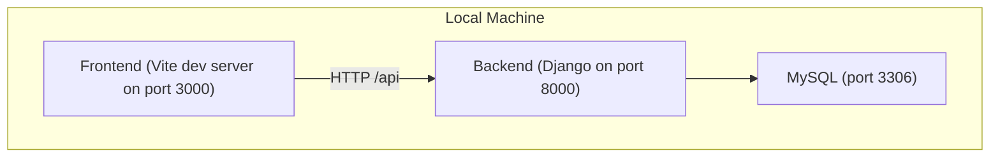

# Getting Started

<cite>
**Referenced Files in This Document**
- [docker-compose.yml](file://docker-compose.yml)
- [backend/Dockerfile](file://backend/Dockerfile)
- [frontend/Dockerfile](file://frontend/Dockerfile)
- [backend/requirements.txt](file://backend/requirements.txt)
- [frontend/package.json](file://frontend/package.json)
- [backend/confighub/settings.py](file://backend/confighub/settings.py)
- [backend/manage.py](file://backend/manage.py)
- [backend/confighub/urls.py](file://backend/confighub/urls.py)
- [backend/config_type/urls.py](file://backend/config_type/urls.py)
- [backend/config_instance/urls.py](file://backend/config_instance/urls.py)
- [frontend/vite.config.js](file://frontend/vite.config.js)
- [frontend/src/api/config.js](file://frontend/src/api/config.js)
</cite>

## Table of Contents
1. [Introduction](#introduction)
2. [Project Structure](#project-structure)
3. [Prerequisites](#prerequisites)
4. [Installation and Setup](#installation-and-setup)
5. [Development Workflow](#development-workflow)
6. [Quick Start Examples](#quick-start-examples)
7. [Troubleshooting Guide](#troubleshooting-guide)
8. [Conclusion](#conclusion)

## Introduction
AI-Ops Configuration Hub is a Django-powered backend with a Vue 3 frontend, designed to manage configuration types and instances. It uses Docker Compose to orchestrate a MySQL database, a Django backend service, and an Nginx-based frontend service. The system exposes REST APIs for managing configuration metadata and instances, with a web UI for browsing and editing.

## Project Structure
The repository is organized into three main parts:
- Backend: Django application with apps for configuration types, instances, versioning, audit, and Django settings/URLs.
- Frontend: Vue 3 single-page application built with Vite and served via Nginx.
- Orchestration: Docker Compose to run database, backend, and frontend services together.

**Diagram sources**
- [frontend/vite.config.js:6-14](file://frontend/vite.config.js#L6-L14)
- [backend/Dockerfile:22-26](file://backend/Dockerfile#L22-L26)
- [docker-compose.yml:13-14](file://docker-compose.yml#L13-L14)

**Section sources**
- [docker-compose.yml:1-50](file://docker-compose.yml#L1-L50)
- [backend/confighub/urls.py:20-24](file://backend/confighub/urls.py#L20-L24)

## Prerequisites
- Python 3.8+ (required by the backend runtime)
- Node.js 20.x (required by the frontend build)
- Docker Engine and Docker Compose
- Git (recommended for cloning the repository)

Notes:
- The backend Dockerfile uses Python 3.11, so a compatible host Python is still useful for local development and tooling.
- The frontend Dockerfile uses Node.js 20 Alpine for building assets.

**Section sources**
- [backend/Dockerfile](file://backend/Dockerfile#L1)
- [frontend/Dockerfile](file://frontend/Dockerfile#L2)
- [backend/requirements.txt](file://backend/requirements.txt#L1)
- [frontend/package.json:11-24](file://frontend/package.json#L11-L24)

## Installation and Setup
Follow these steps to set up the project locally using Docker Compose.

1. Clone the repository and navigate to the project root.
2. Start the services with Docker Compose:
   - Bring up the stack: docker compose up -d
   - Verify services are healthy:
     - docker compose ps
3. Initialize the backend database:
   - Run migrations: docker compose exec backend python manage.py migrate
   - Collect static files: docker compose exec backend python manage.py collectstatic --noinput
4. Access the services:
   - Backend API: http://localhost:8000/api/
   - Admin: http://localhost:8000/admin/
   - Frontend UI: http://localhost

Environment variables and ports:
- Database credentials and options are configured in the compose file.
- Backend binds port 8000; frontend binds port 80.
- The backend reads database and Django settings from environment variables injected by the compose file.

**Section sources**
- [docker-compose.yml:21-45](file://docker-compose.yml#L21-L45)
- [backend/confighub/settings.py:94-117](file://backend/confighub/settings.py#L94-L117)
- [backend/manage.py:9-18](file://backend/manage.py#L9-L18)

## Development Workflow
There are two primary ways to develop locally: using Docker Compose (recommended) or running services natively.

Option A: Docker Compose (recommended)
- Start services: docker compose up -d
- View logs: docker compose logs -f backend
- Apply migrations and static collection after initial setup
- Make changes to frontend or backend; rebuild frontend image if needed

Option B: Native development
- Backend (Python/Django):
  - Install dependencies: pip install -r backend/requirements.txt
  - Set environment variables matching the compose file defaults
  - Run migrations: python backend/manage.py migrate
  - Collect static: python backend/manage.py collectstatic --noinput
  - Start development server: python backend/manage.py runserver 0.0.0.0:8000
- Frontend (Node/Vue):
  - Install dependencies: npm install
  - Start dev server: npm run dev (runs on port 3000)
  - Proxy requests to backend at http://localhost:8000

Networking and proxies:
- The frontend Vite dev server proxies /api to the backend on port 8000.
- The production frontend Docker image serves static assets via Nginx.

**Section sources**
- [frontend/vite.config.js:6-14](file://frontend/vite.config.js#L6-L14)
- [frontend/src/api/config.js:3-9](file://frontend/src/api/config.js#L3-L9)
- [backend/confighub/settings.py:94-117](file://backend/confighub/settings.py#L94-L117)
- [backend/manage.py:9-18](file://backend/manage.py#L9-L18)

## Quick Start Examples
Create your first configuration type and instance to verify the system works.

Step 1: Create a configuration type
- Endpoint: POST /api/types/
- Example payload (use a JSON editor in the UI or curl):
  - name: "example-type"
  - schema: a JSON schema object defining allowed fields
- Response: the created type resource

Step 2: Create a configuration instance
- Endpoint: POST /api/instances/
- Example payload:
  - type_name: "example-type"
  - name: "prod-cluster"
  - content: a JSON object matching the type’s schema
- Response: the created instance resource

Step 3: List and view
- List types: GET /api/types/
- List instances: GET /api/instances/
- View a specific instance: GET /api/instances/{id}/
- View instance content: GET /api/instances/{id}/content/?format=json

Notes:
- The frontend provides list and edit views for types and instances.
- Versioning and rollback endpoints are available under instance URLs.

**Section sources**
- [backend/config_type/urls.py:5-10](file://backend/config_type/urls.py#L5-L10)
- [backend/config_instance/urls.py:5-10](file://backend/config_instance/urls.py#L5-L10)
- [frontend/src/api/config.js:12-31](file://frontend/src/api/config.js#L12-L31)

## Troubleshooting Guide
Common setup issues and resolutions:

- Port conflicts
  - Symptom: Services fail to start or show binding errors.
  - Resolution: Change ports in docker-compose.yml or stop conflicting services.
  - Ports in use: frontend 80, backend 8000, database 3306.

- Database connectivity
  - Symptom: Backend cannot connect to MySQL.
  - Resolution: Ensure the db service is healthy; confirm credentials and DB_ENGINE match the compose configuration.
  - Verify environment variables for DB_NAME, DB_USER, DB_PASSWORD, DB_HOST, DB_PORT.

- Static files not loading
  - Symptom: Blank pages or missing assets in the UI.
  - Resolution: Re-run static collection after migrations: python manage.py collectstatic --noinput.

- CORS or proxy issues
  - Symptom: API calls from the frontend fail due to CORS or proxy misconfiguration.
  - Resolution: Confirm the frontend dev server proxy targets the backend port 8000; ensure ALLOW_ALL_ORIGINS is enabled in settings.

- Health checks and service readiness
  - Symptom: Backend starts before the database is ready.
  - Resolution: The compose file defines a healthcheck and depends_on condition; wait for the db to become healthy before accessing backend.

- Production secrets
  - Symptom: Security warnings or exposure of default keys.
  - Resolution: Override DJANGO_SECRET_KEY and disable DEBUG in production environments.

**Section sources**
- [docker-compose.yml:16-19](file://docker-compose.yml#L16-L19)
- [docker-compose.yml:32-34](file://docker-compose.yml#L32-L34)
- [backend/confighub/settings.py:24-27](file://backend/confighub/settings.py#L24-L27)
- [backend/confighub/settings.py](file://backend/confighub/settings.py#L31)
- [frontend/vite.config.js:8-12](file://frontend/vite.config.js#L8-L12)

## Conclusion
You now have the foundational steps to install, run, and validate AI-Ops Configuration Hub locally. Use Docker Compose for a quick start, or run services natively for iterative development. After initializing the database and collecting static files, explore the UI and APIs to create your first configuration type and instance.