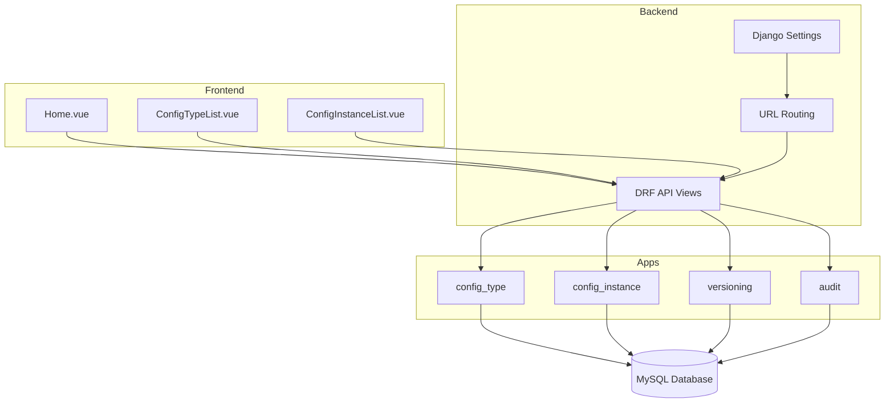
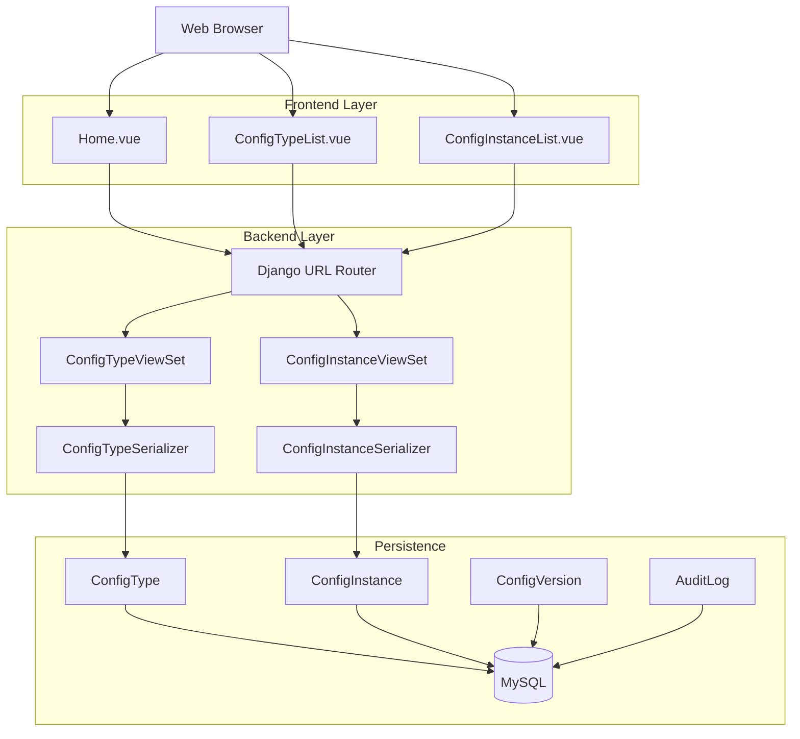
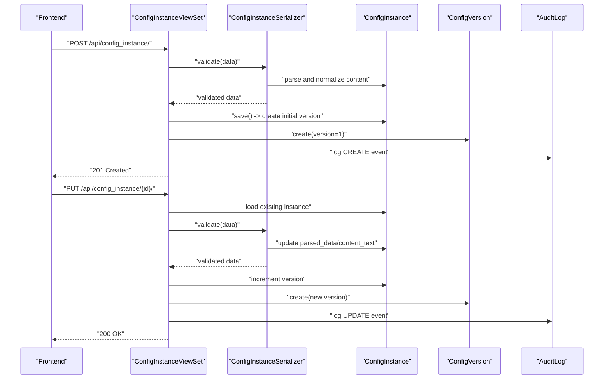
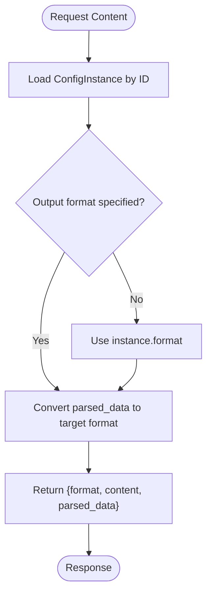
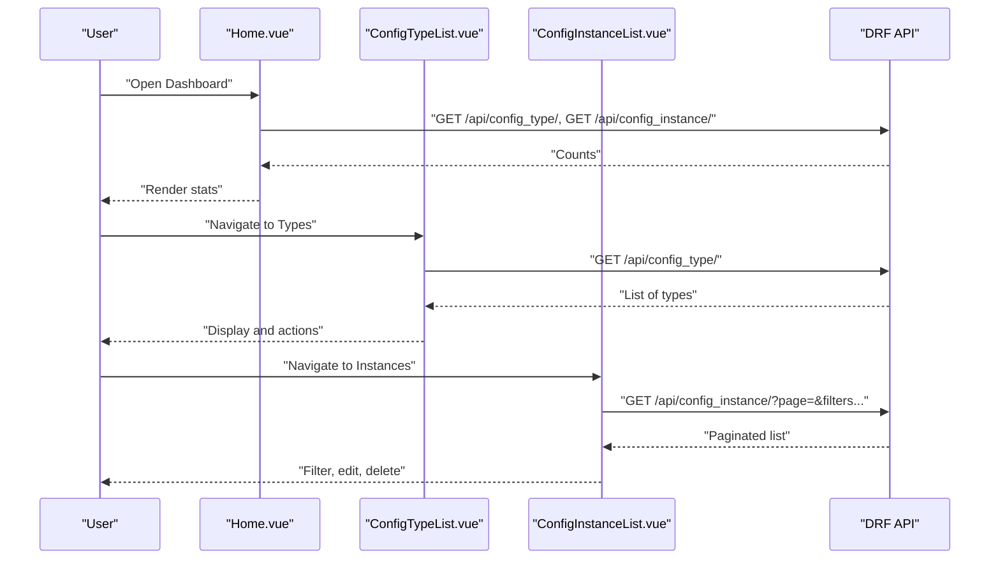
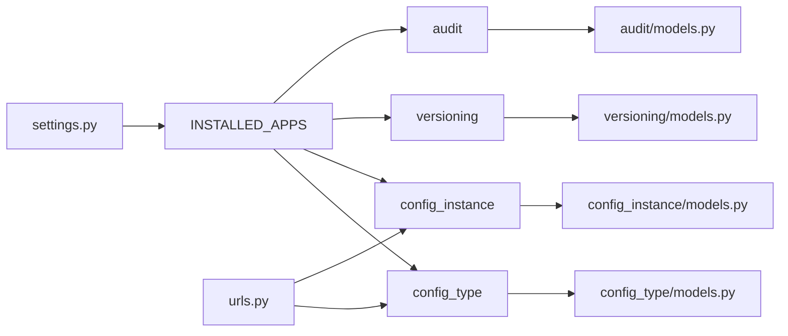

# Introduction and Purpose

<cite>
**Referenced Files in This Document**
- [settings.py](file://backend/confighub/settings.py)
- [urls.py](file://backend/confighub/urls.py)
- [models.py (ConfigType)](file://backend/config_type/models.py)
- [models.py (ConfigInstance)](file://backend/config_instance/models.py)
- [models.py (ConfigVersion)](file://backend/versioning/models.py)
- [models.py (AuditLog)](file://backend/audit/models.py)
- [serializers.py (ConfigType)](file://backend/config_type/serializers.py)
- [serializers.py (ConfigInstance)](file://backend/config_instance/serializers.py)
- [views.py (ConfigType)](file://backend/config_type/views.py)
- [views.py (ConfigInstance)](file://backend/config_instance/views.py)
- [docker-compose.yml](file://docker-compose.yml)
- [Home.vue](file://frontend/src/views/Home.vue)
- [ConfigTypeList.vue](file://frontend/src/views/ConfigTypeList.vue)
- [ConfigInstanceList.vue](file://frontend/src/views/ConfigInstanceList.vue)
</cite>

## Table of Contents
1. [Introduction](#introduction)
2. [Project Structure](#project-structure)
3. [Core Components](#core-components)
4. [Architecture Overview](#architecture-overview)
5. [Detailed Component Analysis](#detailed-component-analysis)
6. [Dependency Analysis](#dependency-analysis)
7. [Performance Considerations](#performance-considerations)
8. [Troubleshooting Guide](#troubleshooting-guide)
9. [Conclusion](#conclusion)

## Introduction
AI-Ops Configuration Hub is a centralized configuration management system tailored for AI-operations environments. Its core mission is to eliminate configuration chaos, enforce robust validation, maintain precise version control, and sustain comprehensive audit trails across distributed AI applications, microservices architectures, and cloud-native deployments. The system provides a unified platform for defining configuration schemas, managing configuration instances, tracking versions, and recording audit events—ensuring that AI operations teams can confidently govern, deploy, and evolve configurations at scale.

Key problems the project solves:
- Configuration chaos: Lack of standardized formats and governance leads to inconsistent, hard-to-manage settings across environments.
- Validation gaps: Absence of schema-driven validation risks deploying invalid or incompatible configuration data.
- Version control issues: Without explicit versioning, rollbacks and change tracking become error-prone and opaque.
- Audit trail gaps: Missing visibility into who changed what, when, and why hampers compliance and incident investigations.

Why this matters for AI-ops:
- Distributed AI systems require consistent, validated configuration across training clusters, inference endpoints, and monitoring stacks.
- Microservices and cloud-native environments demand portable, auditable configuration artifacts that can be versioned and rolled back reliably.
- Operational safety and reproducibility hinge on schema enforcement, immutable version history, and transparent audit logs.

Vision:
AI-Ops Configuration Hub aims to become the standard configuration management platform for AI operations teams by offering:
- A schema-first approach to define and validate configuration types.
- A robust configuration instance lifecycle with built-in versioning and rollback.
- Comprehensive audit logging for compliance and operational traceability.
- A modern, intuitive web interface for day-to-day configuration management tasks.

## Project Structure
The project follows a clear separation of concerns:
- Backend: Django + Django REST Framework (DRF) serving a REST API with modular apps for configuration types, instances, versioning, and auditing.
- Frontend: Vue 3 + Pinia + Element Plus providing a responsive admin interface for managing configuration types and instances.
- DevOps: docker-compose orchestrating MySQL, backend, and frontend services.

**Diagram sources**
- [urls.py:20-24](file://backend/confighub/urls.py#L20-L24)
- [settings.py:44-57](file://backend/confighub/settings.py#L44-L57)
- [docker-compose.yml:3-46](file://docker-compose.yml#L3-L46)

**Section sources**
- [settings.py:44-57](file://backend/confighub/settings.py#L44-L57)
- [settings.py:93-117](file://backend/confighub/settings.py#L93-L117)
- [urls.py:20-24](file://backend/confighub/urls.py#L20-L24)
- [docker-compose.yml:3-46](file://docker-compose.yml#L3-L46)

## Core Components
- Configuration Type (ConfigType): Defines a named, typed configuration schema with a chosen format (JSON/TOML) and a JSON Schema for validation. It enables consistent governance across all instances of that type.
- Configuration Instance (ConfigInstance): Represents a concrete configuration payload bound to a ConfigType, with parsed data storage, format normalization, and version control.
- Versioning (ConfigVersion): Maintains immutable historical snapshots of configuration instances, enabling safe rollbacks and change tracking.
- Audit (AuditLog): Records user actions against resources, capturing actor, action type, resource identity, and contextual details for compliance and forensics.

How these components work together:
- ConfigType sets the schema and format.
- ConfigInstance validates incoming content against the schema, normalizes it, and persists both raw and parsed forms.
- On create/update, ConfigInstance triggers creation of a new ConfigVersion snapshot and records an AuditLog event.
- ConfigInstance exposes endpoints to fetch content in a requested format, list versions, and rollback to prior versions.

**Section sources**
- [models.py (ConfigType):4-24](file://backend/config_type/models.py#L4-L24)
- [models.py (ConfigInstance):7-69](file://backend/config_instance/models.py#L7-L69)
- [models.py (ConfigVersion):5-23](file://backend/versioning/models.py#L5-L23)
- [models.py (AuditLog):5-31](file://backend/audit/models.py#L5-L31)

## Architecture Overview
The system architecture centers on a REST API that exposes CRUD and specialized operations for configuration types and instances, backed by a relational database. The frontend consumes the API to present management capabilities.

**Diagram sources**
- [urls.py:20-24](file://backend/confighub/urls.py#L20-L24)
- [views.py (ConfigType):8-39](file://backend/config_type/views.py#L8-L39)
- [views.py (ConfigInstance):11-150](file://backend/config_instance/views.py#L11-L150)
- [serializers.py (ConfigType):5-31](file://backend/config_type/serializers.py#L5-L31)
- [serializers.py (ConfigInstance):7-60](file://backend/config_instance/serializers.py#L7-L60)
- [models.py (ConfigType):4-24](file://backend/config_type/models.py#L4-L24)
- [models.py (ConfigInstance):7-69](file://backend/config_instance/models.py#L7-L69)
- [models.py (ConfigVersion):5-23](file://backend/versioning/models.py#L5-L23)
- [models.py (AuditLog):5-31](file://backend/audit/models.py#L5-L31)

## Detailed Component Analysis

### Configuration Lifecycle: Create, Update, Version, and Rollback
This sequence illustrates how the backend enforces validation, creates version snapshots, and records audit events during instance updates.

**Diagram sources**
- [views.py (ConfigInstance):36-90](file://backend/config_instance/views.py#L36-L90)
- [serializers.py (ConfigInstance):20-48](file://backend/config_instance/serializers.py#L20-L48)
- [models.py (ConfigInstance):37-69](file://backend/config_instance/models.py#L37-L69)
- [models.py (ConfigVersion):5-23](file://backend/versioning/models.py#L5-L23)
- [models.py (AuditLog):5-31](file://backend/audit/models.py#L5-L31)

**Section sources**
- [views.py (ConfigInstance):36-90](file://backend/config_instance/views.py#L36-L90)
- [serializers.py (ConfigInstance):20-48](file://backend/config_instance/serializers.py#L20-L48)
- [models.py (ConfigInstance):37-69](file://backend/config_instance/models.py#L37-L69)

### Configuration Retrieval and Format Conversion
This flow shows how a client can request a specific format for a configuration instance, triggering internal conversion while preserving parsed data for queries.

**Diagram sources**
- [views.py (ConfigInstance):138-149](file://backend/config_instance/views.py#L138-L149)
- [models.py (ConfigInstance):55-69](file://backend/config_instance/models.py#L55-L69)

**Section sources**
- [views.py (ConfigInstance):138-149](file://backend/config_instance/views.py#L138-L149)
- [models.py (ConfigInstance):55-69](file://backend/config_instance/models.py#L55-L69)

### Frontend Management Flows
The frontend provides quick actions and lists for efficient management:
- Home dashboard aggregates counts for types, instances, and versions.
- ConfigTypeList allows creation, editing, and deletion of configuration types.
- ConfigInstanceList supports filtering by type/format/search, pagination, and version inspection.

**Diagram sources**
- [Home.vue:134-157](file://frontend/src/views/Home.vue#L134-L157)
- [ConfigTypeList.vue:41-89](file://frontend/src/views/ConfigTypeList.vue#L41-L89)
- [ConfigInstanceList.vue:76-156](file://frontend/src/views/ConfigInstanceList.vue#L76-L156)
- [urls.py:22-24](file://backend/confighub/urls.py#L22-L24)

**Section sources**
- [Home.vue:134-157](file://frontend/src/views/Home.vue#L134-L157)
- [ConfigTypeList.vue:41-89](file://frontend/src/views/ConfigTypeList.vue#L41-L89)
- [ConfigInstanceList.vue:76-156](file://frontend/src/views/ConfigInstanceList.vue#L76-L156)

## Dependency Analysis
- Backend apps depend on shared models and serializers to maintain consistency across configuration types and instances.
- Views orchestrate serialization, persistence, versioning, and auditing in a transactional manner to ensure atomicity.
- The frontend depends on the DRF API exposed via the configured URL routing.

**Diagram sources**
- [settings.py:44-57](file://backend/confighub/settings.py#L44-L57)
- [urls.py:20-24](file://backend/confighub/urls.py#L20-L24)
- [models.py (ConfigType):4-24](file://backend/config_type/models.py#L4-L24)
- [models.py (ConfigInstance):7-69](file://backend/config_instance/models.py#L7-L69)
- [models.py (ConfigVersion):5-23](file://backend/versioning/models.py#L5-L23)
- [models.py (AuditLog):5-31](file://backend/audit/models.py#L5-L31)

**Section sources**
- [settings.py:44-57](file://backend/confighub/settings.py#L44-L57)
- [urls.py:20-24](file://backend/confighub/urls.py#L20-L24)

## Performance Considerations
- Database selection: The system supports SQLite for development and MySQL for production, allowing scalable deployment patterns.
- Pagination: REST framework pagination is enabled to handle large datasets efficiently.
- Select-related queries: Views prefetch related data to minimize N+1 query issues.
- Serialization overhead: Keep schema validation concise; avoid overly complex JSON Schemas to reduce validation latency.

[No sources needed since this section provides general guidance]

## Troubleshooting Guide
Common issues and resolutions:
- Schema validation failures: Ensure the configuration content matches the associated ConfigType’s JSON Schema and format.
- Invalid content format: Verify that JSON or TOML content parses correctly before saving.
- Version mismatch: Use the versions endpoint to inspect available versions and rollback to a known-good version.
- Audit visibility: Review audit logs for user actions, resource changes, and timestamps to investigate incidents.

Operational checks:
- Confirm backend and database containers are healthy via docker-compose.
- Validate API endpoints for listing types and instances to ensure connectivity.

**Section sources**
- [serializers.py (ConfigInstance):20-48](file://backend/config_instance/serializers.py#L20-L48)
- [views.py (ConfigInstance):92-136](file://backend/config_instance/views.py#L92-L136)
- [models.py (AuditLog):5-31](file://backend/audit/models.py#L5-L31)
- [docker-compose.yml:3-46](file://docker-compose.yml#L3-L46)

## Conclusion
AI-Ops Configuration Hub delivers a focused, schema-driven configuration management solution for AI operations. By centralizing configuration types, enforcing validation, maintaining immutable versions, and recording comprehensive audits, it addresses the core challenges of modern AI deployments: chaos, inconsistency, opacity, and risk. With a clean backend API and a practical frontend interface, it is positioned to become the standard platform for managing configuration across distributed AI systems, microservices, and cloud-native infrastructures.