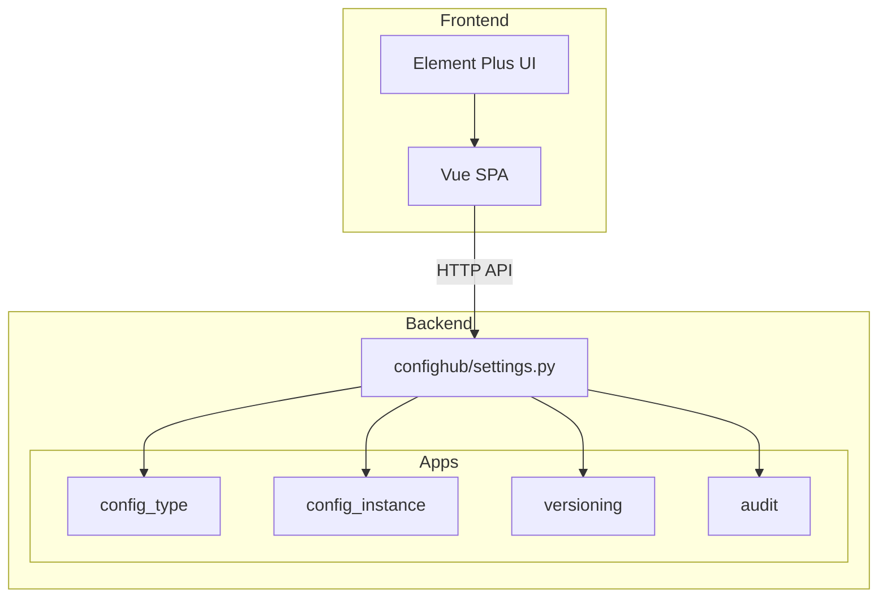
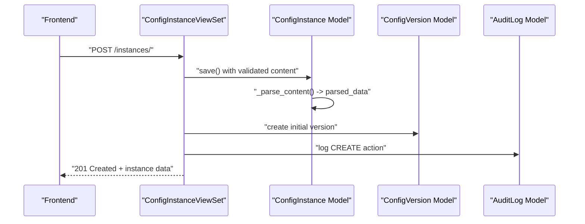
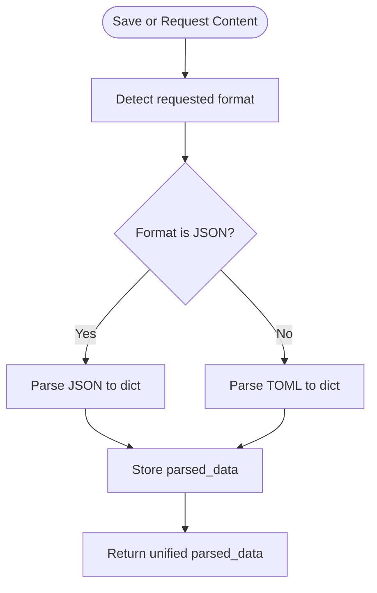
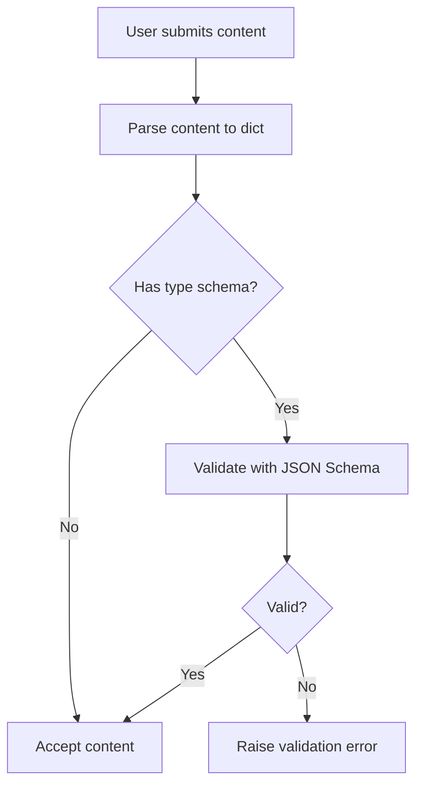
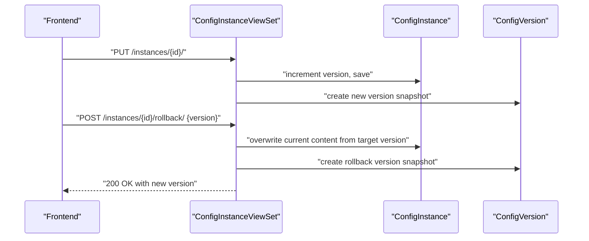
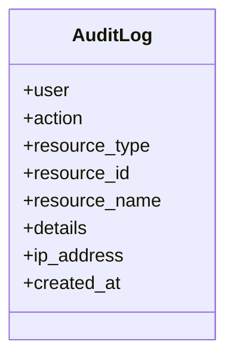
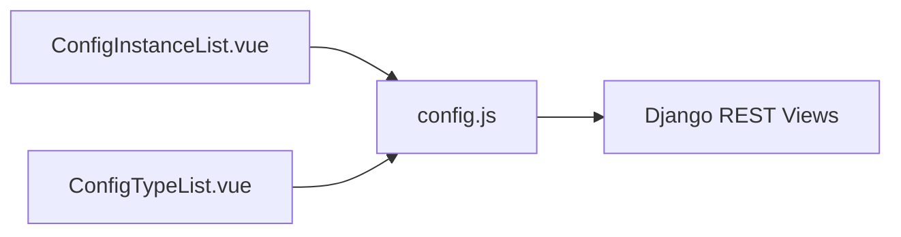
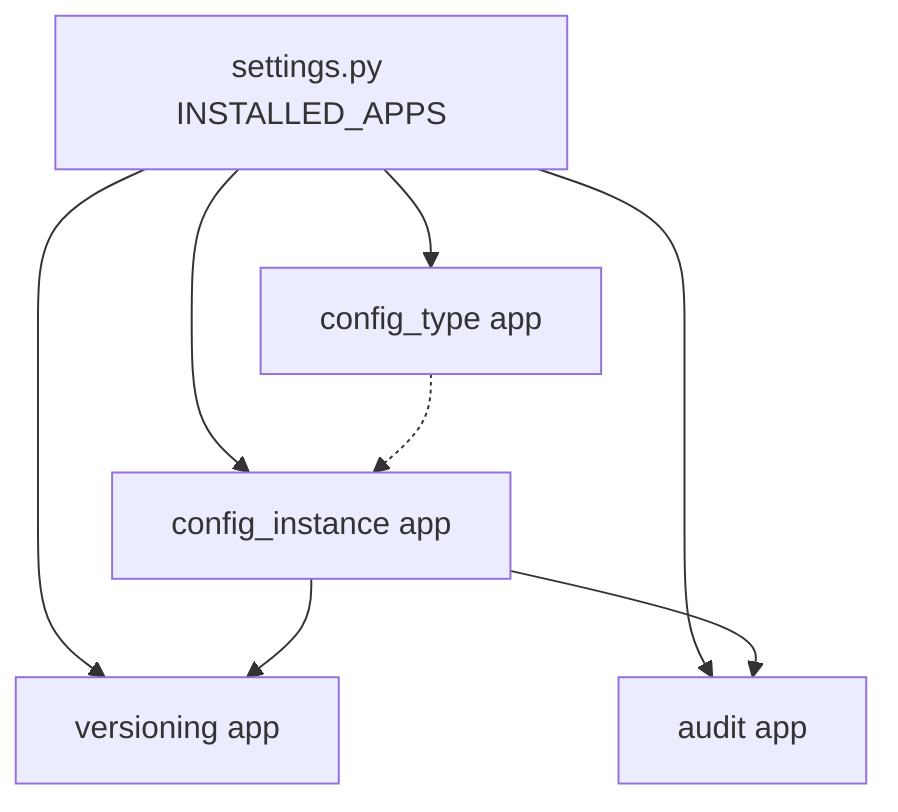

# Key Features and Capabilities

<cite>
**Referenced Files in This Document**
- [settings.py](file://backend/confighub/settings.py)
- [models.py](file://backend/config_type/models.py)
- [serializers.py](file://backend/config_type/serializers.py)
- [views.py](file://backend/config_type/views.py)
- [urls.py](file://backend/config_type/urls.py)
- [models.py](file://backend/config_instance/models.py)
- [serializers.py](file://backend/config_instance/serializers.py)
- [views.py](file://backend/config_instance/views.py)
- [urls.py](file://backend/config_instance/urls.py)
- [models.py](file://backend/versioning/models.py)
- [models.py](file://backend/audit/models.py)
- [ConfigTypeList.vue](file://frontend/src/views/ConfigTypeList.vue)
- [ConfigInstanceList.vue](file://frontend/src/views/ConfigInstanceList.vue)
- [config.js](file://frontend/src/api/config.js)
</cite>

## Table of Contents
1. [Introduction](#introduction)
2. [Project Structure](#project-structure)
3. [Core Components](#core-components)
4. [Architecture Overview](#architecture-overview)
5. [Detailed Component Analysis](#detailed-component-analysis)
6. [Dependency Analysis](#dependency-analysis)
7. [Performance Considerations](#performance-considerations)
8. [Troubleshooting Guide](#troubleshooting-guide)
9. [Conclusion](#conclusion)

## Introduction
This document presents the AI-Ops Configuration Hub’s key features and capabilities with a focus on:
- Multi-format configuration support (JSON and TOML)
- Robust JSON Schema validation
- Automatic version control and rollback
- Comprehensive audit trails
- User-friendly web interface

It explains how each feature is implemented, its business value, and how the components interoperate to form a cohesive configuration management solution.

## Project Structure
The system is organized into:
- Backend: Django + Django REST Framework with modular apps for configuration types, instances, versioning, and audit
- Frontend: Vue 3 + Element Plus SPA communicating via REST APIs

**Diagram sources**
- [settings.py:44-57](file://backend/confighub/settings.py#L44-L57)
- [urls.py:1-11](file://backend/config_type/urls.py#L1-L11)
- [urls.py:1-11](file://backend/config_instance/urls.py#L1-L11)

**Section sources**
- [settings.py:44-57](file://backend/confighub/settings.py#L44-L57)

## Core Components
- Configuration Type: Defines schema and supported format per type
- Configuration Instance: Stores raw content, normalized parsed data, and manages versioning and audit
- Versioning: Historical snapshots of instances with metadata
- Audit: Centralized logs of user actions and system events
- Frontend: CRUD and navigation for types and instances, plus pagination and filtering

Business value:
- Enforce correctness with JSON Schema
- Enable safe collaboration with versioning and rollback
- Provide visibility and compliance via audit logs
- Deliver a fast, intuitive UI for day-to-day operations

**Section sources**
- [models.py:4-25](file://backend/config_type/models.py#L4-L25)
- [models.py:7-69](file://backend/config_instance/models.py#L7-L69)
- [models.py:5-23](file://backend/versioning/models.py#L5-L23)
- [models.py:5-31](file://backend/audit/models.py#L5-L31)
- [ConfigTypeList.vue:1-99](file://frontend/src/views/ConfigTypeList.vue#L1-L99)
- [ConfigInstanceList.vue:1-170](file://frontend/src/views/ConfigInstanceList.vue#L1-L170)

## Architecture Overview
The backend exposes REST endpoints for configuration types and instances. On create/update, the instance pipeline:
- Validates format and content
- Applies JSON Schema if configured
- Persists normalized parsed data
- Creates a version snapshot
- Records an audit log

**Diagram sources**
- [views.py:36-61](file://backend/config_instance/views.py#L36-L61)
- [models.py:37-41](file://backend/config_instance/models.py#L37-L41)
- [models.py:5-23](file://backend/versioning/models.py#L5-L23)
- [models.py:5-31](file://backend/audit/models.py#L5-L31)

## Detailed Component Analysis

### Multi-format Configuration Support (JSON and TOML)
Implementation highlights:
- Format choices are enforced at model and serializer levels
- Content parsing occurs during save and on demand via getters
- Unified storage of parsed data enables efficient queries and indexing

**Diagram sources**
- [models.py:42-69](file://backend/config_instance/models.py#L42-L69)

Business value:
- Eliminates format drift across teams
- Enables consistent downstream processing and search

**Section sources**
- [models.py:6-9](file://backend/config_type/models.py#L6-L9)
- [models.py:9-12](file://backend/config_instance/models.py#L9-L12)
- [models.py:42-69](file://backend/config_instance/models.py#L42-L69)

### Robust JSON Schema Validation
Implementation highlights:
- Schema stored per configuration type
- Validation runs during instance creation/update
- Validation errors surfaced as user-facing messages

**Diagram sources**
- [serializers.py:20-48](file://backend/config_instance/serializers.py#L20-L48)
- [models.py:14-15](file://backend/config_type/models.py#L14-L15)

Business value:
- Prevents invalid configurations from entering production
- Encourages self-documenting configuration contracts

**Section sources**
- [serializers.py:24-30](file://backend/config_type/serializers.py#L24-L30)
- [serializers.py:37-42](file://backend/config_instance/serializers.py#L37-L42)
- [models.py:14-15](file://backend/config_type/models.py#L14-L15)

### Automatic Version Control and Rollback
Implementation highlights:
- Initial version created on first save
- New version created on each update
- Rollback endpoint re-applies historical snapshot and increments version

**Diagram sources**
- [views.py:62-91](file://backend/config_instance/views.py#L62-L91)
- [views.py:106-136](file://backend/config_instance/views.py#L106-L136)
- [models.py:5-23](file://backend/versioning/models.py#L5-L23)

Business value:
- Safely iterate on configurations with auditable history
- Recover quickly from accidental or bad changes

**Section sources**
- [views.py:36-91](file://backend/config_instance/views.py#L36-L91)
- [views.py:106-136](file://backend/config_instance/views.py#L106-L136)
- [models.py:5-23](file://backend/versioning/models.py#L5-L23)

### Comprehensive Audit Trails
Implementation highlights:
- Logs created on create/update of configuration instances
- Captures actor, action, resource, IP, and contextual details
- Extensible action vocabulary supports future auditing needs

**Diagram sources**
- [models.py:5-31](file://backend/audit/models.py#L5-L31)

Business value:
- Compliance-ready records of who changed what and when
- Security monitoring and incident response support

**Section sources**
- [views.py:52-60](file://backend/config_instance/views.py#L52-L60)
- [views.py:82-90](file://backend/config_instance/views.py#L82-L90)
- [models.py:7-14](file://backend/audit/models.py#L7-L14)

### User-Friendly Web Interface
Implementation highlights:
- List pages with filters (type, format, search) and pagination
- Navigation to create/edit/delete
- API bindings for all major operations

**Diagram sources**
- [ConfigInstanceList.vue:1-170](file://frontend/src/views/ConfigInstanceList.vue#L1-L170)
- [ConfigTypeList.vue:1-99](file://frontend/src/views/ConfigTypeList.vue#L1-L99)
- [config.js:1-34](file://frontend/src/api/config.js#L1-L34)

Business value:
- Low barrier to entry for operators and developers
- Consistent UX across configuration lifecycle tasks

**Section sources**
- [ConfigInstanceList.vue:13-72](file://frontend/src/views/ConfigInstanceList.vue#L13-L72)
- [ConfigTypeList.vue:13-38](file://frontend/src/views/ConfigTypeList.vue#L13-L38)
- [config.js:21-31](file://frontend/src/api/config.js#L21-L31)

## Dependency Analysis
- Apps installed in Django settings define module boundaries
- Views depend on models and cross-app models for versioning and audit
- Serializers depend on models and external libraries for validation
- Frontend depends on REST endpoints exposed by DRF ViewSets

**Diagram sources**
- [settings.py:44-57](file://backend/confighub/settings.py#L44-L57)

**Section sources**
- [settings.py:44-57](file://backend/confighub/settings.py#L44-L57)
- [views.py:7-8](file://backend/config_instance/views.py#L7-L8)

## Performance Considerations
- Parsing and validation occur on write; consider caching frequently accessed schemas and pre-validating large batches externally
- Pagination is enabled at the framework level; ensure frontend paginates aggressively for large datasets
- Audit and versioning add write overhead; tune database indexes on foreign keys and timestamps if scaling

## Troubleshooting Guide
Common issues and resolutions:
- Invalid JSON/TOML content: The instance serializer raises validation errors during create/update; correct the syntax or select the proper format
- Schema validation failure: Review the type’s schema and fix the content to match the schema
- Version not found on rollback: Ensure the target version exists for the instance before attempting rollback
- Audit gaps: Verify that requests capture client IP and that authentication is enabled so user context is recorded

**Section sources**
- [serializers.py:34-42](file://backend/config_instance/serializers.py#L34-L42)
- [views.py:112-116](file://backend/config_instance/views.py#L112-L116)
- [models.py:22-23](file://backend/audit/models.py#L22-L23)

## Conclusion
The AI-Ops Configuration Hub delivers a complete configuration lifecycle platform:
- Multi-format support ensures broad applicability
- JSON Schema enforcement guarantees correctness
- Automatic versioning and rollback enable safe experimentation
- Audit logs provide transparency and compliance
- The frontend accelerates adoption with a practical, filterable interface

These features work together to reduce risk, improve collaboration, and streamline operations across teams managing infrastructure and application configurations.