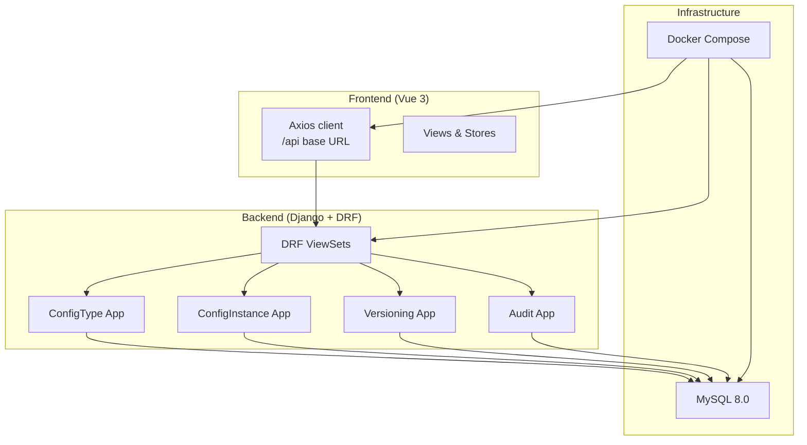
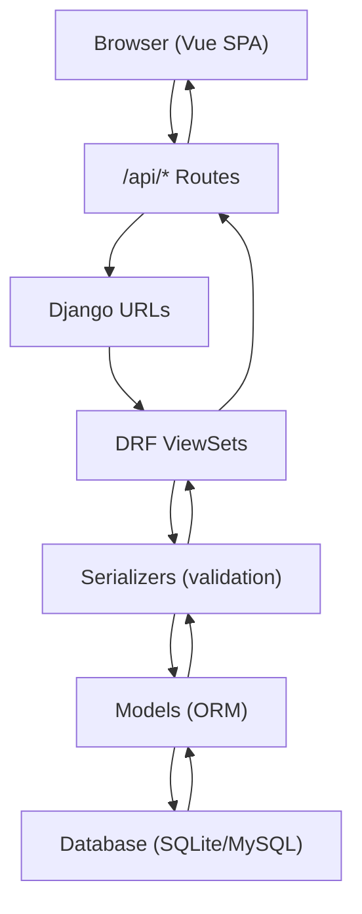
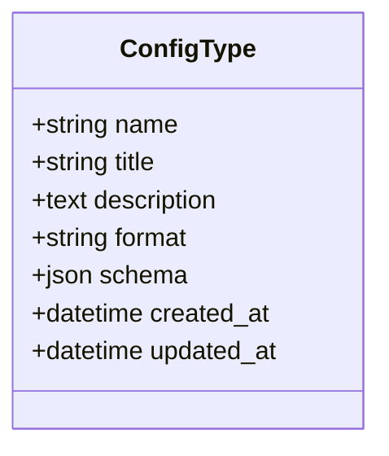
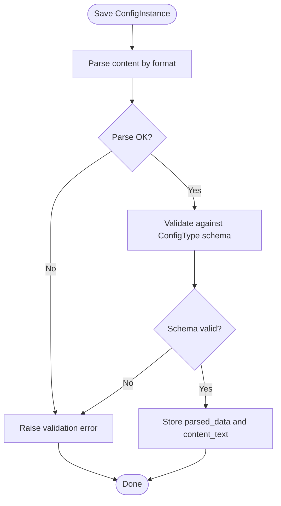
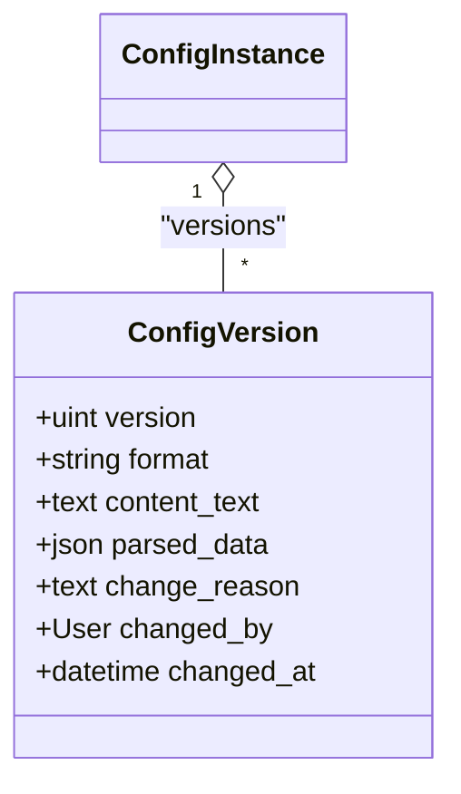
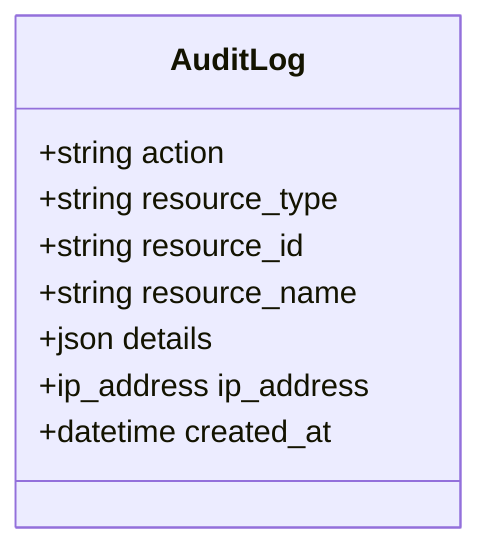
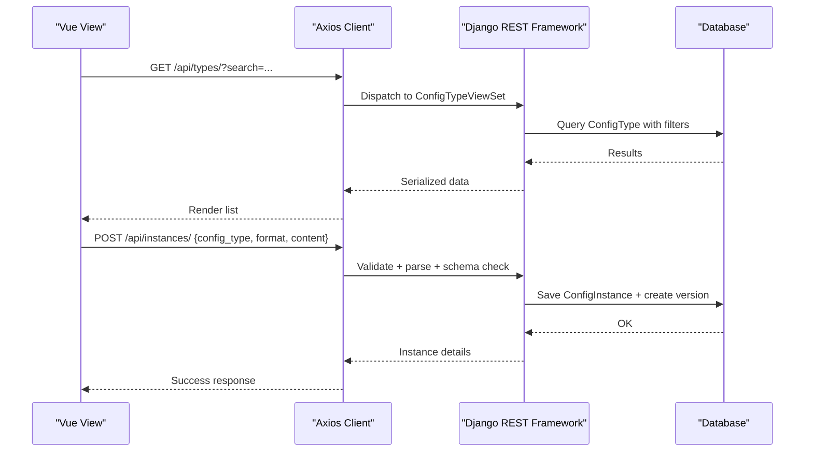
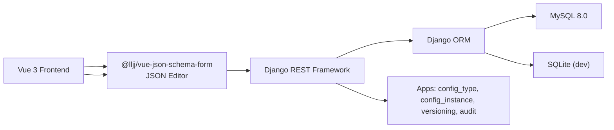

# Project Overview

<cite>
**Referenced Files in This Document**
- [settings.py](file://backend/confighub/settings.py)
- [urls.py](file://backend/confighub/urls.py)
- [manage.py](file://backend/manage.py)
- [docker-compose.yml](file://docker-compose.yml)
- [package.json](file://frontend/package.json)
- [config.js](file://frontend/src/api/config.js)
- [Home.vue](file://frontend/src/views/Home.vue)
- [models.py (ConfigType)](file://backend/config_type/models.py)
- [serializers.py (ConfigType)](file://backend/config_type/serializers.py)
- [views.py (ConfigType)](file://backend/config_type/views.py)
- [models.py (ConfigInstance)](file://backend/config_instance/models.py)
- [serializers.py (ConfigInstance)](file://backend/config_instance/serializers.py)
- [models.py (ConfigVersion)](file://backend/versioning/models.py)
- [models.py (AuditLog)](file://backend/audit/models.py)
</cite>

## Table of Contents
1. [Introduction](#introduction)
2. [Project Structure](#project-structure)
3. [Core Components](#core-components)
4. [Architecture Overview](#architecture-overview)
5. [Detailed Component Analysis](#detailed-component-analysis)
6. [Dependency Analysis](#dependency-analysis)
7. [Performance Considerations](#performance-considerations)
8. [Troubleshooting Guide](#troubleshooting-guide)
9. [Conclusion](#conclusion)
10. [Appendices](#appendices)

## Introduction
AI-Ops Configuration Hub is a centralized configuration management platform designed to simplify and standardize how applications define, store, validate, and evolve their configuration artifacts. It supports multiple configuration formats (JSON and TOML), enforces schema-driven validation, maintains version history, and records comprehensive audit trails. The system targets DevOps engineers, system administrators, and development teams who manage complex, evolving configurations across AI/ML pipelines, microservices, and infrastructure-as-code setups.

Key value propositions:
- Centralized configuration management: Single pane of glass for configuration types and instances.
- Multi-format support: Native parsing and export for JSON and TOML.
- Robust validation: JSON Schema-based validation ensures correctness and consistency.
- Comprehensive audit: Full lifecycle tracking of who did what, when, and why.
- Version control: Built-in versioning with rollback capabilities.

Target audience:
- DevOps engineers automating configuration deployment and drift detection.
- System administrators maintaining compliance and operational visibility.
- Development teams enforcing configuration standards and reducing errors.

## Project Structure
The project follows a clear separation of concerns:
- Backend: Django + Django REST Framework providing REST APIs for configuration types, instances, versioning, and auditing.
- Frontend: Vue 3 SPA with Element Plus and JSON Editor for user-friendly configuration authoring and management.
- Infrastructure: Docker Compose orchestrating MySQL, backend, and frontend services.

**Diagram sources**
- [docker-compose.yml:1-50](file://docker-compose.yml#L1-L50)
- [settings.py:44-57](file://backend/confighub/settings.py#L44-L57)
- [urls.py:20-24](file://backend/confighub/urls.py#L20-L24)

**Section sources**
- [docker-compose.yml:1-50](file://docker-compose.yml#L1-L50)
- [settings.py:44-57](file://backend/confighub/settings.py#L44-L57)
- [urls.py:20-24](file://backend/confighub/urls.py#L20-L24)

## Core Components
- ConfigType: Defines a named configuration schema with a chosen format (JSON/TOML) and a JSON Schema for validation.
- ConfigInstance: Represents a concrete configuration instance bound to a ConfigType, storing raw content and parsed JSON for indexing and queries.
- Versioning: Maintains historical snapshots of configuration changes with metadata for rollback.
- Audit: Records user actions, resources affected, and IP addresses for compliance and forensics.

High-level features:
- Create and manage configuration types with JSON Schema validation.
- Create, edit, and export configuration instances in JSON or TOML.
- Enforce schema validation during creation/update.
- Track versions and roll back to previous states.
- Log all user actions with timestamps and IP addresses.

**Section sources**
- [models.py (ConfigType):4-25](file://backend/config_type/models.py#L4-L25)
- [models.py (ConfigInstance):7-69](file://backend/config_instance/models.py#L7-L69)
- [models.py (ConfigVersion):5-23](file://backend/versioning/models.py#L5-L23)
- [models.py (AuditLog):5-31](file://backend/audit/models.py#L5-L31)

## Architecture Overview
The system is API-centric:
- Django serves as the backend engine with Django REST Framework powering CRUD and specialized endpoints.
- Frontend communicates via Axios against /api endpoints.
- Database is pluggable; defaults to SQLite for development, MySQL in production via Docker Compose.

**Diagram sources**
- [urls.py:20-24](file://backend/confighub/urls.py#L20-L24)
- [settings.py:33-39](file://backend/confighub/settings.py#L33-L39)
- [config.js:11-31](file://frontend/src/api/config.js#L11-L31)

**Section sources**
- [settings.py:33-39](file://backend/confighub/settings.py#L33-L39)
- [urls.py:20-24](file://backend/confighub/urls.py#L20-L24)
- [config.js:11-31](file://frontend/src/api/config.js#L11-L31)

## Detailed Component Analysis

### ConfigType: Schema-Driven Configuration Definition
ConfigType encapsulates:
- Unique name and human-readable title.
- Format selection (JSON or TOML).
- JSON Schema payload for validation.
- Creation/update timestamps.

Validation highlights:
- Name validation restricts characters to alphanumeric and underscore.
- Schema validation ensures it is a JSON object and contains a type field.

**Diagram sources**
- [models.py (ConfigType):4-25](file://backend/config_type/models.py#L4-L25)

**Section sources**
- [models.py (ConfigType):4-25](file://backend/config_type/models.py#L4-L25)
- [serializers.py (ConfigType):18-30](file://backend/config_type/serializers.py#L18-L30)

### ConfigInstance: Multi-Format Content with Validation
ConfigInstance binds a ConfigType to a named instance and manages:
- Raw content storage (content_text).
- Parsed JSON representation (parsed_data) for indexing and queries.
- Format enforcement (JSON/TOML).
- Versioning and ownership metadata.

Validation and parsing pipeline:
- On save, content is parsed according to selected format.
- JSON Schema validation is applied against the associated ConfigType.
- Export helpers provide JSON or TOML output.

**Diagram sources**
- [models.py (ConfigInstance):37-69](file://backend/config_instance/models.py#L37-L69)
- [serializers.py (ConfigInstance):20-48](file://backend/config_instance/serializers.py#L20-L48)

**Section sources**
- [models.py (ConfigInstance):37-69](file://backend/config_instance/models.py#L37-L69)
- [serializers.py (ConfigInstance):20-48](file://backend/config_instance/serializers.py#L20-L48)

### Versioning: Historical Snapshots and Rollback
ConfigVersion persists each persisted change:
- References the parent ConfigInstance.
- Stores format, raw content, and parsed data snapshot.
- Captures change reason, actor, and timestamp.
- Enforces uniqueness per instance/version.

**Diagram sources**
- [models.py (ConfigVersion):5-23](file://backend/versioning/models.py#L5-L23)

**Section sources**
- [models.py (ConfigVersion):5-23](file://backend/versioning/models.py#L5-L23)

### Audit: Compliance and Forensics
AuditLog captures:
- Action types (CREATE, UPDATE, DELETE, VIEW, EXPORT, IMPORT).
- Resource identity and name.
- Actor, IP address, and detailed metadata.
- Timestamps for chronological analysis.

**Diagram sources**
- [models.py (AuditLog):5-31](file://backend/audit/models.py#L5-L31)

**Section sources**
- [models.py (AuditLog):5-31](file://backend/audit/models.py#L5-L31)

### API Workflows and Frontend Integration
Frontend integrates with backend via Axios against /api endpoints. Typical flows:
- Listing and filtering ConfigTypes.
- Managing ConfigInstances (create, update, delete, list).
- Fetching versions and rolling back.
- Exporting content in desired format.

**Diagram sources**
- [config.js:11-31](file://frontend/src/api/config.js#L11-L31)
- [views.py (ConfigType):8-39](file://backend/config_type/views.py#L8-L39)
- [serializers.py (ConfigInstance):20-48](file://backend/config_instance/serializers.py#L20-L48)

**Section sources**
- [config.js:11-31](file://frontend/src/api/config.js#L11-L31)
- [views.py (ConfigType):8-39](file://backend/config_type/views.py#L8-L39)
- [serializers.py (ConfigInstance):20-48](file://backend/config_instance/serializers.py#L20-L48)

### Use Case Scenarios
- AI/ML Pipeline Configuration:
  - Define a ConfigType for training hyperparameters with a JSON Schema ensuring required fields and types.
  - Create ConfigInstances for experiments, enforce schema validation, and export TOML for downstream tools.
  - Use versioning to track iterations and audit logs to record who approved runs.

- Microservices Configuration:
  - Model service-specific ConfigTypes (e.g., logging, metrics, feature flags) with strict schemas.
  - Manage ConfigInstances centrally, export in preferred format, and audit all changes for compliance.

- Infrastructure-as-Code:
  - Store infrastructure templates as ConfigInstances, validate against schemas, and maintain version history for safe rollbacks.

[No sources needed since this section provides conceptual scenarios]

## Dependency Analysis
Technology stack and integration patterns:
- Backend: Django, Django REST Framework, JSON Schema validator, MySQL/SQLite.
- Frontend: Vue 3, Element Plus, JSON Editor, Axios, @iarna/toml for parsing.
- DevOps: Docker Compose for local development and production-like deployment.

**Diagram sources**
- [package.json:11-24](file://frontend/package.json#L11-L24)
- [settings.py:44-57](file://backend/confighub/settings.py#L44-L57)

**Section sources**
- [package.json:11-24](file://frontend/package.json#L11-L24)
- [settings.py:44-57](file://backend/confighub/settings.py#L44-L57)

## Performance Considerations
- Parsing and validation cost: Format parsing and JSON Schema validation occur on write; optimize by keeping schemas concise and avoiding overly deep nesting.
- Indexing: parsed_data is stored as JSONField for fast filtering; ensure appropriate database indexing on frequently queried fields.
- Pagination: REST framework pagination is enabled; leverage query parameters to limit result sets.
- Caching: Consider adding read-side caching for frequently accessed ConfigType definitions.

[No sources needed since this section provides general guidance]

## Troubleshooting Guide
Common issues and resolutions:
- Schema validation failures: Ensure the JSON Schema attached to the ConfigType is a valid JSON object and includes a type field. Review the serialized error messages returned by the API.
- Format parsing errors: Verify the content matches the selected format (JSON/TOML). The system raises explicit errors for malformed content.
- Database connectivity: Confirm environment variables for MySQL are set correctly in Docker Compose and that the service is healthy.
- CORS and API reachability: The backend allows all origins; verify the frontend baseURL and network routing.

**Section sources**
- [serializers.py (ConfigInstance):20-48](file://backend/config_instance/serializers.py#L20-L48)
- [models.py (ConfigInstance):42-53](file://backend/config_instance/models.py#L42-L53)
- [docker-compose.yml:23-31](file://docker-compose.yml#L23-L31)
- [settings.py:31](file://backend/confighub/settings.py#L31)

## Conclusion
AI-Ops Configuration Hub delivers a pragmatic, extensible solution for modern configuration management. By combining multi-format support, schema-driven validation, built-in versioning, and comprehensive audit trails, it empowers teams to govern configurations consistently across diverse AI/ops environments. The clean separation of frontend and backend, plus containerized deployment, makes it straightforward to integrate into existing CI/CD and monitoring stacks.

[No sources needed since this section summarizes without analyzing specific files]

## Appendices
- Getting started locally:
  - Start services with Docker Compose, then seed initial data via the admin interface or API.
  - Access the frontend at the configured port and the admin at /admin/.

- Environment variables:
  - Backend reads DB_ENGINE, DB_NAME, DB_USER, DB_PASSWORD, DB_HOST, DB_PORT, DJANGO_SECRET_KEY, and DJANGO_DEBUG from the environment.

**Section sources**
- [docker-compose.yml:21-38](file://docker-compose.yml#L21-L38)
- [settings.py:94-117](file://backend/confighub/settings.py#L94-L117)
- [manage.py:7-18](file://backend/manage.py#L7-L18)