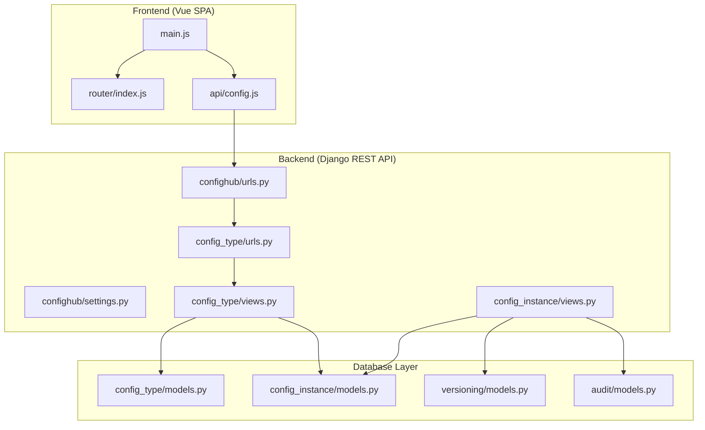
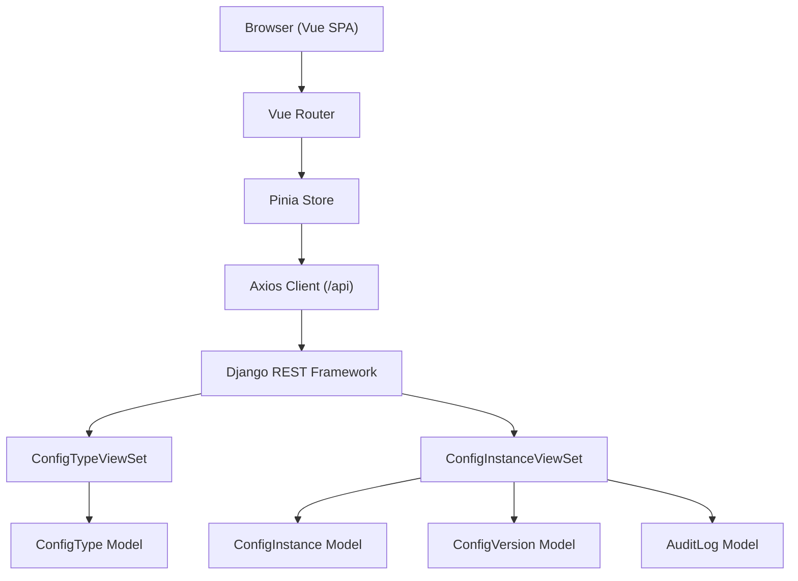
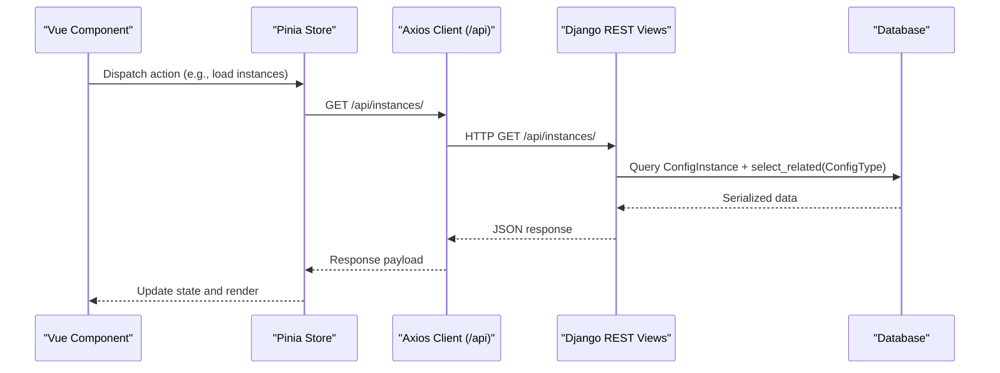
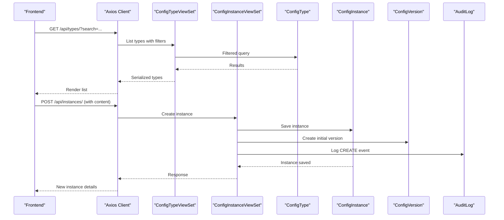
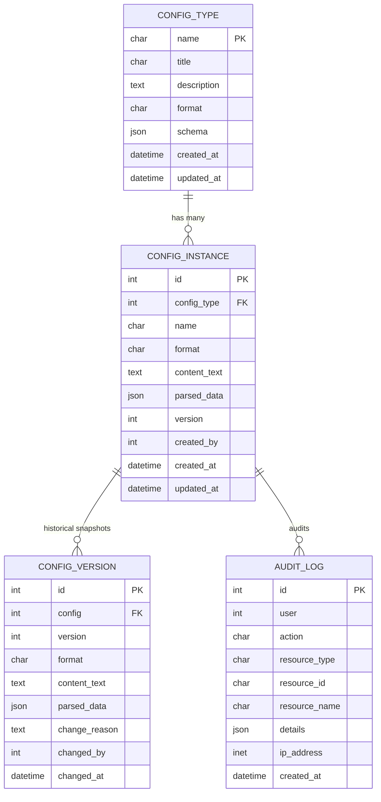
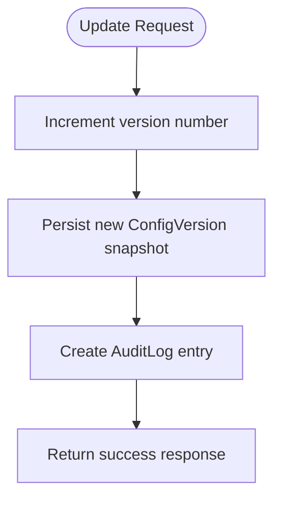
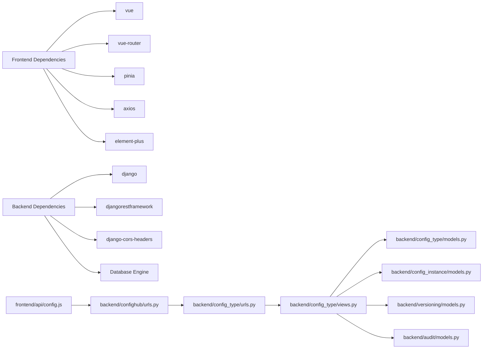
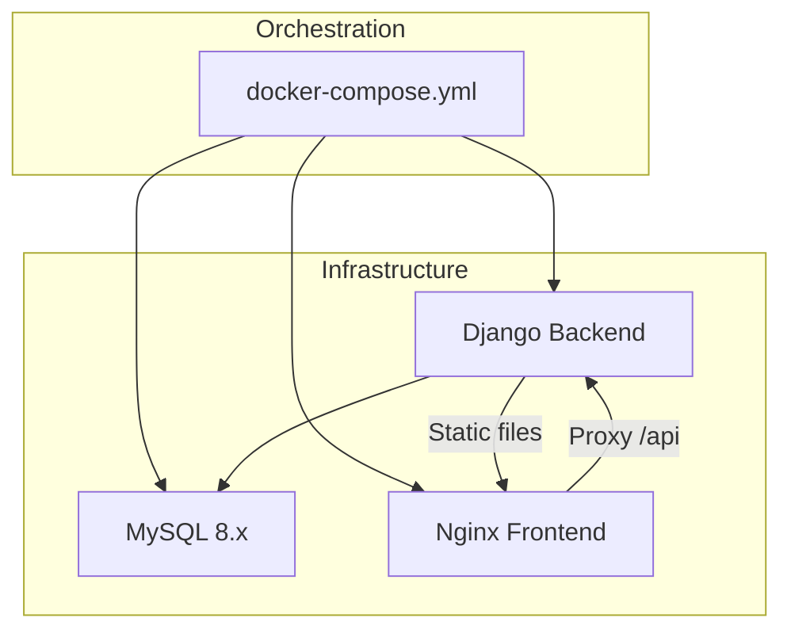

# System Architecture

<cite>
**Referenced Files in This Document**
- [settings.py](file://backend/confighub/settings.py)
- [urls.py](file://backend/confighub/urls.py)
- [config.js](file://frontend/src/api/config.js)
- [main.js](file://frontend/src/main.js)
- [index.js](file://frontend/src/router/index.js)
- [docker-compose.yml](file://docker-compose.yml)
- [models.py (ConfigType)](file://backend/config_type/models.py)
- [models.py (ConfigInstance)](file://backend/config_instance/models.py)
- [models.py (ConfigVersion)](file://backend/versioning/models.py)
- [models.py (AuditLog)](file://backend/audit/models.py)
- [views.py (ConfigType)](file://backend/config_type/views.py)
- [views.py (ConfigInstance)](file://backend/config_instance/views.py)
- [urls.py (ConfigType)](file://backend/config_type/urls.py)
- [package.json](file://frontend/package.json)
</cite>

## Table of Contents
1. [Introduction](#introduction)
2. [Project Structure](#project-structure)
3. [Core Components](#core-components)
4. [Architecture Overview](#architecture-overview)
5. [Detailed Component Analysis](#detailed-component-analysis)
6. [Dependency Analysis](#dependency-analysis)
7. [Performance Considerations](#performance-considerations)
8. [Troubleshooting Guide](#troubleshooting-guide)
9. [Conclusion](#conclusion)
10. [Appendices](#appendices)

## Introduction
This document describes the system architecture of the AI-Ops Configuration Hub, focusing on the separation between the Vue.js single-page application (SPA) frontend and the Django REST API backend. It explains data flow across components, the layered database design, and integration patterns for version control and audit systems. It also outlines infrastructure requirements, scalability considerations, and deployment topology using container orchestration.

## Project Structure
The system is organized into two primary layers:
- Frontend: Vue 3 SPA with routing, state management, and HTTP client.
- Backend: Django application exposing REST endpoints via Django REST Framework, with modular apps for configuration types, instances, versioning, and audit.

**Diagram sources**
- [main.js:1-22](file://frontend/src/main.js#L1-L22)
- [index.js:1-52](file://frontend/src/router/index.js#L1-L52)
- [config.js:1-34](file://frontend/src/api/config.js#L1-L34)
- [settings.py:1-159](file://backend/confighub/settings.py#L1-L159)
- [urls.py:1-25](file://backend/confighub/urls.py#L1-L25)
- [urls.py (ConfigType):1-11](file://backend/config_type/urls.py#L1-L11)
- [views.py (ConfigType):1-39](file://backend/config_type/views.py#L1-L39)
- [views.py (ConfigInstance):1-150](file://backend/config_instance/views.py#L1-L150)
- [models.py (ConfigType):1-25](file://backend/config_type/models.py#L1-L25)
- [models.py (ConfigInstance):1-69](file://backend/config_instance/models.py#L1-L69)
- [models.py (ConfigVersion):1-23](file://backend/versioning/models.py#L1-L23)
- [models.py (AuditLog):1-31](file://backend/audit/models.py#L1-L31)

**Section sources**
- [settings.py:1-159](file://backend/confighub/settings.py#L1-L159)
- [urls.py:1-25](file://backend/confighub/urls.py#L1-L25)
- [main.js:1-22](file://frontend/src/main.js#L1-L22)
- [index.js:1-52](file://frontend/src/router/index.js#L1-L52)
- [config.js:1-34](file://frontend/src/api/config.js#L1-L34)

## Core Components
- Frontend SPA bootstrap and DI container:
  - Initializes Vue app, Pinia, Element Plus, and registers icons.
  - Mounts the root component to the DOM.
- Routing:
  - Defines routes for home, configuration type list/edit, and configuration instance list/edit.
- API client:
  - Axios instance configured with base URL pointing to the backend API.
  - Exposes typed endpoints for configuration types and instances, including nested actions (e.g., versions, rollback, content).
- Backend settings and middleware:
  - REST framework defaults, CORS, pagination, and database selection (SQLite by default, MySQL via environment).
  - Installed apps include core Django, REST framework, CORS, and domain apps.
- URL routing:
  - Root URL patterns include admin and API namespaces.
  - API namespace includes config_type and config_instance endpoints.

**Section sources**
- [main.js:1-22](file://frontend/src/main.js#L1-L22)
- [index.js:1-52](file://frontend/src/router/index.js#L1-L52)
- [config.js:1-34](file://frontend/src/api/config.js#L1-L34)
- [settings.py:33-57](file://backend/confighub/settings.py#L33-L57)
- [urls.py:20-24](file://backend/confighub/urls.py#L20-L24)

## Architecture Overview
The system follows a classic SPA plus REST API pattern:
- The Vue SPA communicates with the Django REST API via HTTP endpoints.
- The backend enforces layered concerns:
  - Domain models define configuration types and instances, with JSON/TOML parsing and unified storage.
  - Versioning tracks historical snapshots per instance.
  - Audit logs record user actions and resource changes.
- The frontend consumes REST endpoints to list, create, update, delete, and query related resources.

**Diagram sources**
- [config.js:1-34](file://frontend/src/api/config.js#L1-L34)
- [views.py (ConfigType):1-39](file://backend/config_type/views.py#L1-L39)
- [views.py (ConfigInstance):1-150](file://backend/config_instance/views.py#L1-L150)
- [models.py (ConfigType):1-25](file://backend/config_type/models.py#L1-L25)
- [models.py (ConfigInstance):1-69](file://backend/config_instance/models.py#L1-L69)
- [models.py (ConfigVersion):1-23](file://backend/versioning/models.py#L1-L23)
- [models.py (AuditLog):1-31](file://backend/audit/models.py#L1-L31)

## Detailed Component Analysis

### Frontend: API Client and Routing
- API client:
  - Base URL set to "/api".
  - Provides methods for listing, retrieving, creating, updating, deleting, and nested actions for configuration types and instances.
- Routing:
  - Routes cover listing and editing pages for configuration types and instances.
- State management:
  - Uses Pinia for reactive state and stores.

**Diagram sources**
- [config.js:22-31](file://frontend/src/api/config.js#L22-L31)
- [views.py (ConfigInstance):21-34](file://backend/config_instance/views.py#L21-L34)
- [models.py (ConfigInstance):14-32](file://backend/config_instance/models.py#L14-L32)

**Section sources**
- [config.js:1-34](file://frontend/src/api/config.js#L1-L34)
- [index.js:1-52](file://frontend/src/router/index.js#L1-L52)
- [package.json:11-20](file://frontend/package.json#L11-L20)

### Backend: REST API Design and Endpoints
- ConfigTypeViewSet:
  - Standard CRUD via ModelViewSet.
  - Lookup by name field.
  - Searchable by name/title and filterable by format.
  - Nested action to list instances under a type.
- ConfigInstanceViewSet:
  - Standard CRUD with list serializer override.
  - Filtering by config_type, search, and format.
  - Atomic creation and updates persist a version snapshot and audit log.
  - Nested actions for versions, rollback, and content retrieval in requested format.

**Diagram sources**
- [views.py (ConfigType):8-39](file://backend/config_type/views.py#L8-L39)
- [views.py (ConfigInstance):36-90](file://backend/config_instance/views.py#L36-L90)
- [models.py (ConfigType):11-24](file://backend/config_type/models.py#L11-L24)
- [models.py (ConfigInstance):37-69](file://backend/config_instance/models.py#L37-L69)
- [models.py (ConfigVersion):5-22](file://backend/versioning/models.py#L5-L22)
- [models.py (AuditLog):5-30](file://backend/audit/models.py#L5-L30)

**Section sources**
- [urls.py (ConfigType):1-11](file://backend/config_type/urls.py#L1-L11)
- [views.py (ConfigType):1-39](file://backend/config_type/views.py#L1-L39)
- [views.py (ConfigInstance):1-150](file://backend/config_instance/views.py#L1-L150)

### Data Models and Relationships
- ConfigType:
  - Unique name, title, description, format choice, JSON schema, timestamps.
- ConfigInstance:
  - Foreign key to ConfigType, unique-together constraint on (config_type, name).
  - Stores raw content and normalized parsed_data for querying.
  - Tracks creator, version, and timestamps.
- ConfigVersion:
  - Historical snapshot per instance with unique version per config.
- AuditLog:
  - Captures user actions, resource metadata, IP address, and details.

**Diagram sources**
- [models.py (ConfigType):4-24](file://backend/config_type/models.py#L4-L24)
- [models.py (ConfigInstance):7-69](file://backend/config_instance/models.py#L7-L69)
- [models.py (ConfigVersion):5-22](file://backend/versioning/models.py#L5-L22)
- [models.py (AuditLog):5-30](file://backend/audit/models.py#L5-L30)

**Section sources**
- [models.py (ConfigType):1-25](file://backend/config_type/models.py#L1-L25)
- [models.py (ConfigInstance):1-69](file://backend/config_instance/models.py#L1-L69)
- [models.py (ConfigVersion):1-23](file://backend/versioning/models.py#L1-L23)
- [models.py (AuditLog):1-31](file://backend/audit/models.py#L1-L31)

### Version Control and Audit Integration
- Creation and updates:
  - On create/update, a new version snapshot is persisted and an audit log entry is recorded atomically.
- Rollback:
  - A rollback action restores content from a selected historical version and creates a new version with a change reason.
- Content retrieval:
  - The content endpoint returns parsed data and serialized content in the requested format.

**Diagram sources**
- [views.py (ConfigInstance):62-90](file://backend/config_instance/views.py#L62-L90)
- [models.py (ConfigVersion):5-22](file://backend/versioning/models.py#L5-L22)
- [models.py (AuditLog):5-30](file://backend/audit/models.py#L5-L30)

**Section sources**
- [views.py (ConfigInstance):36-136](file://backend/config_instance/views.py#L36-L136)

## Dependency Analysis
- Frontend dependencies:
  - Vue 3, Vue Router, Pinia, Element Plus, Axios, and optional JSON editor libraries.
- Backend dependencies:
  - Django, Django REST Framework, Django CORS headers, and database engine selection.
- Internal module dependencies:
  - ConfigInstanceViewSet imports ConfigVersion and AuditLog models.
  - ConfigTypeViewSet and ConfigInstanceViewSet depend on their respective models and serializers.

**Diagram sources**
- [package.json:11-20](file://frontend/package.json#L11-L20)
- [settings.py:44-57](file://backend/confighub/settings.py#L44-L57)
- [urls.py:20-24](file://backend/confighub/urls.py#L20-L24)
- [urls.py (ConfigType):1-11](file://backend/config_type/urls.py#L1-L11)
- [views.py (ConfigType):1-39](file://backend/config_type/views.py#L1-L39)
- [models.py (ConfigType):1-25](file://backend/config_type/models.py#L1-L25)
- [models.py (ConfigInstance):1-69](file://backend/config_instance/models.py#L1-L69)
- [models.py (ConfigVersion):1-23](file://backend/versioning/models.py#L1-L23)
- [models.py (AuditLog):1-31](file://backend/audit/models.py#L1-L31)

**Section sources**
- [package.json:1-26](file://frontend/package.json#L1-L26)
- [settings.py:44-57](file://backend/confighub/settings.py#L44-L57)

## Performance Considerations
- Pagination:
  - REST framework pagination is enabled with a fixed page size, reducing payload sizes for list endpoints.
- Select-related queries:
  - Instance listing uses select_related to avoid N+1 queries when accessing related ConfigType.
- Filtering:
  - Query parameters enable server-side filtering and search to minimize client-side processing.
- Database engine:
  - SQLite is suitable for development; MySQL is supported for production-grade workloads with proper connection tuning and indexing.
- Recommendations:
  - Index frequently filtered fields (e.g., config_type.name, name, format).
  - Consider read replicas for heavy read workloads.
  - Cache hot lists and metadata where appropriate.
  - Use database connection pooling and tune max connections.

**Section sources**
- [settings.py:33-39](file://backend/confighub/settings.py#L33-L39)
- [views.py (ConfigInstance):34-34](file://backend/config_instance/views.py#L34-L34)

## Troubleshooting Guide
- CORS and API reachability:
  - Verify frontend base URL targets the backend API route and that CORS is configured.
- Authentication and permissions:
  - Default permission class allows any; ensure authentication is configured as needed.
- Database connectivity:
  - Confirm environment variables for DB engine, host, port, name, user, and password match the running database service.
- Health checks:
  - The compose file defines a database health check; ensure the backend waits for the database to be healthy before starting.

**Section sources**
- [settings.py:31-39](file://backend/confighub/settings.py#L31-L39)
- [docker-compose.yml:16-19](file://docker-compose.yml#L16-L19)
- [docker-compose.yml:32-34](file://docker-compose.yml#L32-L34)

## Conclusion
The AI-Ops Configuration Hub employs a clean separation between a Vue.js SPA and a Django REST API, enabling scalable development and deployment. The layered database design with explicit versioning and audit logging ensures traceability and reliability. With configurable database engines, pagination, and filtering, the system is prepared for growth. Container orchestration via docker-compose simplifies local development and production alignment.

## Appendices

### Infrastructure Requirements
- Development:
  - Node.js and npm/yarn for frontend builds.
  - Python and pip for backend virtual environment and dependencies.
  - Docker and docker-compose for local orchestration.
- Production:
  - Reverse proxy (e.g., Nginx) serving static assets and proxying API requests.
  - Database: MySQL 8.x recommended; configure credentials and connection limits.
  - Environment variables for secrets, debug mode, and database configuration.
  - Optional: Redis for caching or session storage if extended.

### Deployment Topology
- Services:
  - Database: MySQL 8.x with persistent volume and health checks.
  - Backend: Django app exposing API on port 8000; serves static files.
  - Frontend: Nginx serving built SPA on port 80; proxies /api to backend.
- Orchestration:
  - docker-compose orchestrates three services with explicit dependencies and volumes.

**Diagram sources**
- [docker-compose.yml:1-50](file://docker-compose.yml#L1-L50)