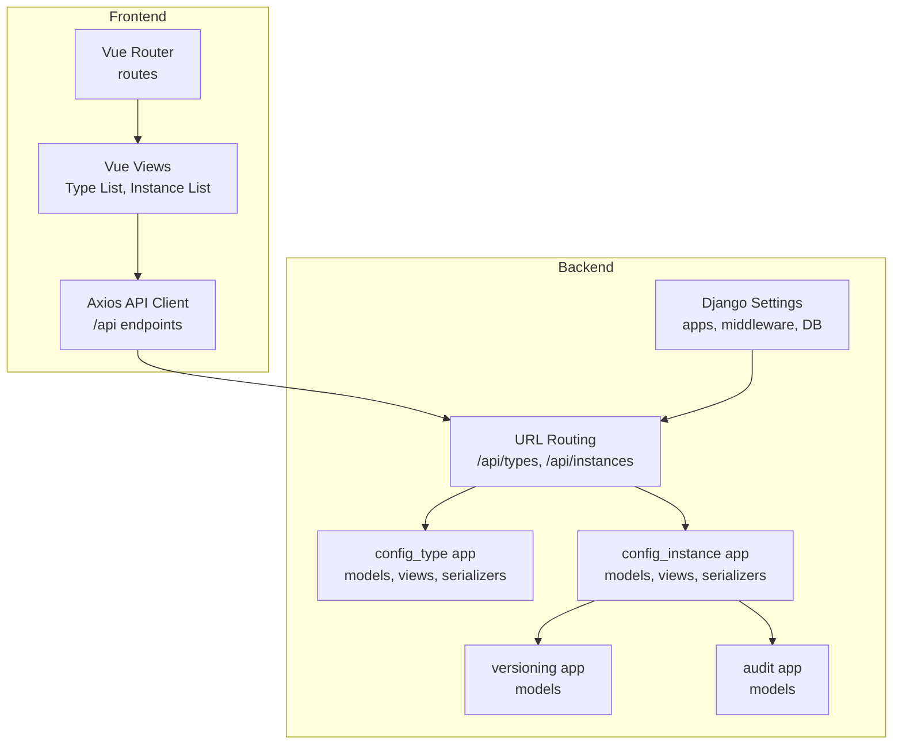
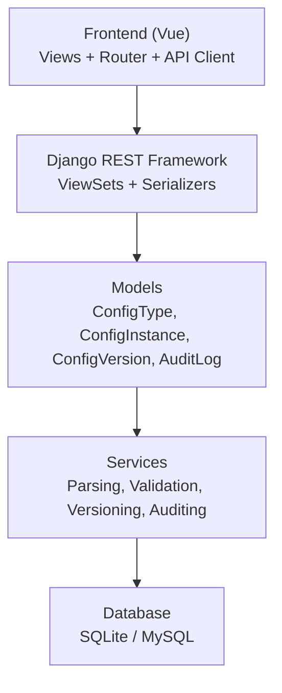
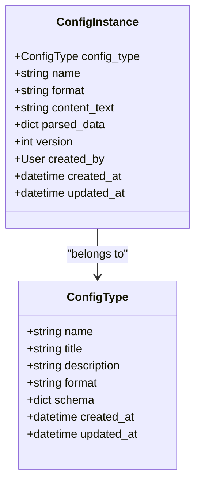
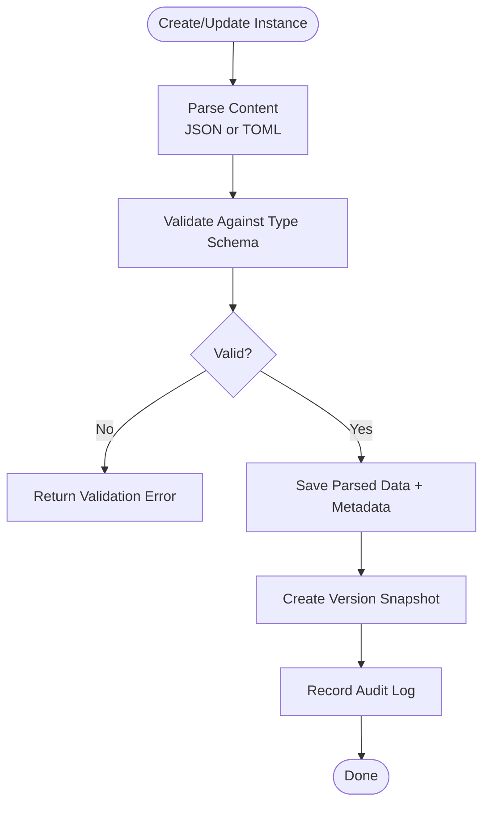
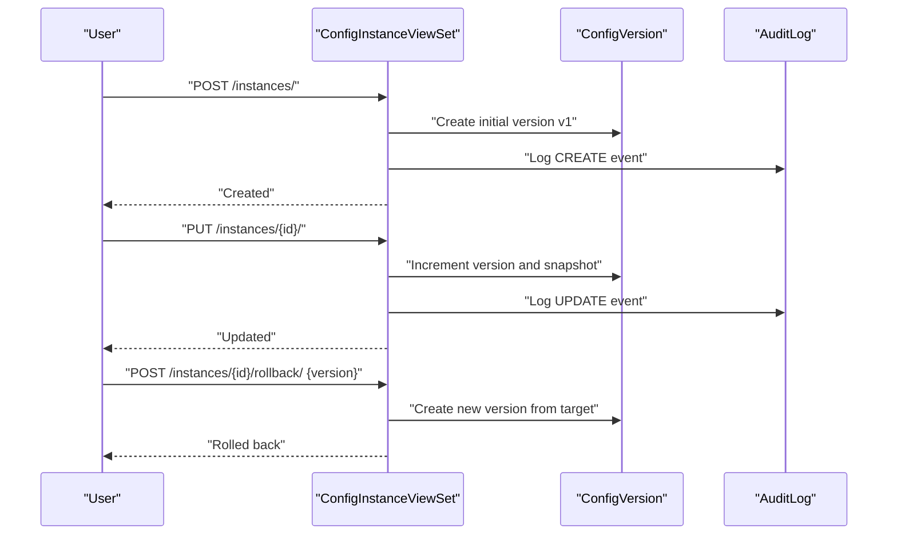
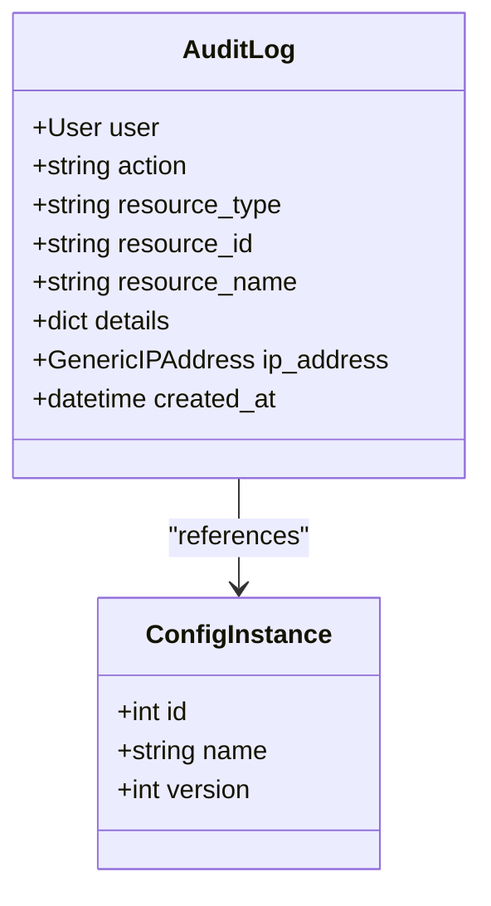
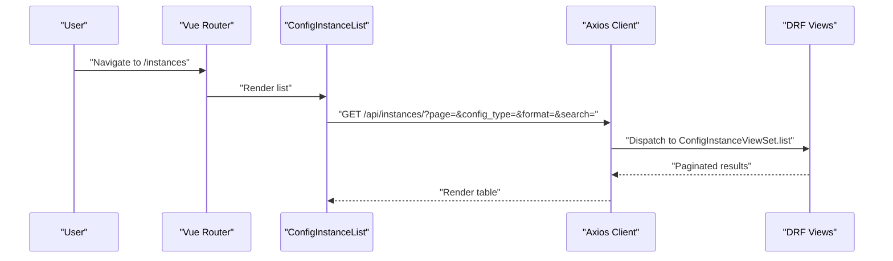
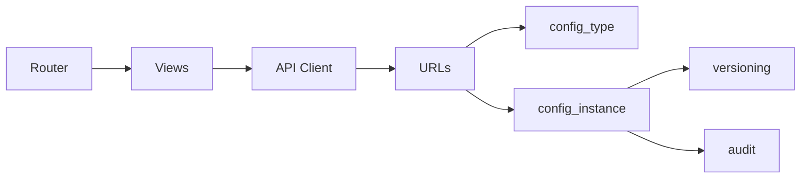

# Target Audience and Use Cases

<cite>
**Referenced Files in This Document**
- [settings.py](file://backend/confighub/settings.py)
- [urls.py](file://backend/confighub/urls.py)
- [models.py](file://backend/config_type/models.py)
- [models.py](file://backend/config_instance/models.py)
- [models.py](file://backend/versioning/models.py)
- [models.py](file://backend/audit/models.py)
- [views.py](file://backend/config_type/views.py)
- [views.py](file://backend/config_instance/views.py)
- [serializers.py](file://backend/config_type/serializers.py)
- [serializers.py](file://backend/config_instance/serializers.py)
- [ConfigTypeList.vue](file://frontend/src/views/ConfigTypeList.vue)
- [ConfigInstanceList.vue](file://frontend/src/views/ConfigInstanceList.vue)
- [config.js](file://frontend/src/api/config.js)
- [index.js](file://frontend/src/router/index.js)
</cite>

## Table of Contents
1. [Introduction](#introduction)
2. [Project Structure](#project-structure)
3. [Core Components](#core-components)
4. [Architecture Overview](#architecture-overview)
5. [Detailed Component Analysis](#detailed-component-analysis)
6. [Dependency Analysis](#dependency-analysis)
7. [Performance Considerations](#performance-considerations)
8. [Troubleshooting Guide](#troubleshooting-guide)
9. [Conclusion](#conclusion)
10. [Appendices](#appendices)

## Introduction
This document defines the target audience and use cases for the AI-Ops Configuration Hub. It identifies primary user groups—DevOps engineers, system administrators, development teams building microservices, and AI/ML engineers—and maps concrete use cases such as centralized configuration management for distributed AI applications, version-controlled deployments, audit-ready change tracking, and multi-environment synchronization. It also outlines typical workflows, integration patterns with CI/CD pipelines and monitoring systems, and real-world configuration types and instances.

## Project Structure
The AI-Ops Configuration Hub is a Django backend with Django REST Framework APIs and a Vue.js frontend. The backend organizes functionality into Django apps:
- config_type: Defines configuration types with JSON Schema validation and metadata.
- config_instance: Manages configuration instances with format support (JSON/TOML), parsing, and versioning.
- versioning: Stores historical versions of configuration instances.
- audit: Records user actions and resource changes for compliance and traceability.
- confighub: Django project settings and URL routing.

The frontend provides a web UI for browsing and editing configuration types and instances, integrating with the backend via Axios HTTP requests.

**Diagram sources**
- [settings.py:44-57](file://backend/confighub/settings.py#L44-L57)
- [urls.py:20-24](file://backend/confighub/urls.py#L20-L24)
- [ConfigTypeList.vue:76-124](file://frontend/src/views/ConfigTypeList.vue#L76-L124)
- [ConfigInstanceList.vue:77-156](file://frontend/src/views/ConfigInstanceList.vue#L77-L156)
- [config.js:11-31](file://frontend/src/api/config.js#L11-L31)

**Section sources**
- [settings.py:44-57](file://backend/confighub/settings.py#L44-L57)
- [urls.py:20-24](file://backend/confighub/urls.py#L20-L24)

## Core Components
- Configuration Type (config_type): Defines a named, typed configuration schema with JSON Schema validation and supported formats (JSON/TOML). It enables consistent governance across diverse configuration categories.
- Configuration Instance (config_instance): Represents a specific configuration payload under a type, with parsed data storage, original content, format, version, and creator metadata.
- Version History (versioning): Captures immutable snapshots of configuration changes with timestamps, reasons, and actors for rollback and auditing.
- Audit Logs (audit): Tracks user actions (create/update/delete/view/export/import) against resources with IP and details for compliance.
- Frontend UI: Provides list and edit pages for types and instances, search/filtering, pagination, and API-driven interactions.

These components collectively enable centralized, versioned, auditable, and interoperable configuration management suitable for distributed AI applications and microservices.

**Section sources**
- [models.py:4-24](file://backend/config_type/models.py#L4-L24)
- [models.py:7-69](file://backend/config_instance/models.py#L7-L69)
- [models.py:5-22](file://backend/versioning/models.py#L5-L22)
- [models.py:5-30](file://backend/audit/models.py#L5-L30)

## Architecture Overview
The system follows a layered architecture:
- Presentation Layer: Vue.js SPA with Element Plus components and Vue Router.
- API Layer: Django REST Framework ViewSets exposing CRUD and specialized actions (versions, rollback, content).
- Domain Layer: Models encapsulate business rules (format parsing, schema validation, version increments).
- Persistence Layer: SQLite by default, with optional MySQL configuration; static assets served by Django.

**Diagram sources**
- [settings.py:94-117](file://backend/confighub/settings.py#L94-L117)
- [views.py:11-150](file://backend/config_instance/views.py#L11-L150)
- [serializers.py:7-60](file://backend/config_instance/serializers.py#L7-L60)

## Detailed Component Analysis

### Configuration Types: Governance and Schema Enforcement
- Purpose: Define reusable configuration templates with JSON Schema validation and metadata (name, title, description, format).
- Key behaviors:
  - Name validation restricts to alphanumeric and underscores.
  - JSON Schema validation ensures content conforms to declared schema.
  - Lookup by name enables precise association with instances.
- Typical use cases:
  - Microservices configuration profiles (e.g., service discovery, logging).
  - AI/ML training job templates (e.g., hyperparameters, dataset paths).
  - Enterprise-wide deployment policies (e.g., network proxies, TLS settings).

**Diagram sources**
- [models.py:4-24](file://backend/config_type/models.py#L4-L24)
- [models.py:7-35](file://backend/config_instance/models.py#L7-L35)

**Section sources**
- [models.py:4-24](file://backend/config_type/models.py#L4-L24)
- [serializers.py:5-31](file://backend/config_type/serializers.py#L5-L31)
- [views.py:8-39](file://backend/config_type/views.py#L8-L39)

### Configuration Instances: Content Parsing, Validation, and Retrieval
- Purpose: Store specific configuration payloads with format-aware parsing and unified JSON representation for queries.
- Key behaviors:
  - Accepts JSON or TOML content; validates and parses into a normalized JSON structure.
  - Enforces schema validation against the associated type’s schema.
  - Exposes endpoints to fetch content in a requested format or original format.
- Typical use cases:
  - Environment-specific overrides (dev/stage/prod).
  - Model serving configurations (e.g., runtime parameters, batching).
  - Feature flag toggles for microservices.

**Diagram sources**
- [models.py:37-69](file://backend/config_instance/models.py#L37-L69)
- [serializers.py:20-48](file://backend/config_instance/serializers.py#L20-L48)
- [views.py:36-91](file://backend/config_instance/views.py#L36-L91)

**Section sources**
- [models.py:7-69](file://backend/config_instance/models.py#L7-L69)
- [serializers.py:7-60](file://backend/config_instance/serializers.py#L7-L60)
- [views.py:11-150](file://backend/config_instance/views.py#L11-L150)

### Versioning: Immutable Snapshots and Rollback
- Purpose: Preserve configuration history with reasons, actors, and timestamps for traceability and rollback.
- Key behaviors:
  - New instance creation seeds version 1.
  - Updates increment version and snapshot previous content.
  - Rollback endpoint restores a chosen version and records a new version.
- Typical use cases:
  - Compliance audits requiring “as-issued” evidence.
  - Safe rollbacks after failed deployments.
  - Multi-environment synchronization with explicit change tracking.

**Diagram sources**
- [views.py:36-136](file://backend/config_instance/views.py#L36-L136)
- [models.py:5-22](file://backend/versioning/models.py#L5-L22)
- [models.py:5-30](file://backend/audit/models.py#L5-L30)

**Section sources**
- [models.py:5-22](file://backend/versioning/models.py#L5-L22)
- [views.py:92-136](file://backend/config_instance/views.py#L92-L136)

### Audit: Change Tracking and Compliance
- Purpose: Record who did what to which resource, when, and from where, enabling audit-ready trails.
- Key behaviors:
  - Captures user, action type, resource identity, IP address, and details.
  - Integrated with create/update operations on configuration instances.
- Typical use cases:
  - Regulatory compliance reporting.
  - Forensic investigations into misconfigurations.
  - Internal policy enforcement and visibility.

**Diagram sources**
- [models.py:5-30](file://backend/audit/models.py#L5-L30)
- [models.py:24-27](file://backend/config_instance/models.py#L24-L27)

**Section sources**
- [models.py:5-30](file://backend/audit/models.py#L5-L30)
- [views.py:52-90](file://backend/config_instance/views.py#L52-L90)

### Frontend Integration: UI Workflows and API Contracts
- Purpose: Provide user-friendly interfaces for browsing, filtering, creating, updating, and deleting configuration types and instances.
- Key behaviors:
  - Routes for list and edit pages.
  - Search/filter by type/format/name.
  - Pagination and confirmation dialogs for destructive actions.
  - API client mapping to backend endpoints (/api/types, /api/instances).
- Typical user journeys:
  - DevOps engineer creates a type with a JSON Schema, then creates instances per environment.
  - System administrator audits recent changes and performs controlled rollbacks.
  - Development team synchronizes microservice configs across environments.
  - AI/ML engineer manages model serving parameters with strict schema validation.

**Diagram sources**
- [index.js:8-44](file://frontend/src/router/index.js#L8-L44)
- [ConfigInstanceList.vue:77-156](file://frontend/src/views/ConfigInstanceList.vue#L77-L156)
- [config.js:22-31](file://frontend/src/api/config.js#L22-L31)

**Section sources**
- [ConfigTypeList.vue:71-124](file://frontend/src/views/ConfigTypeList.vue#L71-L124)
- [ConfigInstanceList.vue:76-156](file://frontend/src/views/ConfigInstanceList.vue#L76-L156)
- [config.js:11-34](file://frontend/src/api/config.js#L11-L34)
- [index.js:1-52](file://frontend/src/router/index.js#L1-L52)

## Dependency Analysis
- Backend dependencies:
  - Django apps depend on shared models and serializers.
  - ConfigInstance depends on ConfigType for schema validation.
  - Versioning and audit are side effects of create/update operations.
- Frontend dependencies:
  - Views depend on router and API client.
  - API client depends on backend URL routing.

**Diagram sources**
- [urls.py:20-24](file://backend/confighub/urls.py#L20-L24)
- [settings.py:53-56](file://backend/confighub/settings.py#L53-L56)

**Section sources**
- [settings.py:53-56](file://backend/confighub/settings.py#L53-L56)
- [urls.py:20-24](file://backend/confighub/urls.py#L20-L24)

## Performance Considerations
- Pagination: REST framework pagination is configured to limit response sizes for large datasets.
- Select-related queries: Instance listing uses select_related to reduce database round-trips.
- Parsing cost: Format parsing occurs on save; keep content sizes reasonable and avoid unnecessary updates.
- Database choice: SQLite is suitable for development; MySQL offers better concurrency for production workloads.

[No sources needed since this section provides general guidance]

## Troubleshooting Guide
- Schema validation errors: Occur when content does not match the associated type’s JSON Schema; review the schema and content structure.
- Format parsing errors: Occur when content is invalid JSON or TOML; ensure correct syntax and encoding.
- Version not found during rollback: Verify the target version exists for the instance.
- Audit gaps: Confirm that create/update operations are being invoked; check user authentication and request context.

**Section sources**
- [serializers.py:20-48](file://backend/config_instance/serializers.py#L20-L48)
- [models.py:42-53](file://backend/config_instance/models.py#L42-L53)
- [views.py:112-116](file://backend/config_instance/views.py#L112-L116)

## Conclusion
The AI-Ops Configuration Hub provides a robust foundation for centralized, versioned, and audited configuration management tailored to modern distributed systems. Its design supports DevOps, system administrators, microservices teams, and AI/ML engineers by enforcing schema governance, preserving immutable history, and offering clear audit trails. Integrating with CI/CD pipelines and monitoring systems enables automated, safe, and traceable deployments across environments.

[No sources needed since this section summarizes without analyzing specific files]

## Appendices

### Use Cases and Personas
- DevOps engineers:
  - Centralized configuration management for heterogeneous services.
  - Version-controlled deployments with rollback capability.
  - Multi-environment synchronization with audit-ready change logs.
- System administrators:
  - Enterprise-wide configuration policies with schema enforcement.
  - Compliance reporting via audit logs and version history.
- Development teams (microservices):
  - Shared configuration templates with JSON Schema validation.
  - Environment-specific overrides with safe rollbacks.
- AI/ML engineers:
  - Model serving parameter templates with strict validation.
  - Experiment configuration management and reproducible runs.

### Real-World Configuration Types and Instances
- Configuration Types:
  - Service Discovery Profile: JSON Schema for service registry endpoints and health checks.
  - Logging Policy: JSON Schema for log levels, sinks, and retention.
  - Training Job Template: JSON Schema for dataset URIs, hyperparameters, and compute resources.
  - Model Serving Config: JSON Schema for inference endpoints, batching, and GPU allocation.
- Configuration Instances:
  - dev/service-discovery.json: Development service registry endpoints.
  - prod/logging-policy.toml: Production log sink configuration.
  - experiments/exp-001.json: Hyperparameter set for a specific experiment.
  - staging/model-serving.json: Staging inference scaling and timeout settings.

[No sources needed since this section provides illustrative examples]