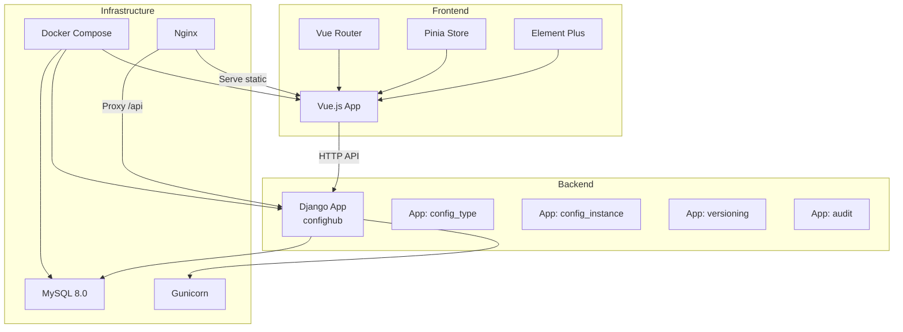
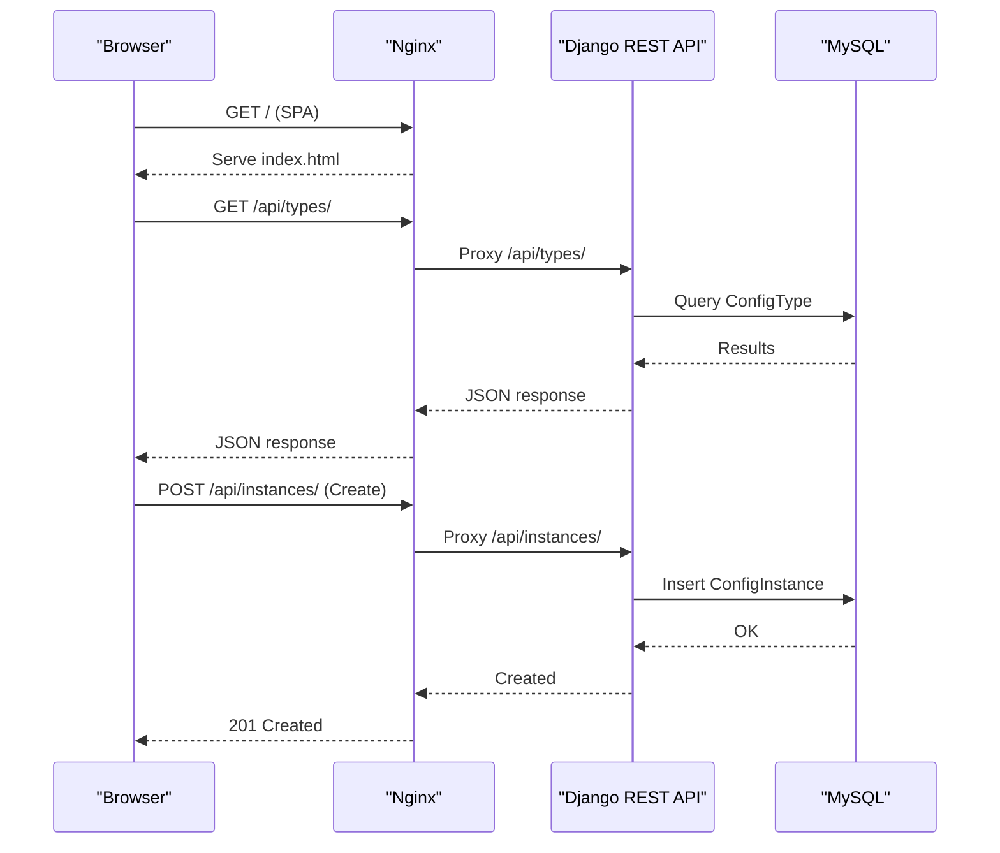
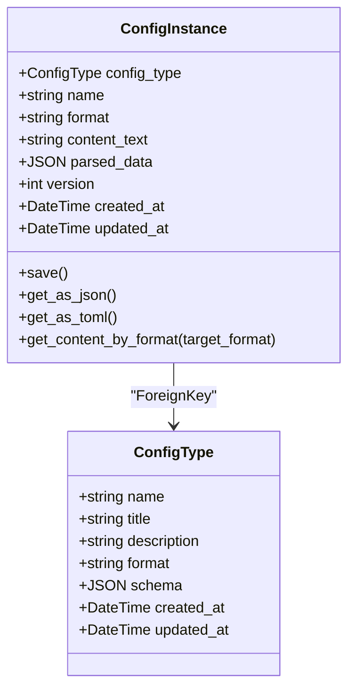
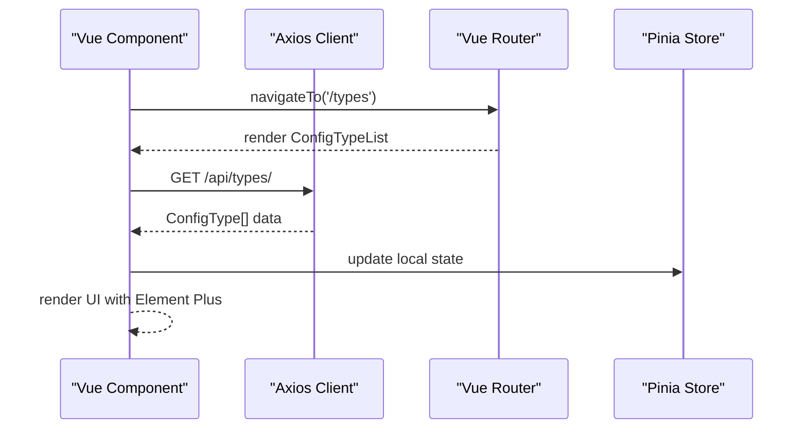
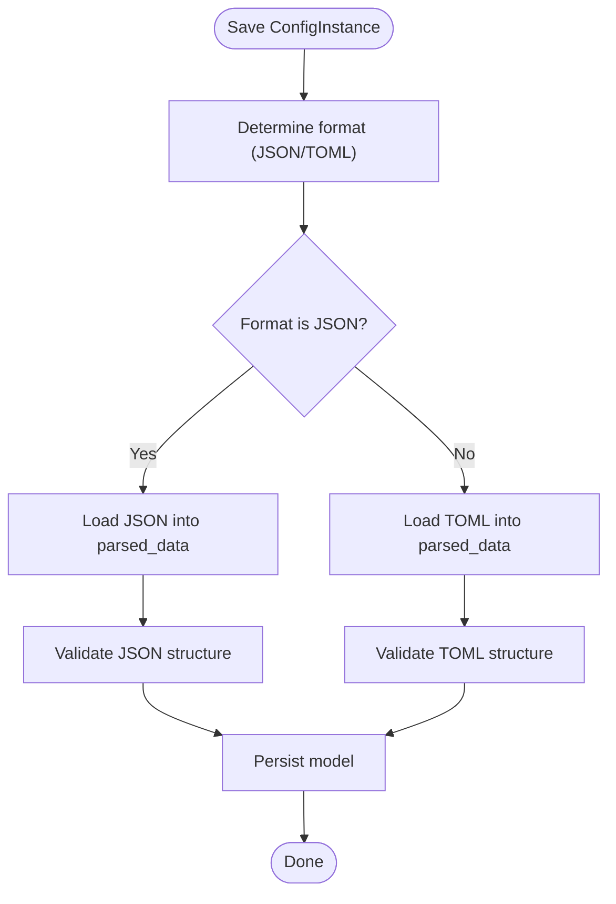
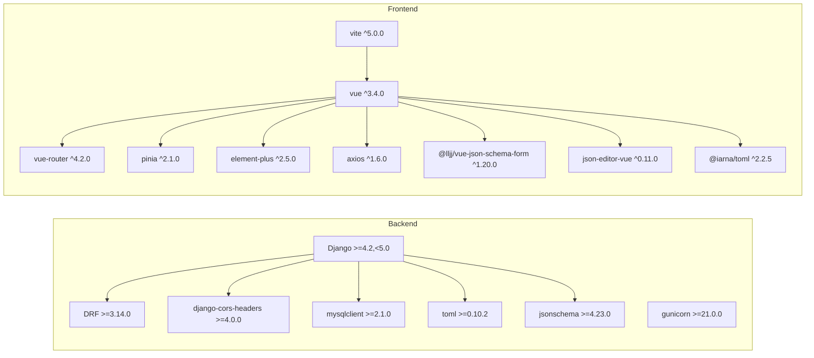

# Technology Stack Overview

<cite>
**Referenced Files in This Document**
- [backend/confighub/settings.py](file://backend/confighub/settings.py)
- [backend/requirements.txt](file://backend/requirements.txt)
- [backend/Dockerfile](file://backend/Dockerfile)
- [backend/confighub/urls.py](file://backend/confighub/urls.py)
- [backend/config_type/models.py](file://backend/config_type/models.py)
- [backend/config_instance/models.py](file://backend/config_instance/models.py)
- [backend/config_type/serializers.py](file://backend/config_type/serializers.py)
- [backend/config_type/urls.py](file://backend/config_type/urls.py)
- [backend/config_instance/urls.py](file://backend/config_instance/urls.py)
- [frontend/package.json](file://frontend/package.json)
- [frontend/vite.config.js](file://frontend/vite.config.js)
- [frontend/src/router/index.js](file://frontend/src/router/index.js)
- [frontend/src/main.js](file://frontend/src/main.js)
- [frontend/src/api/config.js](file://frontend/src/api/config.js)
- [frontend/Dockerfile](file://frontend/Dockerfile)
- [frontend/nginx.conf](file://frontend/nginx.conf)
- [docker-compose.yml](file://docker-compose.yml)
</cite>

## Table of Contents
1. [Introduction](#introduction)
2. [Project Structure](#project-structure)
3. [Core Components](#core-components)
4. [Architecture Overview](#architecture-overview)
5. [Detailed Component Analysis](#detailed-component-analysis)
6. [Dependency Analysis](#dependency-analysis)
7. [Performance Considerations](#performance-considerations)
8. [Troubleshooting Guide](#troubleshooting-guide)
9. [Conclusion](#conclusion)

## Introduction
This document provides a comprehensive technology stack overview for the AI-Ops Configuration Hub. It covers the backend built with Django and Django REST Framework, the MySQL database for persistence, and supporting libraries for TOML parsing and JSON Schema validation. On the frontend, it documents Vue.js 3.x with Composition API, Element Plus UI, Vue Router, Pinia state management, and Vite build tooling. Infrastructure-wise, it explains Docker containerization, Docker Compose orchestration, and Nginx for production serving. The document also includes technology selection rationale, version compatibility requirements, and integration patterns between frontend and backend components.

## Project Structure
The project follows a clear separation of concerns:
- Backend: Django application under backend/confighub with multiple Django apps for domain features (config_type, config_instance, versioning, audit).
- Frontend: Vue.js 3 application under frontend with modular structure for components, views, router, and stores.
- Infrastructure: Docker images for backend and frontend, orchestrated via docker-compose.yml, with Nginx serving static assets and proxying API requests.

**Diagram sources**
- [backend/confighub/urls.py:1-25](file://backend/confighub/urls.py#L1-L25)
- [frontend/src/router/index.js:1-52](file://frontend/src/router/index.js#L1-L52)
- [frontend/src/main.js:1-22](file://frontend/src/main.js#L1-L22)
- [docker-compose.yml:1-50](file://docker-compose.yml#L1-L50)
- [frontend/nginx.conf:1-26](file://frontend/nginx.conf#L1-L26)

**Section sources**
- [backend/confighub/urls.py:1-25](file://backend/confighub/urls.py#L1-L25)
- [frontend/src/router/index.js:1-52](file://frontend/src/router/index.js#L1-L52)
- [docker-compose.yml:1-50](file://docker-compose.yml#L1-L50)

## Core Components

### Backend: Django and Django REST Framework
- Framework: Django 6.x with Django REST Framework for API development.
- Settings: CORS enabled for development, SQLite fallback and MySQL 8.0 support via environment variables.
- Apps: Dedicated Django apps for configuration types, instances, versioning, and audit.
- Authentication: Default Django authentication with permission classes configured for development.
- Pagination: PageNumberPagination with page size 20.

**Section sources**
- [backend/confighub/settings.py:1-159](file://backend/confighub/settings.py#L1-L159)
- [backend/requirements.txt:1-8](file://backend/requirements.txt#L1-L8)

### Database: MySQL and ORM Models
- Database engine selection via environment variable supports MySQL 8.0 or SQLite.
- MySQL configuration includes charset and strict SQL mode initialization.
- Models:
  - ConfigType: Defines configuration type with format (JSON/TOML), JSON Schema, and metadata.
  - ConfigInstance: Stores raw content, parses and validates content into unified JSON, supports versioning, and provides conversion utilities.

**Section sources**
- [backend/confighub/settings.py:90-118](file://backend/confighub/settings.py#L90-L118)
- [backend/config_type/models.py:1-25](file://backend/config_type/models.py#L1-L25)
- [backend/config_instance/models.py:1-69](file://backend/config_instance/models.py#L1-L69)

### Supporting Libraries: TOML Parsing and JSON Schema Validation
- TOML parsing: Used in ConfigInstance model to parse and validate TOML content.
- JSON Schema validation: Enforced in ConfigType serializer to ensure schema correctness and presence of required fields.

**Section sources**
- [backend/config_instance/models.py:42-62](file://backend/config_instance/models.py#L42-L62)
- [backend/config_type/serializers.py:24-30](file://backend/config_type/serializers.py#L24-L30)

### Frontend: Vue.js 3.x with Composition API
- Core dependencies: Vue 3.4+, Vue Router 4.2+, Pinia 2.1+, Element Plus 2.5+.
- HTTP client: Axios for API communication.
- Form libraries: @lljj/vue-json-schema-form and json-editor-vue for form rendering and editing.
- Build tool: Vite 5.x with Vue plugin.

**Section sources**
- [frontend/package.json:1-26](file://frontend/package.json#L1-L26)
- [frontend/vite.config.js:1-19](file://frontend/vite.config.js#L1-L19)

### Frontend: Routing, State Management, and UI
- Routing: Vue Router with history mode and named routes for lists and edit pages.
- State management: Pinia for reactive state containers.
- UI components: Element Plus with globally registered icons.
- API client: Axios instance configured with base URL pointing to /api.

**Section sources**
- [frontend/src/router/index.js:1-52](file://frontend/src/router/index.js#L1-L52)
- [frontend/src/main.js:1-22](file://frontend/src/main.js#L1-L22)
- [frontend/src/api/config.js:1-34](file://frontend/src/api/config.js#L1-L34)

### Infrastructure: Containerization and Orchestration
- Backend container: Python 3.11 slim with system dependencies for MySQL client, collects static files, runs with Gunicorn.
- Frontend container: Node 20 Alpine build stage, Nginx Alpine runtime serving built assets and proxying API requests.
- Orchestration: docker-compose defines services for db (MySQL 8.0), backend (Django + Gunicorn), and frontend (Nginx), with health checks and volume mounts.

**Section sources**
- [backend/Dockerfile:1-27](file://backend/Dockerfile#L1-L27)
- [frontend/Dockerfile:1-26](file://frontend/Dockerfile#L1-L26)
- [docker-compose.yml:1-50](file://docker-compose.yml#L1-L50)

## Architecture Overview
The system follows a classic web application pattern:
- Frontend (Vue.js) communicates with backend APIs via HTTP.
- Backend exposes REST endpoints using Django REST Framework.
- Database abstraction handled by Django ORM with MySQL or SQLite.
- Production serving via Nginx proxying API requests to backend and serving static assets.

**Diagram sources**
- [frontend/nginx.conf:1-26](file://frontend/nginx.conf#L1-L26)
- [backend/confighub/urls.py:1-25](file://backend/confighub/urls.py#L1-L25)
- [backend/config_type/urls.py:1-11](file://backend/config_type/urls.py#L1-L11)
- [backend/config_instance/urls.py:1-11](file://backend/config_instance/urls.py#L1-L11)

## Detailed Component Analysis

### Backend API Layer
- URL routing: Central confighub.urls aggregates API endpoints from config_type and config_instance apps.
- ViewSets: REST endpoints exposed via DefaultRouter registries for types and instances.
- Serializers: ConfigTypeSerializer handles serialization, instance count calculation, and schema validation.

**Diagram sources**
- [backend/config_type/models.py:1-25](file://backend/config_type/models.py#L1-L25)
- [backend/config_instance/models.py:1-69](file://backend/config_instance/models.py#L1-L69)

**Section sources**
- [backend/confighub/urls.py:1-25](file://backend/confighub/urls.py#L1-L25)
- [backend/config_type/urls.py:1-11](file://backend/config_type/urls.py#L1-L11)
- [backend/config_instance/urls.py:1-11](file://backend/config_instance/urls.py#L1-L11)
- [backend/config_type/serializers.py:1-31](file://backend/config_type/serializers.py#L1-L31)

### Frontend Integration Patterns
- API client: Axios instance configured with base URL "/api" proxies to backend during development and Nginx in production.
- Routing: Named routes for listing and editing pages with dynamic parameters.
- UI composition: Element Plus components integrated globally with icon registration.

**Diagram sources**
- [frontend/src/api/config.js:1-34](file://frontend/src/api/config.js#L1-L34)
- [frontend/src/router/index.js:1-52](file://frontend/src/router/index.js#L1-L52)
- [frontend/src/main.js:1-22](file://frontend/src/main.js#L1-L22)

**Section sources**
- [frontend/src/api/config.js:1-34](file://frontend/src/api/config.js#L1-L34)
- [frontend/src/router/index.js:1-52](file://frontend/src/router/index.js#L1-L52)
- [frontend/src/main.js:1-22](file://frontend/src/main.js#L1-L22)

### Data Flow and Validation
- Content parsing: ConfigInstance.save triggers _parse_content to convert raw text into parsed_data based on format (JSON/TOML).
- Schema validation: ConfigTypeSerializer enforces schema object structure and required fields.

**Diagram sources**
- [backend/config_instance/models.py:37-62](file://backend/config_instance/models.py#L37-L62)

**Section sources**
- [backend/config_instance/models.py:37-62](file://backend/config_instance/models.py#L37-L62)
- [backend/config_type/serializers.py:24-30](file://backend/config_type/serializers.py#L24-L30)

## Dependency Analysis
- Backend dependencies pinned to major versions ensuring compatibility with Django 6.x and DRF 3.14+.
- Frontend dependencies align with Vue 3 ecosystem and modern tooling (Vite 5.x).
- Infrastructure dependencies specify MySQL 8.0 and Nginx Alpine for production readiness.

**Diagram sources**
- [backend/requirements.txt:1-8](file://backend/requirements.txt#L1-L8)
- [frontend/package.json:1-26](file://frontend/package.json#L1-L26)

**Section sources**
- [backend/requirements.txt:1-8](file://backend/requirements.txt#L1-L8)
- [frontend/package.json:1-26](file://frontend/package.json#L1-L26)

## Performance Considerations
- Backend:
  - Pagination reduces payload sizes for list endpoints.
  - Gunicorn workers configured for concurrency; adjust based on CPU cores and memory.
  - Static files collected and served by Nginx to reduce application load.
- Database:
  - MySQL strict mode and UTF8MB4 charset ensure data integrity and internationalization support.
  - Consider connection pooling and read replicas for high-load scenarios.
- Frontend:
  - Vite build produces optimized assets; enable code splitting and lazy loading for large views.
  - Nginx caching for static assets improves load times.

## Troubleshooting Guide
- CORS issues:
  - Verify CORS settings and origins in development vs. production environments.
- Database connectivity:
  - Confirm environment variables for DB_ENGINE, DB_NAME, DB_USER, DB_PASSWORD, DB_HOST, DB_PORT.
- API proxying:
  - Development proxy targets backend host/port; ensure backend is reachable at configured address.
- Health checks:
  - Docker Compose health check for MySQL ensures readiness before backend starts.

**Section sources**
- [backend/confighub/settings.py:31-39](file://backend/confighub/settings.py#L31-L39)
- [backend/confighub/settings.py:94-117](file://backend/confighub/settings.py#L94-L117)
- [frontend/vite.config.js:8-13](file://frontend/vite.config.js#L8-L13)
- [docker-compose.yml:16-19](file://docker-compose.yml#L16-L19)

## Conclusion
The AI-Ops Configuration Hub leverages a modern, container-first stack combining Django and Django REST Framework for robust backend APIs, MySQL for persistence, and Vue.js 3 with contemporary frontend tooling for an efficient developer experience. The stack emphasizes simplicity, scalability, and maintainability through Docker Compose orchestration and Nginx-based production serving. Version compatibility constraints and integration patterns documented here provide a reliable foundation for extending functionality while preserving system coherence.