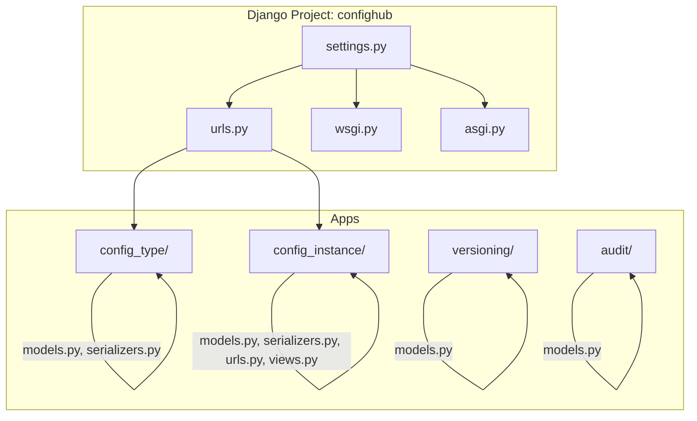
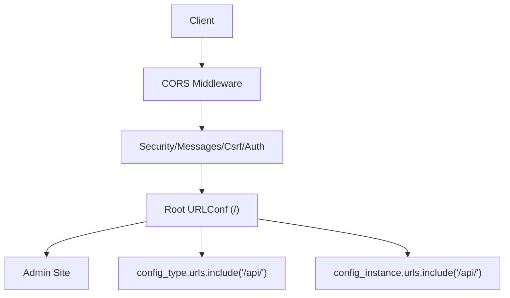
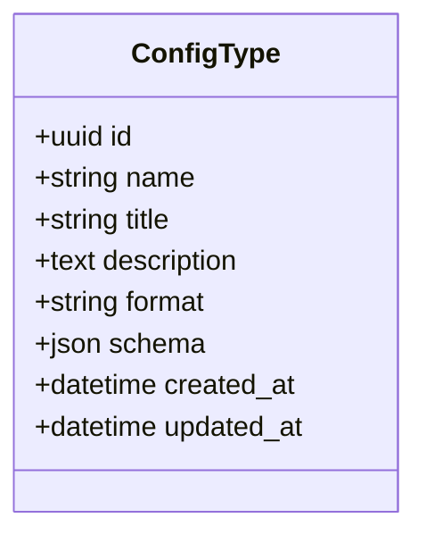
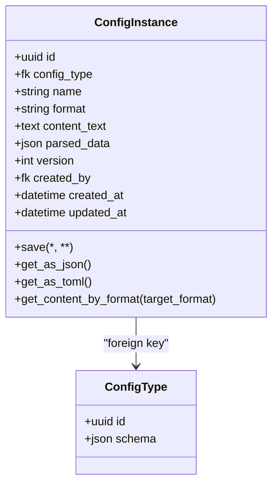
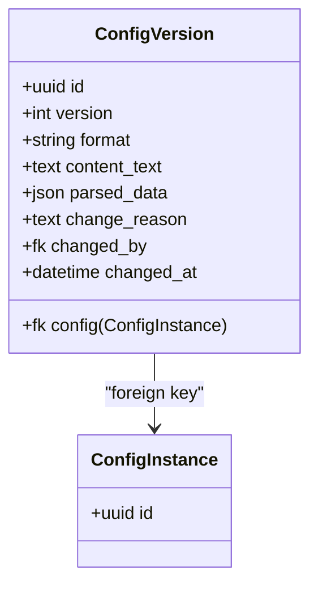
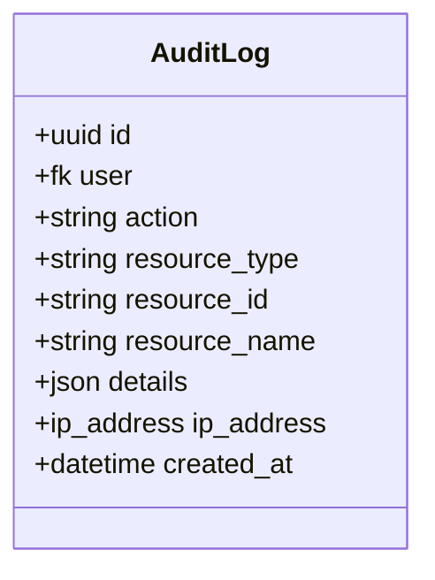
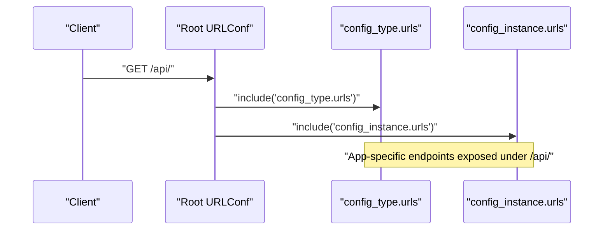
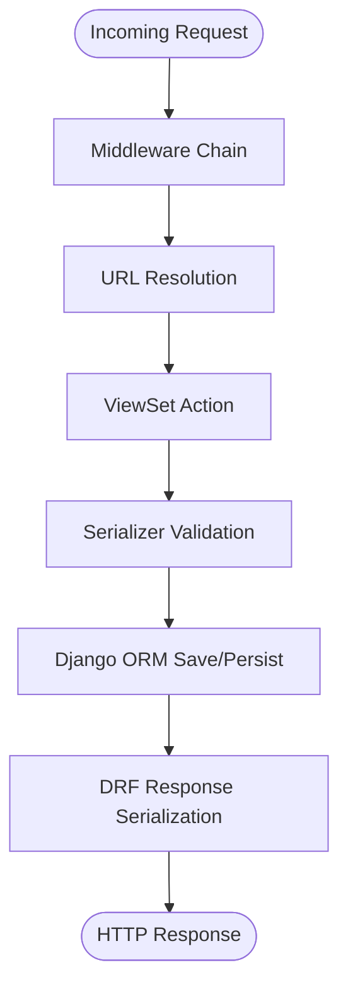
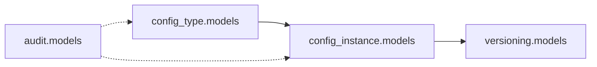

# Backend Architecture

<cite>
**Referenced Files in This Document**
- [settings.py](file://backend/confighub/settings.py)
- [urls.py](file://backend/confighub/urls.py)
- [manage.py](file://backend/manage.py)
- [requirements.txt](file://backend/requirements.txt)
- [Dockerfile](file://backend/Dockerfile)
- [config_type/apps.py](file://backend/config_type/apps.py)
- [config_type/models.py](file://backend/config_type/models.py)
- [config_type/serializers.py](file://backend/config_type/serializers.py)
- [config_instance/apps.py](file://backend/config_instance/apps.py)
- [config_instance/models.py](file://backend/config_instance/models.py)
- [config_instance/serializers.py](file://backend/config_instance/serializers.py)
- [config_instance/urls.py](file://backend/config_instance/urls.py)
- [config_instance/views.py](file://backend/config_instance/views.py)
- [versioning/apps.py](file://backend/versioning/apps.py)
- [versioning/models.py](file://backend/versioning/models.py)
- [audit/apps.py](file://backend/audit/apps.py)
- [audit/models.py](file://backend/audit/models.py)
</cite>

## Table of Contents
1. [Introduction](#introduction)
2. [Project Structure](#project-structure)
3. [Core Components](#core-components)
4. [Architecture Overview](#architecture-overview)
5. [Detailed Component Analysis](#detailed-component-analysis)
6. [Dependency Analysis](#dependency-analysis)
7. [Performance Considerations](#performance-considerations)
8. [Troubleshooting Guide](#troubleshooting-guide)
9. [Conclusion](#conclusion)

## Introduction
This document describes the backend architecture of the AI-Ops Configuration Hub built with Django and Django REST Framework. The system is composed of four main Django apps:
- config_type: manages configuration types and their JSON Schemas
- config_instance: stores configuration instances, validates content against schemas, and normalizes content into a unified JSON structure
- versioning: maintains historical versions of configuration instances
- audit: records user actions and system events for compliance and traceability

The backend exposes a REST API organized under the /api/ base path, with pagination enabled globally. Authentication and permissions are configured to allow any client by default, while CORS is enabled broadly for development. The database can be SQLite (default) or MySQL 8, selected via environment variables.

## Project Structure
The backend follows a feature-based Django layout with separate apps for domain capabilities. The main application configuration resides under confighub, including settings, URL routing, WSGI/ASGI entry points, and static collection for deployment.

**Diagram sources**
- [settings.py:1-159](file://backend/confighub/settings.py#L1-L159)
- [urls.py:1-25](file://backend/confighub/urls.py#L1-L25)
- [config_type/models.py:1-25](file://backend/config_type/models.py#L1-L25)
- [config_instance/models.py:1-69](file://backend/config_instance/models.py#L1-L69)
- [config_instance/serializers.py:1-60](file://backend/config_instance/serializers.py#L1-L60)
- [versioning/models.py:1-23](file://backend/versioning/models.py#L1-L23)
- [audit/models.py:1-31](file://backend/audit/models.py#L1-L31)

**Section sources**
- [settings.py:44-57](file://backend/confighub/settings.py#L44-L57)
- [urls.py:20-24](file://backend/confighub/urls.py#L20-L24)

## Core Components
- Django Settings and Middleware
  - Installed apps include Django core, REST Framework, CORS headers, and the four domain apps.
  - Middleware stack includes CORS, security, sessions, CSRF, auth, messages, and X-Frame-Options.
  - Global REST Framework settings enable per-app pagination and allow-any permission policy.
  - Database selection is controlled by environment variables with defaults for SQLite and MySQL 8.
- URL Routing
  - Root URLConf includes the admin interface and mounts API endpoints from config_type and config_instance under /api/.
- Application Lifecycle
  - Management script sets the DJANGO_SETTINGS_MODULE and executes commands via Django’s CLI.
  - Dockerfile builds a Python slim image, installs system and Python dependencies, collects static assets, and runs Gunicorn with multiple workers.

Key implementation references:
- [settings.py:44-68](file://backend/confighub/settings.py#L44-L68)
- [settings.py:96-117](file://backend/confighub/settings.py#L96-L117)
- [urls.py:20-24](file://backend/confighub/urls.py#L20-L24)
- [manage.py:7-18](file://backend/manage.py#L7-L18)
- [Dockerfile:19-26](file://backend/Dockerfile#L19-L26)

**Section sources**
- [settings.py:33-39](file://backend/confighub/settings.py#L33-L39)
- [settings.py:96-117](file://backend/confighub/settings.py#L96-L117)
- [urls.py:20-24](file://backend/confighub/urls.py#L20-L24)
- [manage.py:7-18](file://backend/manage.py#L7-L18)
- [Dockerfile:19-26](file://backend/Dockerfile#L19-L26)

## Architecture Overview
The backend uses Django REST Framework ViewSets and Serializers to expose CRUD endpoints. Requests flow through the middleware stack, resolve to app-specific URL patterns, and are handled by ViewSets that serialize and persist data via Django ORM.

**Diagram sources**
- [settings.py:59-68](file://backend/confighub/settings.py#L59-L68)
- [urls.py:20-24](file://backend/confighub/urls.py#L20-L24)

## Detailed Component Analysis

### config_type: Configuration Type Management
- Purpose: Define configuration types with metadata, supported formats, and JSON Schema validation rules.
- Models: ConfigType defines name, title, description, format, schema, timestamps, and ordering.
- Serializers: ConfigTypeSerializer extends ModelSerializer, computes instance_count via reverse relation, enforces alphanumeric underscore names, and validates schema structure.
- Views: Not shown here but would typically expose CRUD endpoints via a ViewSet.

**Diagram sources**
- [config_type/models.py:4-24](file://backend/config_type/models.py#L4-L24)

**Section sources**
- [config_type/models.py:4-24](file://backend/config_type/models.py#L4-L24)
- [config_type/serializers.py:5-31](file://backend/config_type/serializers.py#L5-L31)

### config_instance: Configuration Instances
- Purpose: Store configuration instances bound to a ConfigType, validate content against the type’s schema, and normalize content into parsed_data for efficient querying.
- Models: ConfigInstance links to ConfigType, stores raw content_text, normalized parsed_data, version, creator, and timestamps. Includes format conversion helpers and validation hooks.
- Serializers: ConfigInstanceSerializer handles write-time parsing and schema validation using the associated ConfigType’s schema; read-only fields prevent accidental mutation of internal fields.
- Views: Not shown here but would expose CRUD endpoints via a ViewSet.

**Diagram sources**
- [config_instance/models.py:7-69](file://backend/config_instance/models.py#L7-L69)
- [config_type/models.py:4-24](file://backend/config_type/models.py#L4-L24)

**Section sources**
- [config_instance/models.py:7-69](file://backend/config_instance/models.py#L7-L69)
- [config_instance/serializers.py:7-60](file://backend/config_instance/serializers.py#L7-L60)

### versioning: Version Control
- Purpose: Track historical versions of configuration instances with original content, parsed data, change reason, and authorship.
- Models: ConfigVersion stores version number, format, content_text, parsed_data, change_reason, changed_by, and changed_at, with uniqueness constraints on (config, version).

**Diagram sources**
- [versioning/models.py:5-23](file://backend/versioning/models.py#L5-L23)

**Section sources**
- [versioning/models.py:5-23](file://backend/versioning/models.py#L5-L23)

### audit: Logging and Compliance
- Purpose: Record user actions, resource changes, IP addresses, and contextual details for auditing.
- Models: AuditLog captures action type, resource metadata, user, IP address, and timestamps, with ordering by creation time.

**Diagram sources**
- [audit/models.py:5-31](file://backend/audit/models.py#L5-L31)

**Section sources**
- [audit/models.py:5-31](file://backend/audit/models.py#L5-L31)

### URL Routing and Endpoint Organization
- Root URLConf includes:
  - Admin site at /admin/
  - API endpoints mounted under /api/ from config_type and config_instance apps
- App-specific URL patterns are defined in each app’s urls.py and typically map to ViewSet routers or explicit path patterns.

**Diagram sources**
- [urls.py:20-24](file://backend/confighub/urls.py#L20-L24)

**Section sources**
- [urls.py:20-24](file://backend/confighub/urls.py#L20-L24)
- [config_instance/urls.py](file://backend/config_instance/urls.py)

### Request/Response Flow and Processing Logic
- Request lifecycle:
  - Middleware stack processes requests (CORS, security, sessions, CSRF, auth, messages, X-Frame-Options).
  - URL resolution routes /api/ paths to app-specific patterns.
  - ViewSets handle HTTP verbs, apply serializer validation, and interact with models via Django ORM.
  - Responses are serialized using DRF serializers and returned to clients.
- Processing logic highlights:
  - config_instance.save() parses and validates content before persistence.
  - Serializers validate format and schema during create/update operations.
  - Pagination is applied globally via REST_FRAMEWORK settings.

**Diagram sources**
- [settings.py:59-68](file://backend/confighub/settings.py#L59-L68)
- [settings.py:33-39](file://backend/confighub/settings.py#L33-L39)
- [config_instance/models.py:37-40](file://backend/config_instance/models.py#L37-L40)
- [config_instance/serializers.py:20-48](file://backend/config_instance/serializers.py#L20-L48)

**Section sources**
- [settings.py:59-68](file://backend/confighub/settings.py#L59-L68)
- [settings.py:33-39](file://backend/confighub/settings.py#L33-L39)
- [config_instance/models.py:37-40](file://backend/config_instance/models.py#L37-L40)
- [config_instance/serializers.py:20-48](file://backend/config_instance/serializers.py#L20-L48)

### Error Handling Patterns
- Validation errors:
  - Serializer validation raises DRF validation errors for invalid formats and schema mismatches.
  - Model-level validation raises value errors for malformed content during save().
- Middleware and global settings:
  - Default permission AllowAny allows unauthenticated access; CSRF and session middlewares are present.
  - CORS is enabled broadly for development.

**Section sources**
- [config_instance/serializers.py:20-48](file://backend/config_instance/serializers.py#L20-L48)
- [config_instance/models.py:42-53](file://backend/config_instance/models.py#L42-L53)
- [settings.py:33-39](file://backend/confighub/settings.py#L33-L39)
- [settings.py:31](file://backend/confighub/settings.py#L31)

## Dependency Analysis
- Internal dependencies:
  - config_instance depends on config_type for schema validation and metadata.
  - versioning depends on config_instance for historical snapshots.
  - audit is independent and logs actions across the system.
- External dependencies:
  - Django, Django REST Framework, django-cors-headers, toml, jsonschema, gunicorn, mysqlclient.

**Diagram sources**
- [config_instance/models.py:14](file://backend/config_instance/models.py#L14)
- [versioning/models.py:7](file://backend/versioning/models.py#L7)
- [audit/models.py:16](file://backend/audit/models.py#L16)

**Section sources**
- [requirements.txt:1-8](file://backend/requirements.txt#L1-L8)

## Performance Considerations
- Database engine selection:
  - SQLite is default for simplicity; MySQL 8 is supported via environment variables for production-grade deployments.
- Pagination:
  - PageNumberPagination with page size 20 reduces payload sizes and improves client responsiveness.
- Model indexing and queries:
  - Unique constraints on (config_type, name) and (config, version) help maintain referential integrity and optimize lookups.
- Content normalization:
  - Storing parsed_data enables efficient querying and filtering on configuration attributes.
- Deployment:
  - Gunicorn with multiple workers and static asset collection improve runtime performance and reduce latency.

**Section sources**
- [settings.py:96-117](file://backend/confighub/settings.py#L96-L117)
- [settings.py:37-39](file://backend/confighub/settings.py#L37-L39)
- [config_instance/models.py:31](file://backend/config_instance/models.py#L31)
- [versioning/models.py:18](file://backend/versioning/models.py#L18)
- [Dockerfile:25-26](file://backend/Dockerfile#L25-L26)

## Troubleshooting Guide
- Environment variables
  - DB_ENGINE selects database backend; defaults to SQLite if unset.
  - DB_NAME, DB_USER, DB_PASSWORD, DB_HOST, DB_PORT configure MySQL 8 connection.
  - DJANGO_DEBUG toggles debug mode; DJANGO_SECRET_KEY sets the Django secret key.
- CORS and permissions
  - CORS_ALLOW_ALL_ORIGINS is enabled broadly; adjust for production environments.
  - REST_FRAMEWORK DEFAULT_PERMISSION_CLASSES set to AllowAny; consider restricting for production.
- Database connectivity
  - Verify MySQL credentials and network access when DB_ENGINE is mysql8.
- Static assets and deployment
  - Static root is configured; ensure collectstatic runs during build.

**Section sources**
- [settings.py:94-117](file://backend/confighub/settings.py#L94-L117)
- [settings.py:23-27](file://backend/confighub/settings.py#L23-L27)
- [settings.py:31](file://backend/confighub/settings.py#L31)
- [settings.py:33-39](file://backend/confighub/settings.py#L33-L39)
- [Dockerfile:19-20](file://backend/Dockerfile#L19-L20)

## Conclusion
The AI-Ops Configuration Hub backend leverages Django and Django REST Framework to provide a modular, extensible architecture for managing configuration types, instances, versions, and audit logs. The design emphasizes content validation via JSON Schema, normalized storage for efficient querying, and straightforward API exposure under /api/. Production readiness can be achieved by tightening CORS and permission policies, selecting MySQL 8 for scalability, and adding authentication middleware as needed.