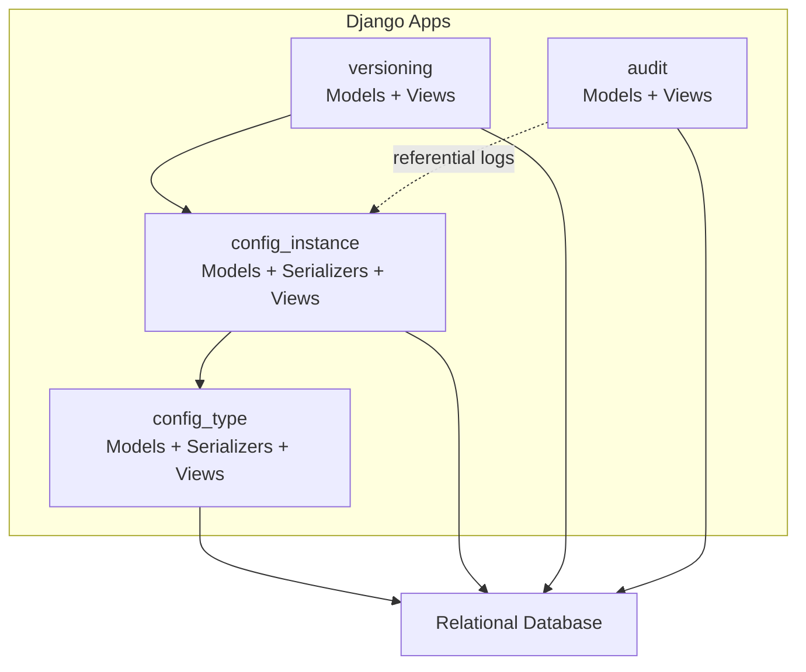
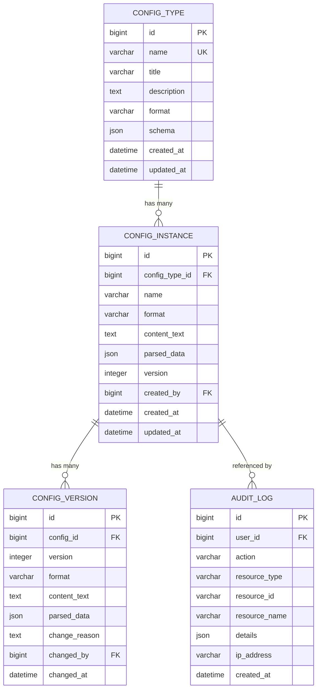
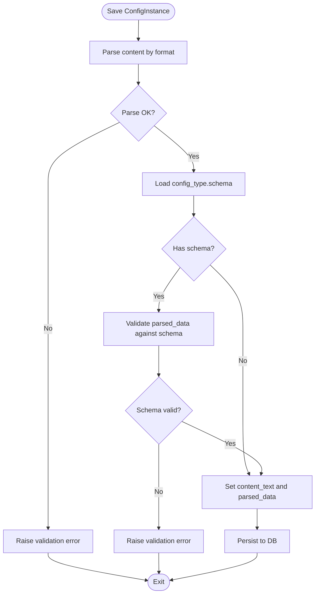
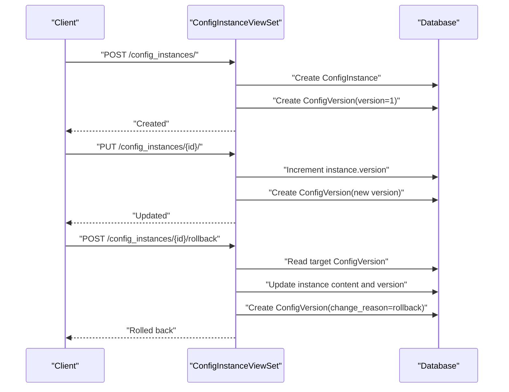
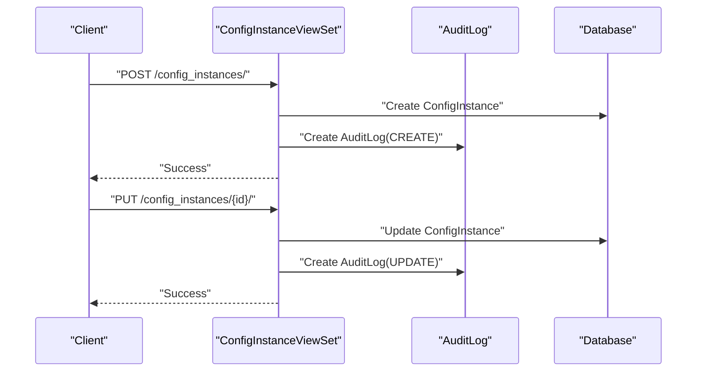
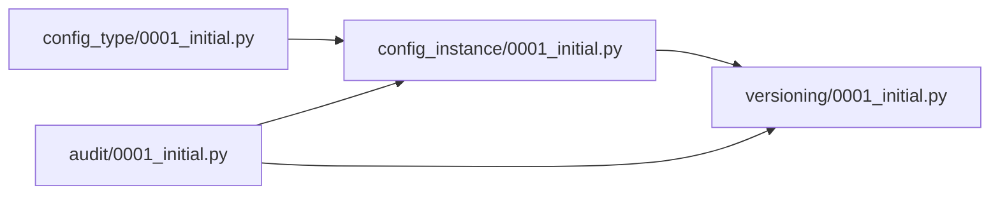
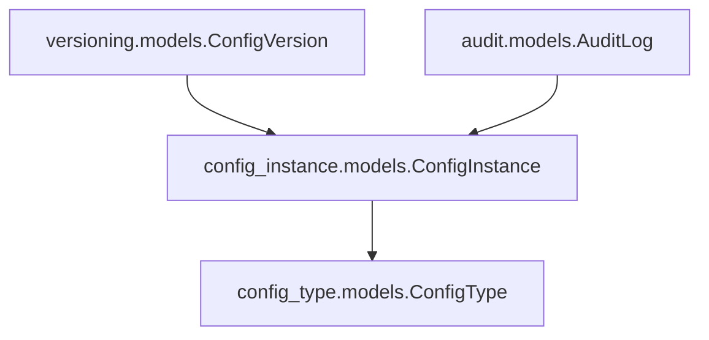

# Data Architecture & Database Design

<cite>
**Referenced Files in This Document**
- [config_type/models.py](file://backend/config_type/models.py)
- [config_type/migrations/0001_initial.py](file://backend/config_type/migrations/0001_initial.py)
- [config_type/serializers.py](file://backend/config_type/serializers.py)
- [config_type/views.py](file://backend/config_type/views.py)
- [config_instance/models.py](file://backend/config_instance/models.py)
- [config_instance/migrations/0001_initial.py](file://backend/config_instance/migrations/0001_initial.py)
- [config_instance/serializers.py](file://backend/config_instance/serializers.py)
- [config_instance/views.py](file://backend/config_instance/views.py)
- [versioning/models.py](file://backend/versioning/models.py)
- [versioning/migrations/0001_initial.py](file://backend/versioning/migrations/0001_initial.py)
- [audit/models.py](file://backend/audit/models.py)
- [audit/migrations/0001_initial.py](file://backend/audit/migrations/0001_initial.py)
- [confighub/settings.py](file://backend/confighub/settings.py)
</cite>

## Table of Contents
1. [Introduction](#introduction)
2. [Project Structure](#project-structure)
3. [Core Components](#core-components)
4. [Architecture Overview](#architecture-overview)
5. [Detailed Component Analysis](#detailed-component-analysis)
6. [Dependency Analysis](#dependency-analysis)
7. [Performance Considerations](#performance-considerations)
8. [Troubleshooting Guide](#troubleshooting-guide)
9. [Conclusion](#conclusion)
10. [Appendices](#appendices)

## Introduction
This document describes the data architecture and database design of the AI-Ops Configuration Hub. It focuses on the relational schema centered around four main tables: config_types, config_instances, config_versions, and audit_logs. It explains foreign key relationships, constraints, and referential integrity enforcement. It documents field definitions, data types, and constraints for each model, details JSON Schema validation for configuration types, and outlines the versioning system with automatic version creation and rollback. It also covers the audit trail design for tracking user actions and system events, along with indexing strategies, query optimization, and the Django migration system.

## Project Structure
The backend is organized into Django apps, each responsible for a domain area:
- config_type: Defines configuration types and their JSON Schemas.
- config_instance: Stores configuration instances, enforces format and JSON Schema validation, and manages versioning and auditing via views.
- versioning: Maintains historical versions of configuration instances.
- audit: Records user actions and system events.

**Diagram sources**
- [config_type/models.py:4-25](file://backend/config_type/models.py#L4-L25)
- [config_instance/models.py:7-69](file://backend/config_instance/models.py#L7-L69)
- [versioning/models.py:5-23](file://backend/versioning/models.py#L5-L23)
- [audit/models.py:5-31](file://backend/audit/models.py#L5-L31)

**Section sources**
- [confighub/settings.py:44-57](file://backend/confighub/settings.py#L44-L57)

## Core Components
This section documents the four main models and their database schema, constraints, and behaviors.

- config_types
  - Purpose: Define configuration types with metadata and JSON Schema.
  - Key fields and constraints:
    - name: Unique identifier for the type.
    - title: Human-readable name.
    - description: Optional description.
    - format: Enumerated choice for content format (JSON or TOML).
    - schema: JSON field storing the JSON Schema used to validate instances.
    - created_at, updated_at: Timestamps.
  - Constraints:
    - Unique constraint on name enforced at the database level.
    - Ordering by created_at descending.

- config_instances
  - Purpose: Store actual configuration content and metadata.
  - Key fields and constraints:
    - config_type: Foreign key to config_types; cascade delete.
    - name: Instance name scoped by type (unique together with config_type).
    - format: Enumerated choice for content format (JSON or TOML).
    - content_text: Raw content storage.
    - parsed_data: JSON field for normalized data used for queries and relations.
    - version: Positive integer representing current version number.
    - created_by: Foreign key to User; SET_NULL on user deletion.
    - created_at, updated_at: Timestamps.
  - Constraints:
    - Unique constraint on (config_type, name).
    - Ordering by updated_at descending.
  - Validation:
    - Content parsing and validation occur during save and in serializer validation.
    - JSON Schema validation is performed against the associated type’s schema.

- config_versions
  - Purpose: Maintain version history of configuration instances.
  - Key fields and constraints:
    - config: Foreign key to config_instances with related_name versions; cascade delete.
    - version: Positive integer; unique together with config.
    - format: Format at time of snapshot.
    - content_text: Snapshot of raw content.
    - parsed_data: Snapshot of parsed data.
    - change_reason: Optional reason for the change.
    - changed_by: Foreign key to User; SET_NULL on user deletion.
    - changed_at: Timestamp of snapshot creation.
  - Constraints:
    - Unique constraint on (config, version).
    - Ordering by version descending.

- audit_logs
  - Purpose: Track user actions and system events.
  - Key fields and constraints:
    - user: Foreign key to User; SET_NULL on user deletion.
    - action: Enumerated action type (CREATE, UPDATE, DELETE, VIEW, EXPORT, IMPORT).
    - resource_type: String identifying the resource type.
    - resource_id: String identifier of the resource.
    - resource_name: Human-readable resource name.
    - details: JSON field for additional structured information.
    - ip_address: Optional IP address.
    - created_at: Timestamp.
  - Constraints:
    - Ordering by created_at descending.

**Section sources**
- [config_type/models.py:4-25](file://backend/config_type/models.py#L4-L25)
- [config_type/migrations/0001_initial.py:14-30](file://backend/config_type/migrations/0001_initial.py#L14-L30)
- [config_instance/models.py:7-69](file://backend/config_instance/models.py#L7-L69)
- [config_instance/migrations/0001_initial.py:18-37](file://backend/config_instance/migrations/0001_initial.py#L18-L37)
- [versioning/models.py:5-23](file://backend/versioning/models.py#L5-L23)
- [versioning/migrations/0001_initial.py:18-36](file://backend/versioning/migrations/0001_initial.py#L18-L36)
- [audit/models.py:5-31](file://backend/audit/models.py#L5-L31)
- [audit/migrations/0001_initial.py:17-35](file://backend/audit/migrations/0001_initial.py#L17-L35)

## Architecture Overview
The system enforces referential integrity through foreign keys and leverages Django ORM to maintain consistency. The config_instances model references config_types, while config_versions references config_instances. Audit logs record lifecycle events triggered by API actions.

**Diagram sources**
- [config_type/models.py:11-17](file://backend/config_type/models.py#L11-L17)
- [config_instance/models.py:14-27](file://backend/config_instance/models.py#L14-L27)
- [versioning/models.py:7-14](file://backend/versioning/models.py#L7-L14)
- [audit/models.py:16-23](file://backend/audit/models.py#L16-L23)

## Detailed Component Analysis

### Relational Schema and Referential Integrity
- config_types
  - Primary key: id
  - Unique constraint: name
- config_instances
  - Primary key: id
  - Foreign key: config_type → config_types(id) with CASCADE
  - Unique constraint: (config_type, name)
  - Optional foreign key: created_by → auth_user(id) with SET_NULL
- config_versions
  - Primary key: id
  - Foreign key: config → config_instances(id) with CASCADE
  - Unique constraint: (config, version)
  - Optional foreign key: changed_by → auth_user(id) with SET_NULL
- audit_logs
  - Primary key: id
  - Optional foreign key: user → auth_user(id) with SET_NULL

These constraints ensure that deleting a config_type cascades to its instances, and deleting an instance cascades to its version history. Deleting a user sets foreign keys to NULL rather than failing.

**Section sources**
- [config_type/migrations/0001_initial.py:14-30](file://backend/config_type/migrations/0001_initial.py#L14-L30)
- [config_instance/migrations/0001_initial.py:18-37](file://backend/config_instance/migrations/0001_initial.py#L18-L37)
- [versioning/migrations/0001_initial.py:18-36](file://backend/versioning/migrations/0001_initial.py#L18-L36)
- [audit/migrations/0001_initial.py:17-35](file://backend/audit/migrations/0001_initial.py#L17-L35)

### Field Definitions, Data Types, and Constraints
- config_types
  - name: char, unique=True
  - title: char
  - description: text, blank=True
  - format: char, choices JSON/TOML
  - schema: JSON field
  - created_at, updated_at: datetime
- config_instances
  - config_type: foreign key to config_types
  - name: char
  - format: char, choices JSON/TOML
  - content_text: text
  - parsed_data: JSON field
  - version: positive integer
  - created_by: foreign key to User
  - created_at, updated_at: datetime
- config_versions
  - config: foreign key to config_instances
  - version: positive integer
  - format: char
  - content_text: text
  - parsed_data: JSON field
  - change_reason: text, blank=True
  - changed_by: foreign key to User
  - changed_at: datetime
- audit_logs
  - user: foreign key to User
  - action: char, choices per model
  - resource_type: char
  - resource_id: char
  - resource_name: char
  - details: JSON field
  - ip_address: generic IP address
  - created_at: datetime

**Section sources**
- [config_type/models.py:11-17](file://backend/config_type/models.py#L11-L17)
- [config_instance/models.py:14-27](file://backend/config_instance/models.py#L14-L27)
- [versioning/models.py:7-14](file://backend/versioning/models.py#L7-L14)
- [audit/models.py:16-23](file://backend/audit/models.py#L16-L23)

### JSON Schema Validation Implementation
Validation occurs at two layers:
- Serializer-level validation in config_instance/serializers.py:
  - Parses content according to declared format.
  - Validates parsed content against the associated config_type.schema using a JSON Schema validator.
  - On success, populates content_text and parsed_data for persistence.
- Model-level validation in config_instance/models.py:
  - During save, content is parsed and validated; errors are raised if invalid.

This dual-layer approach ensures early failure on invalid content and prevents inconsistent data from entering the database.

**Diagram sources**
- [config_instance/models.py:37-69](file://backend/config_instance/models.py#L37-L69)
- [config_instance/serializers.py:20-48](file://backend/config_instance/serializers.py#L20-L48)
- [config_type/models.py](file://backend/config_type/models.py#L15)

**Section sources**
- [config_instance/serializers.py:20-48](file://backend/config_instance/serializers.py#L20-L48)
- [config_instance/models.py:37-69](file://backend/config_instance/models.py#L37-L69)
- [config_type/serializers.py:24-30](file://backend/config_type/serializers.py#L24-L30)

### Versioning System: Automatic Creation and Rollback
- Automatic version creation:
  - On creation, a ConfigVersion record is created with version=1 and change_reason set appropriately.
  - On updates, the instance version is incremented, and a new ConfigVersion snapshot is recorded.
- Rollback capability:
  - The rollback endpoint retrieves the target version, re-applies its content_text and parsed_data, increments the version, and records a new ConfigVersion with a change reason indicating rollback.

**Diagram sources**
- [config_instance/views.py:36-90](file://backend/config_instance/views.py#L36-L90)
- [config_instance/views.py:106-136](file://backend/config_instance/views.py#L106-L136)

**Section sources**
- [config_instance/views.py:36-90](file://backend/config_instance/views.py#L36-L90)
- [config_instance/views.py:106-136](file://backend/config_instance/views.py#L106-L136)

### Audit Trail Design
- AuditLog captures:
  - Action type (CREATE, UPDATE, DELETE, VIEW, EXPORT, IMPORT).
  - Resource identification (type, id, name).
  - Details payload (e.g., format, version).
  - IP address and timestamp.
- Triggers:
  - Created on instance creation and update via view hooks.
  - Can be extended to cover deletions and other actions.

**Diagram sources**
- [config_instance/views.py:52-60](file://backend/config_instance/views.py#L52-L60)
- [config_instance/views.py:82-90](file://backend/config_instance/views.py#L82-L90)
- [audit/models.py:7-14](file://backend/audit/models.py#L7-L14)

**Section sources**
- [audit/models.py:5-31](file://backend/audit/models.py#L5-L31)
- [config_instance/views.py:52-60](file://backend/config_instance/views.py#L52-L60)
- [config_instance/views.py:82-90](file://backend/config_instance/views.py#L82-L90)

### Django Migration System
- Initial migrations define the four tables with their fields, constraints, and indexes.
- Dependencies:
  - config_instance depends on config_type.
  - config_versions depends on config_instance.
  - All depend on the auth_user table for foreign keys.
- To apply migrations:
  - Use Django’s migration commands to migrate forward and backward as needed.

**Diagram sources**
- [config_type/migrations/0001_initial.py:10-14](file://backend/config_type/migrations/0001_initial.py#L10-L14)
- [config_instance/migrations/0001_initial.py:12-15](file://backend/config_instance/migrations/0001_initial.py#L12-L15)
- [versioning/migrations/0001_initial.py:12-14](file://backend/versioning/migrations/0001_initial.py#L12-L14)
- [audit/migrations/0001_initial.py:12-14](file://backend/audit/migrations/0001_initial.py#L12-L14)

**Section sources**
- [config_type/migrations/0001_initial.py:1-32](file://backend/config_type/migrations/0001_initial.py#L1-L32)
- [config_instance/migrations/0001_initial.py:1-39](file://backend/config_instance/migrations/0001_initial.py#L1-L39)
- [versioning/migrations/0001_initial.py:1-38](file://backend/versioning/migrations/0001_initial.py#L1-L38)
- [audit/migrations/0001_initial.py:1-36](file://backend/audit/migrations/0001_initial.py#L1-L36)

## Dependency Analysis
- Cohesion:
  - Each app encapsulates a cohesive domain: type definition, instance management, versioning, and auditing.
- Coupling:
  - config_instances depends on config_types.
  - config_versions depends on config_instances.
  - Audit logs reference config_instances indirectly through resource identifiers.
- Referential integrity:
  - Foreign keys and unique constraints enforce data consistency across tables.

**Diagram sources**
- [config_instance/models.py](file://backend/config_instance/models.py#L14)
- [versioning/models.py](file://backend/versioning/models.py#L7)
- [audit/models.py](file://backend/audit/models.py#L16)

**Section sources**
- [config_instance/models.py](file://backend/config_instance/models.py#L14)
- [versioning/models.py](file://backend/versioning/models.py#L7)
- [audit/models.py](file://backend/audit/models.py#L16)

## Performance Considerations
- Indexing strategies:
  - Unique composite indexes on (config_type, name) for config_instances and (config, version) for config_versions reduce lookup costs.
  - Consider adding indexes on frequently filtered fields such as config_type.name, config_instances.format, and audit_logs.user for improved query performance.
- Query optimization:
  - Use select_related('config_type') to avoid N+1 queries when listing instances.
  - Paginate results and limit fields in list serializers to reduce payload sizes.
- Data types:
  - JSON fields (parsed_data, schema, details) enable flexible storage but can hinder indexing; use them judiciously and rely on unique constraints and foreign keys for joins.
- Database engine:
  - The project supports SQLite and MySQL8; choose MySQL8 for production workloads requiring advanced indexing and concurrency.

**Section sources**
- [config_instance/migrations/0001_initial.py:32-36](file://backend/config_instance/migrations/0001_initial.py#L32-L36)
- [versioning/migrations/0001_initial.py:31-35](file://backend/versioning/migrations/0001_initial.py#L31-L35)
- [config_instance/views.py:21-34](file://backend/config_instance/views.py#L21-L34)
- [confighub/settings.py:94-117](file://backend/confighub/settings.py#L94-L117)

## Troubleshooting Guide
- JSON/TOML parse errors:
  - Occur when content_text does not conform to the declared format; the model’s parser raises explicit errors during save.
- JSON Schema validation failures:
  - Raised by the serializer when parsed content fails schema validation; review the type’s schema and content alignment.
- Version not found during rollback:
  - The rollback endpoint returns a 404 if the requested version does not exist; verify the version number and that snapshots were created.
- Audit log missing user:
  - If the request user is not authenticated, user may be NULL; ensure proper authentication for audited actions.

**Section sources**
- [config_instance/models.py:42-69](file://backend/config_instance/models.py#L42-L69)
- [config_instance/serializers.py:20-48](file://backend/config_instance/serializers.py#L20-L48)
- [config_instance/views.py:112-116](file://backend/config_instance/views.py#L112-L116)
- [audit/models.py](file://backend/audit/models.py#L16)

## Conclusion
The AI-Ops Configuration Hub employs a clean relational design with strong referential integrity enforced by foreign keys and unique constraints. The schema supports robust configuration type definitions with JSON Schema validation, maintains precise version histories, and records comprehensive audit trails. Django migrations provide a reliable mechanism for evolving the schema over time. With thoughtful indexing and query optimization, the system can scale effectively for configuration management and governance.

## Appendices

### Appendix A: API Endpoints Related to Versioning and Auditing
- GET /config-types/{name}/instances/
  - Lists instances under a given type.
- POST /config-instances/
  - Creates a new instance and initializes version 1.
- PUT /config-instances/{id}/
  - Updates an instance and creates a new version snapshot.
- GET /config-instances/{id}/versions/
  - Retrieves version history.
- POST /config-instances/{id}/rollback/
  - Rolls back to a specified version and creates a new snapshot.
- GET /config-instances/{id}/content/?format=json|toml
  - Returns content in the requested format.

**Section sources**
- [config_type/views.py:27-38](file://backend/config_type/views.py#L27-L38)
- [config_instance/views.py:36-90](file://backend/config_instance/views.py#L36-L90)
- [config_instance/views.py:92-149](file://backend/config_instance/views.py#L92-L149)