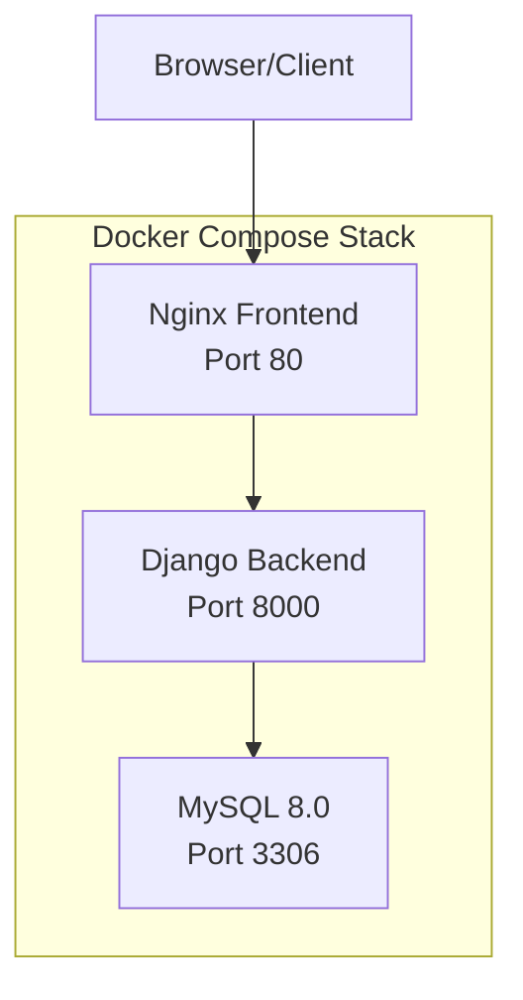
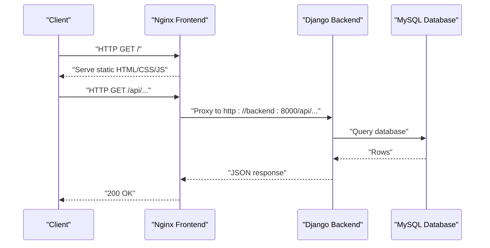

# Deployment Architecture

<cite>
**Referenced Files in This Document**
- [docker-compose.yml](file://docker-compose.yml)
- [backend/Dockerfile](file://backend/Dockerfile)
- [frontend/Dockerfile](file://frontend/Dockerfile)
- [frontend/nginx.conf](file://frontend/nginx.conf)
- [backend/requirements.txt](file://backend/requirements.txt)
- [frontend/package.json](file://frontend/package.json)
- [backend/confighub/settings.py](file://backend/confighub/settings.py)
- [backend/manage.py](file://backend/manage.py)
- [frontend/vite.config.js](file://frontend/vite.config.js)
- [backend/confighub/wsgi.py](file://backend/confighub/wsgi.py)
- [backend/confighub/asgi.py](file://backend/confighub/asgi.py)
</cite>

## Table of Contents
1. [Introduction](#introduction)
2. [Project Structure](#project-structure)
3. [Core Components](#core-components)
4. [Architecture Overview](#architecture-overview)
5. [Detailed Component Analysis](#detailed-component-analysis)
6. [Dependency Analysis](#dependency-analysis)
7. [Performance Considerations](#performance-considerations)
8. [Troubleshooting Guide](#troubleshooting-guide)
9. [Conclusion](#conclusion)
10. [Appendices](#appendices)

## Introduction
This document describes the deployment architecture of the AI-Ops Configuration Hub with a focus on containerized deployment using Docker and orchestration via Docker Compose. It covers the containerization strategy for both frontend and backend services, the production-grade Nginx reverse proxy configuration, environment configuration and secrets management, persistent volume strategies, build processes for frontend and backend, and operational concerns such as health checks, monitoring, scaling, load balancing, high availability, and CI/CD integration points.

## Project Structure
The deployment stack consists of:
- A MySQL 8.0 relational database service
- A Django-based backend service exposed on port 8000
- A frontend service built with Vite and served via Nginx on port 80
- Persistent volumes for database data and backend static assets



**Diagram sources**
- [docker-compose.yml:3-46](file://docker-compose.yml#L3-L46)

**Section sources**
- [docker-compose.yml:1-50](file://docker-compose.yml#L1-L50)

## Core Components
- Database service
  - Image: mysql:8.0
  - Environment variables for root and application credentials
  - Health check using mysqladmin ping
  - Persistent storage via named volume
- Backend service
  - Python 3.11 slim base image
  - Installs MariaDB client headers for MySQL client compilation
  - Pip installs dependencies from requirements.txt
  - Collects static files for production
  - Exposes port 8000
  - Runs with Gunicorn using 4 workers
- Frontend service
  - Multi-stage build: Node 20 Alpine for building, Nginx Alpine for runtime
  - Builds Vue application with Vite
  - Serves static assets via Nginx
  - Includes proxy configuration for API requests to backend

**Section sources**
- [backend/Dockerfile:1-27](file://backend/Dockerfile#L1-L27)
- [frontend/Dockerfile:1-26](file://frontend/Dockerfile#L1-L26)
- [frontend/nginx.conf:1-26](file://frontend/nginx.conf#L1-L26)
- [backend/requirements.txt:1-8](file://backend/requirements.txt#L1-L8)
- [frontend/package.json:1-26](file://frontend/package.json#L1-L26)

## Architecture Overview
The system uses a reverse proxy model:
- Nginx handles incoming HTTP traffic on port 80
- Static assets are served directly by Nginx
- API requests under /api/ are proxied to the Django backend on port 8000
- The backend serves dynamic content and interacts with the MySQL database



**Diagram sources**
- [frontend/nginx.conf:12-18](file://frontend/nginx.conf#L12-L18)
- [docker-compose.yml:21-38](file://docker-compose.yml#L21-L38)

**Section sources**
- [frontend/nginx.conf:1-26](file://frontend/nginx.conf#L1-L26)
- [docker-compose.yml:21-46](file://docker-compose.yml#L21-L46)

## Detailed Component Analysis

### Database Service (MySQL 8.0)
- Purpose: Stores configuration types, instances, versioning, and audit logs
- Security and persistence:
  - Root and application credentials are configured via environment variables
  - Data persisted in a named volume to survive container recreation
- Health checks:
  - Uses mysqladmin ping to verify readiness
- Networking:
  - Exposed on host port 3306 for local development; in production, bind to internal network only

Operational notes:
- Change default credentials before production deployment
- Consider TLS configuration and backup policies for production

**Section sources**
- [docker-compose.yml:4-19](file://docker-compose.yml#L4-L19)

### Backend Service (Django + Gunicorn)
- Base image and build steps:
  - Python 3.11 slim
  - System-level MariaDB client headers for compiling mysqlclient
  - Pip installation of Python dependencies
  - Static collection for production
- Runtime:
  - Exposes port 8000
  - Starts Gunicorn with 4 worker processes
- Environment configuration:
  - Reads database connection parameters from environment variables
  - Supports switching between MySQL and SQLite engines
  - Secret key and debug mode configurable via environment
- Static files:
  - Static root configured for collection and serving

Security and production hardening:
- Set DJANGO_SECRET_KEY to a strong random value
- Disable DEBUG in production
- Configure ALLOWED_HOSTS appropriately

**Section sources**
- [backend/Dockerfile:1-27](file://backend/Dockerfile#L1-L27)
- [backend/confighub/settings.py:94-117](file://backend/confighub/settings.py#L94-L117)
- [backend/confighub/settings.py:23-29](file://backend/confighub/settings.py#L23-L29)
- [backend/confighub/settings.py:154-156](file://backend/confighub/settings.py#L154-L156)
- [backend/requirements.txt:1-8](file://backend/requirements.txt#L1-L8)

### Frontend Service (Vite + Nginx)
- Build pipeline:
  - Node 20 Alpine stage installs dependencies and builds the app
  - Output placed in dist directory
- Runtime:
  - Nginx Alpine serves the built assets
  - Default site configuration proxies /api/ to backend
  - Enables browser history support via try_files
  - Applies long-lived caching headers for static assets

Development proxy:
- Vite dev server proxies /api to http://localhost:8000 during local development

**Section sources**
- [frontend/Dockerfile:1-26](file://frontend/Dockerfile#L1-L26)
- [frontend/nginx.conf:1-26](file://frontend/nginx.conf#L1-L26)
- [frontend/vite.config.js:1-19](file://frontend/vite.config.js#L1-L19)
- [frontend/package.json:1-26](file://frontend/package.json#L1-L26)

### Reverse Proxy and Static File Serving (Nginx)
Key behaviors:
- Listens on port 80
- Serves static assets from /usr/share/nginx/html
- Routes API requests under /api/ to backend service
- Browser history fallback using try_files
- Long cache TTL for JS/CSS/Assets

Integration with backend:
- Upstream target is the backend service name and port
- Preserves client IP and protocol information via proxy headers

**Section sources**
- [frontend/nginx.conf:1-26](file://frontend/nginx.conf#L1-L26)
- [docker-compose.yml:40-46](file://docker-compose.yml#L40-L46)

## Dependency Analysis
Inter-service dependencies and coupling:
- Frontend depends on backend being reachable at http://backend:8000
- Backend depends on database being healthy before startup
- Both services rely on environment variables for configuration

```mermaid
graph LR
DB["MySQL Service"] <- --> |TCP 3306| BACKEND["Django Backend"]
FRONTEND["Nginx Frontend"] --> |/api/*| BACKEND
BACKEND --> |ORM| DB
```

**Diagram sources**
- [docker-compose.yml:32-34](file://docker-compose.yml#L32-L34)
- [frontend/nginx.conf:14](file://frontend/nginx.conf#L14)
- [backend/confighub/settings.py:96-110](file://backend/confighub/settings.py#L96-L110)

**Section sources**
- [docker-compose.yml:32-34](file://docker-compose.yml#L32-L34)
- [frontend/nginx.conf:14](file://frontend/nginx.conf#L14)
- [backend/confighub/settings.py:96-110](file://backend/confighub/settings.py#L96-L110)

## Performance Considerations
- Worker processes:
  - Backend uses 4 Gunicorn workers; adjust based on CPU cores and memory
- Static delivery:
  - Nginx serves static assets directly, reducing backend load
- Caching:
  - Long cache TTL for static assets improves performance
- Database:
  - Use connection pooling and tune MySQL settings for production workloads

[No sources needed since this section provides general guidance]

## Troubleshooting Guide
Common issues and resolutions:
- Backend fails to start due to database unavailability:
  - Verify database health check passes and network connectivity
  - Confirm environment variables match database credentials
- API calls return errors:
  - Check Nginx proxy configuration and backend service name resolution
  - Validate CORS settings if cross-origin requests fail
- Static assets not loading:
  - Ensure static files were collected and mounted correctly
  - Confirm Nginx root and index directives
- Health checks failing:
  - Review health check commands and retry thresholds
  - Inspect container logs for startup errors

**Section sources**
- [docker-compose.yml:16-19](file://docker-compose.yml#L16-L19)
- [backend/confighub/settings.py:31](file://backend/confighub/settings.py#L31)
- [frontend/nginx.conf:12-18](file://frontend/nginx.conf#L12-L18)

## Conclusion
The AI-Ops Configuration Hub employs a clean, container-first architecture using Docker and Docker Compose. The frontend and backend are packaged independently, with Nginx acting as a reverse proxy and static file server. The current setup emphasizes simplicity for development and local deployment. For production, prioritize secrets management, hardened network policies, observability, and scalability controls.

[No sources needed since this section summarizes without analyzing specific files]

## Appendices

### Environment Configuration and Secrets Management
- Database credentials and engine selection are controlled via environment variables
- Django secret key and debug mode are configurable via environment variables
- Recommended approach:
  - Store sensitive values in a secrets manager or compose override files
  - Avoid committing secrets to version control
  - Use environment-specific compose files for dev/stage/prod

**Section sources**
- [docker-compose.yml:23-31](file://docker-compose.yml#L23-L31)
- [backend/confighub/settings.py:24](file://backend/confighub/settings.py#L24)
- [backend/confighub/settings.py:27](file://backend/confighub/settings.py#L27)
- [backend/confighub/settings.py:96-110](file://backend/confighub/settings.py#L96-L110)

### Volume Mounting Strategies
- Database data persisted via named volume
- Backend static files collected and served via mounted volume
- Recommendation:
  - Use explicit bind mounts for backups and disaster recovery
  - Consider separate volumes for logs and static assets

**Section sources**
- [docker-compose.yml:47-49](file://docker-compose.yml#L47-L49)
- [backend/Dockerfile:20](file://backend/Dockerfile#L20)
- [backend/confighub/settings.py:154-156](file://backend/confighub/settings.py#L154-L156)

### Build Process
- Backend:
  - System dependencies installed, Python dependencies installed, static files collected
- Frontend:
  - Node dependencies installed, Vite build executed, assets copied to Nginx root

**Section sources**
- [backend/Dockerfile:6-20](file://backend/Dockerfile#L6-L20)
- [frontend/Dockerfile:8-12](file://frontend/Dockerfile#L8-L12)
- [frontend/package.json:6-10](file://frontend/package.json#L6-L10)
- [frontend/vite.config.js:15-17](file://frontend/vite.config.js#L15-L17)

### Production Deployment Setup
- Nginx reverse proxy and static file serving are integrated into the frontend container
- Network exposure:
  - Frontend: port 80
  - Backend: port 8000
  - Database: port 3306 (internal network in production)
- Recommendations:
  - Place the stack behind a production-grade reverse proxy/load balancer
  - Enable TLS termination at the edge
  - Configure health checks and auto-healing

**Section sources**
- [frontend/nginx.conf:1-26](file://frontend/nginx.conf#L1-L26)
- [docker-compose.yml:44-45](file://docker-compose.yml#L44-L45)
- [docker-compose.yml:13-14](file://docker-compose.yml#L13-L14)

### Health Checks and Monitoring
- Database health check using mysqladmin ping
- Backend readiness:
  - Add Django health check endpoint or readiness probe pointing to /health
  - Monitor Gunicorn worker processes and response latency
- Frontend:
  - Nginx stub_status or external monitoring can track uptime and response times

**Section sources**
- [docker-compose.yml:16-19](file://docker-compose.yml#L16-L19)

### Scaling, Load Balancing, and High Availability
- Horizontal scaling:
  - Scale backend replicas behind a load balancer
  - Use sticky sessions if required; otherwise design stateless backend
- Database HA:
  - Use MySQL replication or managed MySQL service with failover
- Frontend:
  - Run multiple Nginx instances behind a load balancer
- Observability:
  - Centralized logging and metrics collection
  - Database performance monitoring and slow query logs

[No sources needed since this section provides general guidance]

### CI/CD Integration Points
- Build stages:
  - Build backend image using requirements.txt
  - Build frontend image using package.json and Vite
- Test and lint:
  - Add unit/integration tests and linters in CI pipeline
- Release and deploy:
  - Push images to registry
  - Deploy using Docker Compose or Kubernetes manifests
- Security scanning:
  - Scan base images and application layers for vulnerabilities

[No sources needed since this section provides general guidance]