# Frontend Architecture

<cite>
**Referenced Files in This Document**
- [main.js](file://frontend/src/main.js)
- [App.vue](file://frontend/src/App.vue)
- [router/index.js](file://frontend/src/router/index.js)
- [package.json](file://frontend/package.json)
- [vite.config.js](file://frontend/vite.config.js)
- [api/config.js](file://frontend/src/api/config.js)
- [views/Home.vue](file://frontend/src/views/Home.vue)
- [views/ConfigTypeList.vue](file://frontend/src/views/ConfigTypeList.vue)
- [views/ConfigInstanceList.vue](file://frontend/src/views/ConfigInstanceList.vue)
- [views/ConfigTypeEdit.vue](file://frontend/src/views/ConfigTypeEdit.vue)
- [views/ConfigInstanceEdit.vue](file://frontend/src/views/ConfigInstanceEdit.vue)
- [styles/sci-fi-theme.css](file://frontend/src/styles/sci-fi-theme.css)
</cite>

## Table of Contents
1. [Introduction](#introduction)
2. [Project Structure](#project-structure)
3. [Core Components](#core-components)
4. [Architecture Overview](#architecture-overview)
5. [Detailed Component Analysis](#detailed-component-analysis)
6. [Dependency Analysis](#dependency-analysis)
7. [Performance Considerations](#performance-considerations)
8. [Troubleshooting Guide](#troubleshooting-guide)
9. [Conclusion](#conclusion)

## Introduction
This document describes the frontend architecture of the AI-Ops Configuration Hub built with Vue.js 3, Composition API, and modern JavaScript. It covers the application entry point, plugin configuration, routing, UI integration with Element Plus, API layer with Axios, and the overall component-based structure. The frontend follows a clean separation of concerns with views for pages, a centralized API module, and a sci-fi themed design system.

## Project Structure
The frontend is organized around a SPA entry, router configuration, view components, API integration, and shared styling. The build system uses Vite with a development proxy to the backend API.

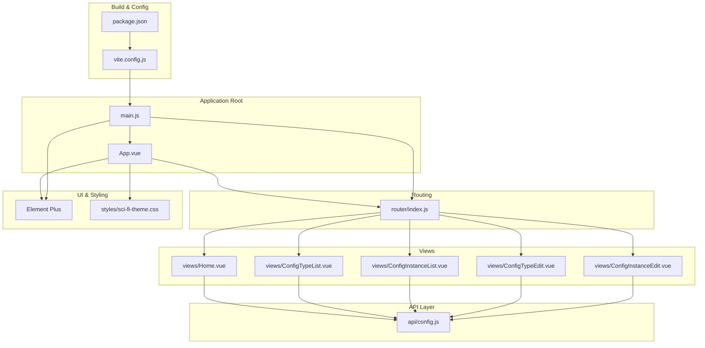

**Diagram sources**
- [main.js:1-22](file://frontend/src/main.js#L1-L22)
- [App.vue:1-288](file://frontend/src/App.vue#L1-L288)
- [router/index.js:1-52](file://frontend/src/router/index.js#L1-L52)
- [api/config.js:1-34](file://frontend/src/api/config.js#L1-L34)
- [views/Home.vue:1-192](file://frontend/src/views/Home.vue#L1-L192)
- [views/ConfigTypeList.vue:1-149](file://frontend/src/views/ConfigTypeList.vue#L1-L149)
- [views/ConfigInstanceList.vue:1-170](file://frontend/src/views/ConfigInstanceList.vue#L1-L170)
- [views/ConfigTypeEdit.vue:1-171](file://frontend/src/views/ConfigTypeEdit.vue#L1-L171)
- [views/ConfigInstanceEdit.vue:1-237](file://frontend/src/views/ConfigInstanceEdit.vue#L1-L237)
- [styles/sci-fi-theme.css:1-494](file://frontend/src/styles/sci-fi-theme.css#L1-L494)
- [package.json:1-26](file://frontend/package.json#L1-L26)
- [vite.config.js:1-19](file://frontend/vite.config.js#L1-L19)

**Section sources**
- [main.js:1-22](file://frontend/src/main.js#L1-L22)
- [router/index.js:1-52](file://frontend/src/router/index.js#L1-L52)
- [package.json:1-26](file://frontend/package.json#L1-L26)
- [vite.config.js:1-19](file://frontend/vite.config.js#L1-L19)

## Core Components
- Application bootstrap initializes Vue, Pinia, Element Plus, and registers icons globally.
- Root component sets up the layout, sidebar navigation, header, and router outlet.
- Views implement page-specific logic using Composition API with refs, computed, lifecycle hooks, and router integration.
- API module encapsulates HTTP client and domain-specific endpoints for configuration types and instances.
- Theme defines a cohesive sci-fi aesthetic with neon colors, grid backgrounds, scanlines, and custom components.

Key implementation patterns:
- Composition API: reactive state, computed properties, watchers, and lifecycle hooks.
- Element Plus: UI primitives, forms, tables, messages, and dialogs.
- Axios: typed endpoints with base URL and shared configuration.
- Scoped styles and theme variables for consistent visuals.

**Section sources**
- [main.js:1-22](file://frontend/src/main.js#L1-L22)
- [App.vue:63-107](file://frontend/src/App.vue#L63-L107)
- [api/config.js:1-34](file://frontend/src/api/config.js#L1-L34)
- [styles/sci-fi-theme.css:1-494](file://frontend/src/styles/sci-fi-theme.css#L1-L494)

## Architecture Overview
The frontend is a single-page application with programmatic routing and a central layout. Navigation is handled via vue-router with a history mode. The UI is powered by Element Plus, styled through a shared theme. HTTP requests are routed through a local proxy to the backend API.

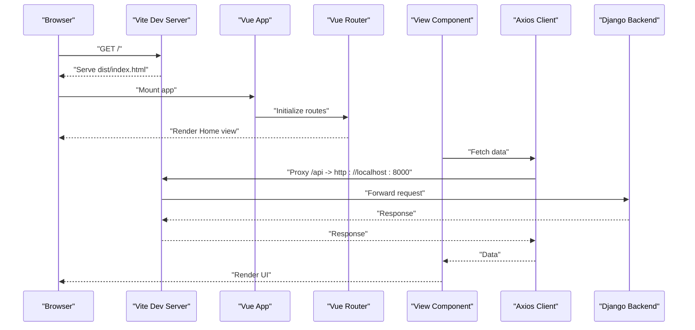

**Diagram sources**
- [vite.config.js:6-14](file://frontend/vite.config.js#L6-L14)
- [router/index.js:46-49](file://frontend/src/router/index.js#L46-L49)
- [api/config.js:3-9](file://frontend/src/api/config.js#L3-L9)
- [views/Home.vue:145-157](file://frontend/src/views/Home.vue#L145-L157)

## Detailed Component Analysis

### Application Entry and Plugin Setup
- Creates the Vue app instance and mounts to the DOM.
- Registers Element Plus icons globally for convenient use.
- Installs Pinia for state management and Vue Router for navigation.
- Uses Element Plus for UI components and theming.

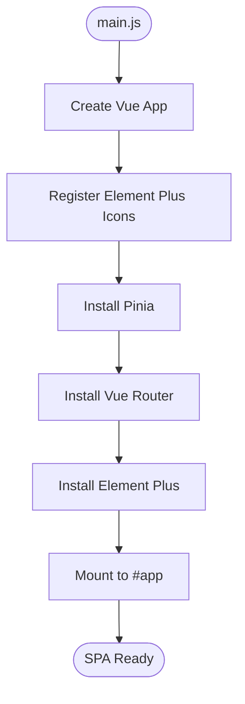

**Diagram sources**
- [main.js:10-21](file://frontend/src/main.js#L10-L21)

**Section sources**
- [main.js:1-22](file://frontend/src/main.js#L1-L22)

### Layout and Navigation (App.vue)
- Central layout with sidebar, header, and main content area.
- Dynamic page title derived from the current route.
- Timer updates a digital clock display.
- Menu items drive navigation to routes such as dashboard, config types, and instances.

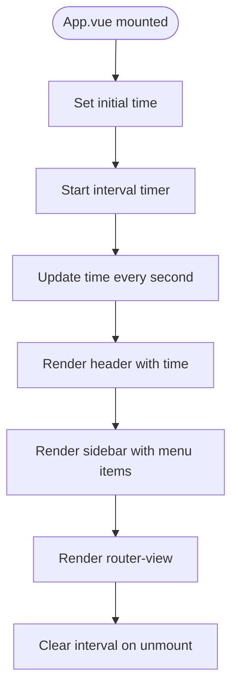

**Diagram sources**
- [App.vue:68-106](file://frontend/src/App.vue#L68-L106)

**Section sources**
- [App.vue:1-288](file://frontend/src/App.vue#L1-L288)

### Routing Configuration
- Defines routes for home, config types list, create/edit, and config instances list, create/edit.
- Uses programmatic navigation within views to move between pages.
- History mode enables clean URLs without hash fragments.

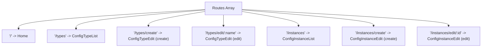

**Diagram sources**
- [router/index.js:8-44](file://frontend/src/router/index.js#L8-L44)

**Section sources**
- [router/index.js:1-52](file://frontend/src/router/index.js#L1-L52)

### API Integration Layer (Axios)
- Centralized HTTP client configured with a base URL pointing to the local proxy.
- Exposes domain-specific APIs for config types and instances with CRUD and specialized endpoints.
- Provides a unified interface for views to consume backend resources.

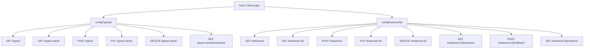

**Diagram sources**
- [api/config.js:3-31](file://frontend/src/api/config.js#L3-L31)

**Section sources**
- [api/config.js:1-34](file://frontend/src/api/config.js#L1-L34)

### Dashboard View (Home.vue)
- Loads statistics concurrently for config types and instances.
- Displays progress bars and status indicators.
- Provides quick action buttons to navigate to creation pages.

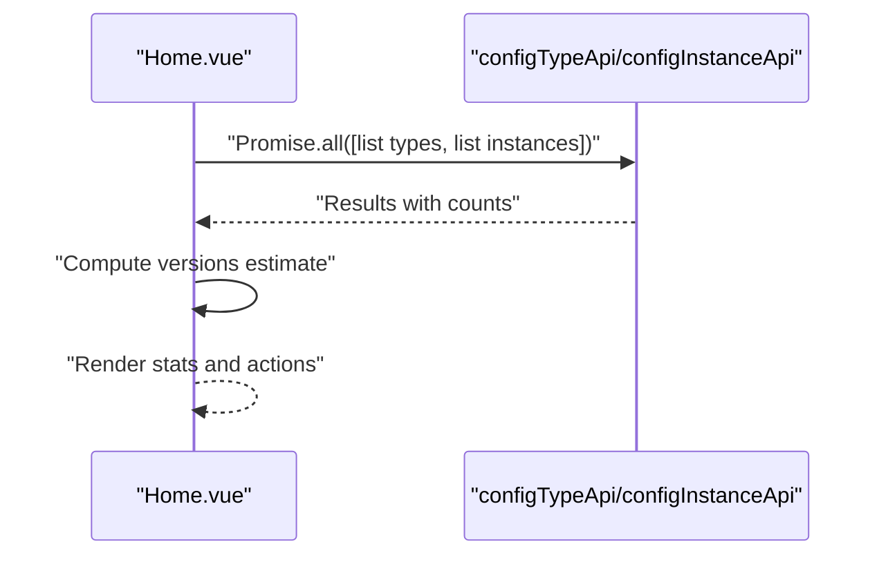

**Diagram sources**
- [views/Home.vue:145-157](file://frontend/src/views/Home.vue#L145-L157)
- [api/config.js:12-29](file://frontend/src/api/config.js#L12-L29)

**Section sources**
- [views/Home.vue:1-192](file://frontend/src/views/Home.vue#L1-L192)

### Config Types List (ConfigTypeList.vue)
- Lists config types with editable metadata and actions.
- Implements loading and empty states.
- Uses Element Plus message and confirmation dialogs for user feedback.

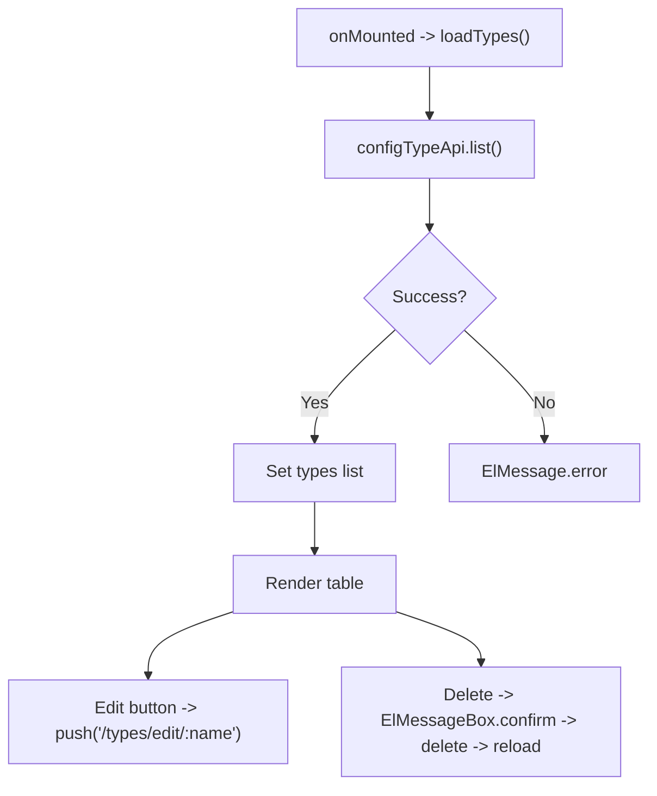

**Diagram sources**
- [views/ConfigTypeList.vue:82-123](file://frontend/src/views/ConfigTypeList.vue#L82-L123)
- [api/config.js:12-19](file://frontend/src/api/config.js#L12-L19)

**Section sources**
- [views/ConfigTypeList.vue:1-149](file://frontend/src/views/ConfigTypeList.vue#L1-L149)

### Config Instances List (ConfigInstanceList.vue)
- Supports filtering by config type, format, and search term.
- Paginates results and integrates with Element Plus table and pagination.
- Loads config types for dropdown population.

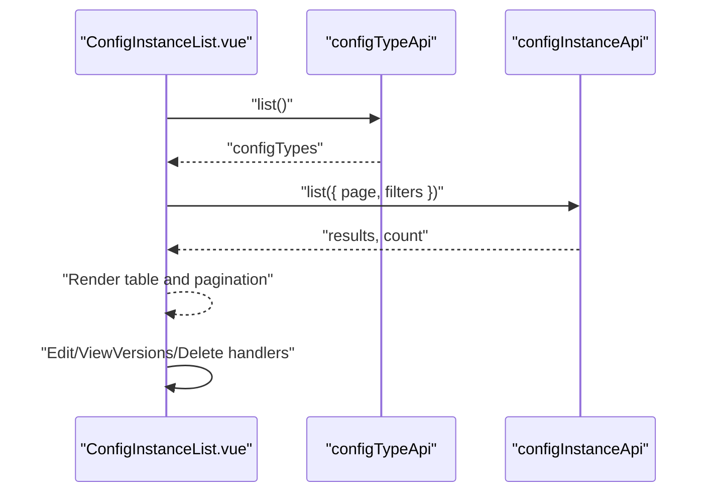

**Diagram sources**
- [views/ConfigInstanceList.vue:97-156](file://frontend/src/views/ConfigInstanceList.vue#L97-L156)
- [api/config.js:22-31](file://frontend/src/api/config.js#L22-L31)

**Section sources**
- [views/ConfigInstanceList.vue:1-170](file://frontend/src/views/ConfigInstanceList.vue#L1-L170)

### Config Type Editor (ConfigTypeEdit.vue)
- Handles creation and editing of config types with JSON/TOML schema support.
- Validates schema input and applies Element Plus form rules.
- Persists data via API and navigates on success.

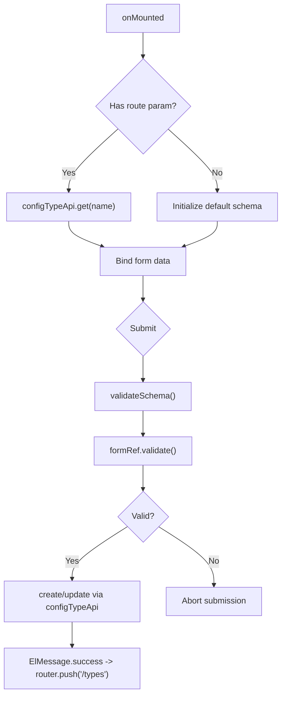

**Diagram sources**
- [views/ConfigTypeEdit.vue:120-143](file://frontend/src/views/ConfigTypeEdit.vue#L120-L143)
- [views/ConfigTypeEdit.vue:145-157](file://frontend/src/views/ConfigTypeEdit.vue#L145-L157)
- [api/config.js:12-19](file://frontend/src/api/config.js#L12-L19)

**Section sources**
- [views/ConfigTypeEdit.vue:1-171](file://frontend/src/views/ConfigTypeEdit.vue#L1-L171)

### Config Instance Editor (ConfigInstanceEdit.vue)
- Selects config type to derive format and generate example content.
- Supports code and form editing modes with validation.
- Persists data via API and navigates on success.

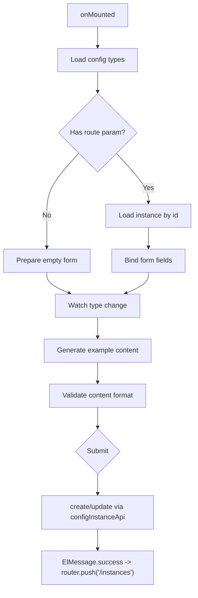

**Diagram sources**
- [views/ConfigInstanceEdit.vue:161-185](file://frontend/src/views/ConfigInstanceEdit.vue#L161-L185)
- [views/ConfigInstanceEdit.vue:187-212](file://frontend/src/views/ConfigInstanceEdit.vue#L187-L212)
- [api/config.js:22-31](file://frontend/src/api/config.js#L22-L31)

**Section sources**
- [views/ConfigInstanceEdit.vue:1-237](file://frontend/src/views/ConfigInstanceEdit.vue#L1-L237)

### Theme and Design System
- Centralized CSS variables define a sci-fi palette with neon accents.
- Shared mixins for glow effects, typography, panels, and status indicators.
- Scoped styles in components leverage theme variables for consistency.

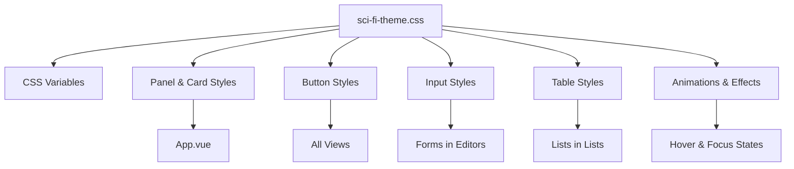

**Diagram sources**
- [styles/sci-fi-theme.css:4-31](file://frontend/src/styles/sci-fi-theme.css#L4-L31)
- [styles/sci-fi-theme.css:169-232](file://frontend/src/styles/sci-fi-theme.css#L169-L232)
- [styles/sci-fi-theme.css:470-494](file://frontend/src/styles/sci-fi-theme.css#L470-L494)

**Section sources**
- [styles/sci-fi-theme.css:1-494](file://frontend/src/styles/sci-fi-theme.css#L1-L494)

## Dependency Analysis
External libraries and their roles:
- Vue 3: Reactive framework with Composition API.
- Vue Router: Declarative routing for SPA navigation.
- Pinia: Global state management.
- Element Plus: UI component library and design system.
- Axios: HTTP client for API communication.
- Vite: Build tool and dev server with hot module replacement.

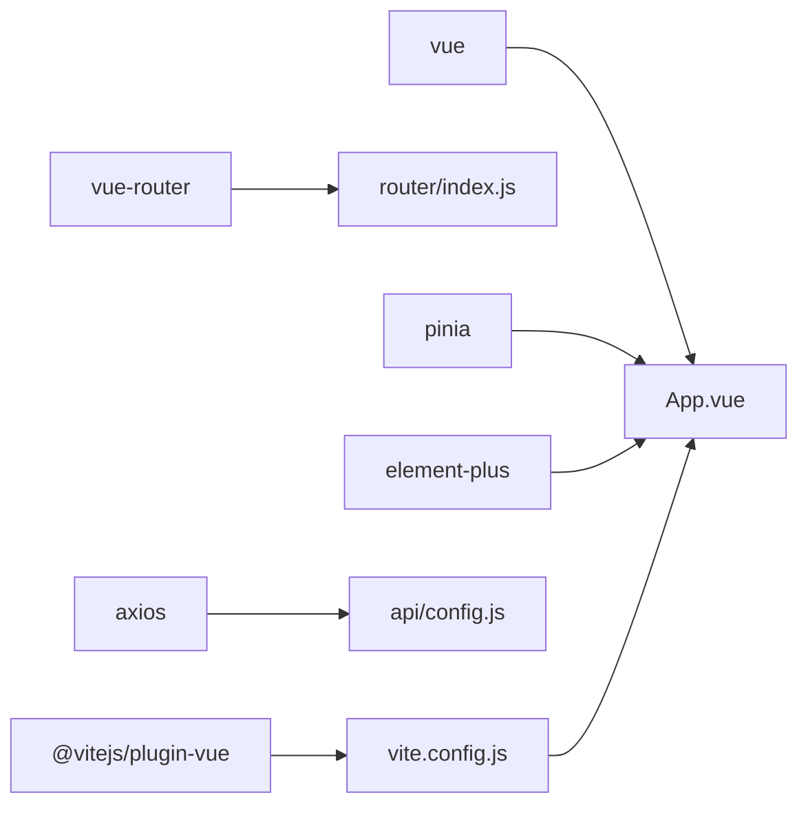

**Diagram sources**
- [package.json:11-24](file://frontend/package.json#L11-L24)
- [vite.config.js:2-5](file://frontend/vite.config.js#L2-L5)

**Section sources**
- [package.json:1-26](file://frontend/package.json#L1-L26)
- [vite.config.js:1-19](file://frontend/vite.config.js#L1-L19)

## Performance Considerations
- Concurrent data fetching: The dashboard uses concurrent requests to reduce load time.
- Minimal reactivity: Prefer computed properties for derived data and avoid unnecessary watchers.
- Lazy loading: Consider lazy-loading heavy views or components if the application grows.
- Proxy configuration: Local proxy avoids CORS issues during development and simplifies endpoint configuration.
- Theme scoping: Scoped styles prevent cascade and improve maintainability.

## Troubleshooting Guide
Common issues and resolutions:
- API proxy not working:
  - Verify the proxy target matches the backend address and port.
  - Confirm the proxy path prefix aligns with the API base URL.
- Route navigation errors:
  - Ensure routes match the defined paths and parameters.
  - Check that views are imported correctly in the router configuration.
- Form validation failures:
  - Confirm Element Plus form refs are properly bound and validated before submission.
  - Review schema and content validation logic in editors.
- Styling inconsistencies:
  - Ensure theme variables are defined and used consistently across components.
  - Verify scoped styles do not override deep selectors unintentionally.

**Section sources**
- [vite.config.js:8-13](file://frontend/vite.config.js#L8-L13)
- [router/index.js:46-49](file://frontend/src/router/index.js#L46-L49)
- [views/ConfigTypeEdit.vue:120-143](file://frontend/src/views/ConfigTypeEdit.vue#L120-L143)
- [views/ConfigInstanceEdit.vue:161-185](file://frontend/src/views/ConfigInstanceEdit.vue#L161-L185)
- [styles/sci-fi-theme.css:109-167](file://frontend/src/styles/sci-fi-theme.css#L109-L167)

## Conclusion
The AI-Ops Configuration Hub frontend leverages Vue 3’s Composition API, a clean component-based architecture, and Element Plus for UI consistency. The router and API layer are straightforward and extensible, while the theme system ensures a cohesive design language. The build system with Vite streamlines development and deployment. This foundation supports scalable enhancements such as global state with Pinia, reusable components, and advanced editor integrations.