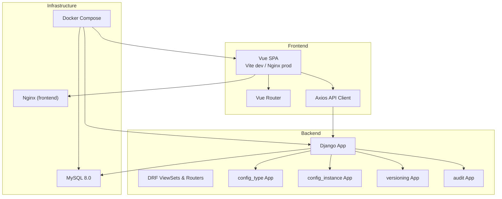
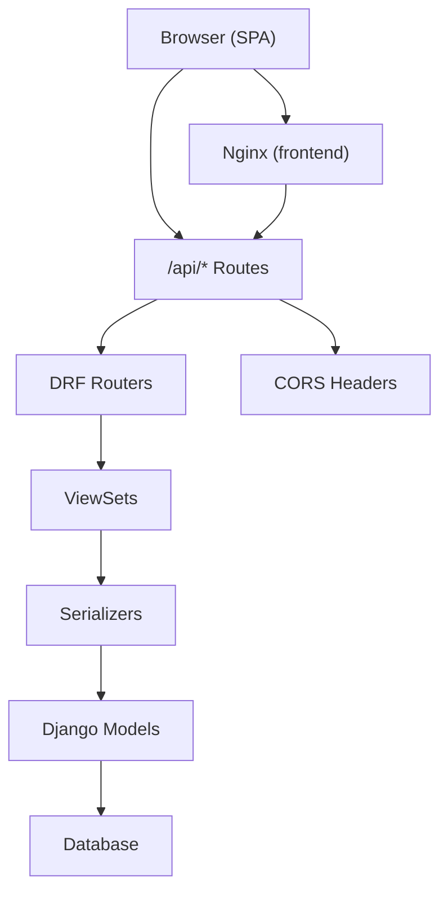
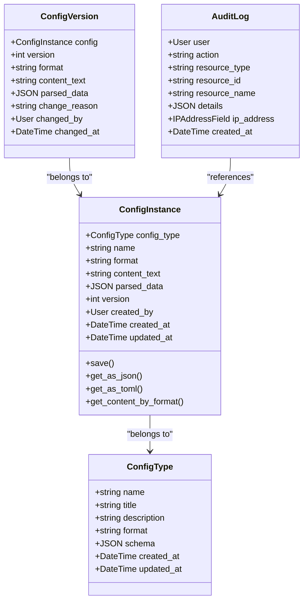
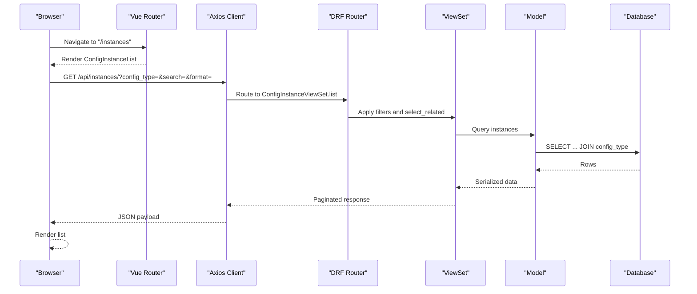
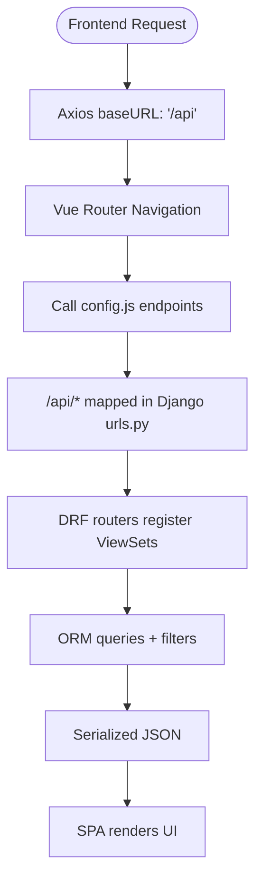
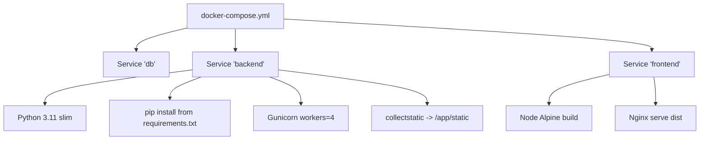
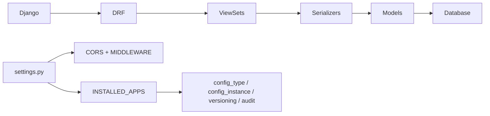

# Overall System Design

<cite>
**Referenced Files in This Document**
- [settings.py](file://backend/confighub/settings.py)
- [urls.py](file://backend/confighub/urls.py)
- [requirements.txt](file://backend/requirements.txt)
- [Dockerfile](file://backend/Dockerfile)
- [docker-compose.yml](file://docker-compose.yml)
- [config_type/models.py](file://backend/config_type/models.py)
- [config_instance/models.py](file://backend/config_instance/models.py)
- [versioning/models.py](file://backend/versioning/models.py)
- [audit/models.py](file://backend/audit/models.py)
- [config_type/views.py](file://backend/config_type/views.py)
- [config_instance/views.py](file://backend/config_instance/views.py)
- [config_type/urls.py](file://backend/config_type/urls.py)
- [config_instance/urls.py](file://backend/config_instance/urls.py)
- [config.js](file://frontend/src/api/config.js)
- [index.js](file://frontend/src/router/index.js)
- [main.js](file://frontend/src/main.js)
- [package.json](file://frontend/package.json)
- [frontend/Dockerfile](file://frontend/Dockerfile)
</cite>

## Table of Contents
1. [Introduction](#introduction)
2. [Project Structure](#project-structure)
3. [Core Components](#core-components)
4. [Architecture Overview](#architecture-overview)
5. [Detailed Component Analysis](#detailed-component-analysis)
6. [Dependency Analysis](#dependency-analysis)
7. [Performance Considerations](#performance-considerations)
8. [Troubleshooting Guide](#troubleshooting-guide)
9. [Conclusion](#conclusion)
10. [Appendices](#appendices)

## Introduction
AI-Ops Configuration Hub is a full-stack system designed to manage configuration types and instances with support for JSON and TOML formats, versioning, and audit trails. The system emphasizes a clean separation between a Vue.js single-page application (SPA) frontend and a Django-powered REST API backend. The backend leverages Django REST Framework to expose resource-centric APIs, while the frontend consumes these APIs via Axios to render views and orchestrate user interactions. Modular Django apps encapsulate domain concerns: configuration types, instances, versioning, and auditing. Containerization with Docker and Docker Compose streamlines development and production deployments, enabling scalable and reproducible environments.

## Project Structure
The repository follows a clear full-stack separation:
- Backend: Django project with modular apps for configuration types, instances, versioning, and auditing, plus shared settings and URL routing.
- Frontend: Vue 3 SPA using Vite for development and Nginx for production serving static assets.
- Orchestration: Docker Compose coordinates MySQL, backend, and frontend services.

**Diagram sources**
- [docker-compose.yml:1-50](file://docker-compose.yml#L1-L50)
- [frontend/Dockerfile:1-26](file://frontend/Dockerfile#L1-L26)
- [backend/Dockerfile:1-27](file://backend/Dockerfile#L1-L27)
- [settings.py:44-57](file://backend/confighub/settings.py#L44-L57)
- [urls.py:20-24](file://backend/confighub/urls.py#L20-L24)

**Section sources**
- [docker-compose.yml:1-50](file://docker-compose.yml#L1-L50)
- [frontend/Dockerfile:1-26](file://frontend/Dockerfile#L1-L26)
- [backend/Dockerfile:1-27](file://backend/Dockerfile#L1-L27)
- [settings.py:44-57](file://backend/confighub/settings.py#L44-L57)
- [urls.py:20-24](file://backend/confighub/urls.py#L20-L24)

## Core Components
- Django REST Framework: Provides automatic serialization, pagination, and route registration via ViewSets and Routers.
- Modular Django Apps:
  - config_type: Defines configuration type metadata and schema.
  - config_instance: Manages configuration instances, parsing/format conversion, and content storage.
  - versioning: Tracks historical versions of configuration instances.
  - audit: Records user actions and resource changes.
- Frontend SPA:
  - Vue 3 with Vue Router for navigation and Pinia for state.
  - Axios client targeting the backend API base path.
- Containerization:
  - Backend: Python slim image, Gunicorn WSGI server, static collection, and MySQL client.
  - Frontend: Multi-stage build with Nginx serving production assets.

**Section sources**
- [requirements.txt:1-8](file://backend/requirements.txt#L1-L8)
- [config_type/models.py:1-25](file://backend/config_type/models.py#L1-L25)
- [config_instance/models.py:1-69](file://backend/config_instance/models.py#L1-L69)
- [versioning/models.py:1-23](file://backend/versioning/models.py#L1-L23)
- [audit/models.py:1-31](file://backend/audit/models.py#L1-L31)
- [config_type/views.py:1-39](file://backend/config_type/views.py#L1-L39)
- [config_instance/views.py:1-150](file://backend/config_instance/views.py#L1-L150)
- [config.js:1-34](file://frontend/src/api/config.js#L1-L34)
- [index.js:1-52](file://frontend/src/router/index.js#L1-L52)
- [main.js:1-22](file://frontend/src/main.js#L1-L22)
- [package.json:1-26](file://frontend/package.json#L1-L26)
- [backend/Dockerfile:1-27](file://backend/Dockerfile#L1-L27)
- [frontend/Dockerfile:1-26](file://frontend/Dockerfile#L1-L26)

## Architecture Overview
The system employs a RESTful API-first design:
- Frontend SPA communicates exclusively with backend endpoints under /api/.
- Backend exposes resource collections and detail endpoints via DRF routers.
- Database abstraction supports SQLite for development and MySQL for production.
- CORS is enabled to facilitate cross-origin requests during development.

**Diagram sources**
- [settings.py:33-39](file://backend/confighub/settings.py#L33-L39)
- [settings.py:31](file://backend/confighub/settings.py#L31)
- [config_type/urls.py:1-11](file://backend/config_type/urls.py#L1-L11)
- [config_instance/urls.py:1-11](file://backend/config_instance/urls.py#L1-L11)
- [config_type/views.py:8-25](file://backend/config_type/views.py#L8-L25)
- [config_instance/views.py:11-34](file://backend/config_instance/views.py#L11-L34)

**Section sources**
- [settings.py:31-39](file://backend/confighub/settings.py#L31-L39)
- [settings.py:96-117](file://backend/confighub/settings.py#L96-L117)
- [config_type/urls.py:1-11](file://backend/config_type/urls.py#L1-L11)
- [config_instance/urls.py:1-11](file://backend/config_instance/urls.py#L1-L11)
- [config_type/views.py:8-25](file://backend/config_type/views.py#L8-L25)
- [config_instance/views.py:11-34](file://backend/config_instance/views.py#L11-L34)

## Detailed Component Analysis

### Backend Technology Stack and Design Decisions
- Django and Django REST Framework were selected for rapid development of robust APIs, mature ORM, built-in admin, and excellent ecosystem support for serializers and pagination.
- Gunicorn serves as the production WSGI server, configured with multiple workers for concurrency.
- CORS is enabled broadly to simplify development; production deployments should tighten origins.
- Database engine selection allows switching between SQLite and MySQL via environment variables.

**Section sources**
- [requirements.txt:1-8](file://backend/requirements.txt#L1-L8)
- [settings.py:31](file://backend/confighub/settings.py#L31)
- [settings.py:96-117](file://backend/confighub/settings.py#L96-L117)
- [backend/Dockerfile:26](file://backend/Dockerfile#L26)

### Frontend Technology Stack and Design Decisions
- Vue 3 provides reactive components and Composition API; Vue Router manages SPA navigation; Pinia offers lightweight state management.
- Axios centralizes API calls with a base URL pointing to /api/, aligning with backend routing.
- Element Plus supplies UI components; Vite builds the app in development and production.

**Section sources**
- [package.json:11-24](file://frontend/package.json#L11-L24)
- [main.js:1-22](file://frontend/src/main.js#L1-L22)
- [index.js:1-52](file://frontend/src/router/index.js#L1-L52)
- [config.js:1-34](file://frontend/src/api/config.js#L1-L34)

### Modular Django Apps and Domain Boundaries
- config_type: Defines configuration type metadata, format, and JSON schema. Provides endpoints to list, create, update, delete, and enumerate instances per type.
- config_instance: Manages configuration instances, content parsing, format conversion, version creation on create/update, rollback, and content retrieval in requested formats.
- versioning: Stores historical snapshots of configuration instances with associated metadata.
- audit: Logs user actions against resources with IP address and details.

**Diagram sources**
- [config_type/models.py:4-24](file://backend/config_type/models.py#L4-L24)
- [config_instance/models.py:7-69](file://backend/config_instance/models.py#L7-L69)
- [versioning/models.py:5-23](file://backend/versioning/models.py#L5-L23)
- [audit/models.py:5-31](file://backend/audit/models.py#L5-L31)

**Section sources**
- [config_type/models.py:1-25](file://backend/config_type/models.py#L1-L25)
- [config_instance/models.py:1-69](file://backend/config_instance/models.py#L1-L69)
- [versioning/models.py:1-23](file://backend/versioning/models.py#L1-L23)
- [audit/models.py:1-31](file://backend/audit/models.py#L1-L31)

### RESTful API Design and Separation of Concerns
- Resource-based routing: /api/types/ and /api/instances/ expose CRUD and custom actions via DRF ViewSets.
- Pagination: Global pagination settings ensure scalable list endpoints.
- Custom actions:
  - config_type instances: Enumerate instances linked to a type.
  - config_instance versions: List historical versions.
  - config_instance rollback: Atomic rollback to a prior version.
  - config_instance content: Retrieve content in requested format with parsed data.
- Search and filtering: Query parameters enable filtering by type, format, and free-text search.

**Diagram sources**
- [config_instance/views.py:16-34](file://backend/config_instance/views.py#L16-L34)
- [config_instance/urls.py:5-10](file://backend/config_instance/urls.py#L5-L10)
- [config.js:22-31](file://frontend/src/api/config.js#L22-L31)
- [index.js:29-43](file://frontend/src/router/index.js#L29-L43)

**Section sources**
- [config_type/urls.py:1-11](file://backend/config_type/urls.py#L1-L11)
- [config_instance/urls.py:1-11](file://backend/config_instance/urls.py#L1-L11)
- [config_type/views.py:8-39](file://backend/config_type/views.py#L8-L39)
- [config_instance/views.py:11-150](file://backend/config_instance/views.py#L11-L150)
- [settings.py:33-39](file://backend/confighub/settings.py#L33-L39)

### Full-Stack Separation and Communication Boundaries
- Frontend base URL targets /api/, ensuring all HTTP calls reach the backend.
- Backend CORS policy permits all origins during development; production should restrict origins.
- Database engine is configurable via environment variables, supporting local SQLite and remote MySQL.

**Diagram sources**
- [config.js:3-9](file://frontend/src/api/config.js#L3-L9)
- [urls.py:20-24](file://backend/confighub/urls.py#L20-L24)
- [config_type/urls.py:5-10](file://backend/config_type/urls.py#L5-L10)
- [config_instance/urls.py:5-10](file://backend/config_instance/urls.py#L5-L10)

**Section sources**
- [config.js:1-34](file://frontend/src/api/config.js#L1-L34)
- [urls.py:20-24](file://backend/confighub/urls.py#L20-L24)
- [settings.py:31](file://backend/confighub/settings.py#L31)

### Containerization Strategy
- Docker Compose orchestrates three services:
  - db: MySQL 8.0 with persistent volume and health checks.
  - backend: Python slim image, installs system dependencies and Python packages, collects static files, and runs Gunicorn.
  - frontend: Multi-stage build with Node for building and Nginx for serving static assets.
- Environment variables configure database connectivity, Django secret key, and debug mode.

**Diagram sources**
- [docker-compose.yml:3-50](file://docker-compose.yml#L3-L50)
- [backend/Dockerfile:1-27](file://backend/Dockerfile#L1-L27)
- [frontend/Dockerfile:1-26](file://frontend/Dockerfile#L1-L26)

**Section sources**
- [docker-compose.yml:1-50](file://docker-compose.yml#L1-L50)
- [backend/Dockerfile:1-27](file://backend/Dockerfile#L1-L27)
- [frontend/Dockerfile:1-26](file://frontend/Dockerfile#L1-L26)

## Dependency Analysis
- Backend dependencies include Django, DRF, CORS headers, MySQL client, Gunicorn, and toml/jsonschema libraries for content parsing and validation.
- Frontend dependencies include Vue 3, Vue Router, Pinia, Element Plus, Axios, and JSON form libraries.
- Internal coupling:
  - config_instance depends on versioning and audit models for version history and logging.
  - Views depend on serializers and models; URLs depend on routers; settings define middleware and installed apps.

**Diagram sources**
- [requirements.txt:1-8](file://backend/requirements.txt#L1-L8)
- [settings.py:44-68](file://backend/confighub/settings.py#L44-L68)
- [settings.py:52-56](file://backend/confighub/settings.py#L52-L56)

**Section sources**
- [requirements.txt:1-8](file://backend/requirements.txt#L1-L8)
- [settings.py:44-68](file://backend/confighub/settings.py#L44-L68)
- [settings.py:52-56](file://backend/confighub/settings.py#L52-L56)

## Performance Considerations
- Pagination: Global PageNumberPagination with PAGE_SIZE set to 20 ensures predictable list performance.
- Select-related joins: Instance listing uses select_related to reduce database round-trips when fetching related config_type.
- Static asset delivery: Frontend served by Nginx improves performance and reduces load on the backend.
- Database choice: MySQL is suitable for production workloads; ensure proper indexing on frequently queried fields (e.g., config_type.name, content search).
- Worker scaling: Gunicorn workers can be tuned based on CPU cores; consider autoscaling at the Docker Compose level for traffic spikes.

**Section sources**
- [settings.py:37-39](file://backend/confighub/settings.py#L37-L39)
- [config_instance/views.py:34](file://backend/config_instance/views.py#L34)
- [backend/Dockerfile:26](file://backend/Dockerfile#L26)

## Troubleshooting Guide
- CORS errors: Verify CORS_ALLOW_ALL_ORIGINS setting and ensure production restricts origins.
- Database connectivity: Confirm DB_ENGINE and credentials match compose environment; check health checks for db service.
- Static files: collectstatic is executed in backend Dockerfile; ensure volumes persist static artifacts.
- API endpoints: Use browser DevTools Network tab to inspect /api/* responses; confirm router registration in urls.py.
- Versioning and rollback: Validate that version records exist and rollback target version is present.

**Section sources**
- [settings.py:31](file://backend/confighub/settings.py#L31)
- [settings.py:96-117](file://backend/confighub/settings.py#L96-L117)
- [backend/Dockerfile:20](file://backend/Dockerfile#L20)
- [config_instance/views.py:92-136](file://backend/config_instance/views.py#L92-L136)

## Conclusion
AI-Ops Configuration Hub adopts a pragmatic full-stack architecture: Django and DRF for a robust, resource-focused backend; Vue 3 SPA for a modern, responsive frontend; and Docker-based orchestration for consistent development and production deployments. The modular app design cleanly separates concerns across configuration types, instances, versioning, and auditing. RESTful APIs with pagination and custom actions enable scalable operations, while containerization simplifies deployment and future horizontal scaling.

## Appendices
- Development quickstart:
  - Start services: docker-compose up --build
  - Access frontend: http://localhost
  - Access backend admin: http://localhost:8000/admin
  - API docs: DRF browsable API at /api/...
- Production hardening:
  - Set DJANGO_DEBUG=false and secure DJANGO_SECRET_KEY
  - Restrict CORS origins
  - Use managed MySQL and persistent volumes
  - Configure SSL termination at reverse proxy/Nginx