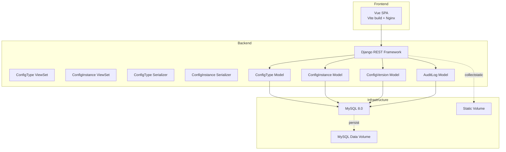
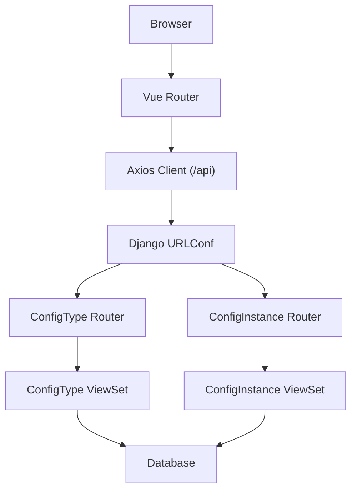
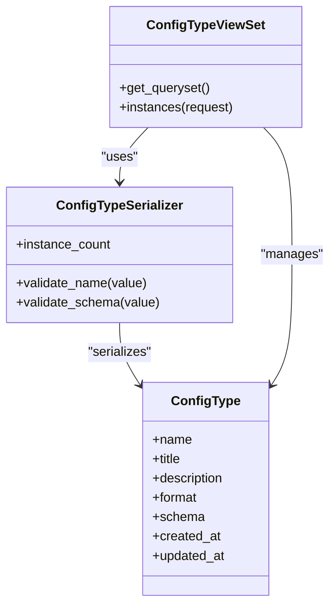
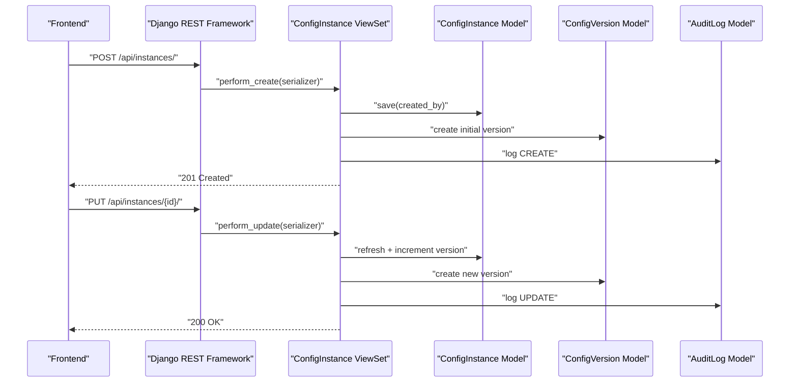
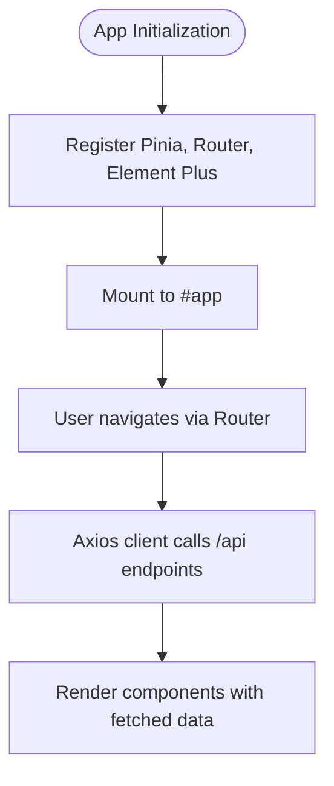
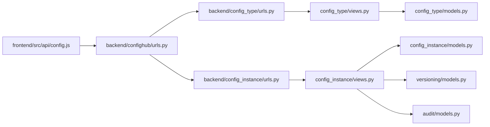

# System Architecture

<cite>
**Referenced Files in This Document**
- [settings.py](file://backend/confighub/settings.py)
- [urls.py](file://backend/confighub/urls.py)
- [config_type/urls.py](file://backend/config_type/urls.py)
- [config_instance/urls.py](file://backend/config_instance/urls.py)
- [config_type/views.py](file://backend/config_type/views.py)
- [config_instance/views.py](file://backend/config_instance/views.py)
- [config_type/models.py](file://backend/config_type/models.py)
- [config_instance/models.py](file://backend/config_instance/models.py)
- [versioning/models.py](file://backend/versioning/models.py)
- [audit/models.py](file://backend/audit/models.py)
- [config_type/serializers.py](file://backend/config_type/serializers.py)
- [config_instance/serializers.py](file://backend/config_instance/serializers.py)
- [main.js](file://frontend/src/main.js)
- [router/index.js](file://frontend/src/router/index.js)
- [api/config.js](file://frontend/src/api/config.js)
- [docker-compose.yml](file://docker-compose.yml)
- [backend/Dockerfile](file://backend/Dockerfile)
- [frontend/Dockerfile](file://frontend/Dockerfile)
</cite>

## Table of Contents
1. [Introduction](#introduction)
2. [Project Structure](#project-structure)
3. [Core Components](#core-components)
4. [Architecture Overview](#architecture-overview)
5. [Detailed Component Analysis](#detailed-component-analysis)
6. [Dependency Analysis](#dependency-analysis)
7. [Performance Considerations](#performance-considerations)
8. [Troubleshooting Guide](#troubleshooting-guide)
9. [Conclusion](#conclusion)
10. [Appendices](#appendices)

## Introduction
This document describes the system architecture of the AI-Ops Configuration Hub. It covers the full-stack implementation with a Django backend exposing REST APIs via Django REST Framework and a Vue.js single-page application (SPA) frontend. The system emphasizes separation of concerns across presentation, business logic, and persistence, while integrating versioning and audit capabilities. Cross-cutting concerns such as security, CORS, and static file serving are documented alongside containerized deployment topology and infrastructure requirements.

## Project Structure
The repository is organized into two primary directories:
- backend: Django project with Django REST Framework, multiple Django apps (config_type, config_instance, versioning, audit), and deployment artifacts.
- frontend: Vue.js SPA built with Vite, packaged with Nginx for production serving.

Key runtime boundaries:
- Frontend SPA served by Nginx.
- Backend API served by Gunicorn under Docker Compose orchestration.
- Database managed by MySQL 8.0.



**Diagram sources**
- [docker-compose.yml:1-50](file://docker-compose.yml#L1-L50)
- [backend/Dockerfile:1-27](file://backend/Dockerfile#L1-L27)
- [frontend/Dockerfile:1-26](file://frontend/Dockerfile#L1-L26)
- [settings.py:94-117](file://backend/confighub/settings.py#L94-L117)
- [config_type/views.py:8-39](file://backend/config_type/views.py#L8-L39)
- [config_instance/views.py:11-150](file://backend/config_instance/views.py#L11-L150)
- [config_type/models.py:4-25](file://backend/config_type/models.py#L4-L25)
- [config_instance/models.py:7-69](file://backend/config_instance/models.py#L7-L69)
- [versioning/models.py:5-23](file://backend/versioning/models.py#L5-L23)
- [audit/models.py:5-31](file://backend/audit/models.py#L5-L31)

**Section sources**
- [docker-compose.yml:1-50](file://docker-compose.yml#L1-L50)
- [backend/Dockerfile:1-27](file://backend/Dockerfile#L1-L27)
- [frontend/Dockerfile:1-26](file://frontend/Dockerfile#L1-L26)
- [settings.py:94-117](file://backend/confighub/settings.py#L94-L117)

## Core Components
- Presentation Layer (Frontend):
  - Vue.js SPA bootstrapped with Pinia and Element Plus, routing configured for CRUD pages.
  - Axios client configured with base URL pointing to backend /api.
- Business Logic Layer (Backend):
  - Django REST Framework ViewSets for ConfigType and ConfigInstance with filtering, pagination, and custom actions.
  - Serializers enforce content format validation and JSON Schema verification against ConfigType schema.
- Data Persistence:
  - Django ORM models for ConfigType, ConfigInstance, ConfigVersion, and AuditLog.
  - Database selection supports SQLite (development) and MySQL 8.0 (production via environment).

**Section sources**
- [main.js:1-22](file://frontend/src/main.js#L1-L22)
- [router/index.js:1-52](file://frontend/src/router/index.js#L1-L52)
- [api/config.js:1-34](file://frontend/src/api/config.js#L1-L34)
- [config_type/views.py:8-39](file://backend/config_type/views.py#L8-L39)
- [config_instance/views.py:11-150](file://backend/config_instance/views.py#L11-L150)
- [config_type/serializers.py:5-31](file://backend/config_type/serializers.py#L5-L31)
- [config_instance/serializers.py:7-60](file://backend/config_instance/serializers.py#L7-L60)
- [config_type/models.py:4-25](file://backend/config_type/models.py#L4-L25)
- [config_instance/models.py:7-69](file://backend/config_instance/models.py#L7-L69)
- [versioning/models.py:5-23](file://backend/versioning/models.py#L5-L23)
- [audit/models.py:5-31](file://backend/audit/models.py#L5-L31)

## Architecture Overview
The system follows a classic three-tier architecture:
- Presentation: Vue.js SPA handles UI and navigation.
- Application/API: Django REST Framework exposes CRUD and specialized endpoints for configuration types and instances.
- Data: Relational models backed by MySQL or SQLite.



**Diagram sources**
- [urls.py:20-24](file://backend/confighub/urls.py#L20-L24)
- [config_type/urls.py:5-10](file://backend/config_type/urls.py#L5-L10)
- [config_instance/urls.py:5-10](file://backend/config_instance/urls.py#L5-L10)
- [config_type/views.py:8-39](file://backend/config_type/views.py#L8-L39)
- [config_instance/views.py:11-150](file://backend/config_instance/views.py#L11-L150)
- [api/config.js:3-9](file://frontend/src/api/config.js#L3-L9)

## Detailed Component Analysis

### Backend: Django Settings and Deployment
- Security and CORS:
  - Debug mode and allowed hosts configurable via environment variables.
  - CORS enabled broadly for development; consider narrowing origins in production.
- REST Framework defaults:
  - Pagination configured; permission class allows any.
- Database selection:
  - SQLite by default; MySQL 8.0 supported via environment variables.
- Static files:
  - Static root collected during container build; mounted as volume for persistence.

**Section sources**
- [settings.py:23-39](file://backend/confighub/settings.py#L23-L39)
- [settings.py:94-117](file://backend/confighub/settings.py#L94-L117)
- [settings.py:151-158](file://backend/confighub/settings.py#L151-L158)
- [backend/Dockerfile:19-20](file://backend/Dockerfile#L19-L20)

### Backend: URL Routing and API Surface
- Root URLConf includes API endpoints for config_type and config_instance.
- Each app registers a DefaultRouter with a ViewSet, exposing standard CRUD plus custom actions.

**Section sources**
- [urls.py:20-24](file://backend/confighub/urls.py#L20-L24)
- [config_type/urls.py:5-10](file://backend/config_type/urls.py#L5-L10)
- [config_instance/urls.py:5-10](file://backend/config_instance/urls.py#L5-L10)

### Backend: ConfigType Module
- ViewSet:
  - Standard CRUD via ModelViewSet.
  - Filtering by search and format; lookup by name.
  - Custom action to list instances of a type.
- Serializer:
  - Validates name and schema fields.
  - Exposes instance_count via SerializerMethodField.
- Model:
  - Defines format choices and JSON schema storage.



**Diagram sources**
- [config_type/models.py:4-25](file://backend/config_type/models.py#L4-L25)
- [config_type/serializers.py:5-31](file://backend/config_type/serializers.py#L5-L31)
- [config_type/views.py:8-39](file://backend/config_type/views.py#L8-L39)

**Section sources**
- [config_type/views.py:8-39](file://backend/config_type/views.py#L8-L39)
- [config_type/serializers.py:5-31](file://backend/config_type/serializers.py#L5-L31)
- [config_type/models.py:4-25](file://backend/config_type/models.py#L4-L25)

### Backend: ConfigInstance Module
- ViewSet:
  - Standard CRUD with custom list serializer.
  - Filtering by config_type, search, and format.
  - Atomic create/update with versioning and audit logging.
  - Custom actions:
    - versions: list historical versions.
    - rollback: create a new version from a selected prior version.
    - content: fetch content in requested format.
- Serializer:
  - Validates content format (JSON/TOML) and applies JSON Schema from associated ConfigType.
  - Writes content to content_text and parsed_data.
- Models:
  - ConfigInstance stores raw content and parsed JSON for querying.
  - ConfigVersion persists historical snapshots.
  - AuditLog records user actions.



**Diagram sources**
- [config_instance/views.py:36-90](file://backend/config_instance/views.py#L36-L90)
- [config_instance/models.py:37-69](file://backend/config_instance/models.py#L37-L69)
- [versioning/models.py:5-23](file://backend/versioning/models.py#L5-L23)
- [audit/models.py:5-31](file://backend/audit/models.py#L5-L31)

**Section sources**
- [config_instance/views.py:11-150](file://backend/config_instance/views.py#L11-L150)
- [config_instance/serializers.py:7-60](file://backend/config_instance/serializers.py#L7-L60)
- [config_instance/models.py:7-69](file://backend/config_instance/models.py#L7-L69)
- [versioning/models.py:5-23](file://backend/versioning/models.py#L5-L23)
- [audit/models.py:5-31](file://backend/audit/models.py#L5-L31)

### Frontend: Vue.js SPA
- Bootstrapping:
  - App initializes Pinia, router, Element Plus, and global icons.
- Routing:
  - Routes for Home, ConfigType list/edit, and ConfigInstance list/edit.
- API Client:
  - Axios instance targeting /api with JSON content type and timeout.



**Diagram sources**
- [main.js:10-21](file://frontend/src/main.js#L10-L21)
- [router/index.js:46-52](file://frontend/src/router/index.js#L46-L52)
- [api/config.js:3-9](file://frontend/src/api/config.js#L3-L9)

**Section sources**
- [main.js:1-22](file://frontend/src/main.js#L1-L22)
- [router/index.js:1-52](file://frontend/src/router/index.js#L1-L52)
- [api/config.js:1-34](file://frontend/src/api/config.js#L1-L34)

### Containerization and Deployment Topology
- Services:
  - db: MySQL 8.0 with health check and persistent volume.
  - backend: Django app built with Python slim, collects static assets, runs with Gunicorn, binds port 8000, mounts static volume.
  - frontend: Nginx serving built SPA, copies nginx.conf, exposes port 80.
- Environment:
  - Database engine switchable via environment variable; secrets and debug toggled via environment.
- Dependencies:
  - Backend depends on database health; frontend depends on backend availability.

```mermaid
graph TB
subgraph "Compose"
DB["Service: db<br/>MySQL 8.0"]
BE["Service: backend<br/>Gunicorn + Django"]
FE["Service: frontend<br/>Nginx"]
end
FE --> |"HTTP 80"| BE
BE --> |"TCP 8000"| BE
BE --> DB
FE -.ports.->|"0.0.0.0:80"| FE
BE -.ports.->|"0.0.0.0:8000"| BE
DB -.volume.-> DBVol["mysql_data"]
BE -.volume.-> StaticVol["backend_static"]
```

**Diagram sources**
- [docker-compose.yml:3-46](file://docker-compose.yml#L3-L46)
- [backend/Dockerfile:1-27](file://backend/Dockerfile#L1-L27)
- [frontend/Dockerfile:1-26](file://frontend/Dockerfile#L1-L26)

**Section sources**
- [docker-compose.yml:1-50](file://docker-compose.yml#L1-L50)
- [backend/Dockerfile:1-27](file://backend/Dockerfile#L1-L27)
- [frontend/Dockerfile:1-26](file://frontend/Dockerfile#L1-L26)

## Dependency Analysis
- Backend module dependencies:
  - config_type and config_instance depend on shared models and serializers.
  - config_instance integrates versioning and audit models.
- Frontend dependency on backend:
  - Axios client targets /api; routes map to backend endpoints registered by routers.
- Infrastructure:
  - Backend depends on database availability; static assets are externalized via mounted volume.



**Diagram sources**
- [api/config.js:3-9](file://frontend/src/api/config.js#L3-L9)
- [urls.py:20-24](file://backend/confighub/urls.py#L20-L24)
- [config_type/urls.py:5-10](file://backend/config_type/urls.py#L5-L10)
- [config_instance/urls.py:5-10](file://backend/config_instance/urls.py#L5-L10)
- [config_type/views.py:8-39](file://backend/config_type/views.py#L8-L39)
- [config_instance/views.py:11-150](file://backend/config_instance/views.py#L11-L150)
- [config_type/models.py:4-25](file://backend/config_type/models.py#L4-L25)
- [config_instance/models.py:7-69](file://backend/config_instance/models.py#L7-L69)
- [versioning/models.py:5-23](file://backend/versioning/models.py#L5-L23)
- [audit/models.py:5-31](file://backend/audit/models.py#L5-L31)

**Section sources**
- [urls.py:20-24](file://backend/confighub/urls.py#L20-L24)
- [config_type/urls.py:5-10](file://backend/config_type/urls.py#L5-L10)
- [config_instance/urls.py:5-10](file://backend/config_instance/urls.py#L5-L10)
- [config_type/views.py:8-39](file://backend/config_type/views.py#L8-L39)
- [config_instance/views.py:11-150](file://backend/config_instance/views.py#L11-L150)
- [config_type/models.py:4-25](file://backend/config_type/models.py#L4-L25)
- [config_instance/models.py:7-69](file://backend/config_instance/models.py#L7-L69)
- [versioning/models.py:5-23](file://backend/versioning/models.py#L5-L23)
- [audit/models.py:5-31](file://backend/audit/models.py#L5-L31)

## Performance Considerations
- Pagination:
  - REST framework pagination reduces payload sizes for large lists.
- Select-related:
  - ConfigInstance list queries use select_related to avoid N+1 on foreign keys.
- Static asset delivery:
  - Nginx serves frontend assets efficiently; static collection is handled at build time.
- Database choice:
  - MySQL recommended for production; ensure proper indexing and connection pooling.

[No sources needed since this section provides general guidance]

## Troubleshooting Guide
- CORS issues:
  - Broad CORS enabled in settings; restrict origins in production environments.
- Database connectivity:
  - Verify environment variables for DB_ENGINE, DB_NAME, DB_USER, DB_PASSWORD, DB_HOST, DB_PORT.
- Static files not loading:
  - Ensure collectstatic ran and static volume is mounted correctly.
- Authentication and permissions:
  - Default permission class allows any; adjust for protected endpoints.
- Health checks:
  - Database healthcheck ensures readiness; backend waits for healthy DB before serving.

**Section sources**
- [settings.py:31-39](file://backend/confighub/settings.py#L31-L39)
- [settings.py:94-117](file://backend/confighub/settings.py#L94-L117)
- [backend/Dockerfile:19-20](file://backend/Dockerfile#L19-L20)
- [docker-compose.yml:16-19](file://docker-compose.yml#L16-L19)

## Conclusion
The AI-Ops Configuration Hub employs a clean separation of concerns with a Vue.js SPA front end and a Django REST Framework backend. The backend encapsulates business logic and integrates robust validation, versioning, and auditing. Containerization simplifies deployment and scaling, while CORS and static asset handling are configured for development and production readiness. The architecture supports extensibility for additional configuration formats and enhanced security controls.

## Appendices

### API Endpoint Reference
- ConfigType endpoints:
  - GET /api/types/
  - GET /api/types/{name}/
  - POST /api/types/
  - PUT /api/types/{name}/
  - DELETE /api/types/{name}/
  - GET /api/types/{name}/instances/
- ConfigInstance endpoints:
  - GET /api/instances/
  - GET /api/instances/{id}/
  - POST /api/instances/
  - PUT /api/instances/{id}/
  - DELETE /api/instances/{id}/
  - GET /api/instances/{id}/versions/
  - POST /api/instances/{id}/rollback/
  - GET /api/instances/{id}/content/?format={json|toml}

**Section sources**
- [config_type/urls.py:5-10](file://backend/config_type/urls.py#L5-L10)
- [config_instance/urls.py:5-10](file://backend/config_instance/urls.py#L5-L10)
- [api/config.js:11-31](file://frontend/src/api/config.js#L11-L31)